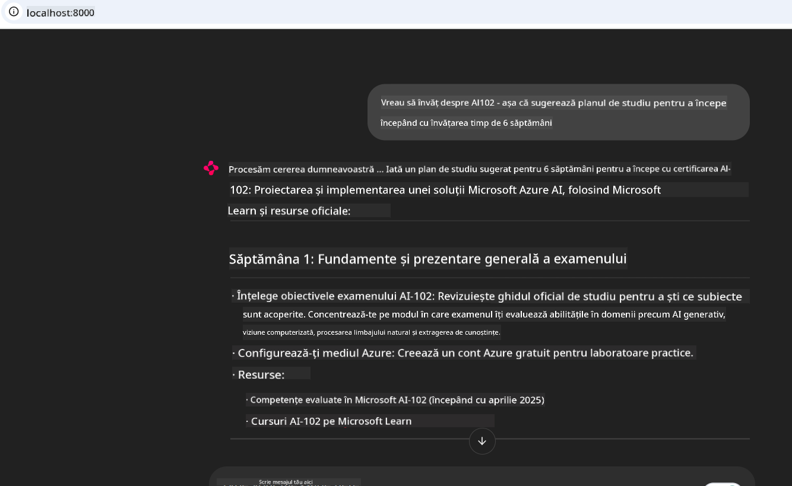
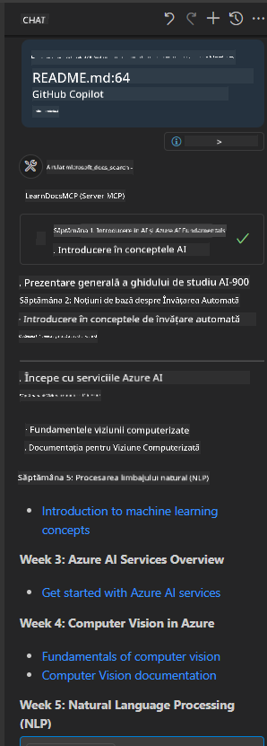

<!--
CO_OP_TRANSLATOR_METADATA:
{
  "original_hash": "4319d291c9d124ecafea52b3d04bfa0e",
  "translation_date": "2025-07-14T06:29:22+00:00",
  "source_file": "09-CaseStudy/docs-mcp/README.md",
  "language_code": "ro"
}
-->
# Studiu de caz: Conectarea la serverul Microsoft Learn Docs MCP de pe un client

Ți s-a întâmplat vreodată să jonglezi între site-uri de documentație, Stack Overflow și zeci de taburi de browser, în timp ce încerci să rezolvi o problemă în codul tău? Poate ai un al doilea monitor doar pentru documentație sau faci constant alt-tab între IDE și browser. Nu ar fi mai bine dacă ai putea aduce documentația direct în fluxul tău de lucru—integrată în aplicațiile tale, în IDE sau chiar în propriile tale unelte personalizate? În acest studiu de caz, vom explora cum să faci exact asta, conectându-te direct la serverul Microsoft Learn Docs MCP din propria aplicație client.

## Prezentare generală

Dezvoltarea modernă înseamnă mai mult decât scrierea de cod—este vorba despre găsirea informației potrivite la momentul potrivit. Documentația este peste tot, dar rareori acolo unde ai cea mai mare nevoie: în interiorul uneltelor și fluxurilor tale de lucru. Prin integrarea accesului la documentație direct în aplicațiile tale, poți economisi timp, reduce schimbările de context și crește productivitatea. În această secțiune, îți vom arăta cum să conectezi un client la serverul Microsoft Learn Docs MCP, astfel încât să accesezi documentație în timp real, conștientă de context, fără să părăsești aplicația.

Vom parcurge procesul de stabilire a conexiunii, trimiterea unei cereri și gestionarea eficientă a răspunsurilor în streaming. Această abordare nu doar că simplifică fluxul tău de lucru, dar deschide și calea pentru construirea unor unelte de dezvoltare mai inteligente și mai utile.

## Obiective de învățare

De ce facem asta? Pentru că cele mai bune experiențe pentru dezvoltatori sunt cele care elimină fricțiunile. Imaginează-ți o lume în care editorul tău de cod, chatbot-ul sau aplicația web pot răspunde instantaneu la întrebările tale despre documentație, folosind cele mai recente conținuturi de pe Microsoft Learn. La finalul acestui capitol, vei ști să:

- Înțelegi bazele comunicării client-server MCP pentru documentație
- Implementezi o aplicație console sau web care să se conecteze la serverul Microsoft Learn Docs MCP
- Folosești clienți HTTP cu streaming pentru acces în timp real la documentație
- Înregistrezi și interpretezi răspunsurile de documentație în aplicația ta

Vei vedea cum aceste abilități te pot ajuta să construiești unelte care nu sunt doar reactive, ci cu adevărat interactive și conștiente de context.

## Scenariul 1 - Acces în timp real la documentație cu MCP

În acest scenariu, îți vom arăta cum să conectezi un client la serverul Microsoft Learn Docs MCP, astfel încât să accesezi documentație în timp real, conștientă de context, fără să părăsești aplicația.

Să trecem la practică. Sarcina ta este să scrii o aplicație care se conectează la serverul Microsoft Learn Docs MCP, apelează uneltele `microsoft_docs_search` și înregistrează răspunsul în streaming în consolă.

### De ce această abordare?
Pentru că este fundamentul pentru construirea unor integrări mai avansate—fie că vrei să alimentezi un chatbot, o extensie IDE sau un panou web.

Veți găsi codul și instrucțiunile pentru acest scenariu în folderul [`solution`](./solution/README.md) din cadrul acestui studiu de caz. Pașii te vor ghida în configurarea conexiunii:
- Folosește SDK-ul oficial MCP și clientul HTTP cu streaming pentru conexiune
- Apelează unealta `microsoft_docs_search` cu un parametru de interogare pentru a obține documentația
- Implementează logare și gestionare corectă a erorilor
- Creează o interfață interactivă în consolă pentru a permite utilizatorilor să introducă mai multe interogări

Acest scenariu demonstrează cum să:
- Te conectezi la serverul Docs MCP
- Trimiți o interogare
- Parsezi și afișezi rezultatele

Iată cum ar putea arăta rularea soluției:

```
Prompt> What is Azure Key Vault?
Answer> Azure Key Vault is a cloud service for securely storing and accessing secrets. ...
```

Mai jos este un exemplu minimal de soluție. Codul complet și detaliile sunt disponibile în folderul solution.

<details>
<summary>Python</summary>

```python
import asyncio
from mcp.client.streamable_http import streamablehttp_client
from mcp import ClientSession

async def main():
    async with streamablehttp_client("https://learn.microsoft.com/api/mcp") as (read_stream, write_stream, _):
        async with ClientSession(read_stream, write_stream) as session:
            await session.initialize()
            result = await session.call_tool("microsoft_docs_search", {"query": "Azure Functions best practices"})
            print(result.content)

if __name__ == "__main__":
    asyncio.run(main())
```

- Pentru implementarea completă și logare, vezi [`scenario1.py`](../../../../09-CaseStudy/docs-mcp/solution/python/scenario1.py).
- Pentru instrucțiuni de instalare și utilizare, consultă fișierul [`README.md`](./solution/python/README.md) din același folder.
</details>

## Scenariul 2 - Aplicație web interactivă pentru generarea planului de studiu cu MCP

În acest scenariu, vei învăța cum să integrezi Docs MCP într-un proiect web. Scopul este să permiți utilizatorilor să caute documentația Microsoft Learn direct dintr-o interfață web, făcând documentația instant accesibilă în aplicația sau site-ul tău.

Vei vedea cum să:
- Configurezi o aplicație web
- Te conectezi la serverul Docs MCP
- Gestionezi input-ul utilizatorului și afișezi rezultatele

Iată cum ar putea arăta rularea soluției:

```
User> I want to learn about AI102 - so suggest the roadmap to get it started from learn for 6 weeks

Assistant> Here’s a detailed 6-week roadmap to start your preparation for the AI-102: Designing and Implementing a Microsoft Azure AI Solution certification, using official Microsoft resources and focusing on exam skills areas:

---
## Week 1: Introduction & Fundamentals
- **Understand the Exam**: Review the [AI-102 exam skills outline](https://learn.microsoft.com/en-us/credentials/certifications/exams/ai-102/).
- **Set up Azure**: Sign up for a free Azure account if you don't have one.
- **Learning Path**: [Introduction to Azure AI services](https://learn.microsoft.com/en-us/training/modules/intro-to-azure-ai/)
- **Focus**: Get familiar with Azure portal, AI capabilities, and necessary tools.

....more weeks of the roadmap...

Let me know if you want module-specific recommendations or need more customized weekly tasks!
```

Mai jos este un exemplu minimal de soluție. Codul complet și detaliile sunt disponibile în folderul solution.



<details>
<summary>Python (Chainlit)</summary>

Chainlit este un framework pentru construirea de aplicații web AI conversaționale. Facilitează crearea de chatboți și asistenți interactivi care pot apela uneltele MCP și afișa rezultatele în timp real. Este ideal pentru prototipare rapidă și interfețe prietenoase cu utilizatorul.

```python
import chainlit as cl
import requests

MCP_URL = "https://learn.microsoft.com/api/mcp"

@cl.on_message
def handle_message(message):
    query = {"question": message}
    response = requests.post(MCP_URL, json=query)
    if response.ok:
        result = response.json()
        cl.Message(content=result.get("answer", "No answer found.")).send()
    else:
        cl.Message(content="Error: " + response.text).send()
```

- Pentru implementarea completă, vezi [`scenario2.py`](../../../../09-CaseStudy/docs-mcp/solution/python/scenario2.py).
- Pentru instrucțiuni de configurare și rulare, consultă [`README.md`](./solution/python/README.md).
</details>

## Scenariul 3: Documentație în editor cu serverul MCP în VS Code

Dacă vrei să ai Microsoft Learn Docs direct în VS Code (fără să schimbi taburile din browser), poți folosi serverul MCP în editorul tău. Acest lucru îți permite să:
- Cauți și să citești documentația în VS Code fără să părăsești mediul de codare.
- Să faci referințe la documentație și să inserezi linkuri direct în fișierele README sau cursuri.
- Să folosești GitHub Copilot și MCP împreună pentru un flux de lucru AI integrat și fluid.

**Vei vedea cum să:**
- Adaugi un fișier valid `.vscode/mcp.json` în rădăcina spațiului de lucru (vezi exemplul de mai jos).
- Deschizi panoul MCP sau folosești paleta de comenzi din VS Code pentru a căuta și insera documentație.
- Faci referințe la documentație direct în fișierele tale markdown pe măsură ce lucrezi.
- Combi această metodă cu GitHub Copilot pentru o productivitate și mai mare.

Iată un exemplu de configurare a serverului MCP în VS Code:

```json
{
  "servers": {
    "LearnDocsMCP": {
      "url": "https://learn.microsoft.com/api/mcp"
    }
  }
}
```

</details>

> Pentru un ghid detaliat cu capturi de ecran și pași, vezi [`README.md`](./solution/scenario3/README.md).



Această abordare este ideală pentru oricine construiește cursuri tehnice, scrie documentație sau dezvoltă cod cu nevoi frecvente de referință.

## Concluzii cheie

Integrarea documentației direct în uneltele tale nu este doar un confort—este o schimbare majoră pentru productivitate. Conectându-te la serverul Microsoft Learn Docs MCP din clientul tău, poți:

- Elimina schimbările de context între cod și documentație
- Accesa documentație actualizată și conștientă de context în timp real
- Construi unelte de dezvoltare mai inteligente și interactive

Aceste abilități te vor ajuta să creezi soluții nu doar eficiente, ci și plăcute de folosit.

## Resurse suplimentare

Pentru a-ți aprofunda cunoștințele, explorează aceste resurse oficiale:

- [Microsoft Learn Docs MCP Server (GitHub)](https://github.com/MicrosoftDocs/mcp)
- [Începe cu Azure MCP Server (mcp-python)](https://learn.microsoft.com/en-us/azure/developer/azure-mcp-server/get-started#create-the-python-app)
- [Ce este Azure MCP Server?](https://learn.microsoft.com/en-us/azure/developer/azure-mcp-server/)
- [Introducere în Model Context Protocol (MCP)](https://modelcontextprotocol.io/introduction)
- [Adaugă pluginuri de la un MCP Server (Python)](https://learn.microsoft.com/en-us/semantic-kernel/concepts/plugins/adding-mcp-plugins)

**Declinare de responsabilitate**:  
Acest document a fost tradus folosind serviciul de traducere AI [Co-op Translator](https://github.com/Azure/co-op-translator). Deși ne străduim pentru acuratețe, vă rugăm să rețineți că traducerile automate pot conține erori sau inexactități. Documentul original în limba sa nativă trebuie considerat sursa autorizată. Pentru informații critice, se recomandă traducerea profesională realizată de un specialist uman. Nu ne asumăm răspunderea pentru eventualele neînțelegeri sau interpretări greșite rezultate din utilizarea acestei traduceri.