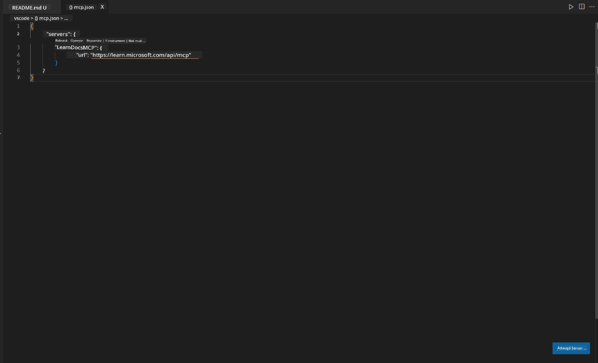
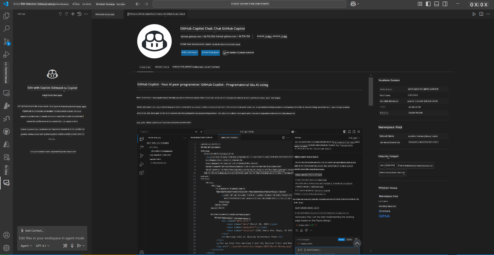
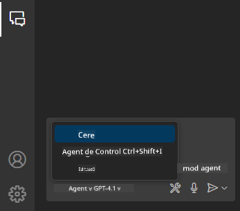
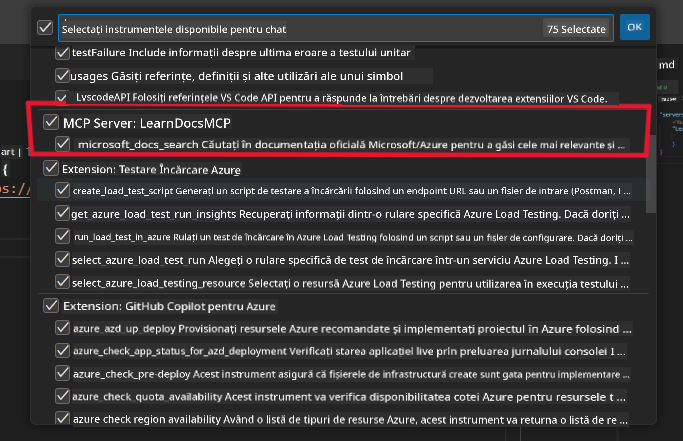
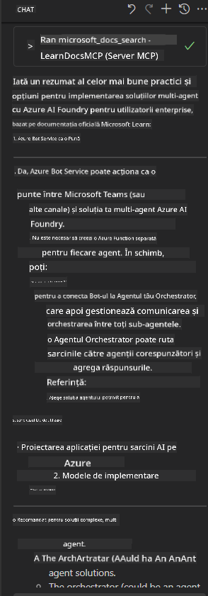

<!--
CO_OP_TRANSLATOR_METADATA:
{
  "original_hash": "db532b1ec386c9ce38c791653dc3c881",
  "translation_date": "2025-07-14T06:55:53+00:00",
  "source_file": "09-CaseStudy/docs-mcp/solution/scenario3/README.md",
  "language_code": "ro"
}
-->
# Scenariul 3: Documentație în editor cu serverul MCP în VS Code

## Prezentare generală

În acest scenariu, vei învăța cum să aduci documentația Microsoft Learn direct în mediul tău Visual Studio Code folosind serverul MCP. În loc să schimbi constant filele din browser pentru a căuta documentație, poți accesa, căuta și face referire la documentația oficială chiar din editorul tău. Această abordare îți optimizează fluxul de lucru, te ajută să rămâi concentrat și permite o integrare perfectă cu instrumente precum GitHub Copilot.

- Caută și citește documentația în VS Code fără să părăsești mediul de programare.
- Fă referire la documentație și inserează linkuri direct în fișierele README sau în cele de curs.
- Folosește GitHub Copilot și MCP împreună pentru un flux de lucru fluid, asistat de AI.

## Obiective de învățare

La finalul acestui capitol, vei înțelege cum să configurezi și să folosești serverul MCP în VS Code pentru a-ți îmbunătăți fluxul de lucru de documentare și dezvoltare. Vei putea:

- Configura spațiul de lucru pentru a folosi serverul MCP la căutarea documentației.
- Căuta și insera documentație direct din VS Code.
- Combina puterea GitHub Copilot și MCP pentru un flux de lucru mai productiv, augmentat de AI.

Aceste abilități te vor ajuta să rămâi concentrat, să îmbunătățești calitatea documentației și să-ți crești productivitatea ca dezvoltator sau scriitor tehnic.

## Soluție

Pentru a obține acces la documentație direct în editor, vei urma o serie de pași care integrează serverul MCP cu VS Code și GitHub Copilot. Această soluție este ideală pentru autorii de cursuri, scriitorii de documentație și dezvoltatorii care doresc să rămână concentrați în editor în timp ce lucrează cu documentația și Copilot.

- Adaugă rapid linkuri de referință într-un README în timp ce scrii documentația unui curs sau proiect.
- Folosește Copilot pentru a genera cod și MCP pentru a găsi și cita instant documentația relevantă.
- Rămâi concentrat în editor și crește-ți productivitatea.

### Ghid pas cu pas

Pentru a începe, urmează acești pași. Pentru fiecare pas, poți adăuga o captură de ecran din folderul assets pentru a ilustra vizual procesul.

1. **Adaugă configurația MCP:**  
   În rădăcina proiectului, creează un fișier `.vscode/mcp.json` și adaugă următoarea configurație:  
   ```json
   {
     "servers": {
       "LearnDocsMCP": {
         "url": "https://learn.microsoft.com/api/mcp"
       }
     }
   }
   ```  
   Această configurație îi spune VS Code cum să se conecteze la [`Microsoft Learn Docs MCP server`](https://github.com/MicrosoftDocs/mcp).
   
   
    
2. **Deschide panoul GitHub Copilot Chat:**  
   Dacă nu ai deja extensia GitHub Copilot instalată, mergi în vizualizarea Extensions din VS Code și instaleaz-o. O poți descărca direct din [Visual Studio Code Marketplace](https://marketplace.visualstudio.com/items?itemName=GitHub.copilot-chat). Apoi, deschide panoul Copilot Chat din bara laterală.

   

3. **Activează modul agent și verifică uneltele:**  
   În panoul Copilot Chat, activează modul agent.

   

   După activarea modului agent, verifică dacă serverul MCP este listat ca una dintre uneltele disponibile. Acest lucru asigură că agentul Copilot poate accesa serverul de documentație pentru a prelua informații relevante.
   
   

4. **Începe o conversație nouă și pune întrebări agentului:**  
   Deschide o conversație nouă în panoul Copilot Chat. Acum poți pune întrebări agentului legate de documentație. Agentul va folosi serverul MCP pentru a prelua și afișa documentația Microsoft Learn relevantă direct în editorul tău.

   - *„Încerc să scriu un plan de studiu pentru subiectul X. Voi studia timp de 8 săptămâni, pentru fiecare săptămână, sugerează-mi conținutul pe care ar trebui să-l parcurg.”*

   

5. **Interogare live:**

   > Să luăm o interogare live din secțiunea [#get-help](https://discord.gg/D6cRhjHWSC) din Azure AI Foundry Discord ([vezi mesajul original](https://discord.com/channels/1113626258182504448/1385498306720829572)):
   
   *„Caut răspunsuri despre cum să implementez o soluție multi-agent cu agenți AI dezvoltați pe Azure AI Foundry. Observ că nu există o metodă directă de implementare, cum ar fi canalele Copilot Studio. Care sunt, așadar, diferitele moduri de a face această implementare pentru ca utilizatorii enterprise să interacționeze și să finalizeze sarcinile?  
Există numeroase articole/bloguri care spun că putem folosi serviciul Azure Bot pentru această sarcină, care poate acționa ca o punte între MS Teams și agenții Azure AI Foundry. Funcționează dacă configurez un bot Azure care se conectează la Orchestrator Agent pe Azure AI Foundry printr-o funcție Azure pentru a face orchestrarea sau trebuie să creez o funcție Azure pentru fiecare agent AI din soluția multi-agent pentru orchestrare în Bot Framework? Orice alte sugestii sunt binevenite.”*

   

   Agentul va răspunde cu linkuri și rezumate relevante din documentație, pe care le poți insera direct în fișierele tale markdown sau folosi ca referințe în cod.

### Exemple de interogări

Iată câteva exemple de întrebări pe care le poți încerca. Acestea vor demonstra cum serverul MCP și Copilot pot lucra împreună pentru a oferi documentație instantanee, contextuală, și referințe fără să părăsești VS Code:

- „Arată-mi cum să folosesc trigger-ele Azure Functions.”
- „Inserează un link către documentația oficială pentru Azure Key Vault.”
- „Care sunt cele mai bune practici pentru securizarea resurselor Azure?”
- „Găsește un quickstart pentru serviciile Azure AI.”

Aceste interogări vor demonstra cum serverul MCP și Copilot pot colabora pentru a oferi documentație instantanee, contextuală și referințe fără să părăsești VS Code.

---

**Declinare de responsabilitate**:  
Acest document a fost tradus folosind serviciul de traducere AI [Co-op Translator](https://github.com/Azure/co-op-translator). Deși ne străduim pentru acuratețe, vă rugăm să rețineți că traducerile automate pot conține erori sau inexactități. Documentul original în limba sa nativă trebuie considerat sursa autorizată. Pentru informații critice, se recomandă traducerea profesională realizată de un specialist uman. Nu ne asumăm răspunderea pentru eventualele neînțelegeri sau interpretări greșite rezultate din utilizarea acestei traduceri.