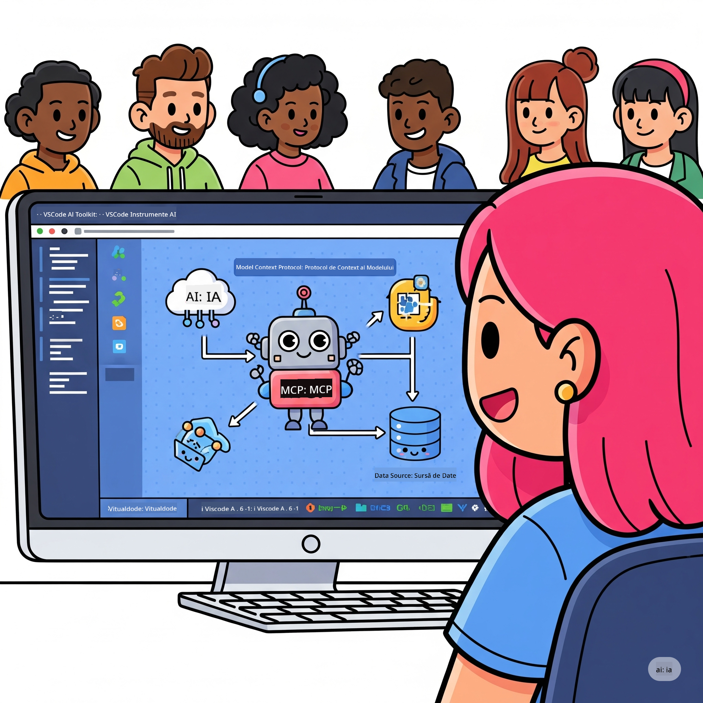
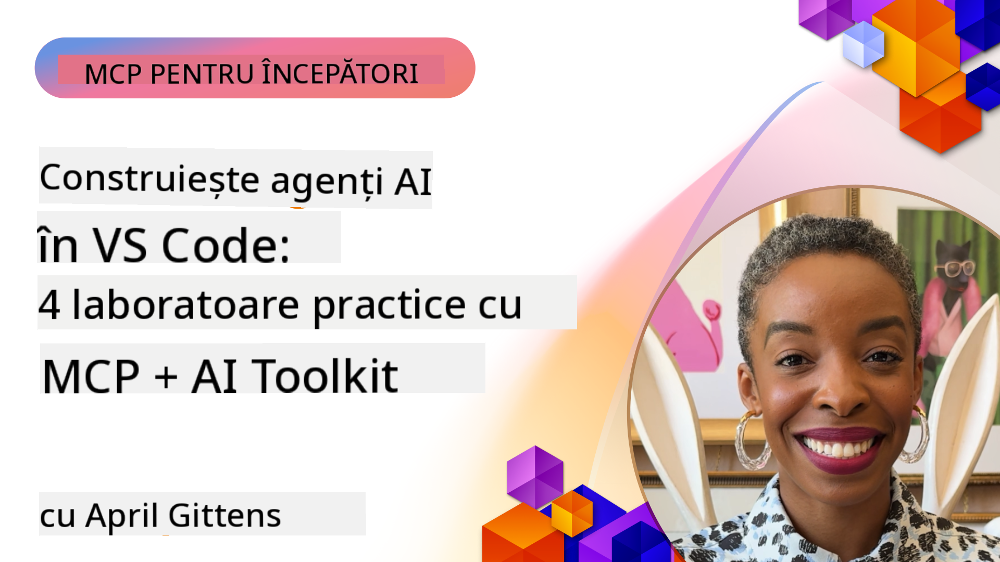

<!--
CO_OP_TRANSLATOR_METADATA:
{
  "original_hash": "1b000fd6e1b04c047578bfc5d07d54eb",
  "translation_date": "2025-08-19T16:42:39+00:00",
  "source_file": "10-StreamliningAIWorkflowsBuildingAnMCPServerWithAIToolkit/README.md",
  "language_code": "ro"
}
-->
# Simplificarea Fluxurilor de Lucru AI: Construirea unui Server MCP cu AI Toolkit

## 🎯 Prezentare Generală

_(Click pe imaginea de mai sus pentru a viziona videoclipul acestei lecții)_

Bine ați venit la **Atelierul Model Context Protocol (MCP)**! Acest atelier practic cuprinzător combină două tehnologii de ultimă generație pentru a revoluționa dezvoltarea aplicațiilor AI:

- **🔗 Model Context Protocol (MCP)**: Un standard deschis pentru integrarea fără cusur a instrumentelor AI
- **🛠️ AI Toolkit pentru Visual Studio Code (AITK)**: Extensia puternică de dezvoltare AI de la Microsoft

### 🎓 Ce Veți Învăța

Până la finalul acestui atelier, veți stăpâni arta construirii aplicațiilor inteligente care conectează modelele AI cu instrumentele și serviciile din lumea reală. De la testare automată la integrarea API-urilor personalizate, veți dobândi abilități practice pentru a rezolva provocări complexe de afaceri.

## 🏗️ Tehnologii Utilizate

### 🔌 Model Context Protocol (MCP)

MCP este **"USB-C pentru AI"** - un standard universal care conectează modelele AI la instrumente și surse de date externe.

**✨ Caracteristici Cheie:**

- 🔄 **Integrare Standardizată**: Interfață universală pentru conexiuni AI-instrumente
- 🏛️ **Arhitectură Flexibilă**: Servere locale și la distanță prin transport stdio/SSE
- 🧰 **Ecosistem Bogat**: Instrumente, prompturi și resurse într-un singur protocol
- 🔒 **Pregătit pentru Enterprise**: Securitate și fiabilitate integrate

**🎯 De ce este Important MCP:**
Așa cum USB-C a eliminat haosul cablurilor, MCP elimină complexitatea integrărilor AI. Un protocol, posibilități infinite.

### 🤖 AI Toolkit pentru Visual Studio Code (AITK)

Extensia de dezvoltare AI de la Microsoft care transformă VS Code într-un centru de putere AI.

**🚀 Capacități de Bază:**

- 📦 **Catalog de Modele**: Acces la modele din Azure AI, GitHub, Hugging Face, Ollama
- ⚡ **Inferență Locală**: Execuție optimizată ONNX pe CPU/GPU/NPU
- 🏗️ **Agent Builder**: Dezvoltare vizuală de agenți AI cu integrare MCP
- 🎭 **Multi-Modal**: Suport pentru text, viziune și ieșiri structurate

**💡 Beneficii pentru Dezvoltare:**

- Implementare de modele fără configurare
- Inginerie vizuală a prompturilor
- Teren de testare în timp real
- Integrare fără cusur a serverului MCP

## 📚 Parcurs de Învățare

### [🚀 Modulul 1: Fundamentele AI Toolkit](./lab1/README.md)

**Durată**: 15 minute

- 🛠️ Instalați și configurați AI Toolkit pentru VS Code
- 🗂️ Explorați Catalogul de Modele (peste 100 de modele din GitHub, ONNX, OpenAI, Anthropic, Google)
- 🎮 Stăpâniți Terenul Interactiv pentru testarea modelelor în timp real
- 🤖 Construiți primul dvs. agent AI cu Agent Builder
- 📊 Evaluați performanța modelelor cu metrici integrate (F1, relevanță, similaritate, coerență)
- ⚡ Învățați procesarea în loturi și capabilitățile de suport multi-modal

**🎯 Rezultat al Învățării**: Creați un agent AI funcțional cu o înțelegere cuprinzătoare a capacităților AITK

### [🌐 Modulul 2: MCP cu Fundamentele AI Toolkit](./lab2/README.md)

**Durată**: 20 minute

- 🧠 Stăpâniți arhitectura și conceptele Model Context Protocol (MCP)
- 🌐 Explorați ecosistemul de servere MCP de la Microsoft
- 🤖 Construiți un agent de automatizare a browserului folosind serverul MCP Playwright
- 🔧 Integrați serverele MCP cu Agent Builder din AI Toolkit
- 📊 Configurați și testați instrumentele MCP în cadrul agenților dvs.
- 🚀 Exportați și implementați agenți alimentați de MCP pentru utilizare în producție

**🎯 Rezultat al Învățării**: Implementați un agent AI îmbunătățit cu instrumente externe prin MCP

### [🔧 Modulul 3: Dezvoltare Avansată MCP cu AI Toolkit](./lab3/README.md)

**Durată**: 20 minute

- 💻 Creați servere MCP personalizate folosind AI Toolkit
- 🐍 Configurați și utilizați cel mai recent SDK MCP Python (v1.9.3)
- 🔍 Configurați și utilizați MCP Inspector pentru depanare
- 🛠️ Construiți un Server MCP pentru Vreme cu fluxuri de lucru profesionale de depanare
- 🧪 Depanați serverele MCP atât în Agent Builder, cât și în mediile Inspector

**🎯 Rezultat al Învățării**: Dezvoltați și depanați servere MCP personalizate cu instrumente moderne

### [🐙 Modulul 4: Dezvoltare Practică MCP - Server Personalizat GitHub Clone](./lab4/README.md)

**Durată**: 30 minute

- 🏗️ Construiți un Server MCP GitHub Clone pentru fluxuri de lucru de dezvoltare
- 🔄 Implementați clonarea inteligentă a depozitelor cu validare și gestionarea erorilor
- 📁 Creați gestionarea inteligentă a directoarelor și integrarea cu VS Code
- 🤖 Utilizați GitHub Copilot Agent Mode cu instrumente MCP personalizate
- 🛡️ Aplicați fiabilitate pregătită pentru producție și compatibilitate multiplatformă

**🎯 Rezultat al Învățării**: Implementați un server MCP pregătit pentru producție care simplifică fluxurile de lucru reale de dezvoltare

## 💡 Aplicații și Impact în Lumea Reală

### 🏢 Cazuri de Utilizare în Enterprise

#### 🔄 Automatizare DevOps

Transformați fluxul de lucru de dezvoltare cu automatizare inteligentă:

- **Gestionare Inteligentă a Depozitelor**: Revizuirea codului și decizii de îmbinare bazate pe AI
- **CI/CD Inteligent**: Optimizarea automată a pipeline-urilor pe baza modificărilor de cod
- **Trierea Problemelor**: Clasificarea automată a erorilor și atribuirea lor

#### 🧪 Revoluția Asigurării Calității

Îmbunătățiți testarea cu automatizare alimentată de AI:

- **Generare Inteligentă de Teste**: Crearea automată a suitei de teste complete
- **Testare Vizuală de Regresie**: Detectarea schimbărilor UI cu ajutorul AI
- **Monitorizare a Performanței**: Identificarea și rezolvarea proactivă a problemelor

#### 📊 Inteligență pentru Fluxurile de Date

Construiți fluxuri de procesare a datelor mai inteligente:

- **Procese ETL Adaptive**: Transformări de date auto-optimizante
- **Detectarea Anomaliilor**: Monitorizare în timp real a calității datelor
- **Rutare Inteligentă**: Gestionarea inteligentă a fluxului de date

#### 🎧 Îmbunătățirea Experienței Clienților

Creați interacțiuni excepționale cu clienții:

- **Suport Conștient de Context**: Agenți AI cu acces la istoricul clienților
- **Rezolvarea Proactivă a Problemelor**: Servicii predictive pentru clienți
- **Integrare Multi-Canal**: Experiență AI unificată pe toate platformele

## 🛠️ Cerințe și Configurare

### 💻 Cerințe de Sistem

| Componentă | Cerință | Note |
|------------|---------|------|
| **Sistem de Operare** | Windows 10+, macOS 10.15+, Linux | Orice OS modern |
| **Visual Studio Code** | Cea mai recentă versiune stabilă | Necesară pentru AITK |
| **Node.js** | v18.0+ și npm | Pentru dezvoltarea serverelor MCP |
| **Python** | 3.10+ | Opțional pentru serverele MCP Python |
| **Memorie** | Minimum 8GB RAM | 16GB recomandat pentru modele locale |

### 🔧 Mediu de Dezvoltare

#### Extensii Recomandate pentru VS Code

- **AI Toolkit** (ms-windows-ai-studio.windows-ai-studio)
- **Python** (ms-python.python)
- **Python Debugger** (ms-python.debugpy)
- **GitHub Copilot** (GitHub.copilot) - Opțional, dar util

#### Instrumente Opționale

- **uv**: Manager modern de pachete Python
- **MCP Inspector**: Instrument vizual de depanare pentru serverele MCP
- **Playwright**: Pentru exemple de automatizare web

## 🎖️ Rezultate ale Învățării și Certificare

### 🏆 Lista de Verificare a Competențelor

Prin finalizarea acestui atelier, veți dobândi competențe în:

#### 🎯 Competențe de Bază

- [ ] **Stăpânirea Protocolului MCP**: Înțelegere profundă a arhitecturii și a modelelor de implementare
- [ ] **Proficiență AITK**: Utilizare la nivel expert a AI Toolkit pentru dezvoltare rapidă
- [ ] **Dezvoltare de Servere Personalizate**: Construirea, implementarea și întreținerea serverelor MCP de producție
- [ ] **Excelență în Integrarea Instrumentelor**: Conectarea fără cusur a AI cu fluxurile de lucru existente
- [ ] **Aplicarea Rezolvării Problemelor**: Aplicarea abilităților învățate la provocări reale de afaceri

#### 🔧 Abilități Tehnice

- [ ] Configurarea și utilizarea AI Toolkit în VS Code
- [ ] Proiectarea și implementarea serverelor MCP personalizate
- [ ] Integrarea modelelor GitHub cu arhitectura MCP
- [ ] Construirea fluxurilor de lucru de testare automată cu Playwright
- [ ] Implementarea agenților AI pentru utilizare în producție
- [ ] Depanarea și optimizarea performanței serverelor MCP

#### 🚀 Capacități Avansate

- [ ] Arhitectura integrărilor AI la scară enterprise
- [ ] Implementarea celor mai bune practici de securitate pentru aplicațiile AI
- [ ] Proiectarea arhitecturilor scalabile pentru serverele MCP
- [ ] Crearea de lanțuri de instrumente personalizate pentru domenii specifice
- [ ] Mentorat în dezvoltarea nativă AI

## 📖 Resurse Suplimentare

- [Specificația MCP](https://modelcontextprotocol.io/docs)
- [Repository-ul GitHub AI Toolkit](https://github.com/microsoft/vscode-ai-toolkit)
- [Colecția de Servere MCP Exemplu](https://github.com/modelcontextprotocol/servers)
- [Ghidul celor Mai Bune Practici](https://modelcontextprotocol.io/docs/best-practices)

---

**🚀 Gata să revoluționați fluxul de lucru al dezvoltării AI?**

Hai să construim împreună viitorul aplicațiilor inteligente cu MCP și AI Toolkit!

**Declinare de responsabilitate**:  
Acest document a fost tradus folosind serviciul de traducere AI [Co-op Translator](https://github.com/Azure/co-op-translator). Deși ne străduim să asigurăm acuratețea, vă rugăm să fiți conștienți că traducerile automate pot conține erori sau inexactități. Documentul original în limba sa natală ar trebui considerat sursa autoritară. Pentru informații critice, se recomandă traducerea profesională realizată de un specialist uman. Nu ne asumăm responsabilitatea pentru eventualele neînțelegeri sau interpretări greșite care pot apărea din utilizarea acestei traduceri.