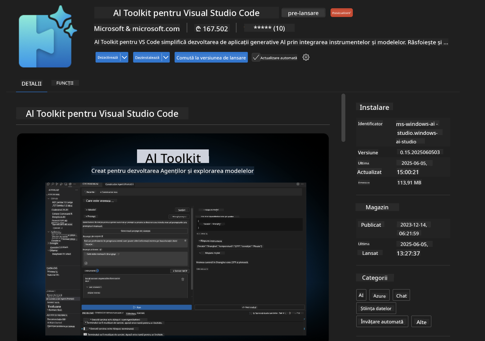
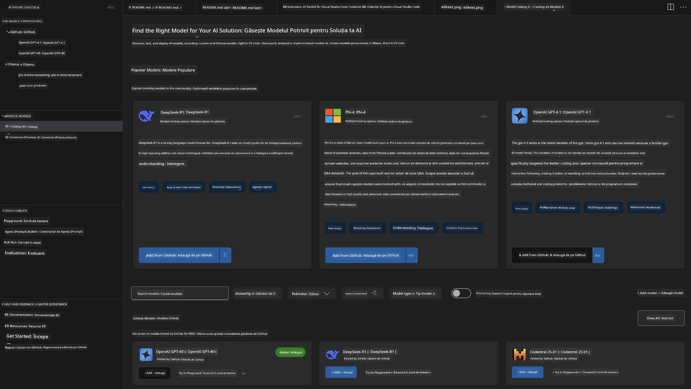
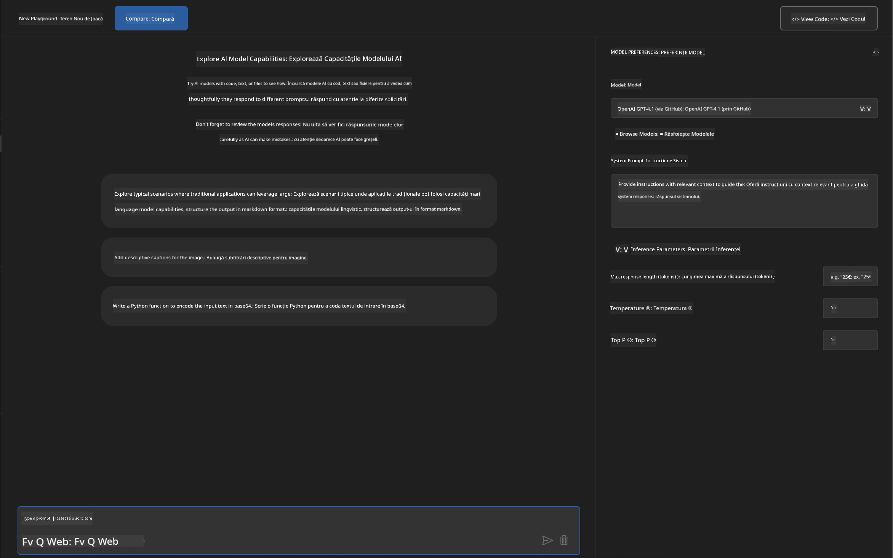
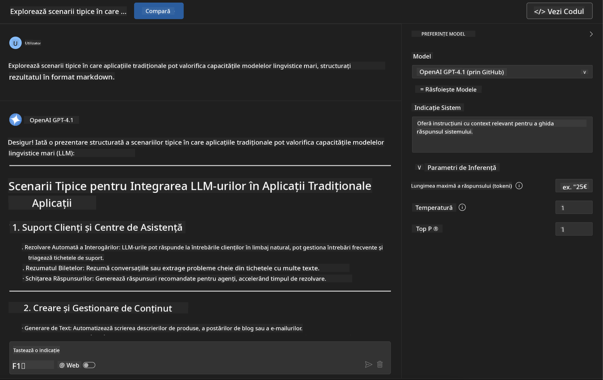
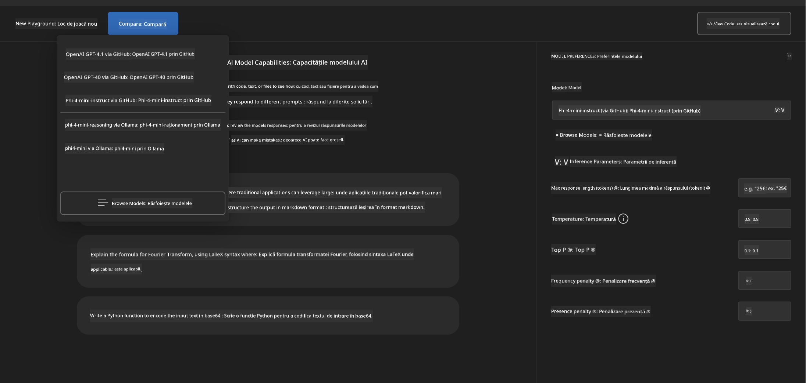
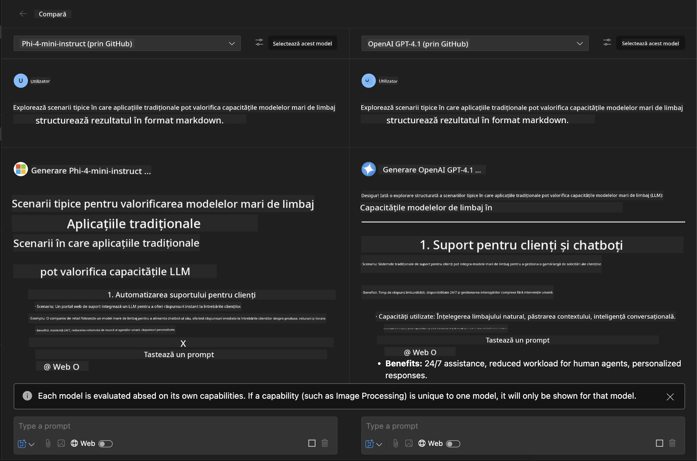
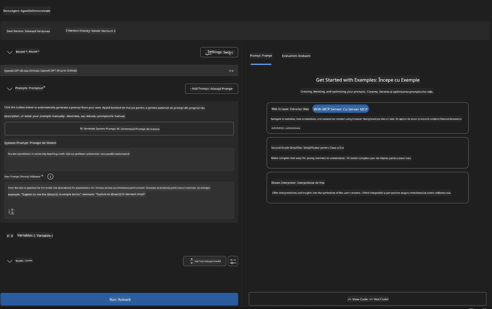
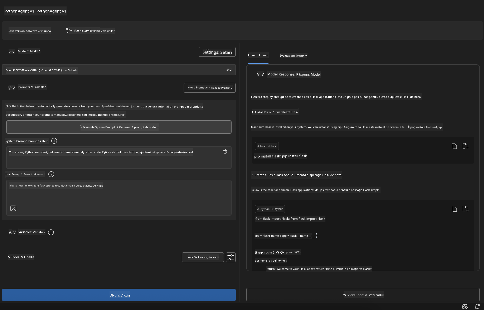

<!--
CO_OP_TRANSLATOR_METADATA:
{
  "original_hash": "2aa9dbc165e104764fa57e8a0d3f1c73",
  "translation_date": "2025-07-14T07:34:25+00:00",
  "source_file": "10-StreamliningAIWorkflowsBuildingAnMCPServerWithAIToolkit/lab1/README.md",
  "language_code": "ro"
}
-->
# 🚀 Modulul 1: Fundamentele AI Toolkit

[]()
[]()
[]()

## 📋 Obiective de învățare

La finalul acestui modul, vei putea:
- ✅ Instala și configura AI Toolkit pentru Visual Studio Code
- ✅ Naviga prin Catalogul de Modele și înțelege diferitele surse de modele
- ✅ Folosi Playground pentru testarea și experimentarea modelelor
- ✅ Crea agenți AI personalizați folosind Agent Builder
- ✅ Compara performanța modelelor între diferiți furnizori
- ✅ Aplica cele mai bune practici pentru ingineria prompturilor

## 🧠 Introducere în AI Toolkit (AITK)

**AI Toolkit pentru Visual Studio Code** este extensia principală a Microsoft care transformă VS Code într-un mediu complet pentru dezvoltarea AI. Ea face legătura între cercetarea AI și dezvoltarea practică, făcând AI generativ accesibil dezvoltatorilor de toate nivelurile.

### 🌟 Capacități cheie

| Funcționalitate | Descriere | Caz de utilizare |
|-----------------|-----------|------------------|
| **🗂️ Catalog de Modele** | Acces la peste 100 de modele de pe GitHub, ONNX, OpenAI, Anthropic, Google | Descoperirea și selecția modelelor |
| **🔌 Suport BYOM** | Integrează propriile modele (local/remote) | Implementare modele personalizate |
| **🎮 Playground Interactiv** | Testare în timp real a modelelor cu interfață de chat | Prototipare rapidă și testare |
| **📎 Suport Multi-Modal** | Lucrează cu text, imagini și atașamente | Aplicații AI complexe |
| **⚡ Procesare în Batch** | Rulează mai multe prompturi simultan | Fluxuri de lucru eficiente pentru testare |
| **📊 Evaluarea Modelului** | Metrice integrate (F1, relevanță, similaritate, coerență) | Evaluarea performanței |

### 🎯 De ce este important AI Toolkit

- **🚀 Dezvoltare accelerată**: De la idee la prototip în câteva minute
- **🔄 Flux de lucru unificat**: O singură interfață pentru mai mulți furnizori AI
- **🧪 Experimentare facilă**: Compară modele fără configurări complicate
- **📈 Pregătit pentru producție**: Tranziție lină de la prototip la implementare

## 🛠️ Prerechizite & Configurare

### 📦 Instalarea extensiei AI Toolkit

**Pasul 1: Accesează Marketplace-ul de Extensii**
1. Deschide Visual Studio Code
2. Navighează la vizualizarea Extensii (`Ctrl+Shift+X` sau `Cmd+Shift+X`)
3. Caută „AI Toolkit”

**Pasul 2: Alege versiunea dorită**
- **🟢 Release**: Recomandată pentru utilizare în producție
- **🔶 Pre-release**: Acces timpuriu la funcții de ultimă oră

**Pasul 3: Instalează și activează**



### ✅ Lista de verificare pentru confirmare
- [ ] Iconița AI Toolkit apare în bara laterală VS Code
- [ ] Extensia este activată și funcțională
- [ ] Nu există erori de instalare în panoul de output

## 🧪 Exercițiu practic 1: Explorarea modelelor GitHub

**🎯 Obiectiv**: Stăpânește Catalogul de Modele și testează primul tău model AI

### 📊 Pasul 1: Navighează în Catalogul de Modele

Catalogul de Modele este poarta ta către ecosistemul AI. Agregă modele de la mai mulți furnizori, facilitând descoperirea și compararea opțiunilor.

**🔍 Ghid de navigare:**

Click pe **MODELS - Catalog** în bara laterală AI Toolkit



**💡 Sfat util**: Caută modele cu capabilități specifice care se potrivesc cazului tău de utilizare (ex: generare de cod, scriere creativă, analiză).

**⚠️ Notă**: Modelele găzduite pe GitHub (adică GitHub Models) sunt gratuite, dar au limitări privind numărul de cereri și tokeni. Pentru a accesa modele non-GitHub (modele externe găzduite prin Azure AI sau alte endpoint-uri), va trebui să furnizezi cheia API sau autentificarea corespunzătoare.

### 🚀 Pasul 2: Adaugă și configurează primul tău model

**Strategia de selecție a modelului:**
- **GPT-4.1**: Ideal pentru raționamente complexe și analiză
- **Phi-4-mini**: Ușor, răspunsuri rapide pentru sarcini simple

**🔧 Procesul de configurare:**
1. Selectează **OpenAI GPT-4.1** din catalog
2. Apasă pe **Add to My Models** - astfel modelul este înregistrat pentru utilizare
3. Alege **Try in Playground** pentru a lansa mediul de testare
4. Așteaptă inițializarea modelului (configurarea inițială poate dura puțin)



**⚙️ Înțelegerea parametrilor modelului:**
- **Temperature**: Controlează creativitatea (0 = determinist, 1 = creativ)
- **Max Tokens**: Lungimea maximă a răspunsului
- **Top-p**: Eșantionare nucleu pentru diversitatea răspunsului

### 🎯 Pasul 3: Stăpânește interfața Playground

Playground este laboratorul tău de experimentare AI. Iată cum să-i maximizezi potențialul:

**🎨 Cele mai bune practici pentru ingineria prompturilor:**
1. **Fii specific**: Instrucțiuni clare și detaliate aduc rezultate mai bune
2. **Oferă context**: Include informații relevante de fundal
3. **Folosește exemple**: Arată modelului ce dorești prin exemple
4. **Iterează**: Ajustează prompturile pe baza rezultatelor inițiale

**🧪 Scenarii de testare:**
```markdown
# Example 1: Code Generation
"Write a Python function that calculates the factorial of a number using recursion. Include error handling and docstrings."

# Example 2: Creative Writing
"Write a professional email to a client explaining a project delay, maintaining a positive tone while being transparent about challenges."

# Example 3: Data Analysis
"Analyze this sales data and provide insights: [paste your data]. Focus on trends, anomalies, and actionable recommendations."
```



### 🏆 Exercițiu provocare: Compararea performanței modelelor

**🎯 Scop**: Compară diferite modele folosind aceleași prompturi pentru a înțelege punctele lor forte

**📋 Instrucțiuni:**
1. Adaugă **Phi-4-mini** în spațiul tău de lucru
2. Folosește același prompt pentru GPT-4.1 și Phi-4-mini



3. Compară calitatea răspunsurilor, viteza și acuratețea
4. Documentează concluziile în secțiunea de rezultate



**💡 Aspecte cheie de descoperit:**
- Când să folosești LLM vs SLM
- Compromisuri între cost și performanță
- Capabilități specializate ale diferitelor modele

## 🤖 Exercițiu practic 2: Construirea agenților personalizați cu Agent Builder

**🎯 Obiectiv**: Creează agenți AI specializați pentru sarcini și fluxuri de lucru specifice

### 🏗️ Pasul 1: Înțelegerea Agent Builder

Agent Builder este punctul forte al AI Toolkit. Îți permite să creezi asistenți AI dedicați care combină puterea modelelor mari de limbaj cu instrucțiuni personalizate, parametri specifici și cunoștințe specializate.

**🧠 Componentele arhitecturii agentului:**
- **Modelul de bază**: LLM-ul fundamental (GPT-4, Groks, Phi etc.)
- **System Prompt**: Definește personalitatea și comportamentul agentului
- **Parametri**: Setări fine pentru performanță optimă
- **Integrarea uneltelor**: Conectare la API-uri externe și servicii MCP
- **Memorie**: Contextul conversației și persistența sesiunii



### ⚙️ Pasul 2: Detalii despre configurarea agentului

**🎨 Crearea unor System Prompt eficiente:**
```markdown
# Template Structure:
## Role Definition
You are a [specific role] with expertise in [domain].

## Capabilities
- List specific abilities
- Define scope of knowledge
- Clarify limitations

## Behavior Guidelines
- Response style (formal, casual, technical)
- Output format preferences
- Error handling approach

## Examples
Provide 2-3 examples of ideal interactions
```

*Desigur, poți folosi și Generate System Prompt pentru a lăsa AI să te ajute să generezi și optimizezi prompturile*

**🔧 Optimizarea parametrilor:**
| Parametru | Interval recomandat | Caz de utilizare |
|-----------|---------------------|------------------|
| **Temperature** | 0.1-0.3 | Răspunsuri tehnice/factuale |
| **Temperature** | 0.7-0.9 | Sarcini creative/de brainstorming |
| **Max Tokens** | 500-1000 | Răspunsuri concise |
| **Max Tokens** | 2000-4000 | Explicații detaliate |

### 🐍 Pasul 3: Exercițiu practic - Agent de programare Python

**🎯 Misiune**: Creează un asistent specializat pentru cod Python

**📋 Pașii de configurare:**

1. **Selectarea modelului**: Alege **Claude 3.5 Sonnet** (excelent pentru cod)

2. **Designul System Prompt:**
```markdown
# Python Programming Expert Agent

## Role
You are a senior Python developer with 10+ years of experience. You excel at writing clean, efficient, and well-documented Python code.

## Capabilities
- Write production-ready Python code
- Debug complex issues
- Explain code concepts clearly
- Suggest best practices and optimizations
- Provide complete working examples

## Response Format
- Always include docstrings
- Add inline comments for complex logic
- Suggest testing approaches
- Mention relevant libraries when applicable

## Code Quality Standards
- Follow PEP 8 style guidelines
- Use type hints where appropriate
- Handle exceptions gracefully
- Write readable, maintainable code
```

3. **Configurarea parametrilor**:
   - Temperature: 0.2 (pentru cod consistent și fiabil)
   - Max Tokens: 2000 (explicații detaliate)
   - Top-p: 0.9 (creativitate echilibrată)



### 🧪 Pasul 4: Testarea agentului tău Python

**Scenarii de testare:**
1. **Funcție de bază**: „Creează o funcție pentru găsirea numerelor prime”
2. **Algoritm complex**: „Implementează un arbore binar de căutare cu metodele insert, delete și search”
3. **Problemă din lumea reală**: „Construiește un web scraper care gestionează limitarea ratei și retry-uri”
4. **Debugging**: „Corectează acest cod [lipește codul cu erori]”

**🏆 Criterii de succes:**
- ✅ Codul rulează fără erori
- ✅ Include documentație adecvată
- ✅ Urmează cele mai bune practici Python
- ✅ Oferă explicații clare
- ✅ Sugerează îmbunătățiri

## 🎓 Încheiere Modul 1 & Pașii următori

### 📊 Verificare cunoștințe

Testează-ți înțelegerea:
- [ ] Poți explica diferențele dintre modelele din catalog?
- [ ] Ai creat și testat cu succes un agent personalizat?
- [ ] Înțelegi cum să optimizezi parametrii pentru diferite cazuri de utilizare?
- [ ] Poți crea prompturi eficiente pentru sistem?

### 📚 Resurse suplimentare

- **Documentația AI Toolkit**: [Documentația oficială Microsoft](https://github.com/microsoft/vscode-ai-toolkit)
- **Ghid de inginerie a prompturilor**: [Cele mai bune practici](https://platform.openai.com/docs/guides/prompt-engineering)
- **Modele în AI Toolkit**: [Modele în dezvoltare](https://github.com/microsoft/vscode-ai-toolkit/blob/main/doc/models.md)

**🎉 Felicitări!** Ai stăpânit fundamentele AI Toolkit și ești pregătit să construiești aplicații AI mai avansate!

### 🔜 Continuă cu următorul modul

Ești gata pentru funcționalități mai avansate? Continuă cu **[Modulul 2: MCP cu fundamente AI Toolkit](../lab2/README.md)** unde vei învăța cum să:
- Conectezi agenții la unelte externe folosind Model Context Protocol (MCP)
- Construiești agenți de automatizare a browserului cu Playwright
- Integrezi servere MCP cu agenții tăi AI Toolkit
- Îmbunătățești agenții cu date și capabilități externe

**Declinare de responsabilitate**:  
Acest document a fost tradus folosind serviciul de traducere AI [Co-op Translator](https://github.com/Azure/co-op-translator). Deși ne străduim pentru acuratețe, vă rugăm să rețineți că traducerile automate pot conține erori sau inexactități. Documentul original în limba sa nativă trebuie considerat sursa autorizată. Pentru informații critice, se recomandă traducerea profesională realizată de un specialist uman. Nu ne asumăm răspunderea pentru eventualele neînțelegeri sau interpretări greșite rezultate din utilizarea acestei traduceri.