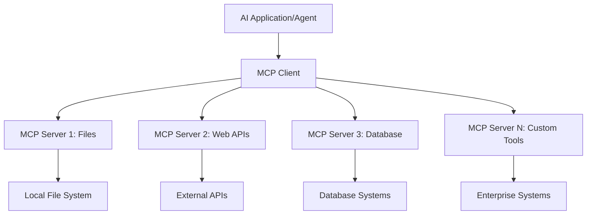

<!--
CO_OP_TRANSLATOR_METADATA:
{
  "original_hash": "a22b7dd11cd7690f99f9195877cafdc3",
  "translation_date": "2025-06-10T05:58:24+00:00",
  "source_file": "10-StreamliningAIWorkflowsBuildingAnMCPServerWithAIToolkit/lab2/README.md",
  "language_code": "ro"
}
-->
# 🌐 Modulul 2: Fundamentele MCP cu AI Toolkit

[]()
[]()
[]()

## 📋 Obiective de învățare

La finalul acestui modul vei putea:
- ✅ Înțelege arhitectura și beneficiile Model Context Protocol (MCP)
- ✅ Explora ecosistemul serverelor MCP de la Microsoft
- ✅ Integra serverele MCP cu AI Toolkit Agent Builder
- ✅ Construi un agent funcțional de automatizare browser folosind Playwright MCP
- ✅ Configura și testa uneltele MCP în agenții tăi
- ✅ Exporta și implementa agenți MCP în producție

## 🎯 Construind pe baza Modulului 1

În Modulul 1, am stăpânit elementele de bază AI Toolkit și am creat primul nostru Agent Python. Acum vom **îmbunătăți** agenții tăi prin conectarea lor la unelte și servicii externe prin revoluționarul **Model Context Protocol (MCP)**.

Gândește-te la asta ca la trecerea de la un calculator simplu la un computer complet – agenții tăi AI vor putea:
- 🌐 Naviga și interacționa cu site-uri web
- 📁 Accesa și manipula fișiere
- 🔧 Integra cu sisteme enterprise
- 📊 Procesa date în timp real din API-uri

## 🧠 Înțelegerea Model Context Protocol (MCP)

### 🔍 Ce este MCP?

Model Context Protocol (MCP) este **„USB-C pentru aplicațiile AI”** – un standard deschis revoluționar care conectează Large Language Models (LLMs) cu unelte, surse de date și servicii externe. Așa cum USB-C a eliminat haosul cablurilor printr-un conector universal, MCP elimină complexitatea integrării AI printr-un protocol standardizat.

### 🎯 Problema pe care o rezolvă MCP

**Înainte de MCP:**
- 🔧 Integrări personalizate pentru fiecare unealtă
- 🔄 Dependență de furnizori cu soluții proprietare  
- 🔒 Vulnerabilități de securitate prin conexiuni ad-hoc
- ⏱️ Luni de dezvoltare pentru integrări de bază

**Cu MCP:**
- ⚡ Integrare uneltă plug-and-play
- 🔄 Arhitectură independentă de furnizor
- 🛡️ Cele mai bune practici de securitate integrate
- 🚀 Adăugarea de noi capabilități în câteva minute

### 🏗️ Arhitectura MCP în detaliu

MCP urmează o **arhitectură client-server** care creează un ecosistem sigur și scalabil:



**🔧 Componente principale:**

| Component | Rol | Exemple |
|-----------|------|----------|
| **MCP Hosts** | Aplicații care consumă serviciile MCP | Claude Desktop, VS Code, AI Toolkit |
| **MCP Clients** | Handleri de protocol (1:1 cu serverele) | Încorporat în aplicațiile host |
| **MCP Servers** | Expun capabilități prin protocol standard | Playwright, Files, Azure, GitHub |
| **Transport Layer** | Metode de comunicare | stdio, HTTP, WebSockets |

## 🏢 Ecosistemul serverelor MCP Microsoft

Microsoft conduce ecosistemul MCP cu o suită cuprinzătoare de servere enterprise care răspund nevoilor reale de business.

### 🌟 Servere MCP Microsoft remarcabile

#### 1. ☁️ Azure MCP Server
**🔗 Repository**: [azure/azure-mcp](https://github.com/azure/azure-mcp)  
**🎯 Scop**: Gestionarea resurselor Azure cu integrare AI

**✨ Funcționalități cheie:**
- Provisionare declarativă a infrastructurii
- Monitorizarea resurselor în timp real
- Recomandări pentru optimizarea costurilor
- Verificarea conformității de securitate

**🚀 Cazuri de utilizare:**
- Infrastructure-as-Code cu asistență AI
- Scalare automată a resurselor
- Optimizarea costurilor cloud
- Automatizarea fluxurilor DevOps

#### 2. 📊 Microsoft Dataverse MCP
**📚 Documentație**: [Microsoft Dataverse Integration](https://go.microsoft.com/fwlink/?linkid=2320176)  
**🎯 Scop**: Interfață în limbaj natural pentru datele de business

**✨ Funcționalități cheie:**
- Interogări în limbaj natural asupra bazelor de date
- Înțelegerea contextului de business
- Șabloane personalizate pentru prompturi
- Guvernanță enterprise a datelor

**🚀 Cazuri de utilizare:**
- Raportare business intelligence
- Analiza datelor clienților
- Perspective asupra pipeline-ului de vânzări
- Interogări pentru conformitate

#### 3. 🌐 Playwright MCP Server
**🔗 Repository**: [microsoft/playwright-mcp](https://github.com/microsoft/playwright-mcp)  
**🎯 Scop**: Automatizare browser și interacțiuni web

**✨ Funcționalități cheie:**
- Automatizare cross-browser (Chrome, Firefox, Safari)
- Detectare inteligentă a elementelor
- Captură de ecran și generare PDF
- Monitorizarea traficului de rețea

**🚀 Cazuri de utilizare:**
- Fluxuri automate de testare
- Web scraping și extragere de date
- Monitorizare UI/UX
- Automatizarea analizei concurenței

#### 4. 📁 Files MCP Server
**🔗 Repository**: [microsoft/files-mcp-server](https://github.com/microsoft/files-mcp-server)  
**🎯 Scop**: Operațiuni inteligente pe sistemul de fișiere

**✨ Funcționalități cheie:**
- Management declarativ al fișierelor
- Sincronizare de conținut
- Integrare control versiuni
- Extracție de metadate

**🚀 Cazuri de utilizare:**
- Managementul documentației
- Organizarea depozitelor de cod
- Fluxuri de lucru pentru publicarea conținutului
- Gestionarea fișierelor în pipeline-uri de date

#### 5. 📝 MarkItDown MCP Server
**🔗 Repository**: [microsoft/markitdown](https://github.com/microsoft/markitdown)  
**🎯 Scop**: Procesare și manipulare avansată Markdown

**✨ Funcționalități cheie:**
- Parsare complexă Markdown
- Conversie formate (MD ↔ HTML ↔ PDF)
- Analiză structură conținut
- Procesare template-uri

**🚀 Cazuri de utilizare:**
- Fluxuri de lucru pentru documentație tehnică
- Sisteme de management al conținutului
- Generare rapoarte
- Automatizarea bazelor de cunoștințe

#### 6. 📈 Clarity MCP Server
**📦 Pachet**: [@microsoft/clarity-mcp-server](https://www.npmjs.com/package/@microsoft/clarity-mcp-server)  
**🎯 Scop**: Analiză web și insight-uri despre comportamentul utilizatorilor

**✨ Funcționalități cheie:**
- Analiza datelor heatmap
- Înregistrări sesiuni utilizator
- Metrici de performanță
- Analiza funnel-ului de conversie

**🚀 Cazuri de utilizare:**
- Optimizarea site-urilor web
- Cercetare experiență utilizator
- Analiza testelor A/B
- Dashboard-uri business intelligence

### 🌍 Ecosistemul comunității

Dincolo de serverele Microsoft, ecosistemul MCP include:
- **🐙 GitHub MCP**: Managementul depozitelor și analiza codului
- **🗄️ Database MCPs**: Integrări PostgreSQL, MySQL, MongoDB
- **☁️ Cloud Provider MCPs**: Unelte AWS, GCP, Digital Ocean
- **📧 Communication MCPs**: Integrări Slack, Teams, Email

## 🛠️ Laborator practic: Construirea unui agent de automatizare browser

**🎯 Obiectivul proiectului**: Creează un agent inteligent de automatizare browser folosind Playwright MCP server care poate naviga pe site-uri, extrage informații și realiza interacțiuni web complexe.

### 🚀 Faza 1: Configurarea bazei agentului

#### Pasul 1: Inițializează agentul tău
1. **Deschide AI Toolkit Agent Builder**  
2. **Creează un agent nou** cu următoarea configurație:  
   - **Nume**: `BrowserAgent`
   - **Model**: Choose GPT-4o 


### 🔧 Phase 2: MCP Integration Workflow

#### Step 3: Add MCP Server Integration
1. **Navigate to Tools Section** in Agent Builder
2. **Click "Add Tool"** to open the integration menu
3. **Select "MCP Server"** from available options


**🔍 Understanding Tool Types:**
- **Built-in Tools**: Pre-configured AI Toolkit functions
- **MCP Servers**: External service integrations
- **Custom APIs**: Your own service endpoints
- **Function Calling**: Direct model function access

#### Step 4: MCP Server Selection
1. **Choose "MCP Server"** option to proceed


2. **Browse MCP Catalog** to explore available integrations


### 🎮 Phase 3: Playwright MCP Configuration

#### Step 5: Select and Configure Playwright
1. **Click "Use Featured MCP Servers"** to access Microsoft's verified servers
2. **Select "Playwright"** from the featured list
3. **Accept Default MCP ID** or customize for your environment


#### Step 6: Enable Playwright Capabilities
**🔑 Critical Step**: Select **ALL** available Playwright methods for maximum functionality


**🛠️ Essential Playwright Tools:**
- **Navigation**: `goto`, `goBack`, `goForward`, `reload`
- **Interaction**: `click`, `fill`, `press`, `hover`, `drag`
- **Extraction**: `textContent`, `innerHTML`, `getAttribute`
- **Validation**: `isVisible`, `isEnabled`, `waitForSelector`
- **Capture**: `screenshot`, `pdf`, `video`
- **Network**: `setExtraHTTPHeaders`, `route`, `waitForResponse`

#### Pasul 7: Verifică succesul integrării
**✅ Indicatori de succes:**  
- Toate uneltele apar în interfața Agent Builder  
- Nu există mesaje de eroare în panoul de integrare  
- Starea serverului Playwright afișează „Connected”  


**🔧 Depanare probleme frecvente:**  
- **Conexiune eșuată**: Verifică conexiunea la internet și setările firewall-ului  
- **Unelte lipsă**: Asigură-te că toate capabilitățile au fost selectate la configurare  
- **Erori de permisiuni**: Verifică dacă VS Code are permisiunile necesare în sistem  

### 🎯 Faza 4: Inginerie avansată a prompturilor

#### Pasul 8: Creează prompturi inteligente pentru sistem  
Construiește prompturi sofisticate care valorifică pe deplin capabilitățile Playwright:

```markdown
# Web Automation Expert System Prompt

## Core Identity
You are an advanced web automation specialist with deep expertise in browser automation, web scraping, and user experience analysis. You have access to Playwright tools for comprehensive browser control.

## Capabilities & Approach
### Navigation Strategy
- Always start with screenshots to understand page layout
- Use semantic selectors (text content, labels) when possible
- Implement wait strategies for dynamic content
- Handle single-page applications (SPAs) effectively

### Error Handling
- Retry failed operations with exponential backoff
- Provide clear error descriptions and solutions
- Suggest alternative approaches when primary methods fail
- Always capture diagnostic screenshots on errors

### Data Extraction
- Extract structured data in JSON format when possible
- Provide confidence scores for extracted information
- Validate data completeness and accuracy
- Handle pagination and infinite scroll scenarios

### Reporting
- Include step-by-step execution logs
- Provide before/after screenshots for verification
- Suggest optimizations and alternative approaches
- Document any limitations or edge cases encountered

## Ethical Guidelines
- Respect robots.txt and rate limiting
- Avoid overloading target servers
- Only extract publicly available information
- Follow website terms of service
```

#### Pasul 9: Creează prompturi dinamice pentru utilizatori  
Proiectează prompturi care demonstrează diverse capabilități:

**🌐 Exemplu de analiză web:**  
```markdown
Navigate to github.com/kinfey and provide a comprehensive analysis including:
1. Repository structure and organization
2. Recent activity and contribution patterns  
3. Documentation quality assessment
4. Technology stack identification
5. Community engagement metrics
6. Notable projects and their purposes

Include screenshots at key steps and provide actionable insights.
```


### 🚀 Faza 5: Execuție și testare

#### Pasul 10: Rulează prima automatizare  
1. **Apasă „Run”** pentru a lansa secvența de automatizare  
2. **Monitorizează execuția în timp real**:  
   - Browserul Chrome pornește automat  
   - Agentul navighează către site-ul țintă  
   - Capturi de ecran pentru fiecare pas important  
   - Rezultatele analizei sunt afișate în timp real  


#### Pasul 11: Analizează rezultatele și insight-urile  
Revizuiește analiza completă în interfața Agent Builder:


### 🌟 Faza 6: Capabilități avansate și implementare

#### Pasul 12: Exportă și implementează în producție  
Agent Builder suportă multiple opțiuni de implementare:


## 🎓 Rezumat Modul 2 & Pași următori

### 🏆 Realizare deblocat: Maestru al integrării MCP

**✅ Competențe dobândite:**  
- [ ] Înțelegerea arhitecturii și beneficiilor MCP  
- [ ] Navigarea în ecosistemul serverelor MCP Microsoft  
- [ ] Integrarea Playwright MCP cu AI Toolkit  
- [ ] Construirea de agenți avansați de automatizare browser  
- [ ] Inginerie avansată a prompturilor pentru automatizare web  

### 📚 Resurse suplimentare

- **🔗 Specificația MCP**: [Official Protocol Documentation](https://modelcontextprotocol.io/)  
- **🛠️ Playwright API**: [Complete Method Reference](https://playwright.dev/docs/api/class-playwright)  
- **🏢 Serverele MCP Microsoft**: [Enterprise Integration Guide](https://github.com/microsoft/mcp-servers)  
- **🌍 Exemple comunitare**: [MCP Server Gallery](https://github.com/modelcontextprotocol/servers)  

**🎉 Felicitări!** Ai stăpânit cu succes integrarea MCP și acum poți construi agenți AI pregătiți pentru producție cu capabilități externe!

### 🔜 Continuă cu următorul modul

Ești gata să-ți duci abilitățile MCP la nivelul următor? Continuă cu **[Modulul 3: Dezvoltare avansată MCP cu AI Toolkit](../lab3/README.md)** unde vei învăța cum să:  
- Creezi propriile servere MCP personalizate  
- Configurezi și folosești cel mai nou MCP Python SDK  
- Configurezi MCP Inspector pentru depanare  
- Stăpânești fluxurile avansate de dezvoltare server MCP  
- Construiești un Weather MCP Server de la zero

**Declinare a responsabilității**:  
Acest document a fost tradus folosind serviciul de traducere AI [Co-op Translator](https://github.com/Azure/co-op-translator). Deși ne străduim pentru acuratețe, vă rugăm să rețineți că traducerile automate pot conține erori sau inexactități. Documentul original în limba sa nativă trebuie considerat sursa autorizată. Pentru informații critice, se recomandă traducerea profesională realizată de un specialist uman. Nu ne asumăm responsabilitatea pentru eventualele neînțelegeri sau interpretări greșite rezultate din utilizarea acestei traduceri.