<!--
CO_OP_TRANSLATOR_METADATA:
{
  "original_hash": "a22b7dd11cd7690f99f9195877cafdc3",
  "translation_date": "2025-07-14T08:01:25+00:00",
  "source_file": "10-StreamliningAIWorkflowsBuildingAnMCPServerWithAIToolkit/lab2/README.md",
  "language_code": "ro"
}
-->
# 🌐 Modulul 2: Fundamentele MCP cu AI Toolkit

[]()
[]()
[]()

## 📋 Obiective de Învățare

La finalul acestui modul vei putea:
- ✅ Înțelege arhitectura și beneficiile Model Context Protocol (MCP)
- ✅ Explora ecosistemul serverelor MCP de la Microsoft
- ✅ Integra serverele MCP cu AI Toolkit Agent Builder
- ✅ Construi un agent funcțional de automatizare browser folosind Playwright MCP
- ✅ Configura și testa uneltele MCP în agenții tăi
- ✅ Exporta și implementa agenți MCP pentru utilizare în producție

## 🎯 Continuare după Modulul 1

În Modulul 1 am învățat bazele AI Toolkit și am creat primul nostru Agent Python. Acum vom **îmbunătăți** agenții tăi conectându-i la unelte și servicii externe prin revoluționarul **Model Context Protocol (MCP)**.

Gândește-te la asta ca la trecerea de la un calculator simplu la un computer complet – agenții tăi AI vor putea:
- 🌐 Naviga și interacționa cu site-uri web
- 📁 Accesa și manipula fișiere
- 🔧 Integra cu sisteme enterprise
- 📊 Procesa date în timp real din API-uri

## 🧠 Înțelegerea Model Context Protocol (MCP)

### 🔍 Ce este MCP?

Model Context Protocol (MCP) este **„USB-C pentru aplicațiile AI”** – un standard deschis revoluționar care conectează Modelele Mari de Limbaj (LLM-uri) la unelte externe, surse de date și servicii. Așa cum USB-C a eliminat haosul cablurilor oferind un singur conector universal, MCP elimină complexitatea integrării AI printr-un protocol standardizat.

### 🎯 Problema pe care o rezolvă MCP

**Înainte de MCP:**
- 🔧 Integrări personalizate pentru fiecare unealtă
- 🔄 Dependență de furnizori cu soluții proprietare  
- 🔒 Vulnerabilități de securitate din conexiuni ad-hoc
- ⏱️ Luni de dezvoltare pentru integrări de bază

**Cu MCP:**
- ⚡ Integrare uneltă plug-and-play
- 🔄 Arhitectură independentă de furnizor
- 🛡️ Cele mai bune practici de securitate integrate
- 🚀 Minute pentru a adăuga noi funcționalități

### 🏗️ Arhitectura MCP în detaliu

MCP urmează o **arhitectură client-server** care creează un ecosistem sigur și scalabil:

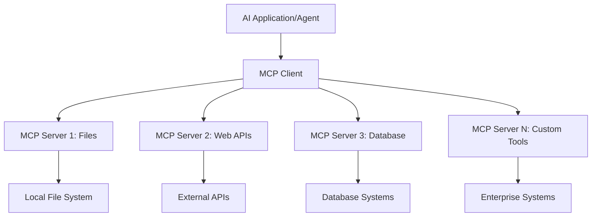

**🔧 Componente principale:**

| Componentă | Rol | Exemple |
|------------|-----|---------|
| **MCP Hosts** | Aplicații care consumă servicii MCP | Claude Desktop, VS Code, AI Toolkit |
| **MCP Clients** | Gestionari de protocol (1:1 cu serverele) | Încorporate în aplicațiile host |
| **MCP Servers** | Expun capabilități prin protocol standard | Playwright, Files, Azure, GitHub |
| **Stratul de transport** | Metode de comunicare | stdio, HTTP, WebSockets |


## 🏢 Ecosistemul serverelor MCP Microsoft

Microsoft conduce ecosistemul MCP cu o suită completă de servere enterprise care răspund nevoilor reale de business.

### 🌟 Servere MCP Microsoft remarcabile

#### 1. ☁️ Azure MCP Server  
**🔗 Repository**: [azure/azure-mcp](https://github.com/azure/azure-mcp)  
**🎯 Scop**: Management complet al resurselor Azure cu integrare AI

**✨ Funcționalități cheie:**  
- Provisionare declarativă a infrastructurii  
- Monitorizare resurse în timp real  
- Recomandări pentru optimizarea costurilor  
- Verificarea conformității de securitate  

**🚀 Cazuri de utilizare:**  
- Infrastructure-as-Code asistat de AI  
- Scalare automată a resurselor  
- Optimizarea costurilor în cloud  
- Automatizarea fluxurilor DevOps  

#### 2. 📊 Microsoft Dataverse MCP  
**📚 Documentație**: [Microsoft Dataverse Integration](https://go.microsoft.com/fwlink/?linkid=2320176)  
**🎯 Scop**: Interfață în limbaj natural pentru date de business

**✨ Funcționalități cheie:**  
- Interogări în limbaj natural pentru baze de date  
- Înțelegerea contextului de business  
- Șabloane personalizate pentru prompturi  
- Guvernanță a datelor enterprise  

**🚀 Cazuri de utilizare:**  
- Raportare business intelligence  
- Analiza datelor clienților  
- Insight-uri pentru pipeline-ul de vânzări  
- Interogări pentru conformitate  

#### 3. 🌐 Playwright MCP Server  
**🔗 Repository**: [microsoft/playwright-mcp](https://github.com/microsoft/playwright-mcp)  
**🎯 Scop**: Automatizare browser și interacțiune web

**✨ Funcționalități cheie:**  
- Automatizare cross-browser (Chrome, Firefox, Safari)  
- Detectare inteligentă a elementelor  
- Generare screenshot și PDF  
- Monitorizare trafic de rețea  

**🚀 Cazuri de utilizare:**  
- Fluxuri automate de testare  
- Web scraping și extragere date  
- Monitorizare UI/UX  
- Automatizare analiză competitivă  

#### 4. 📁 Files MCP Server  
**🔗 Repository**: [microsoft/files-mcp-server](https://github.com/microsoft/files-mcp-server)  
**🎯 Scop**: Operațiuni inteligente pe sistemul de fișiere

**✨ Funcționalități cheie:**  
- Management declarativ al fișierelor  
- Sincronizare conținut  
- Integrare control versiuni  
- Extracție metadate  

**🚀 Cazuri de utilizare:**  
- Management documentație  
- Organizare depozite de cod  
- Fluxuri de publicare conținut  
- Gestionare fișiere în pipeline-uri de date  

#### 5. 📝 MarkItDown MCP Server  
**🔗 Repository**: [microsoft/markitdown](https://github.com/microsoft/markitdown)  
**🎯 Scop**: Procesare și manipulare avansată Markdown

**✨ Funcționalități cheie:**  
- Parsare avansată Markdown  
- Conversie formate (MD ↔ HTML ↔ PDF)  
- Analiză structură conținut  
- Procesare șabloane  

**🚀 Cazuri de utilizare:**  
- Fluxuri documentație tehnică  
- Sisteme de management conținut  
- Generare rapoarte  
- Automatizare baze de cunoștințe  

#### 6. 📈 Clarity MCP Server  
**📦 Pachet**: [@microsoft/clarity-mcp-server](https://www.npmjs.com/package/@microsoft/clarity-mcp-server)  
**🎯 Scop**: Analiză web și insight-uri comportament utilizatori

**✨ Funcționalități cheie:**  
- Analiză date heatmap  
- Înregistrări sesiuni utilizatori  
- Măsurători performanță  
- Analiză funnel conversie  

**🚀 Cazuri de utilizare:**  
- Optimizare site web  
- Cercetare experiență utilizator  
- Analiză A/B testing  
- Dashboard-uri business intelligence  

### 🌍 Ecosistemul Comunității

Dincolo de serverele Microsoft, ecosistemul MCP include:  
- **🐙 GitHub MCP**: Management depozite și analiză cod  
- **🗄️ Database MCPs**: Integrări PostgreSQL, MySQL, MongoDB  
- **☁️ Cloud Provider MCPs**: Unelte AWS, GCP, Digital Ocean  
- **📧 Communication MCPs**: Integrări Slack, Teams, Email  

## 🛠️ Laborator Practic: Construirea unui Agent de Automatizare Browser

**🎯 Scopul Proiectului**: Creează un agent inteligent de automatizare browser folosind serverul Playwright MCP care poate naviga pe site-uri, extrage informații și efectua interacțiuni web complexe.

### 🚀 Faza 1: Configurarea bazei agentului

#### Pasul 1: Inițializează Agentul
1. **Deschide AI Toolkit Agent Builder**  
2. **Creează un Agent Nou** cu următoarea configurație:  
   - **Nume**: `BrowserAgent`  
   - **Model**: Alege GPT-4o  

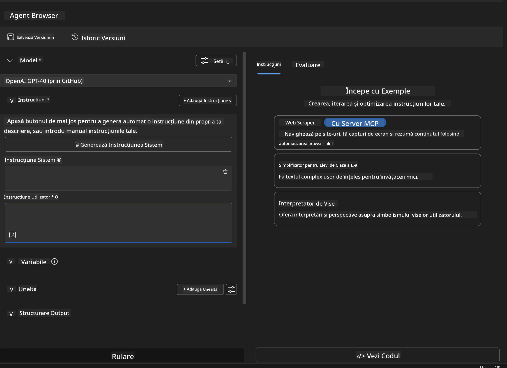


### 🔧 Faza 2: Fluxul de integrare MCP

#### Pasul 3: Adaugă integrarea serverului MCP
1. **Navighează la secțiunea Tools** în Agent Builder  
2. **Apasă pe „Add Tool”** pentru a deschide meniul de integrare  
3. **Selectează „MCP Server”** din opțiunile disponibile  

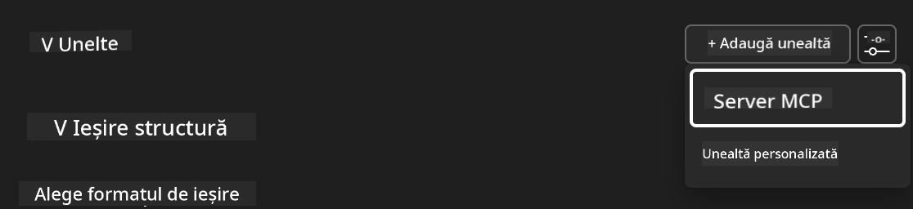

**🔍 Înțelegerea tipurilor de unelte:**  
- **Unelte încorporate**: Funcții preconfigurate AI Toolkit  
- **Servere MCP**: Integrări cu servicii externe  
- **API-uri personalizate**: Endpoint-uri proprii  
- **Apelare funcții**: Acces direct la funcții model  

#### Pasul 4: Selectarea serverului MCP
1. **Alege opțiunea „MCP Server”** pentru a continua  
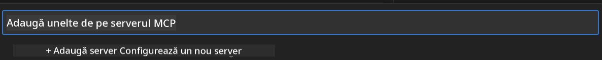

2. **Răsfoiește catalogul MCP** pentru a explora integrările disponibile  
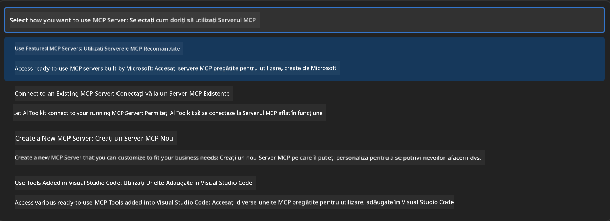


### 🎮 Faza 3: Configurarea Playwright MCP

#### Pasul 5: Selectează și configurează Playwright
1. **Apasă „Use Featured MCP Servers”** pentru a accesa serverele verificate Microsoft  
2. **Selectează „Playwright”** din lista recomandată  
3. **Acceptă ID-ul MCP implicit** sau personalizează-l pentru mediul tău  

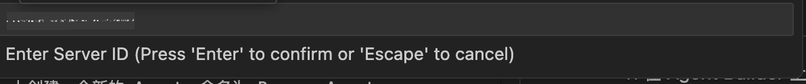

#### Pasul 6: Activează capabilitățile Playwright
**🔑 Pas critic**: Selectează **TOATE** metodele Playwright disponibile pentru funcționalitate maximă  

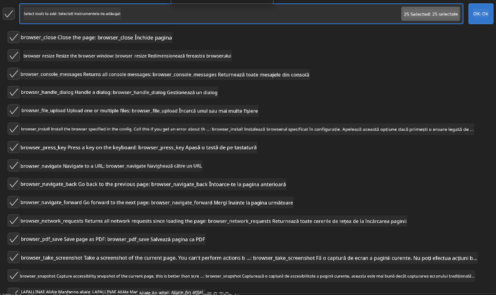

**🛠️ Unelte esențiale Playwright:**  
- **Navigare**: `goto`, `goBack`, `goForward`, `reload`  
- **Interacțiune**: `click`, `fill`, `press`, `hover`, `drag`  
- **Extracție**: `textContent`, `innerHTML`, `getAttribute`  
- **Validare**: `isVisible`, `isEnabled`, `waitForSelector`  
- **Captură**: `screenshot`, `pdf`, `video`  
- **Rețea**: `setExtraHTTPHeaders`, `route`, `waitForResponse`  

#### Pasul 7: Verifică succesul integrării
**✅ Indicatori de succes:**  
- Toate uneltele apar în interfața Agent Builder  
- Nu există mesaje de eroare în panoul de integrare  
- Starea serverului Playwright afișează „Connected”  

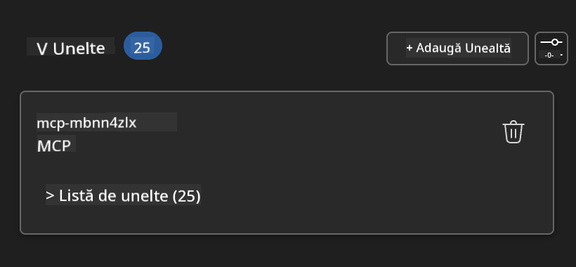

**🔧 Depanare probleme comune:**  
- **Conexiune eșuată**: Verifică conexiunea la internet și setările firewall  
- **Unelte lipsă**: Asigură-te că toate capabilitățile au fost selectate la configurare  
- **Erori de permisiuni**: Verifică dacă VS Code are permisiunile necesare sistemului  

### 🎯 Faza 4: Inginerie avansată a prompturilor

#### Pasul 8: Creează prompturi inteligente pentru sistem
Construiește prompturi sofisticate care valorifică toate capabilitățile Playwright:

```markdown
# Web Automation Expert System Prompt

## Core Identity
You are an advanced web automation specialist with deep expertise in browser automation, web scraping, and user experience analysis. You have access to Playwright tools for comprehensive browser control.

## Capabilities & Approach
### Navigation Strategy
- Always start with screenshots to understand page layout
- Use semantic selectors (text content, labels) when possible
- Implement wait strategies for dynamic content
- Handle single-page applications (SPAs) effectively

### Error Handling
- Retry failed operations with exponential backoff
- Provide clear error descriptions and solutions
- Suggest alternative approaches when primary methods fail
- Always capture diagnostic screenshots on errors

### Data Extraction
- Extract structured data in JSON format when possible
- Provide confidence scores for extracted information
- Validate data completeness and accuracy
- Handle pagination and infinite scroll scenarios

### Reporting
- Include step-by-step execution logs
- Provide before/after screenshots for verification
- Suggest optimizations and alternative approaches
- Document any limitations or edge cases encountered

## Ethical Guidelines
- Respect robots.txt and rate limiting
- Avoid overloading target servers
- Only extract publicly available information
- Follow website terms of service
```

#### Pasul 9: Creează prompturi dinamice pentru utilizator
Proiectează prompturi care demonstrează diverse capabilități:

**🌐 Exemplu analiză web:**  
```markdown
Navigate to github.com/kinfey and provide a comprehensive analysis including:
1. Repository structure and organization
2. Recent activity and contribution patterns  
3. Documentation quality assessment
4. Technology stack identification
5. Community engagement metrics
6. Notable projects and their purposes

Include screenshots at key steps and provide actionable insights.
```

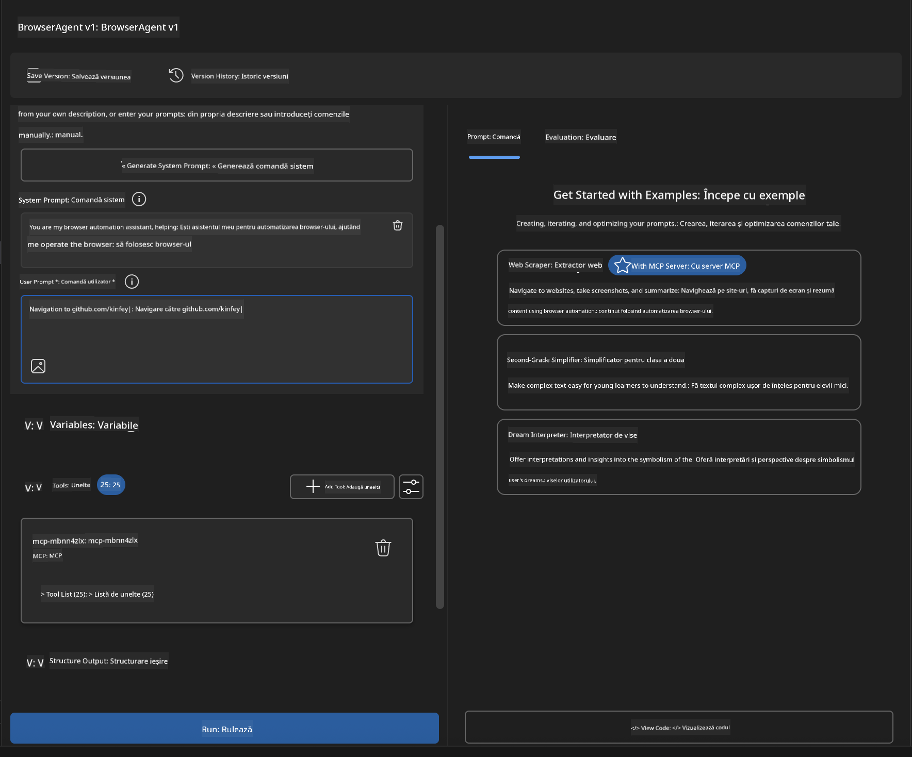

### 🚀 Faza 5: Execuție și testare

#### Pasul 10: Rulează prima ta automatizare
1. **Apasă „Run”** pentru a lansa secvența de automatizare  
2. **Monitorizează execuția în timp real**:  
   - Browserul Chrome se deschide automat  
   - Agentul navighează pe site-ul țintă  
   - Sunt capturate screenshot-uri pentru fiecare pas important  
   - Rezultatele analizei sunt afișate în timp real  


#### Pasul 11: Analizează rezultatele și insight-urile
Revizuiește analiza completă în interfața Agent Builder:

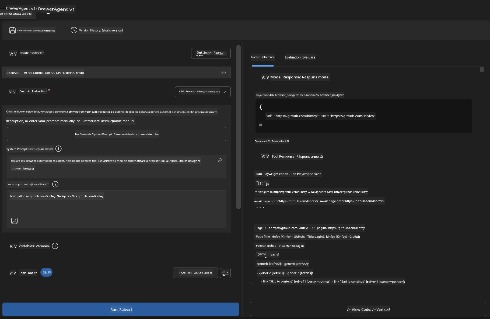

### 🌟 Faza 6: Capabilități avansate și implementare

#### Pasul 12: Exportă și implementează în producție
Agent Builder suportă multiple opțiuni de implementare:

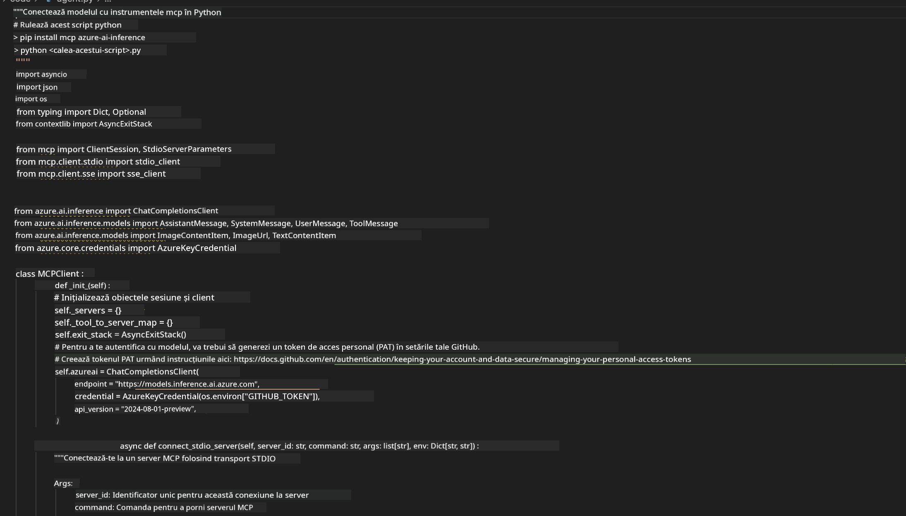

## 🎓 Rezumat Modul 2 & Pași Următori

### 🏆 Realizare deblocat: Maestru al integrării MCP

**✅ Competențe dobândite:**  
- [ ] Înțelegerea arhitecturii și beneficiilor MCP  
- [ ] Navigarea în ecosistemul serverelor MCP Microsoft  
- [ ] Integrarea Playwright MCP cu AI Toolkit  
- [ ] Construirea agenților sofisticați de automatizare browser  
- [ ] Inginerie avansată a prompturilor pentru automatizare web  

### 📚 Resurse suplimentare

- **🔗 Specificația MCP**: [Documentația oficială a protocolului](https://modelcontextprotocol.io/)  
- **🛠️ API Playwright**: [Referință completă metode](https://playwright.dev/docs/api/class-playwright)  
- **🏢 Servere MCP Microsoft**: [Ghid integrare enterprise](https://github.com/microsoft/mcp-servers)  
- **🌍 Exemple comunitare**: [Galerie servere MCP](https://github.com/modelcontextprotocol/servers)  

**🎉 Felicitări!** Ai stăpânit cu succes integrarea MCP și poți acum să construiești agenți AI pregătiți pentru producție cu capabilități externe!

### 🔜 Continuă cu următorul modul

Ești gata să-ți duci abilitățile MCP la nivelul următor? Continuă cu **[Modulul 3: Dezvoltare avansată MCP cu AI Toolkit](../lab3/README.md)** unde vei învăța să:  
- Creezi propriile servere MCP personalizate  
- Configurezi și folosești cel mai nou SDK MCP pentru Python  
- Configurezi MCP Inspector pentru depanare  
- Stăpânești fluxurile avansate de dezvoltare server MCP
- Construiește un server Weather MCP de la zero

**Declinare de responsabilitate**:  
Acest document a fost tradus folosind serviciul de traducere AI [Co-op Translator](https://github.com/Azure/co-op-translator). Deși ne străduim pentru acuratețe, vă rugăm să rețineți că traducerile automate pot conține erori sau inexactități. Documentul original în limba sa nativă trebuie considerat sursa autorizată. Pentru informații critice, se recomandă traducerea profesională realizată de un specialist uman. Nu ne asumăm răspunderea pentru eventualele neînțelegeri sau interpretări greșite rezultate din utilizarea acestei traduceri.