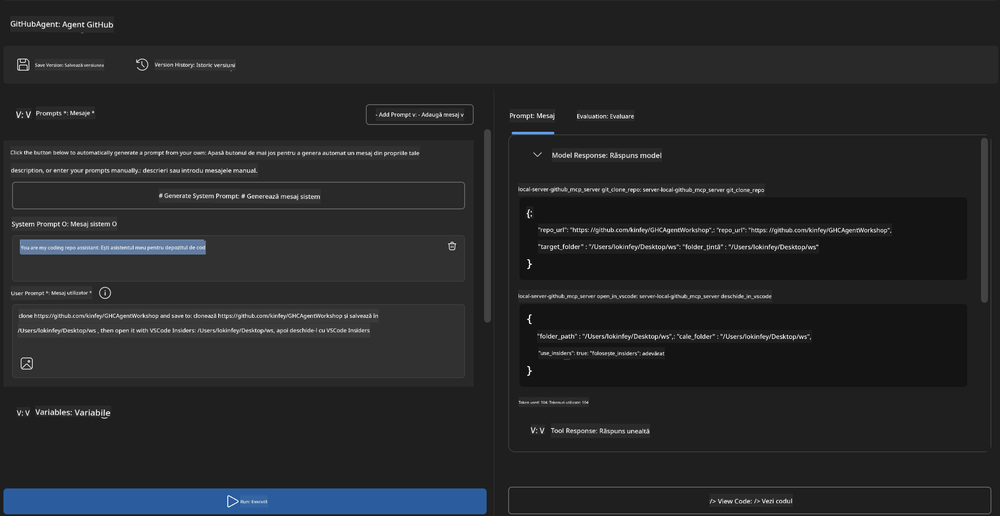
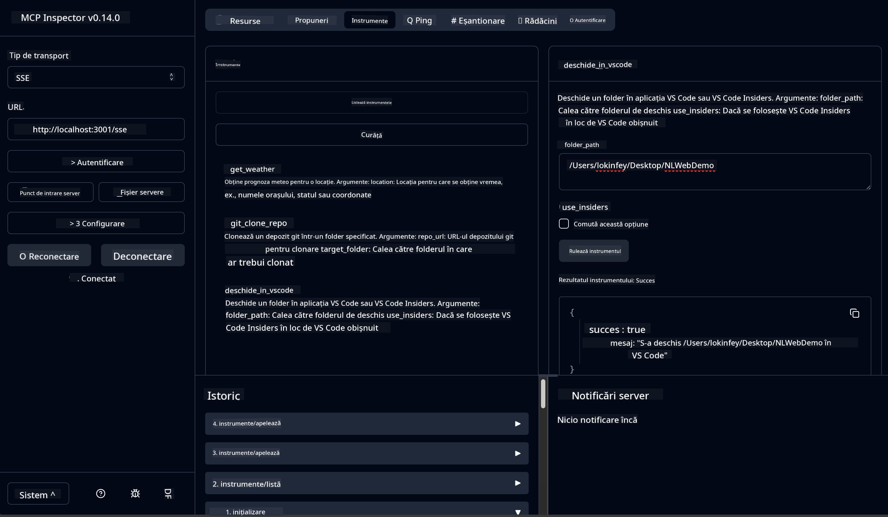

<!--
CO_OP_TRANSLATOR_METADATA:
{
  "original_hash": "f83bc722dc758efffd68667d6a1db470",
  "translation_date": "2025-07-14T08:47:23+00:00",
  "source_file": "10-StreamliningAIWorkflowsBuildingAnMCPServerWithAIToolkit/lab4/README.md",
  "language_code": "ro"
}
-->
# 🐙 Modulul 4: Dezvoltare Practică MCP - Server Personalizat de Clonare GitHub


> **⚡ Pornire Rapidă:** Construiește un server MCP gata de producție care automatizează clonarea depozitelor GitHub și integrarea cu VS Code în doar 30 de minute!

## 🎯 Obiective de Învățare

La finalul acestui laborator, vei putea:

- ✅ Să creezi un server MCP personalizat pentru fluxuri de lucru reale de dezvoltare
- ✅ Să implementezi funcționalitatea de clonare a depozitelor GitHub prin MCP
- ✅ Să integrezi servere MCP personalizate cu VS Code și Agent Builder
- ✅ Să folosești GitHub Copilot Agent Mode cu uneltele MCP personalizate
- ✅ Să testezi și să implementezi servere MCP personalizate în medii de producție

## 📋 Cerințe Prealabile

- Finalizarea Laboratoarelor 1-3 (fundamente MCP și dezvoltare avansată)
- Abonament GitHub Copilot ([înregistrare gratuită disponibilă](https://github.com/github-copilot/signup))
- VS Code cu extensiile AI Toolkit și GitHub Copilot instalate
- Git CLI instalat și configurat

## 🏗️ Prezentare Generală a Proiectului

### **Provocare Reală de Dezvoltare**
Ca dezvoltatori, folosim frecvent GitHub pentru a clona depozite și a le deschide în VS Code sau VS Code Insiders. Acest proces manual implică:
1. Deschiderea terminalului/liniei de comandă
2. Navigarea către directorul dorit
3. Executarea comenzii `git clone`
4. Deschiderea VS Code în directorul clonat

**Soluția noastră MCP simplifică totul într-o singură comandă inteligentă!**

### **Ce Vei Construi**
Un **Server MCP de Clonare GitHub** (`git_mcp_server`) care oferă:

| Funcționalitate | Descriere | Beneficiu |
|-----------------|-----------|-----------|
| 🔄 **Clonare Inteligentă a Depozitelor** | Clonează depozite GitHub cu validare | Verificare automată a erorilor |
| 📁 **Gestionare Inteligentă a Directorului** | Verifică și creează directoare în siguranță | Previne suprascrierea |
| 🚀 **Integrare Cross-Platform cu VS Code** | Deschide proiecte în VS Code/Insiders | Tranziție fluidă în fluxul de lucru |
| 🛡️ **Gestionare Robustă a Erorilor** | Gestionează probleme de rețea, permisiuni și căi | Fiabilitate pentru producție |

---

## 📖 Implementare Pas cu Pas

### Pasul 1: Creează Agentul GitHub în Agent Builder

1. **Lansează Agent Builder** prin extensia AI Toolkit
2. **Creează un agent nou** cu următoarea configurație:
   ```
   Agent Name: GitHubAgent
   ```

3. **Inițializează serverul MCP personalizat:**
   - Mergi la **Tools** → **Add Tool** → **MCP Server**
   - Selectează **"Create A new MCP Server"**
   - Alege **șablonul Python** pentru flexibilitate maximă
   - **Nume Server:** `git_mcp_server`

### Pasul 2: Configurează GitHub Copilot Agent Mode

1. **Deschide GitHub Copilot** în VS Code (Ctrl/Cmd + Shift + P → "GitHub Copilot: Open")
2. **Selectează Modelul Agent** în interfața Copilot
3. **Alege modelul Claude 3.7** pentru capacități avansate de raționament
4. **Activează integrarea MCP** pentru acces la unelte

> **💡 Sfat Util:** Claude 3.7 oferă o înțelegere superioară a fluxurilor de lucru de dezvoltare și a modelelor de gestionare a erorilor.

### Pasul 3: Implementează Funcționalitatea Principală a Serverului MCP

**Folosește următorul prompt detaliat cu GitHub Copilot Agent Mode:**

```
Create two MCP tools with the following comprehensive requirements:

🔧 TOOL A: clone_repository
Requirements:
- Clone any GitHub repository to a specified local folder
- Return the absolute path of the successfully cloned project
- Implement comprehensive validation:
  ✓ Check if target directory already exists (return error if exists)
  ✓ Validate GitHub URL format (https://github.com/user/repo)
  ✓ Verify git command availability (prompt installation if missing)
  ✓ Handle network connectivity issues
  ✓ Provide clear error messages for all failure scenarios

🚀 TOOL B: open_in_vscode
Requirements:
- Open specified folder in VS Code or VS Code Insiders
- Cross-platform compatibility (Windows/Linux/macOS)
- Use direct application launch (not terminal commands)
- Auto-detect available VS Code installations
- Handle cases where VS Code is not installed
- Provide user-friendly error messages

Additional Requirements:
- Follow MCP 1.9.3 best practices
- Include proper type hints and documentation
- Implement logging for debugging purposes
- Add input validation for all parameters
- Include comprehensive error handling
```

### Pasul 4: Testează Serverul MCP

#### 4a. Test în Agent Builder

1. **Lansează configurația de depanare** pentru Agent Builder
2. **Configurează agentul cu acest prompt de sistem:**

```
SYSTEM_PROMPT:
You are my intelligent coding repository assistant. You help developers efficiently clone GitHub repositories and set up their development environment. Always provide clear feedback about operations and handle errors gracefully.
```

3. **Testează cu scenarii realiste de utilizator:**

```
USER_PROMPT EXAMPLES:

Scenario : Basic Clone and Open
"Clone {Your GitHub Repo link such as https://github.com/kinfey/GHCAgentWorkshop
 } and save to {The global path you specify}, then open it with VS Code Insiders"
```



**Rezultate Așteptate:**
- ✅ Clonare reușită cu confirmare a căii
- ✅ Lansare automată VS Code
- ✅ Mesaje clare de eroare pentru scenarii invalide
- ✅ Gestionare corectă a cazurilor limită

#### 4b. Test în MCP Inspector



---

**🎉 Felicitări!** Ai creat cu succes un server MCP practic, gata de producție, care rezolvă provocări reale din fluxurile de lucru de dezvoltare. Serverul tău personalizat de clonare GitHub demonstrează puterea MCP în automatizarea și creșterea productivității dezvoltatorilor.

### 🏆 Realizări Deblocate:
- ✅ **Dezvoltator MCP** - Ai creat un server MCP personalizat
- ✅ **Automatizator de Fluxuri de Lucru** - Ai optimizat procesele de dezvoltare  
- ✅ **Expert în Integrare** - Ai conectat mai multe unelte de dezvoltare
- ✅ **Gata pentru Producție** - Ai construit soluții implementabile

---

## 🎓 Finalizarea Workshop-ului: Călătoria Ta cu Model Context Protocol

**Dragă Participant la Workshop,**

Felicitări pentru finalizarea celor patru module ale workshop-ului Model Context Protocol! Ai parcurs un drum lung, de la înțelegerea conceptelor de bază AI Toolkit până la construirea de servere MCP gata de producție care rezolvă provocări reale de dezvoltare.

### 🚀 Recapitulare a Parcursului Tău de Învățare:

**[Modulul 1](../lab1/README.md)**: Ai început explorând fundamentele AI Toolkit, testarea modelelor și crearea primului agent AI.

**[Modulul 2](../lab2/README.md)**: Ai învățat arhitectura MCP, ai integrat Playwright MCP și ai construit primul agent de automatizare browser.

**[Modulul 3](../lab3/README.md)**: Ai avansat către dezvoltarea serverelor MCP personalizate cu serverul Weather MCP și ai stăpânit uneltele de depanare.

**[Modulul 4](../lab4/README.md)**: Acum ai aplicat totul pentru a crea un instrument practic de automatizare a fluxului de lucru cu depozite GitHub.

### 🌟 Ce Ai Stăpânit:

- ✅ **Ecosistemul AI Toolkit**: Modele, agenți și tipare de integrare
- ✅ **Arhitectura MCP**: Design client-server, protocoale de transport și securitate
- ✅ **Unelte pentru Dezvoltatori**: De la Playground la Inspector și implementare în producție
- ✅ **Dezvoltare Personalizată**: Construirea, testarea și implementarea propriilor servere MCP
- ✅ **Aplicații Practice**: Rezolvarea provocărilor reale de fluxuri de lucru cu AI

### 🔮 Pașii Următori:

1. **Construiește-ți propriul server MCP**: Aplică aceste abilități pentru a automatiza fluxurile tale unice
2. **Alătură-te comunității MCP**: Împărtășește creațiile tale și învață de la alții
3. **Explorează integrarea avansată**: Conectează servere MCP la sisteme enterprise
4. **Contribuie la Open Source**: Ajută la îmbunătățirea uneltelor și documentației MCP

Amintește-ți, acest workshop este doar începutul. Ecosistemul Model Context Protocol evoluează rapid, iar tu ești acum pregătit să fii în avangarda uneltelor de dezvoltare alimentate de AI.

**Îți mulțumim pentru participare și dedicarea ta în procesul de învățare!**

Sperăm că acest workshop ți-a stârnit idei care vor transforma modul în care construiești și interacționezi cu uneltele AI în călătoria ta de dezvoltare.

**Codare plăcută!**

---

**Declinare de responsabilitate**:  
Acest document a fost tradus folosind serviciul de traducere AI [Co-op Translator](https://github.com/Azure/co-op-translator). Deși ne străduim pentru acuratețe, vă rugăm să rețineți că traducerile automate pot conține erori sau inexactități. Documentul original în limba sa nativă trebuie considerat sursa autorizată. Pentru informații critice, se recomandă traducerea profesională realizată de un specialist uman. Nu ne asumăm răspunderea pentru eventualele neînțelegeri sau interpretări greșite rezultate din utilizarea acestei traduceri.