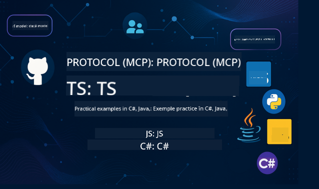

<!--
CO_OP_TRANSLATOR_METADATA:
{
  "original_hash": "866c8877136cb03e1efb9ad633a2f0a6",
  "translation_date": "2025-08-26T18:16:27+00:00",
  "source_file": "README.md",
  "language_code": "ro"
}
-->
 

Urmați acești pași pentru a începe să utilizați aceste resurse:
1. **Forkați Repozitoriul**: Click 
2. **Clonați Repozitoriul**:   `git clone https://github.com/microsoft/mcp-for-beginners.git`
3. [**Alăturați-vă Discordului Azure AI Foundry și întâlniți experți și alți dezvoltatori**](https://discord.com/invite/ByRwuEEgH4)

### 🌐 Suport Multi-Limbă

#### Suportat prin GitHub Action (Automat & Mereu Actualizat)

 [Arabic](../ar/README.md) | [Bengali](../bn/README.md) | [Bulgarian](../bg/README.md) | [Burmese (Myanmar)](../my/README.md) | [Chinese (Simplified)](../zh/README.md) | [Chinese (Traditional, Hong Kong)](../hk/README.md) | [Chinese (Traditional, Macau)](../mo/README.md) | [Chinese (Traditional, Taiwan)](../tw/README.md) | [Croatian](../hr/README.md) | [Czech](../cs/README.md) | [Danish](../da/README.md) | [Dutch](../nl/README.md) | [Finnish](../fi/README.md) | [French](../fr/README.md) | [German](../de/README.md) | [Greek](../el/README.md) | [Hebrew](../he/README.md) | [Hindi](../hi/README.md) | [Hungarian](../hu/README.md) | [Indonesian](../id/README.md) | [Italian](../it/README.md) | [Japanese](../ja/README.md) | [Korean](../ko/README.md) | [Malay](../ms/README.md) | [Marathi](../mr/README.md) | [Nepali](../ne/README.md) | [Norwegian](../no/README.md) | [Persian (Farsi)](../fa/README.md) | [Polish](../pl/README.md) | [Portuguese (Brazil)](../br/README.md) | [Portuguese (Portugal)](../pt/README.md) | [Punjabi (Gurmukhi)](../pa/README.md) | [Romanian](./README.md) | [Russian](../ru/README.md) | [Serbian (Cyrillic)](../sr/README.md) | [Slovak](../sk/README.md) | [Slovenian](../sl/README.md) | [Spanish](../es/README.md) | [Swahili](../sw/README.md) | [Swedish](../sv/README.md) | [Tagalog (Filipino)](../tl/README.md) | [Thai](../th/README.md) | [Turkish](../tr/README.md) | [Ukrainian](../uk/README.md) | [Urdu](../ur/README.md) | [Vietnamese](../vi/README.md)

# 🚀 Curriculum Model Context Protocol (MCP) pentru Începători

## **Învață MCP cu Exemple Practice de Cod în C#, Java, JavaScript, Rust, Python și TypeScript**

## 🧠 Prezentare Generală a Curriculumului Model Context Protocol

**Model Context Protocol (MCP)** este un cadru de ultimă generație conceput pentru a standardiza interacțiunile dintre modelele AI și aplicațiile client. Acest curriculum open-source oferă o cale de învățare structurată, completată cu exemple practice de cod și cazuri de utilizare reale, în limbaje de programare populare precum C#, Java, JavaScript, TypeScript și Python.

Indiferent dacă ești dezvoltator AI, arhitect de sisteme sau inginer software, acest ghid este resursa ta completă pentru a stăpâni fundamentele MCP și strategiile de implementare.

## 🔗 Resurse Oficiale MCP

- 📘 [Documentația MCP](https://modelcontextprotocol.io/) – Tutoriale detaliate și ghiduri pentru utilizatori  
- 📜 [Specificația MCP](https://modelcontextprotocol.io/docs/) – Arhitectura protocolului și referințe tehnice  
- 📜 [Specificația Originală MCP](https://spec.modelcontextprotocol.io/) – Referințe tehnice vechi (pot conține detalii suplimentare)  
- 🧑‍💻 [Repozitoriul GitHub MCP](https://github.com/modelcontextprotocol) – SDK-uri open-source, instrumente și exemple de cod
- 🌐 [Comunitatea MCP](https://github.com/orgs/modelcontextprotocol/discussions) – Alăturați-vă discuțiilor și contribuiți la comunitate

## 🧭 Prezentare Generală a Curriculumului MCP

### 📚 Structura Completă a Curriculumului

| Modul | Subiect | Descriere | Link |
|-------|---------|-----------|------|
| **Modulele 1-3: Fundamente** | | | |
| 00 | Introducere în MCP | Prezentare generală a Model Context Protocol și importanța sa în fluxurile AI | [Citește mai mult](./00-Introduction/README.md) |
| 01 | Explicarea Conceptelor de Bază | Explorare detaliată a conceptelor de bază MCP | [Citește mai mult](./01-CoreConcepts/README.md) |
| 02 | Securitatea în MCP | Amenințări de securitate și cele mai bune practici | [Citește mai mult](./02-Security/README.md) |
| 03 | Începe cu MCP | Configurarea mediului, servere/clienți de bază, integrare | [Citește mai mult](./03-GettingStarted/README.md) |
| **Modulul 3: Construirea Primului Server și Client** | | | |
| 3.1 | Primul Server | Creează primul tău server MCP | [Ghid](./03-GettingStarted/01-first-server/README.md) |
| 3.2 | Primul Client | Dezvoltă un client MCP de bază | [Ghid](./03-GettingStarted/02-client/README.md) |
| 3.3 | Client cu LLM | Integrează modele de limbaj mari | [Ghid](./03-GettingStarted/03-llm-client/README.md) |
| 3.4 | Integrare VS Code | Consumă servere MCP în VS Code | [Ghid](./03-GettingStarted/04-vscode/README.md) |
| 3.5 | Server stdio | Creează servere utilizând transportul stdio | [Ghid](./03-GettingStarted/05-stdio-server/README.md) |
| 3.6 | Streaming HTTP | Implementează streaming HTTP în MCP | [Ghid](./03-GettingStarted/06-http-streaming/README.md) |
| 3.7 | Toolkit AI | Utilizează Toolkit AI cu MCP | [Ghid](./03-GettingStarted/07-aitk/README.md) |
| 3.8 | Testare | Testează implementarea serverului MCP | [Ghid](./03-GettingStarted/08-testing/README.md) |
| 3.9 | Implementare | Implementarea serverelor MCP în producție | [Ghid](./03-GettingStarted/09-deployment/README.md) |
| **Modulele 4-5: Practic & Avansat** | | | |
| 04 | Implementare Practică | SDK-uri, depanare, testare, șabloane de prompt reutilizabile | [Citește mai mult](./04-PracticalImplementation/README.md) |
| 05 | Subiecte Avansate în MCP | AI multi-modal, scalare, utilizare în întreprinderi | [Citește mai mult](./05-AdvancedTopics/README.md) |
| 5.1 | Integrare Azure | Integrarea MCP cu Azure | [Ghid](./05-AdvancedTopics/mcp-integration/README.md) |
| 5.2 | Multi-modalitate | Lucrul cu multiple modalități | [Ghid](./05-AdvancedTopics/mcp-multi-modality/README.md) |
| 5.3 | Demo OAuth2 | Implementarea autentificării OAuth2 | [Ghid](./05-AdvancedTopics/mcp-oauth2-demo/README.md) |
| 5.4 | Contexturi Rădăcină | Înțelegerea și implementarea contexturilor rădăcină | [Ghid](./05-AdvancedTopics/mcp-root-contexts/README.md) |
| 5.5 | Rutare | Strategii de rutare MCP | [Ghid](./05-AdvancedTopics/mcp-routing/README.md) |
| 5.6 | Eșantionare | Tehnici de eșantionare în MCP | [Ghid](./05-AdvancedTopics/mcp-sampling/README.md) |
| 5.7 | Scalare | Scalarea implementărilor MCP | [Ghid](./05-AdvancedTopics/mcp-scaling/README.md) |
| 5.8 | Securitate | Considerații avansate de securitate | [Ghid](./05-AdvancedTopics/mcp-security/README.md) |
| 5.9 | Căutare Web | Implementarea capacităților de căutare web | [Ghid](./05-AdvancedTopics/web-search-mcp/README.md) |
| 5.10 | Streaming în Timp Real | Construirea funcționalității de streaming în timp real | [Ghid](./05-AdvancedTopics/mcp-realtimestreaming/README.md) |
| 5.11 | Căutare în Timp Real | Implementarea căutării în timp real | [Ghid](./05-AdvancedTopics/mcp-realtimesearch/README.md) |
| 5.12 | Autentificare Entra ID | Autentificare cu Microsoft Entra ID | [Ghid](./05-AdvancedTopics/mcp-security-entra/README.md) |
| 5.13 | Integrare Foundry | Integrare cu Azure AI Foundry | [Ghid](./05-AdvancedTopics/mcp-foundry-agent-integration/README.md) |
| 5.14 | Inginerie Contextuală | Tehnici pentru inginerie contextuală eficientă | [Ghid](./05-AdvancedTopics/mcp-contextengineering/README.md) |
| **Modulele 6-10: Comunitate & Cele Mai Bune Practici** | | | |
| 06 | Contribuții Comunitare | Cum să contribui la ecosistemul MCP | [Ghid](./06-CommunityContributions/README.md) |
| 07 | Perspective din Adopția Timpurie | Povești de implementare din lumea reală | [Ghid](./07-LessonsFromEarlyAdoption/README.md) |
| 08 | Cele Mai Bune Practici pentru MCP | Performanță, toleranță la erori, reziliență | [Ghid](./08-BestPractices/README.md) |
| 09 | Studii de Caz MCP | Exemple practice de implementare | [Ghid](./09-CaseStudy/README.md) |
| 10 | Atelier Practic | Construirea unui Server MCP cu Toolkit AI | [Laborator](./10-StreamliningAIWorkflowsBuildingAnMCPServerWithAIToolkit/README.md) |

### 💻 Proiecte de Cod Exemplu

#### Exemple de Calculatoare MCP de Bază

| Limbaj | Descriere | Link |
|--------|-----------|------|
| C# | Exemplu de Server MCP | [Vezi Codul](./03-GettingStarted/samples/csharp/README.md) |
| Java | Calculator MCP | [Vezi Codul](./03-GettingStarted/samples/java/calculator/README.md) |
| JavaScript | Demo MCP | [Vezi Codul](./03-GettingStarted/samples/javascript/README.md) |
| Python | Server MCP | [Vezi Codul](../../03-GettingStarted/samples/python/mcp_calculator_server.py) |
| TypeScript | Exemplu MCP | [Vezi Codul](./03-GettingStarted/samples/typescript/README.md) |
| Rust | Exemplu MCP | [Vezi Codul](./03-GettingStarted/samples/rust/README.md) |

#### Implementări Avansate MCP

| Limbaj | Descriere | Link |
|--------|-----------|------|
| C# | Exemplu Avansat | [View Code](./04-PracticalImplementation/samples/csharp/README.md) |
| Java cu Spring | Exemplu de Aplicație Container | [View Code](./04-PracticalImplementation/samples/java/containerapp/README.md) |
| JavaScript | Exemplu Avansat | [View Code](./04-PracticalImplementation/samples/javascript/README.md) |
| Python | Implementare Complexă | [View Code](../../04-PracticalImplementation/samples/python/READMEmd) |
| TypeScript | Exemplu de Container | [View Code](./04-PracticalImplementation/samples/typescript/README.md) |

## 🎯 Cerințe preliminare pentru învățarea MCP

Pentru a beneficia la maximum de acest curriculum, ar trebui să aveți:

- Cunoștințe de bază de programare în cel puțin unul dintre următoarele limbaje: C#, Java, JavaScript, Python sau TypeScript
- Înțelegerea modelului client-server și a API-urilor
- Familiaritate cu conceptele REST și HTTP
- (Opțional) Fundamente în concepte AI/ML

- Participarea la discuțiile comunității pentru suport

## 📚 Ghid de studiu și resurse

Acest depozit include mai multe resurse pentru a vă ajuta să navigați și să învățați eficient:

### Ghid de studiu

Un [Ghid de studiu](./study_guide.md) cuprinzător este disponibil pentru a vă ajuta să navigați eficient în acest depozit. Ghidul include:

- O hartă vizuală a curriculumului care arată toate subiectele acoperite
- Detalii despre fiecare secțiune a depozitului
- Instrucțiuni despre cum să utilizați proiectele exemplu
- Căi de învățare recomandate pentru diferite niveluri de competență
- Resurse suplimentare pentru a completa procesul de învățare

### Jurnal de modificări

Menținem un [Jurnal de modificări](./changelog.md) detaliat care urmărește toate actualizările semnificative ale materialelor curriculumului, inclusiv:

- Adăugiri de conținut nou
- Modificări structurale
- Îmbunătățiri ale funcționalităților
- Actualizări ale documentației

## 🛠️ Cum să utilizați acest curriculum eficient

Fiecare lecție din acest ghid include:

1. Explicații clare ale conceptelor MCP  
2. Exemple de cod live în mai multe limbaje  
3. Exerciții pentru a construi aplicații MCP reale  
4. Resurse suplimentare pentru cursanții avansați

## Evenimente 

### [MCP Dev Days Iulie 2025](https://developer.microsoft.com/en-us/reactor/series/S-1563/)
#### [➡️Urmărește la cerere - MCP Dev Days](https://developer.microsoft.com/en-us/reactor/series/S-1563/)
Pregătiți-vă pentru două zile de informații tehnice aprofundate, conexiuni comunitare și învățare practică la MCP Dev Days, un eveniment virtual dedicat Protocolului Model Context (MCP) — standardul emergent care conectează modelele AI și instrumentele pe care se bazează.
Puteți urmări MCP Dev Days înregistrându-vă pe pagina noastră de eveniment: https://aka.ms/mcpdevdays. 

#### [Ziua 1: Productivitate MCP, Instrumente de Dezvoltare și Comunitate:](https://developer.microsoft.com/en-us/reactor/series/S-1563/)

Este dedicată dezvoltatorilor, pentru a utiliza MCP în fluxul lor de lucru și pentru a celebra comunitatea MCP. Vom fi alături de membri ai comunității și parteneri precum Arcade, Block, Okta și Neon pentru a vedea cum colaborează cu Microsoft pentru a modela un ecosistem MCP deschis și extensibil.  
Demonstrații reale în VS Code, Visual Studio, GitHub Copilot și instrumente populare ale comunității  
Fluxuri de lucru practice, orientate pe context  
Sesiuni și perspective conduse de comunitate  
Indiferent dacă abia începeți cu MCP sau deja construiți cu el, Ziua 1 va oferi inspirație și sfaturi practice.

#### [Ziua 2: Construirea Serverelor MCP cu Încredere](https://developer.microsoft.com/en-us/reactor/series/S-1563/)

Este dedicată constructorilor MCP. Vom aprofunda strategiile de implementare și cele mai bune practici pentru crearea serverelor MCP și integrarea MCP în fluxurile de lucru AI.

#### Subiecte incluse:

- Construirea serverelor MCP și integrarea lor în experiențele agenților
- Dezvoltare bazată pe prompturi
- Cele mai bune practici de securitate
- Utilizarea blocurilor de construcție precum Functions, ACA și API Management
- Alinierea registrului și instrumentele (1P + 3P)

Dacă sunteți dezvoltator, constructor de instrumente sau strateg de produse AI, această zi este plină de perspectivele de care aveți nevoie pentru a construi soluții MCP scalabile, sigure și pregătite pentru viitor.

### MCP Boot Camp August 2025
Învățați în sesiuni video intensive cum să creați servere MCP, să integrați cu VS Code și să implementați profesional pe Azure, bazat pe conținutul curriculumului MCP pentru Începători. Plecați cu abilități practice într-o tehnologie pe care companii majore o folosesc deja.

#### [➡️Urmărește la cerere MCP Bootcamp | Engleză](https://developer.microsoft.com/en-us/reactor/series/s-1568/)
#### [➡️Urmărește la cerere MCP Bootcamp | Brasil](https://developer.microsoft.com/en-us/reactor/series/S-1566/)
#### [➡️Urmărește la cerere MCP Bootcamp | Spaniolă](https://developer.microsoft.com/en-us/reactor/series/S-1567/)

## 🌟 Mulțumiri Comunității

Mulțumiri Microsoft Valued Professional [Shivam Goyal](https://www.linkedin.com/in/shivam2003/) pentru contribuirea cu exemple importante de cod. 

## 📜 Informații despre licență

Acest conținut este licențiat sub **MIT License**. Pentru termeni și condiții, consultați [LICENSE](../../LICENSE).

## 🤝 Ghid pentru contribuții

Acest proiect acceptă contribuții și sugestii. Majoritatea contribuțiilor necesită să fiți de acord cu un
Contributor License Agreement (CLA) care declară că aveți dreptul și, de fapt, acordați drepturile de a utiliza contribuția dvs. Pentru detalii, vizitați 
<https://cla.opensource.microsoft.com>.

Când trimiteți un pull request, un bot CLA va determina automat dacă trebuie să furnizați
un CLA și va decora PR-ul corespunzător (de exemplu, verificare de stare, comentariu). Urmați pur și simplu instrucțiunile
furnizate de bot. Va trebui să faceți acest lucru o singură dată pentru toate depozitele care utilizează CLA-ul nostru.

Acest proiect a adoptat [Microsoft Open Source Code of Conduct](https://opensource.microsoft.com/codeofconduct/).
Pentru mai multe informații, consultați [Code of Conduct FAQ](https://opensource.microsoft.com/codeofconduct/faq/) sau
contactați [opencode@microsoft.com](mailto:opencode@microsoft.com) pentru întrebări sau comentarii suplimentare.

## 📂 Structura depozitului

Depozitul este organizat astfel:

- **Curriculum de bază (00-10)**: Conținutul principal organizat în zece module secvențiale
- **images/**: Diagrame și ilustrații utilizate pe parcursul curriculumului
- **translations/**: Suport multilingvistic cu traduceri automate
- **translated_images/**: Versiuni localizate ale diagramelor și ilustrațiilor
- **study_guide.md**: Ghid cuprinzător pentru navigarea în depozit
- **changelog.md**: Înregistrare a tuturor modificărilor semnificative ale materialelor curriculumului
- **mcp.json**: Fișier de configurare pentru specificația MCP
- **CODE_OF_CONDUCT.md, LICENSE, SECURITY.md, SUPPORT.md**: Documente de guvernanță ale proiectului

## 🎒 Alte cursuri
Echipa noastră produce alte cursuri! Consultați:

- [AI Agents For Beginners](https://github.com/microsoft/ai-agents-for-beginners?WT.mc_id=academic-105485-koreyst)
- [Generative AI for Beginners using .NET](https://github.com/microsoft/Generative-AI-for-beginners-dotnet?WT.mc_id=academic-105485-koreyst)
- [Generative AI for Beginners using JavaScript](https://github.com/microsoft/generative-ai-with-javascript?WT.mc_id=academic-105485-koreyst)
- [Generative AI for Beginners](https://github.com/microsoft/generative-ai-for-beginners?WT.mc_id=academic-105485-koreyst)
- [Generative AI for Beginners using Java](https://github.com/microsoft/generative-ai-for-beginners-java?WT.mc_id=academic-105485-koreyst)
- [ML for Beginners](https://aka.ms/ml-beginners?WT.mc_id=academic-105485-koreyst)
- [Data Science for Beginners](https://aka.ms/datascience-beginners?WT.mc_id=academic-105485-koreyst)
- [AI for Beginners](https://aka.ms/ai-beginners?WT.mc_id=academic-105485-koreyst)
- [Cybersecurity for Beginners](https://github.com/microsoft/Security-101?WT.mc_id=academic-96948-sayoung)
- [Web Dev for Beginners](https://aka.ms/webdev-beginners?WT.mc_id=academic-105485-koreyst)
- [IoT for Beginners](https://aka.ms/iot-beginners?WT.mc_id=academic-105485-koreyst)
- [XR Development for Beginners](https://github.com/microsoft/xr-development-for-beginners?WT.mc_id=academic-105485-koreyst)
- [Mastering GitHub Copilot for AI Paired Programming](https://aka.ms/GitHubCopilotAI?WT.mc_id=academic-105485-koreyst)
- [Mastering GitHub Copilot for C#/.NET Developers](https://github.com/microsoft/mastering-github-copilot-for-dotnet-csharp-developers?WT.mc_id=academic-105485-koreyst)
- [Choose Your Own Copilot Adventure](https://github.com/microsoft/CopilotAdventures?WT.mc_id=academic-105485-koreyst)

## ™️ Notificare privind mărcile comerciale

Acest proiect poate conține mărci comerciale sau logo-uri pentru proiecte, produse sau servicii. Utilizarea autorizată a mărcilor comerciale sau logo-urilor Microsoft este supusă și trebuie să respecte
[Microsoft's Trademark & Brand Guidelines](https://www.microsoft.com/legal/intellectualproperty/trademarks/usage/general).
Utilizarea mărcilor comerciale sau logo-urilor Microsoft în versiuni modificate ale acestui proiect nu trebuie să provoace confuzie sau să implice sponsorizarea Microsoft.
Orice utilizare a mărcilor comerciale sau logo-urilor terților este supusă politicilor acelor terți.

---

**Declinare de responsabilitate**:  
Acest document a fost tradus folosind serviciul de traducere AI [Co-op Translator](https://github.com/Azure/co-op-translator). Deși ne străduim să asigurăm acuratețea, vă rugăm să fiți conștienți că traducerile automate pot conține erori sau inexactități. Documentul original în limba sa natală ar trebui considerat sursa autoritară. Pentru informații critice, se recomandă traducerea profesională realizată de un specialist uman. Nu ne asumăm responsabilitatea pentru eventualele neînțelegeri sau interpretări greșite care pot apărea din utilizarea acestei traduceri.