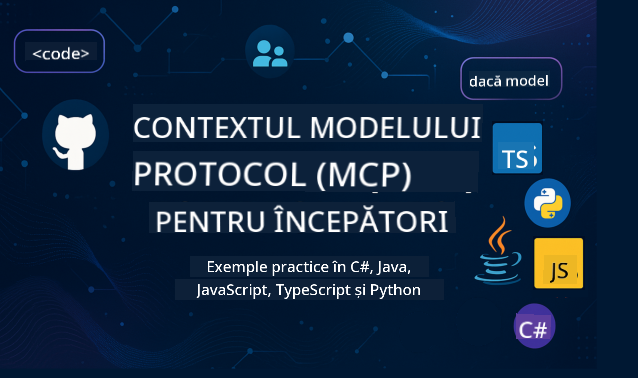

<!--
CO_OP_TRANSLATOR_METADATA:
{
  "original_hash": "2a21391378c12ecfef50f866329dfde0",
  "translation_date": "2025-05-17T05:34:25+00:00",
  "source_file": "README.md",
  "language_code": "ro"
}
-->

Urmați acești pași pentru a începe să utilizați aceste resurse:
1. **Fork al Repozitoriului**: Click 
2. **Clonează Repozitoriul**: `git clone https://github.com/microsoft/mcp-for-beginners.git`
3. [**Alătură-te Discordului Microsoft Azure AI Foundry și întâlnește experți și alți dezvoltatori**](https://discord.com/invite/ByRwuEEgH4)

### 🌐 Suport Multi-Limbă

#### Suportat prin GitHub Action (Automatizat și Mereu Actualizat)
[Franceză](../fr/README.md) | [Spaniolă](../es/README.md) | [Germană](../de/README.md) | [Rusă](../ru/README.md) | [Arabă](../ar/README.md) | [Persană (Farsi)](../fa/README.md) | [Urdu](../ur/README.md) | [Chineză (Simplificată)](../zh/README.md) | [Chineză (Tradițională, Macau)](../mo/README.md) | [Chineză (Tradițională, Hong Kong)](../hk/README.md) | [Chineză (Tradițională, Taiwan)](../tw/README.md) | [Japoneză](../ja/README.md) | [Coreeană](../ko/README.md) | [Hindi](../hi/README.md) | [Bengaleză](../bn/README.md) | [Marathi](../mr/README.md) | [Nepaleză](../ne/README.md) | [Punjabi (Gurmukhi)](../pa/README.md) | [Portugheză (Portugalia)](../pt/README.md) | [Portugheză (Brazilia)](../br/README.md) | [Italiană](../it/README.md) | [Poloneză](../pl/README.md) | [Turcă](../tr/README.md) | [Greacă](../el/README.md) | [Thailandeză](../th/README.md) | [Suedeză](../sv/README.md) | [Daneză](../da/README.md) | [Norvegiană](../no/README.md) | [Finlandeză](../fi/README.md) | [Olandeză](../nl/README.md) | [Ebraică](../he/README.md) | [Vietnameză](../vi/README.md) | [Indoneziană](../id/README.md) | [Malaeză](../ms/README.md) | [Tagalog (Filipineză)](../tl/README.md) | [Swahili](../sw/README.md) | [Maghiară](../hu/README.md) | [Cehă](../cs/README.md) | [Slovacă](../sk/README.md) | [Română](./README.md) | [Bulgară](../bg/README.md) | [Sârbă (Chirilică)](../sr/README.md) | [Croată](../hr/README.md) | [Slovenă](../sl/README.md)
# 🚀 Ghidul Ultim pentru Curriculum-ul Protocolului Contextual al Modelului (MCP) pentru Începători

## **Învață MCP cu Exemple de Cod Practic în C#, Java, JavaScript, Python și TypeScript**

## 🧠 Prezentare Generală a Curriculum-ului Protocolului Contextual al Modelului

**Model Context Protocol (MCP)** este un cadru de ultimă generație creat pentru a standardiza interacțiunile dintre modelele AI și aplicațiile client. Acest curriculum open-source oferă un traseu de învățare structurat, completat cu exemple de cod practic și cazuri de utilizare din lumea reală, în limbaje de programare populare, inclusiv C#, Java, JavaScript, TypeScript și Python.

Indiferent dacă ești dezvoltator AI, arhitect de sistem sau inginer software, acest ghid este resursa ta cuprinzătoare pentru a stăpâni fundamentele MCP și strategiile de implementare.

## 🔗 Resurse Oficiale MCP

- 📘 [MCP Documentation](https://modelcontextprotocol.io/) – Tutoriale detaliate și ghiduri pentru utilizatori  
- 📜 [MCP Specification](https://spec.modelcontextprotocol.io/) – Arhitectura protocolului și referințe tehnice  
- 🧑‍💻 [MCP GitHub Repository](https://github.com/modelcontextprotocol) – SDK-uri open-source, unelte și exemple de cod  

## 🧭 Structura Completă a Curriculum-ului MCP

### 📌 [Introducere în MCP](./00-Introduction/README.md)

- Ce este Protocolul Contextual al Modelului?
- De ce contează standardizarea în fluxurile de lucru AI
- Cazuri de utilizare practice și beneficii ale MCP

### 🧩 [Concepte de Bază Explicate](./01-CoreConcepts/README.md)

- Înțelegerea arhitecturii client-server în MCP
- Componente cheie ale protocolului: cereri, răspunsuri și scheme
- Modele de mesagerie și schimb de date în MCP

### 🔐 [Securitate în MCP](./02-Security/readme.md)

- Identificarea amenințărilor de securitate în sistemele bazate pe MCP
- Tehnici și bune practici pentru securizarea implementărilor

### 🚀 [Începuturi cu MCP](./03-GettingStarted/README.md)

- Configurarea și setarea mediului
- Crearea de servere și clienți MCP de bază
- Integrarea MCP cu aplicațiile existente

#### 🧮 Proiecte de Exemplu MCP Calculator:

  
<strong>Explorează Implementările de Cod pe Limbaj</strong>

  - [Exemplu Server MCP C#](./03-GettingStarted/samples/csharp/README.md)
  - [Calculator MCP Java](./03-GettingStarted/samples/java/calculator/README.md)
  - [Demo MCP JavaScript](./03-GettingStarted/samples/javascript/README.md)
  - [Server MCP Python](../../03-GettingStarted/samples/python/mcp_calculator_server.py)
  - [Exemplu MCP TypeScript](./03-GettingStarted/samples/typescript/README.md)

### 🛠️ [Implementare Practică](./04-PracticalImplementation/README.md)

- Utilizarea SDK-urilor în diferite limbaje
- Debugging, testare și validare
- Crearea de șabloane de prompt reutilizabile și fluxuri de lucru

#### 💡 Proiecte Avansate MCP Calculator:

  
<strong>Explorează Exemple Avansate</strong>

  - [Exemplu Avansat C#](./04-PracticalImplementation/samples/csharp/README.md)
  - [Exemplu Aplicație Container Java](./04-PracticalImplementation/samples/java/containerapp/README.md)
  - [Exemplu Avansat JavaScript](./04-PracticalImplementation/samples/javascript/README.md)
  - [Implementare Complexă Python](../../04-PracticalImplementation/samples/python/mcp_sample.py)
  - [Exemplu Container TypeScript](./04-PracticalImplementation/samples/typescript/README.md)

### 🎓 [Subiecte Avansate în MCP](./05-AdvancedTopics/README.md)

- Fluxuri de lucru AI multi-modale și extensibilitate
- Strategii de scalare securizată
- MCP în ecosistemele de întreprindere

### 🌍 [Contribuții Comunitare](./06-CommunityContributions/README.md)

- Cum să contribui cu cod și documentație
- Colaborarea prin GitHub
- Îmbunătățiri și feedback conduse de comunitate

### 📈 [Perspective din Adopția Timpurie](./07-CaseStudies/README.md)

- Implementări din lumea reală și ce a funcționat
- Construirea și implementarea soluțiilor bazate pe MCP
- Tendințe și foaie de parcurs viitoare

### 📏 [Bune Practici pentru MCP](./08-BestPractices/README.md)

- Ajustarea performanței și optimizare
- Proiectarea sistemelor MCP tolerante la erori
- Strategii de testare și reziliență

### 📊 [Studii de Caz MCP](./09-CaseStudy/Readme.md)

- Analize aprofundate ale arhitecturilor soluțiilor MCP
- Schițe de implementare și sfaturi de integrare
- Diagrame adnotate și prezentări ale proiectelor

## 🎯 Cerințe Prealabile pentru Învățarea MCP

Pentru a beneficia la maxim de acest curriculum, ar trebui să ai:

- Cunoștințe de bază despre C#, Java sau Python
- Înțelegerea modelului client-server și a API-urilor
- (Opțional) Familiaritate cu conceptele de învățare automată

## 🛠️ Cum să Utilizezi Eficient Acest Curriculum

Fiecare lecție din acest ghid include:

1. Explicații clare ale conceptelor MCP  
2. Exemple de cod live în mai multe limbaje  
3. Exerciții pentru construirea de aplicații MCP reale  
4. Resurse suplimentare pentru cursanți avansați  

## 📜 Informații despre Licență

Acest conținut este licențiat sub **Licența MIT**. Pentru termeni și condiții, vezi [LICENSE](../../LICENSE).

## 🤝 Ghiduri de Contribuție

Acest proiect primește cu bucurie contribuții și sugestii. Majoritatea contribuțiilor necesită să fi de acord cu un
Acord de Licență a Contribuitorului (CLA) care declară că ai dreptul să, și de fapt, ne oferi
drepturile de a folosi contribuția ta. Pentru detalii, vizitează <https://cla.opensource.microsoft.com>.

Când trimiți un pull request, un bot CLA va determina automat dacă trebuie să furnizezi
un CLA și va decora PR-ul corespunzător (de exemplu, verificare de status, comentariu). Urmează pur și simplu instrucțiunile
oferite de bot. Va trebui să faci acest lucru doar o dată pentru toate repo-urile care folosesc CLA-ul nostru.

Acest proiect a adoptat [Codul de Conduită Open Source Microsoft](https://opensource.microsoft.com/codeofconduct/).
Pentru mai multe informații, vezi [Întrebări frecvente despre Codul de Conduită](https://opensource.microsoft.com/codeofconduct/faq/) sau
contactează [opencode@microsoft.com](mailto:opencode@microsoft.com) pentru orice întrebări sau comentarii suplimentare.

## ™️ Notificare de Marcă Comercială

Acest proiect poate conține mărci comerciale sau logo-uri pentru proiecte, produse sau servicii. Utilizarea autorizată a mărcilor comerciale sau logo-urilor Microsoft este supusă și trebuie să respecte
[Ghidurile de Marcă Comercială și Brand ale Microsoft](https://www.microsoft.com/legal/intellectualproperty/trademarks/usage/general).
Utilizarea mărcilor comerciale sau logo-urilor Microsoft în versiuni modificate ale acestui proiect nu trebuie să provoace confuzie sau să implice sponsorizarea de către Microsoft.
Orice utilizare a mărcilor comerciale sau logo-urilor terților este supusă politicilor acelor terți.

**Declinarea responsabilității**:  
Acest document a fost tradus folosind serviciul de traducere AI [Co-op Translator](https://github.com/Azure/co-op-translator). Deși ne străduim să asigurăm acuratețea, vă rugăm să fiți conștienți că traducerile automate pot conține erori sau inexactități. Documentul original în limba sa natală ar trebui considerat sursa autoritară. Pentru informații critice, se recomandă traducerea profesională realizată de oameni. Nu suntem răspunzători pentru neînțelegerile sau interpretările greșite care pot apărea din utilizarea acestei traduceri.