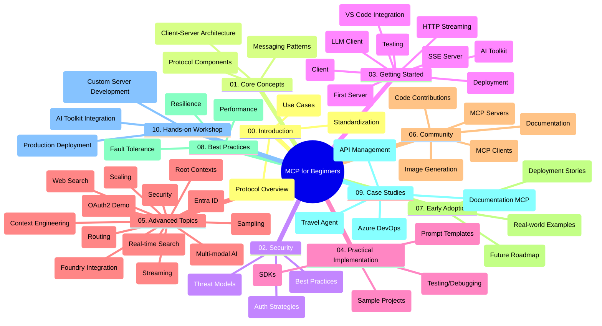

<!--
CO_OP_TRANSLATOR_METADATA:
{
  "original_hash": "5f321ea583cf087a94e47ee74c62b504",
  "translation_date": "2025-07-17T11:07:47+00:00",
  "source_file": "study_guide.md",
  "language_code": "ro"
}
-->
# Protocolul Contextului Modelului (MCP) pentru Începători - Ghid de Studiu

Acest ghid de studiu oferă o prezentare generală a structurii și conținutului depozitului pentru curriculumul „Protocolul Contextului Modelului (MCP) pentru Începători”. Folosește acest ghid pentru a naviga eficient în depozit și pentru a profita la maximum de resursele disponibile.

## Prezentare Generală a Depozitului

Model Context Protocol (MCP) este un cadru standardizat pentru interacțiunile dintre modelele AI și aplicațiile client. Creat inițial de Anthropic, MCP este acum întreținut de comunitatea largă MCP prin organizația oficială GitHub. Acest depozit oferă un curriculum cuprinzător, cu exemple practice de cod în C#, Java, JavaScript, Python și TypeScript, destinat dezvoltatorilor AI, arhitecților de sisteme și inginerilor software.

## Hartă Vizuală a Curriculumului

## Structura Depozitului

Depozitul este organizat în zece secțiuni principale, fiecare concentrându-se pe diferite aspecte ale MCP:

1. **Introducere (00-Introduction/)**
   - Prezentare generală a Protocolului Contextului Modelului
   - De ce este importantă standardizarea în fluxurile AI
   - Cazuri practice și beneficii

2. **Concepte de Bază (01-CoreConcepts/)**
   - Arhitectura client-server
   - Componente cheie ale protocolului
   - Modele de mesagerie în MCP

3. **Securitate (02-Security/)**
   - Amenințări de securitate în sistemele bazate pe MCP
   - Cele mai bune practici pentru securizarea implementărilor
   - Strategii de autentificare și autorizare

4. **Începutul Lucrului (03-GettingStarted/)**
   - Configurarea și pregătirea mediului
   - Crearea primelor servere și clienți MCP
   - Integrarea cu aplicații existente
   - Include secțiuni pentru:
     - Prima implementare a serverului
     - Dezvoltarea clientului
     - Integrarea clientului LLM
     - Integrarea cu VS Code
     - Servere Server-Sent Events (SSE)
     - Streaming HTTP
     - Integrarea AI Toolkit
     - Strategii de testare
     - Ghiduri de implementare

5. **Implementare Practică (04-PracticalImplementation/)**
   - Utilizarea SDK-urilor în diferite limbaje de programare
   - Tehnici de depanare, testare și validare
   - Crearea de șabloane și fluxuri reutilizabile pentru prompturi
   - Proiecte exemplu cu implementări

6. **Subiecte Avansate (05-AdvancedTopics/)**
   - Tehnici de inginerie a contextului
   - Integrarea agentului Foundry
   - Fluxuri AI multimodale
   - Demonstrații de autentificare OAuth2
   - Capacități de căutare în timp real
   - Streaming în timp real
   - Implementarea contextelor root
   - Strategii de rutare
   - Tehnici de eșantionare
   - Abordări de scalare
   - Considerații de securitate
   - Integrarea securității Entra ID
   - Integrarea căutării web

7. **Contribuții din Comunitate (06-CommunityContributions/)**
   - Cum să contribui cu cod și documentație
   - Colaborarea prin GitHub
   - Îmbunătățiri și feedback din partea comunității
   - Utilizarea diferiților clienți MCP (Claude Desktop, Cline, VSCode)
   - Lucrul cu servere MCP populare, inclusiv generare de imagini

8. **Lecții din Primele Implementări (07-LessonsfromEarlyAdoption/)**
   - Implementări reale și povești de succes
   - Construirea și implementarea soluțiilor bazate pe MCP
   - Tendințe și planuri de viitor

9. **Cele Mai Bune Practici (08-BestPractices/)**
   - Optimizarea performanței
   - Proiectarea sistemelor MCP tolerante la erori
   - Strategii de testare și reziliență

10. **Studii de Caz (09-CaseStudy/)**
    - Studiu de caz: integrarea Azure API Management
    - Studiu de caz: implementarea unui agent de turism
    - Studiu de caz: integrarea Azure DevOps cu YouTube
    - Exemple de implementare cu documentație detaliată

11. **Atelier Practic (10-StreamliningAIWorkflowsBuildingAnMCPServerWithAIToolkit/)**
    - Atelier practic complet care combină MCP cu AI Toolkit
    - Construirea de aplicații inteligente care leagă modelele AI de instrumente reale
    - Module practice ce acoperă fundamentele, dezvoltarea serverului personalizat și strategii de implementare în producție
    - Abordare de învățare bazată pe laborator cu instrucțiuni pas cu pas

## Resurse Suplimentare

Depozitul include resurse de suport:

- **Folderul Imagini**: Conține diagrame și ilustrații folosite în tot curriculumul
- **Traduceri**: Suport multilingv cu traduceri automate ale documentației
- **Resurse Oficiale MCP**:
  - [MCP Documentation](https://modelcontextprotocol.io/)
  - [MCP Specification](https://spec.modelcontextprotocol.io/)
  - [MCP GitHub Repository](https://github.com/modelcontextprotocol)

## Cum să Folosești Acest Depozit

1. **Învățare Secvențială**: Parcurge capitolele în ordine (de la 00 la 10) pentru o experiență de învățare structurată.
2. **Focalizare pe Limbaj**: Dacă ești interesat de un anumit limbaj de programare, explorează directoarele cu exemple pentru implementări în limbajul preferat.
3. **Implementare Practică**: Începe cu secțiunea „Getting Started” pentru a-ți configura mediul și a crea primul server și client MCP.
4. **Explorare Avansată**: După ce stăpânești elementele de bază, aprofundează subiectele avansate pentru a-ți extinde cunoștințele.
5. **Implicare în Comunitate**: Alătură-te comunității MCP prin discuții pe GitHub și canale Discord pentru a interacționa cu experți și alți dezvoltatori.

## Clienți și Unelte MCP

Curriculumul acoperă diferiți clienți și unelte MCP:

1. **Clienți Oficiali**:
   - Visual Studio Code
   - MCP în Visual Studio Code
   - Claude Desktop
   - Claude în VSCode
   - Claude API

2. **Clienți din Comunitate**:
   - Cline (terminal)
   - Cursor (editor de cod)
   - ChatMCP
   - Windsurf

3. **Unelte de Administrare MCP**:
   - MCP CLI
   - MCP Manager
   - MCP Linker
   - MCP Router

## Servere MCP Populare

Depozitul prezintă diverse servere MCP, inclusiv:

1. **Servere Oficiale de Referință**:
   - Filesystem
   - Fetch
   - Memory
   - Sequential Thinking

2. **Generare de Imagini**:
   - Azure OpenAI DALL-E 3
   - Stable Diffusion WebUI
   - Replicate

3. **Unelte de Dezvoltare**:
   - Git MCP
   - Terminal Control
   - Code Assistant

4. **Servere Specializate**:
   - Salesforce
   - Microsoft Teams
   - Jira & Confluence

## Contribuții

Acest depozit primește cu plăcere contribuții din partea comunității. Consultă secțiunea Contribuții din Comunitate pentru îndrumări despre cum să contribui eficient la ecosistemul MCP.

## Jurnal de Modificări

| Data          | Modificări                                                                                              |
|---------------|-------------------------------------------------------------------------------------------------------|
| 16 iulie 2025 | - Actualizare structură depozit pentru a reflecta conținutul curent - Adăugare secțiune Clienți și Unelte MCP - Adăugare secțiune Servere MCP Populare - Actualizare Hartă Vizuală a Curriculumului cu toate subiectele curente - Extindere secțiune Subiecte Avansate cu toate ariile specializate - Actualizare Studii de Caz cu exemple reale - Clarificare origine MCP ca fiind creat de Anthropic |
| 11 iunie 2025 | - Crearea inițială a ghidului de studiu - Adăugare Hartă Vizuală a Curriculumului - Schițare structură depozit - Incluse proiecte exemplu și resurse suplimentare |

---

*Acest ghid de studiu a fost actualizat la 16 iulie 2025 și oferă o prezentare a depozitului la acea dată. Conținutul depozitului poate fi actualizat după această dată.*

**Declinare de responsabilitate**:  
Acest document a fost tradus folosind serviciul de traducere AI [Co-op Translator](https://github.com/Azure/co-op-translator). Deși ne străduim pentru acuratețe, vă rugăm să rețineți că traducerile automate pot conține erori sau inexactități. Documentul original în limba sa nativă trebuie considerat sursa autorizată. Pentru informații critice, se recomandă traducerea profesională realizată de un specialist uman. Nu ne asumăm răspunderea pentru eventualele neînțelegeri sau interpretări greșite rezultate din utilizarea acestei traduceri.