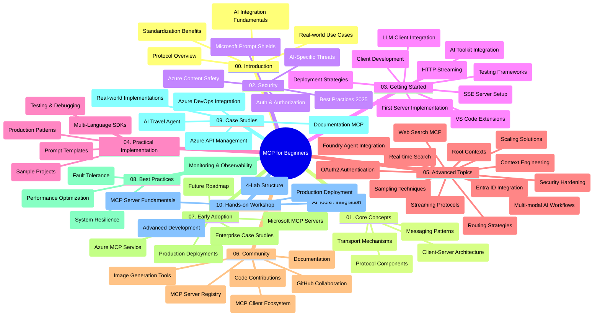

<!--
CO_OP_TRANSLATOR_METADATA:
{
  "original_hash": "e2c6ed897fa98fa08e0146101776c7ff",
  "translation_date": "2025-07-18T10:22:41+00:00",
  "source_file": "study_guide.md",
  "language_code": "ro"
}
-->
# Protocolul Contextului Modelului (MCP) pentru Începători - Ghid de Studiu

Acest ghid de studiu oferă o prezentare generală a structurii și conținutului depozitului pentru curriculumul „Protocolul Contextului Modelului (MCP) pentru Începători”. Folosește acest ghid pentru a naviga eficient în depozit și pentru a profita la maximum de resursele disponibile.

## Prezentare Generală a Depozitului

Model Context Protocol (MCP) este un cadru standardizat pentru interacțiunile dintre modelele AI și aplicațiile client. Creat inițial de Anthropic, MCP este acum întreținut de comunitatea largă MCP prin organizația oficială GitHub. Acest depozit oferă un curriculum cuprinzător, cu exemple practice de cod în C#, Java, JavaScript, Python și TypeScript, destinat dezvoltatorilor AI, arhitecților de sisteme și inginerilor software.

## Hartă Vizuală a Curriculumului

## Structura Depozitului

Depozitul este organizat în zece secțiuni principale, fiecare concentrându-se pe diferite aspecte ale MCP:

1. **Introducere (00-Introduction/)**
   - Prezentare generală a Protocolului Contextului Modelului
   - De ce este importantă standardizarea în fluxurile AI
   - Cazuri practice și beneficii

2. **Concepte de Bază (01-CoreConcepts/)**
   - Arhitectura client-server
   - Componente cheie ale protocolului
   - Modele de mesagerie în MCP

3. **Securitate (02-Security/)**
   - Amenințări de securitate în sistemele bazate pe MCP
   - Cele mai bune practici pentru securizarea implementărilor
   - Strategii de autentificare și autorizare
   - **Documentație completă de securitate**:
     - MCP Security Best Practices 2025
     - Ghid de implementare Azure Content Safety
     - Controale și tehnici de securitate MCP
     - Referință rapidă Best Practices MCP
   - **Subiecte cheie de securitate**:
     - Atacuri de tip prompt injection și tool poisoning
     - Hijacking de sesiune și probleme de tip confused deputy
     - Vulnerabilități de tip token passthrough
     - Permisiuni excesive și controlul accesului
     - Securitatea lanțului de aprovizionare pentru componente AI
     - Integrarea Microsoft Prompt Shields

4. **Începutul Lucrului (03-GettingStarted/)**
   - Configurarea și pregătirea mediului
   - Crearea primelor servere și clienți MCP
   - Integrarea cu aplicații existente
   - Include secțiuni pentru:
     - Prima implementare a serverului
     - Dezvoltarea clientului
     - Integrarea clientului LLM
     - Integrarea în VS Code
     - Server-Sent Events (SSE)
     - Streaming HTTP
     - Integrarea AI Toolkit
     - Strategii de testare
     - Ghiduri de implementare

5. **Implementare Practică (04-PracticalImplementation/)**
   - Utilizarea SDK-urilor în diverse limbaje de programare
   - Tehnici de depanare, testare și validare
   - Crearea de șabloane și fluxuri de lucru reutilizabile pentru prompturi
   - Proiecte exemplu cu implementări practice

6. **Subiecte Avansate (05-AdvancedTopics/)**
   - Tehnici de inginerie a contextului
   - Integrarea agentului Foundry
   - Fluxuri de lucru AI multimodale
   - Demonstrații de autentificare OAuth2
   - Capacități de căutare în timp real
   - Streaming în timp real
   - Implementarea contextelor root
   - Strategii de rutare
   - Tehnici de sampling
   - Abordări de scalare
   - Considerații de securitate
   - Integrarea securității Entra ID
   - Integrarea căutării web

7. **Contribuții din Comunitate (06-CommunityContributions/)**
   - Cum să contribui cu cod și documentație
   - Colaborarea prin GitHub
   - Îmbunătățiri și feedback din partea comunității
   - Utilizarea diferiților clienți MCP (Claude Desktop, Cline, VSCode)
   - Lucrul cu servere MCP populare, inclusiv generare de imagini

8. **Lecții din Primele Implementări (07-LessonsfromEarlyAdoption/)**
   - Implementări reale și povești de succes
   - Construirea și lansarea soluțiilor bazate pe MCP
   - Tendințe și planuri de viitor
   - **Ghid Microsoft MCP Servers**: Ghid complet pentru 10 servere MCP Microsoft gata de producție, inclusiv:
     - Microsoft Learn Docs MCP Server
     - Azure MCP Server (peste 15 conectori specializați)
     - GitHub MCP Server
     - Azure DevOps MCP Server
     - MarkItDown MCP Server
     - SQL Server MCP Server
     - Playwright MCP Server
     - Dev Box MCP Server
     - Azure AI Foundry MCP Server
     - Microsoft 365 Agents Toolkit MCP Server

9. **Cele Mai Bune Practici (08-BestPractices/)**
   - Optimizarea performanței și tuning
   - Proiectarea sistemelor MCP tolerante la erori
   - Strategii de testare și reziliență

10. **Studii de Caz (09-CaseStudy/)**
    - Exemplu de integrare Azure API Management
    - Exemplu de implementare agent de turism
    - Integrare Azure DevOps cu actualizări YouTube
    - Exemple de implementare MCP pentru documentație
    - Exemple detaliate de implementare cu documentație

11. **Atelier Practic (10-StreamliningAIWorkflowsBuildingAnMCPServerWithAIToolkit/)**
    - Atelier practic complet care combină MCP cu AI Toolkit
    - Construirea de aplicații inteligente care leagă modelele AI de instrumente reale
    - Module practice ce acoperă fundamentele, dezvoltarea serverului personalizat și strategii de lansare în producție
    - **Structura laboratorului**:
      - Laborator 1: Fundamente MCP Server
      - Laborator 2: Dezvoltare avansată MCP Server
      - Laborator 3: Integrare AI Toolkit
      - Laborator 4: Lansare în producție și scalare
    - Abordare de învățare bazată pe laboratoare cu instrucțiuni pas cu pas

## Resurse Suplimentare

Depozitul include resurse de suport:

- **Folderul Images**: Conține diagrame și ilustrații folosite în curriculum
- **Traduceri**: Suport multilingv cu traduceri automate ale documentației
- **Resurse oficiale MCP**:
  - [MCP Documentation](https://modelcontextprotocol.io/)
  - [MCP Specification](https://spec.modelcontextprotocol.io/)
  - [MCP GitHub Repository](https://github.com/modelcontextprotocol)

## Cum să Folosești Acest Depozit

1. **Învățare Secvențială**: Parcurge capitolele în ordine (de la 00 la 10) pentru o experiență de învățare structurată.
2. **Focus pe Limbajul Preferat**: Dacă ești interesat de un anumit limbaj de programare, explorează directoarele cu exemple pentru implementări în limbajul tău preferat.
3. **Implementare Practică**: Începe cu secțiunea „Getting Started” pentru a-ți configura mediul și a crea primul server și client MCP.
4. **Explorare Avansată**: După ce stăpânești elementele de bază, aprofundează subiectele avansate pentru a-ți extinde cunoștințele.
5. **Implicare în Comunitate**: Alătură-te comunității MCP prin discuții pe GitHub și canale Discord pentru a interacționa cu experți și alți dezvoltatori.

## Clienți și Unelte MCP

Curriculumul acoperă diferiți clienți și unelte MCP:

1. **Clienți Oficiali**:
   - Visual Studio Code
   - MCP în Visual Studio Code
   - Claude Desktop
   - Claude în VSCode
   - Claude API

2. **Clienți din Comunitate**:
   - Cline (terminal)
   - Cursor (editor de cod)
   - ChatMCP
   - Windsurf

3. **Unelte de Administrare MCP**:
   - MCP CLI
   - MCP Manager
   - MCP Linker
   - MCP Router

## Servere MCP Populare

Depozitul prezintă diverse servere MCP, inclusiv:

1. **Servere Oficiale Microsoft MCP**:
   - Microsoft Learn Docs MCP Server
   - Azure MCP Server (peste 15 conectori specializați)
   - GitHub MCP Server
   - Azure DevOps MCP Server
   - MarkItDown MCP Server
   - SQL Server MCP Server
   - Playwright MCP Server
   - Dev Box MCP Server
   - Azure AI Foundry MCP Server
   - Microsoft 365 Agents Toolkit MCP Server

2. **Servere de Referință Oficiale**:
   - Filesystem
   - Fetch
   - Memory
   - Sequential Thinking

3. **Generare de Imagini**:
   - Azure OpenAI DALL-E 3
   - Stable Diffusion WebUI
   - Replicate

4. **Unelte de Dezvoltare**:
   - Git MCP
   - Terminal Control
   - Code Assistant

5. **Servere Specializate**:
   - Salesforce
   - Microsoft Teams
   - Jira & Confluence

## Contribuții

Acest depozit primește cu plăcere contribuții din partea comunității. Consultă secțiunea Contribuții din Comunitate pentru îndrumări despre cum să contribui eficient la ecosistemul MCP.

## Jurnal de Modificări

| Data          | Modificări                                                                                              |
|---------------|-------------------------------------------------------------------------------------------------------|
| 18 iulie 2025 | - Actualizare structură depozit pentru includerea Ghidului Microsoft MCP Servers - Adăugare listă completă cu 10 servere MCP Microsoft gata de producție - Îmbunătățire secțiune Servere MCP Populare cu Servere Oficiale Microsoft MCP - Actualizare secțiune Studii de Caz cu exemple reale de fișiere - Adăugare detalii despre structura laboratorului pentru Atelierul Practic |
| 16 iulie 2025 | - Actualizare structură depozit pentru conținutul curent - Adăugare secțiune Clienți și Unelte MCP - Adăugare secțiune Servere MCP Populare - Actualizare Harta Vizuală a Curriculumului cu toate subiectele curente - Îmbunătățire secțiune Subiecte Avansate cu toate ariile specializate - Actualizare Studii de Caz cu exemple reale - Clarificare originea MCP ca fiind creat de Anthropic |
| 11 iunie 2025 | - Crearea inițială a ghidului de studiu - Adăugare Hartă Vizuală a Curriculumului - Schițare structură depozit - Incluse proiecte exemplu și resurse suplimentare |

---

*Acest ghid de studiu a fost actualizat la 18 iulie 2025 și oferă o prezentare generală a depozitului la acea dată. Conținutul depozitului poate fi actualizat după această dată.*

**Declinare de responsabilitate**:  
Acest document a fost tradus folosind serviciul de traducere AI [Co-op Translator](https://github.com/Azure/co-op-translator). Deși ne străduim pentru acuratețe, vă rugăm să rețineți că traducerile automate pot conține erori sau inexactități. Documentul original în limba sa nativă trebuie considerat sursa autorizată. Pentru informații critice, se recomandă traducerea profesională realizată de un specialist uman. Nu ne asumăm răspunderea pentru eventualele neînțelegeri sau interpretări greșite rezultate din utilizarea acestei traduceri.