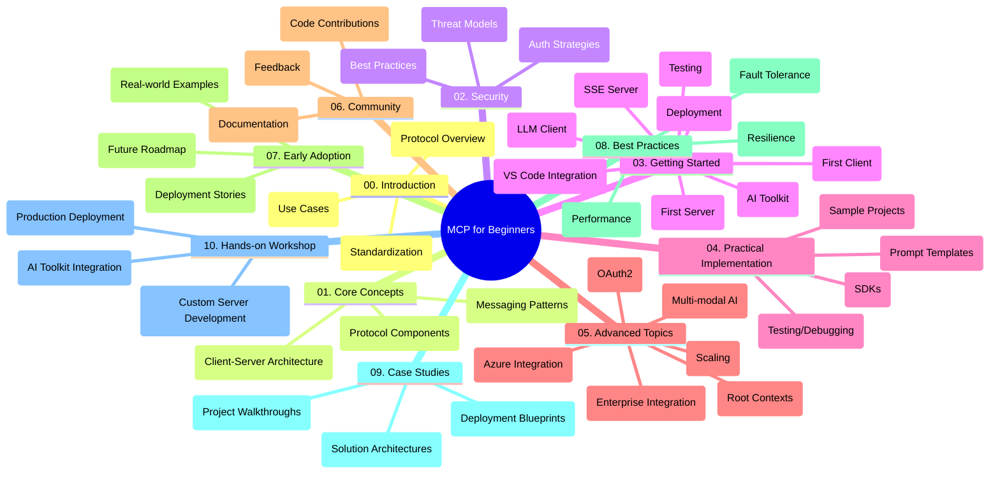

<!--
CO_OP_TRANSLATOR_METADATA:
{
  "original_hash": "a607d4febc94caee9a12b77795f7fc9a",
  "translation_date": "2025-06-11T16:50:49+00:00",
  "source_file": "study_guide.md",
  "language_code": "ro"
}
-->
# Model Context Protocol (MCP) pentru Începători - Ghid de Studiu

Acest ghid de studiu oferă o prezentare generală a structurii și conținutului repository-ului pentru curriculumul „Model Context Protocol (MCP) pentru Începători”. Folosește acest ghid pentru a naviga eficient prin repository și pentru a valorifica la maximum resursele disponibile.

## Prezentare Generală a Repository-ului

Model Context Protocol (MCP) este un cadru standardizat pentru interacțiunile dintre modelele AI și aplicațiile client. Acest repository oferă un curriculum complet cu exemple practice de cod în C#, Java, JavaScript, Python și TypeScript, destinat dezvoltatorilor AI, arhitecților de sistem și inginerilor software.

## Harta Vizuală a Curriculumului

## Structura Repository-ului

Repository-ul este organizat în zece secțiuni principale, fiecare concentrându-se pe diferite aspecte ale MCP:

1. **Introducere (00-Introduction/)**
   - Prezentare generală a Model Context Protocol
   - Importanța standardizării în pipeline-urile AI
   - Cazuri practice și beneficii

2. **Concepte de Bază (01-CoreConcepts/)**
   - Arhitectura client-server
   - Componente cheie ale protocolului
   - Modele de mesagerie în MCP

3. **Securitate (02-Security/)**
   - Amenințări de securitate în sistemele bazate pe MCP
   - Cele mai bune practici pentru securizarea implementărilor
   - Strategii de autentificare și autorizare

4. **Primii Pași (03-GettingStarted/)**
   - Configurarea și pregătirea mediului
   - Crearea primilor serveri și clienți MCP
   - Integrarea cu aplicații existente
   - Subsecțiuni pentru primul server, primul client, client LLM, integrare VS Code, server SSE, AI Toolkit, testare și implementare

5. **Implementare Practică (04-PracticalImplementation/)**
   - Utilizarea SDK-urilor în diferite limbaje de programare
   - Tehnici de depanare, testare și validare
   - Crearea de șabloane și fluxuri de lucru reutilizabile
   - Proiecte exemplu cu implementări

6. **Subiecte Avansate (05-AdvancedTopics/)**
   - Fluxuri de lucru AI multimodale și extensibilitate
   - Strategii sigure de scalare
   - MCP în ecosistemele enterprise
   - Subiecte specializate precum integrarea Azure, multimodalitate, OAuth2, root contexts, rutare, sampling, scalare, securitate, integrare web search și streaming

7. **Contribuții Comunitare (06-CommunityContributions/)**
   - Cum să contribui cu cod și documentație
   - Colaborarea prin GitHub
   - Îmbunătățiri și feedback din partea comunității

8. **Lecții din Primele Implementări (07-LessonsfromEarlyAdoption/)**
   - Implementări reale și povești de succes
   - Construirea și lansarea soluțiilor bazate pe MCP
   - Tendințe și planuri viitoare

9. **Cele Mai Bune Practici (08-BestPractices/)**
   - Optimizarea performanței
   - Proiectarea sistemelor MCP rezistente la erori
   - Strategii de testare și reziliență

10. **Studii de Caz (09-CaseStudy/)**
    - Analize detaliate ale arhitecturilor soluțiilor MCP
    - Scheme de implementare și sfaturi de integrare
    - Diagrame explicative și parcurgeri ale proiectelor

11. **Atelier Practic (10-StreamliningAIWorkflowsBuildingAnMCPServerWithAIToolkit/)**
    - Atelier practic complet care combină MCP cu AI Toolkit de la Microsoft pentru VS Code
    - Construirea de aplicații inteligente care leagă modelele AI de unelte reale
    - Module practice ce acoperă fundamentele, dezvoltarea serverului personalizat și strategii de implementare în producție

## Proiecte Exemplu

Repository-ul include mai multe proiecte exemplu care demonstrează implementarea MCP în diverse limbaje de programare:

### Exemple de Calculatoare MCP de Bază
- Exemplu C# MCP Server
- Calculator Java MCP
- Demo JavaScript MCP
- Server Python MCP
- Exemplu TypeScript MCP

### Proiecte Avansate de Calculatoare MCP
- Exemplu avansat C#
- Aplicație Container Java
- Exemplu avansat JavaScript
- Implementare complexă Python
- Exemplu Container TypeScript

## Resurse Suplimentare

Repository-ul include resurse suport:

- **Folderul Images**: Conține diagrame și ilustrații folosite pe parcursul curriculumului
- **Traduceri**: Suport multilingv cu traduceri automate ale documentației
- **Resurse oficiale MCP**:
  - [MCP Documentation](https://modelcontextprotocol.io/)
  - [MCP Specification](https://spec.modelcontextprotocol.io/)
  - [MCP GitHub Repository](https://github.com/modelcontextprotocol)

## Cum să Folosești Acest Repository

1. **Învățare Secvențială**: Urmează capitolele în ordine (00 până la 10) pentru o experiență structurată.
2. **Focus pe Limbajul Preferat**: Dacă ești interesat de un anumit limbaj de programare, explorează directoarele de exemple pentru implementări în limbajul ales.
3. **Implementare Practică**: Începe cu secțiunea „Getting Started” pentru a-ți configura mediul și a crea primul server și client MCP.
4. **Explorare Avansată**: După ce stăpânești bazele, aprofundează subiectele avansate pentru a-ți extinde cunoștințele.
5. **Implicare în Comunitate**: Alătură-te [Azure AI Foundry Discord](https://discord.com/invite/ByRwuEEgH4) pentru a interacționa cu experți și alți dezvoltatori.

## Contribuții

Acest repository primește cu plăcere contribuții din partea comunității. Consultă secțiunea Community Contributions pentru indicații despre cum să contribui.

---

*Acest ghid de studiu a fost creat pe 11 iunie 2025 și oferă o privire de ansamblu a repository-ului la acea dată. Conținutul repository-ului poate fi fost actualizat între timp.*

**Declinare a responsabilității**:  
Acest document a fost tradus folosind serviciul de traducere AI [Co-op Translator](https://github.com/Azure/co-op-translator). Deși ne străduim pentru acuratețe, vă rugăm să rețineți că traducerile automate pot conține erori sau inexactități. Documentul original în limba sa nativă trebuie considerat sursa autoritară. Pentru informații critice, se recomandă traducerea profesională realizată de un specialist uman. Nu ne asumăm responsabilitatea pentru eventualele neînțelegeri sau interpretări greșite rezultate din utilizarea acestei traduceri.