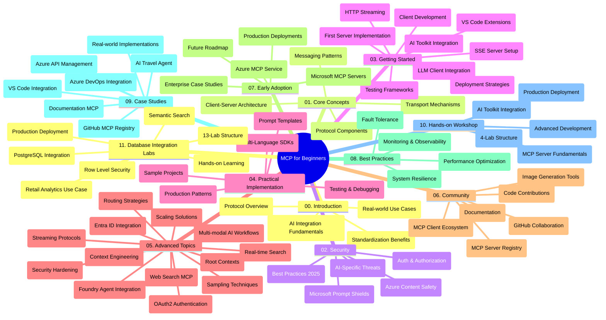

<!--
CO_OP_TRANSLATOR_METADATA:
{
  "original_hash": "aa1ce97bc694b08faf3018bab6d275b9",
  "translation_date": "2025-09-30T21:42:16+00:00",
  "source_file": "study_guide.md",
  "language_code": "ro"
}
-->
# Protocolul Model Context (MCP) pentru Începători - Ghid de Studiu

Acest ghid de studiu oferă o prezentare generală a structurii și conținutului depozitului pentru curriculumul „Protocolul Model Context (MCP) pentru Începători”. Folosiți acest ghid pentru a naviga eficient în depozit și pentru a profita la maximum de resursele disponibile.

## Prezentare Generală a Depozitului

Protocolul Model Context (MCP) este un cadru standardizat pentru interacțiunile dintre modelele AI și aplicațiile client. Creat inițial de Anthropic, MCP este acum întreținut de comunitatea MCP prin organizația oficială GitHub. Acest depozit oferă un curriculum cuprinzător, cu exemple de cod practice în C#, Java, JavaScript, Python și TypeScript, conceput pentru dezvoltatori AI, arhitecți de sisteme și ingineri software.

## Harta Vizuală a Curriculumului

## Structura Depozitului

Depozitul este organizat în unsprezece secțiuni principale, fiecare concentrându-se pe diferite aspecte ale MCP:

1. **Introducere (00-Introduction/)**
   - Prezentare generală a Protocolului Model Context
   - De ce este importantă standardizarea în fluxurile de lucru AI
   - Cazuri practice de utilizare și beneficii

2. **Concepte de Bază (01-CoreConcepts/)**
   - Arhitectura client-server
   - Componentele cheie ale protocolului
   - Modele de mesagerie în MCP

3. **Securitate (02-Security/)**
   - Amenințări de securitate în sistemele bazate pe MCP
   - Cele mai bune practici pentru implementări sigure
   - Strategii de autentificare și autorizare
   - **Documentație cuprinzătoare despre securitate**:
     - Cele mai bune practici de securitate MCP 2025
     - Ghid de implementare Azure Content Safety
     - Controale și tehnici de securitate MCP
     - Referință rapidă pentru cele mai bune practici MCP
   - **Subiecte cheie de securitate**:
     - Atacuri prin injectare de prompt și otrăvirea instrumentelor
     - Deturnarea sesiunii și problemele de tip „deputat confuz”
     - Vulnerabilități de trecere a token-urilor
     - Permisiuni excesive și controlul accesului
     - Securitatea lanțului de aprovizionare pentru componentele AI
     - Integrarea Microsoft Prompt Shields

4. **Primii Pași (03-GettingStarted/)**
   - Configurarea și configurarea mediului
   - Crearea serverelor și clienților MCP de bază
   - Integrarea cu aplicații existente
   - Include secțiuni pentru:
     - Prima implementare a serverului
     - Dezvoltarea clientului
     - Integrarea clientului LLM
     - Integrarea VS Code
     - Server Server-Sent Events (SSE)
     - Streaming HTTP
     - Integrarea AI Toolkit
     - Strategii de testare
     - Ghiduri de implementare

5. **Implementare Practică (04-PracticalImplementation/)**
   - Utilizarea SDK-urilor în diferite limbaje de programare
   - Tehnici de depanare, testare și validare
   - Crearea de șabloane de prompt reutilizabile și fluxuri de lucru
   - Proiecte exemplu cu exemple de implementare

6. **Subiecte Avansate (05-AdvancedTopics/)**
   - Tehnici de inginerie a contextului
   - Integrarea agenților Foundry
   - Fluxuri de lucru AI multi-modale
   - Demonstrații de autentificare OAuth2
   - Capacități de căutare în timp real
   - Streaming în timp real
   - Implementarea contextelor de bază
   - Strategii de rutare
   - Tehnici de eșantionare
   - Abordări de scalare
   - Considerații de securitate
   - Integrarea securității Entra ID
   - Integrarea căutării web

7. **Contribuții Comunitare (06-CommunityContributions/)**
   - Cum să contribuiți cu cod și documentație
   - Colaborarea prin GitHub
   - Îmbunătățiri și feedback conduse de comunitate
   - Utilizarea diverselor clienți MCP (Claude Desktop, Cline, VSCode)
   - Lucrul cu servere MCP populare, inclusiv generarea de imagini

8. **Lecții din Adopția Timpurie (07-LessonsfromEarlyAdoption/)**
   - Implementări reale și povești de succes
   - Construirea și implementarea soluțiilor bazate pe MCP
   - Tendințe și foaie de parcurs viitoare
   - **Ghidul Serverelor MCP Microsoft**: Ghid cuprinzător pentru 10 servere MCP Microsoft gata de producție, inclusiv:
     - Server MCP Microsoft Learn Docs
     - Server MCP Azure (15+ conectori specializați)
     - Server MCP GitHub
     - Server MCP Azure DevOps
     - Server MCP MarkItDown
     - Server MCP SQL Server
     - Server MCP Playwright
     - Server MCP Dev Box
     - Server MCP Azure AI Foundry
     - Server MCP Microsoft 365 Agents Toolkit

9. **Cele Mai Bune Practici (08-BestPractices/)**
   - Optimizarea performanței
   - Proiectarea sistemelor MCP tolerante la erori
   - Strategii de testare și reziliență

10. **Studii de Caz (09-CaseStudy/)**
    - **Șapte studii de caz cuprinzătoare** care demonstrează versatilitatea MCP în diverse scenarii:
    - **Agenți de Călătorie AI Azure**: Orchestrare multi-agent cu Azure OpenAI și AI Search
    - **Integrarea Azure DevOps**: Automatizarea proceselor de flux de lucru cu actualizări de date YouTube
    - **Recuperarea Documentației în Timp Real**: Client Python în consolă cu streaming HTTP
    - **Generator Interactiv de Planuri de Studiu**: Aplicație web Chainlit cu AI conversațional
    - **Documentație în Editor**: Integrare VS Code cu fluxuri de lucru GitHub Copilot
    - **Managementul API Azure**: Integrare API de întreprindere cu crearea serverului MCP
    - **Registrul MCP GitHub**: Dezvoltarea ecosistemului și platforma de integrare agentică
    - Exemple de implementare care acoperă integrarea în întreprinderi, productivitatea dezvoltatorilor și dezvoltarea ecosistemului

11. **Atelier Practic (10-StreamliningAIWorkflowsBuildingAnMCPServerWithAIToolkit/)**
    - Atelier practic cuprinzător care combină MCP cu AI Toolkit
    - Construirea aplicațiilor inteligente care conectează modelele AI cu instrumentele din lumea reală
    - Module practice care acoperă fundamentele, dezvoltarea serverului personalizat și strategiile de implementare în producție
    - **Structura Laboratorului**:
      - Laborator 1: Fundamentele Serverului MCP
      - Laborator 2: Dezvoltarea Avansată a Serverului MCP
      - Laborator 3: Integrarea AI Toolkit
      - Laborator 4: Implementare și Scalare în Producție
    - Abordare bazată pe laboratoare cu instrucțiuni pas cu pas

12. **Laboratoare de Integrare a Serverului MCP cu Baze de Date (11-MCPServerHandsOnLabs/)**
    - **Cale de învățare cuprinzătoare de 13 laboratoare** pentru construirea serverelor MCP gata de producție cu integrare PostgreSQL
    - **Implementare reală de analiză retail** folosind cazul de utilizare Zava Retail
    - **Modele de nivel enterprise** incluzând Securitatea la Nivel de Rând (RLS), căutare semantică și acces la date multi-chiriaș
    - **Structura Completă a Laboratoarelor**:
      - **Laboratoare 00-03: Fundamente** - Introducere, Arhitectură, Securitate, Configurarea Mediului
      - **Laboratoare 04-06: Construirea Serverului MCP** - Proiectarea Bazei de Date, Implementarea Serverului MCP, Dezvoltarea Instrumentelor
      - **Laboratoare 07-09: Funcționalități Avansate** - Căutare Semantică, Testare și Depanare, Integrare VS Code
      - **Laboratoare 10-12: Producție și Cele Mai Bune Practici** - Implementare, Monitorizare, Optimizare
    - **Tehnologii Acoperite**: Cadru FastMCP, PostgreSQL, Azure OpenAI, Azure Container Apps, Application Insights
    - **Rezultate ale Învățării**: Servere MCP gata de producție, modele de integrare a bazelor de date, analize AI, securitate enterprise

## Resurse Suplimentare

Depozitul include resurse de suport:

- **Folderul de imagini**: Conține diagrame și ilustrații utilizate în curriculum
- **Traduceri**: Suport multilingv cu traduceri automate ale documentației
- **Resurse Oficiale MCP**:
  - [Documentația MCP](https://modelcontextprotocol.io/)
  - [Specificația MCP](https://spec.modelcontextprotocol.io/)
  - [Depozitul GitHub MCP](https://github.com/modelcontextprotocol)

## Cum să Utilizați Acest Depozit

1. **Învățare Secvențială**: Urmați capitolele în ordine (00 până la 11) pentru o experiență de învățare structurată.
2. **Focalizare pe Limbaj**: Dacă sunteți interesat de un anumit limbaj de programare, explorați directoarele de exemple pentru implementări în limbajul preferat.
3. **Implementare Practică**: Începeți cu secțiunea „Primii Pași” pentru a vă configura mediul și a crea primul server și client MCP.
4. **Explorare Avansată**: După ce vă simțiți confortabil cu elementele de bază, aprofundați subiectele avansate pentru a vă extinde cunoștințele.
5. **Implicare Comunitară**: Alăturați-vă comunității MCP prin discuții pe GitHub și canale Discord pentru a vă conecta cu experți și alți dezvoltatori.

## Clienți și Instrumente MCP

Curriculumul acoperă diferiți clienți și instrumente MCP:

1. **Clienți Oficiali**:
   - Visual Studio Code 
   - MCP în Visual Studio Code
   - Claude Desktop
   - Claude în VSCode 
   - Claude API

2. **Clienți Comunitari**:
   - Cline (bazat pe terminal)
   - Cursor (editor de cod)
   - ChatMCP
   - Windsurf

3. **Instrumente de Management MCP**:
   - MCP CLI
   - MCP Manager
   - MCP Linker
   - MCP Router

## Servere MCP Populare

Depozitul introduce diverse servere MCP, inclusiv:

1. **Servere MCP Microsoft Oficiale**:
   - Server MCP Microsoft Learn Docs
   - Server MCP Azure (15+ conectori specializați)
   - Server MCP GitHub
   - Server MCP Azure DevOps
   - Server MCP MarkItDown
   - Server MCP SQL Server
   - Server MCP Playwright
   - Server MCP Dev Box
   - Server MCP Azure AI Foundry
   - Server MCP Microsoft 365 Agents Toolkit

2. **Servere de Referință Oficiale**:
   - Filesystem
   - Fetch
   - Memory
   - Sequential Thinking

3. **Generare de Imagini**:
   - Azure OpenAI DALL-E 3
   - Stable Diffusion WebUI
   - Replicate

4. **Instrumente de Dezvoltare**:
   - Git MCP
   - Terminal Control
   - Code Assistant

5. **Servere Specializate**:
   - Salesforce
   - Microsoft Teams
   - Jira & Confluence

## Contribuții

Acest depozit acceptă contribuții din partea comunității. Consultați secțiunea Contribuții Comunitare pentru îndrumări despre cum să contribuiți eficient la ecosistemul MCP.

## Jurnal de Modificări

| Data | Modificări |
|------|---------||
| 29 septembrie 2025 | - Adăugată secțiunea 11-MCPServerHandsOnLabs cu cale de învățare cuprinzătoare de 13 laboratoare pentru integrarea bazelor de date - Actualizată Harta Vizuală a Curriculumului pentru a include Laboratoarele de Integrare a Bazelor de Date - Îmbunătățită structura depozitului pentru a reflecta unsprezece secțiuni principale - Adăugată descriere detaliată a integrării PostgreSQL, cazul de utilizare pentru analiza retail și modelele enterprise - Actualizată ghidarea navigării pentru a include secțiunile 00-11 |
| 26 septembrie 2025 | - Adăugat studiul de caz Registrul MCP GitHub în secțiunea 09-CaseStudy - Actualizate Studiile de Caz pentru a reflecta șapte studii de caz cuprinzătoare - Îmbunătățite descrierile studiilor de caz cu detalii specifice de implementare - Actualizată Harta Vizuală a Curriculumului pentru a include Registrul MCP GitHub - Revizuită structura ghidului de studiu pentru a reflecta focalizarea pe dezvoltarea ecosistemului |
| 18 iulie 2025 | - Actualizată structura depozitului pentru a include Ghidul Serverelor MCP Microsoft - Adăugată listă cuprinzătoare de 10 servere MCP Microsoft gata de producție - Îmbunătățită secțiunea Servere MCP Populare cu Servere MCP Microsoft Oficiale - Actualizată secțiunea Studii de Caz cu exemple reale de fișiere - Adăugate detalii despre Structura Laboratorului pentru Atelierul Practic |
| 16 iulie 2025 | - Actualizată structura depozitului pentru a reflecta conținutul actual - Adăugată secțiunea Clienți și Instrumente MCP - Adăugată secțiunea Servere MCP Populare - Actualizată Harta Vizuală a Curriculumului cu toate subiectele actuale - Îmbunătățită secțiunea Subiecte Avansate cu toate domeniile specializate - Actualizate Studiile de Caz pentru a reflecta exemple reale - Clarificat originea MCP ca fiind creat de Anthropic |
| 11 iunie 2025 | - Crearea inițială a ghidului de studiu - Adăugată Harta Vizuală a Curriculumului - Conturată structura depozitului - Incluse proiecte exemplu și resurse suplimentare |

---

*Acest ghid de studiu a fost actualizat pe 29 septembrie 2025 și oferă o prezentare generală a depozitului la acea dată. Conținutul depozitului poate fi actualizat după această dată.*

---

**Declinare de responsabilitate**:  
Acest document a fost tradus folosind serviciul de traducere AI [Co-op Translator](https://github.com/Azure/co-op-translator). Deși ne străduim să asigurăm acuratețea, vă rugăm să fiți conștienți că traducerile automate pot conține erori sau inexactități. Documentul original în limba sa natală ar trebui considerat sursa autoritară. Pentru informații critice, se recomandă traducerea profesională realizată de un specialist. Nu ne asumăm responsabilitatea pentru eventualele neînțelegeri sau interpretări greșite care pot apărea din utilizarea acestei traduceri.