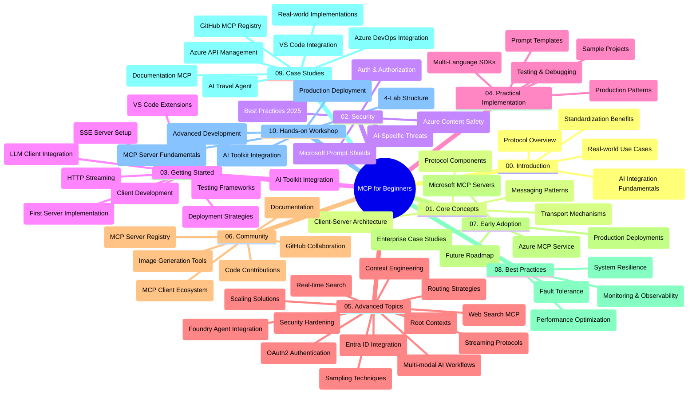

<!--
CO_OP_TRANSLATOR_METADATA:
{
  "original_hash": "719117a0a5f34ade7b5dfb61ee06fb13",
  "translation_date": "2025-09-26T19:05:29+00:00",
  "source_file": "study_guide.md",
  "language_code": "ro"
}
-->
# Protocolul Model Context (MCP) pentru Începători - Ghid de Studiu

Acest ghid de studiu oferă o prezentare generală a structurii și conținutului depozitului pentru curriculumul "Protocolul Model Context (MCP) pentru Începători". Folosiți acest ghid pentru a naviga eficient prin depozit și pentru a profita la maximum de resursele disponibile.

## Prezentare Generală a Depozitului

Protocolul Model Context (MCP) este un cadru standardizat pentru interacțiunile dintre modelele AI și aplicațiile client. Creat inițial de Anthropic, MCP este acum întreținut de comunitatea MCP prin organizația oficială GitHub. Acest depozit oferă un curriculum cuprinzător, cu exemple practice de cod în C#, Java, JavaScript, Python și TypeScript, destinat dezvoltatorilor AI, arhitecților de sisteme și inginerilor software.

## Harta Vizuală a Curriculumului

## Structura Depozitului

Depozitul este organizat în zece secțiuni principale, fiecare concentrându-se pe diferite aspecte ale MCP:

1. **Introducere (00-Introduction/)**
   - Prezentare generală a Protocolului Model Context
   - De ce este importantă standardizarea în fluxurile de lucru AI
   - Cazuri practice de utilizare și beneficii

2. **Concepte de Bază (01-CoreConcepts/)**
   - Arhitectura client-server
   - Componentele cheie ale protocolului
   - Modele de mesagerie în MCP

3. **Securitate (02-Security/)**
   - Amenințări de securitate în sistemele bazate pe MCP
   - Cele mai bune practici pentru implementări sigure
   - Strategii de autentificare și autorizare
   - **Documentație Cuprinzătoare de Securitate**:
     - Cele mai bune practici de securitate MCP 2025
     - Ghid de implementare Azure Content Safety
     - Controale și tehnici de securitate MCP
     - Referință rapidă pentru cele mai bune practici MCP
   - **Subiecte Cheie de Securitate**:
     - Atacuri de injectare de prompt și otrăvirea instrumentelor
     - Deturnarea sesiunii și problemele de confuzie a delegatului
     - Vulnerabilități de trecere a token-urilor
     - Permisiuni excesive și controlul accesului
     - Securitatea lanțului de aprovizionare pentru componentele AI
     - Integrarea Microsoft Prompt Shields

4. **Primii Pași (03-GettingStarted/)**
   - Configurarea și configurarea mediului
   - Crearea serverelor și clienților MCP de bază
   - Integrarea cu aplicații existente
   - Include secțiuni pentru:
     - Prima implementare a serverului
     - Dezvoltarea clientului
     - Integrarea clientului LLM
     - Integrarea VS Code
     - Server Server-Sent Events (SSE)
     - Streaming HTTP
     - Integrarea AI Toolkit
     - Strategii de testare
     - Ghiduri de implementare

5. **Implementare Practică (04-PracticalImplementation/)**
   - Utilizarea SDK-urilor în diferite limbaje de programare
   - Tehnici de depanare, testare și validare
   - Crearea de șabloane de prompt reutilizabile și fluxuri de lucru
   - Proiecte de exemplu cu exemple de implementare

6. **Subiecte Avansate (05-AdvancedTopics/)**
   - Tehnici de inginerie a contextului
   - Integrarea agenților Foundry
   - Fluxuri de lucru AI multi-modale
   - Demonstrații de autentificare OAuth2
   - Capacități de căutare în timp real
   - Streaming în timp real
   - Implementarea contextelor de bază
   - Strategii de rutare
   - Tehnici de eșantionare
   - Abordări de scalare
   - Considerații de securitate
   - Integrarea securității Entra ID
   - Integrarea căutării web

7. **Contribuții Comunitare (06-CommunityContributions/)**
   - Cum să contribuiți cu cod și documentație
   - Colaborarea prin GitHub
   - Îmbunătățiri și feedback conduse de comunitate
   - Utilizarea diferiților clienți MCP (Claude Desktop, Cline, VSCode)
   - Lucrul cu servere MCP populare, inclusiv generarea de imagini

8. **Lecții din Adopția Timpurie (07-LessonsfromEarlyAdoption/)**
   - Implementări reale și povești de succes
   - Construirea și implementarea soluțiilor bazate pe MCP
   - Tendințe și foaie de parcurs viitoare
   - **Ghidul Serverelor MCP Microsoft**: Ghid cuprinzător pentru 10 servere MCP Microsoft gata de producție, inclusiv:
     - Server MCP Microsoft Learn Docs
     - Server MCP Azure (15+ conectori specializați)
     - Server MCP GitHub
     - Server MCP Azure DevOps
     - Server MCP MarkItDown
     - Server MCP SQL Server
     - Server MCP Playwright
     - Server MCP Dev Box
     - Server MCP Azure AI Foundry
     - Server MCP Microsoft 365 Agents Toolkit

9. **Cele Mai Bune Practici (08-BestPractices/)**
   - Optimizarea performanței
   - Proiectarea sistemelor MCP tolerante la erori
   - Strategii de testare și reziliență

10. **Studii de Caz (09-CaseStudy/)**
    - **Șapte studii de caz cuprinzătoare** care demonstrează versatilitatea MCP în diverse scenarii:
    - **Agenți de Călătorie AI Azure**: Orchestrare multi-agent cu Azure OpenAI și AI Search
    - **Integrarea Azure DevOps**: Automatizarea proceselor de flux de lucru cu actualizări de date YouTube
    - **Recuperarea Documentației în Timp Real**: Client Python console cu streaming HTTP
    - **Generator Interactiv de Planuri de Studiu**: Aplicație web Chainlit cu AI conversațional
    - **Documentație în Editor**: Integrare VS Code cu fluxuri de lucru GitHub Copilot
    - **Managementul API Azure**: Integrare API de întreprindere cu crearea serverului MCP
    - **Registrul MCP GitHub**: Dezvoltarea ecosistemului și platforma de integrare agentică
    - Exemple de implementare care acoperă integrarea în întreprinderi, productivitatea dezvoltatorilor și dezvoltarea ecosistemului

11. **Atelier Practic (10-StreamliningAIWorkflowsBuildingAnMCPServerWithAIToolkit/)**
    - Atelier practic cuprinzător care combină MCP cu AI Toolkit
    - Construirea aplicațiilor inteligente care leagă modelele AI de instrumentele din lumea reală
    - Module practice care acoperă fundamentele, dezvoltarea serverului personalizat și strategiile de implementare în producție
    - **Structura Laboratorului**:
      - Laborator 1: Fundamentele Serverului MCP
      - Laborator 2: Dezvoltarea Avansată a Serverului MCP
      - Laborator 3: Integrarea AI Toolkit
      - Laborator 4: Implementare și Scalare în Producție
    - Abordare de învățare bazată pe laborator cu instrucțiuni pas cu pas

## Resurse Suplimentare

Depozitul include resurse de suport:

- **Folderul de Imagini**: Conține diagrame și ilustrații utilizate în curriculum
- **Traduceri**: Suport multilingv cu traduceri automate ale documentației
- **Resurse Oficiale MCP**:
  - [Documentația MCP](https://modelcontextprotocol.io/)
  - [Specificația MCP](https://spec.modelcontextprotocol.io/)
  - [Depozitul GitHub MCP](https://github.com/modelcontextprotocol)

## Cum să Utilizați Acest Depozit

1. **Învățare Secvențială**: Urmați capitolele în ordine (00 până la 10) pentru o experiență de învățare structurată.
2. **Focalizare pe Limbaj**: Dacă sunteți interesat de un anumit limbaj de programare, explorați directoarele de exemple pentru implementări în limbajul preferat.
3. **Implementare Practică**: Începeți cu secțiunea "Primii Pași" pentru a vă configura mediul și a crea primul server și client MCP.
4. **Explorare Avansată**: După ce vă simțiți confortabil cu elementele de bază, aprofundați subiectele avansate pentru a vă extinde cunoștințele.
5. **Implicare Comunitară**: Alăturați-vă comunității MCP prin discuții pe GitHub și canale Discord pentru a vă conecta cu experți și alți dezvoltatori.

## Clienți și Instrumente MCP

Curriculumul acoperă diferiți clienți și instrumente MCP:

1. **Clienți Oficiali**:
   - Visual Studio Code 
   - MCP în Visual Studio Code
   - Claude Desktop
   - Claude în VSCode 
   - Claude API

2. **Clienți Comunitari**:
   - Cline (bazat pe terminal)
   - Cursor (editor de cod)
   - ChatMCP
   - Windsurf

3. **Instrumente de Management MCP**:
   - MCP CLI
   - MCP Manager
   - MCP Linker
   - MCP Router

## Servere MCP Populare

Depozitul introduce diverse servere MCP, inclusiv:

1. **Servere MCP Microsoft Oficiale**:
   - Server MCP Microsoft Learn Docs
   - Server MCP Azure (15+ conectori specializați)
   - Server MCP GitHub
   - Server MCP Azure DevOps
   - Server MCP MarkItDown
   - Server MCP SQL Server
   - Server MCP Playwright
   - Server MCP Dev Box
   - Server MCP Azure AI Foundry
   - Server MCP Microsoft 365 Agents Toolkit

2. **Servere de Referință Oficiale**:
   - Filesystem
   - Fetch
   - Memory
   - Sequential Thinking

3. **Generare de Imagini**:
   - Azure OpenAI DALL-E 3
   - Stable Diffusion WebUI
   - Replicate

4. **Instrumente de Dezvoltare**:
   - Git MCP
   - Control Terminal
   - Asistent de Cod

5. **Servere Specializate**:
   - Salesforce
   - Microsoft Teams
   - Jira & Confluence

## Contribuții

Acest depozit acceptă contribuții din partea comunității. Consultați secțiunea Contribuții Comunitare pentru îndrumări despre cum să contribuiți eficient la ecosistemul MCP.

## Jurnal de Modificări

| Data | Modificări |
|------|------------|
| 26 septembrie 2025 | - Adăugat studiul de caz Registrul MCP GitHub în secțiunea 09-CaseStudy - Actualizat Studii de Caz pentru a reflecta șapte studii de caz cuprinzătoare - Îmbunătățit descrierile studiilor de caz cu detalii specifice de implementare - Actualizat Harta Vizuală a Curriculumului pentru a include Registrul MCP GitHub - Revizuit structura ghidului de studiu pentru a reflecta focalizarea pe dezvoltarea ecosistemului |
| 18 iulie 2025 | - Actualizat structura depozitului pentru a include Ghidul Serverelor MCP Microsoft - Adăugat lista cuprinzătoare de 10 servere MCP Microsoft gata de producție - Îmbunătățit secțiunea Servere MCP Populare cu Servere MCP Microsoft Oficiale - Actualizat secțiunea Studii de Caz cu exemple reale de fișiere - Adăugat detalii despre Structura Laboratorului pentru Atelier Practic |
| 16 iulie 2025 | - Actualizat structura depozitului pentru a reflecta conținutul actual - Adăugat secțiunea Clienți și Instrumente MCP - Adăugat secțiunea Servere MCP Populare - Actualizat Harta Vizuală a Curriculumului cu toate subiectele actuale - Îmbunătățit secțiunea Subiecte Avansate cu toate domeniile specializate - Actualizat Studii de Caz pentru a reflecta exemple reale - Clarificat originea MCP ca fiind creat de Anthropic |
| 11 iunie 2025 | - Crearea inițială a ghidului de studiu - Adăugat Harta Vizuală a Curriculumului - Schițată structura depozitului - Inclus proiecte de exemplu și resurse suplimentare |

---

*Acest ghid de studiu a fost actualizat pe 26 septembrie 2025 și oferă o prezentare generală a depozitului la acea dată. Conținutul depozitului poate fi actualizat după această dată.*

---

