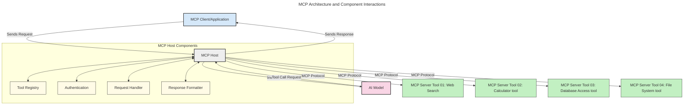
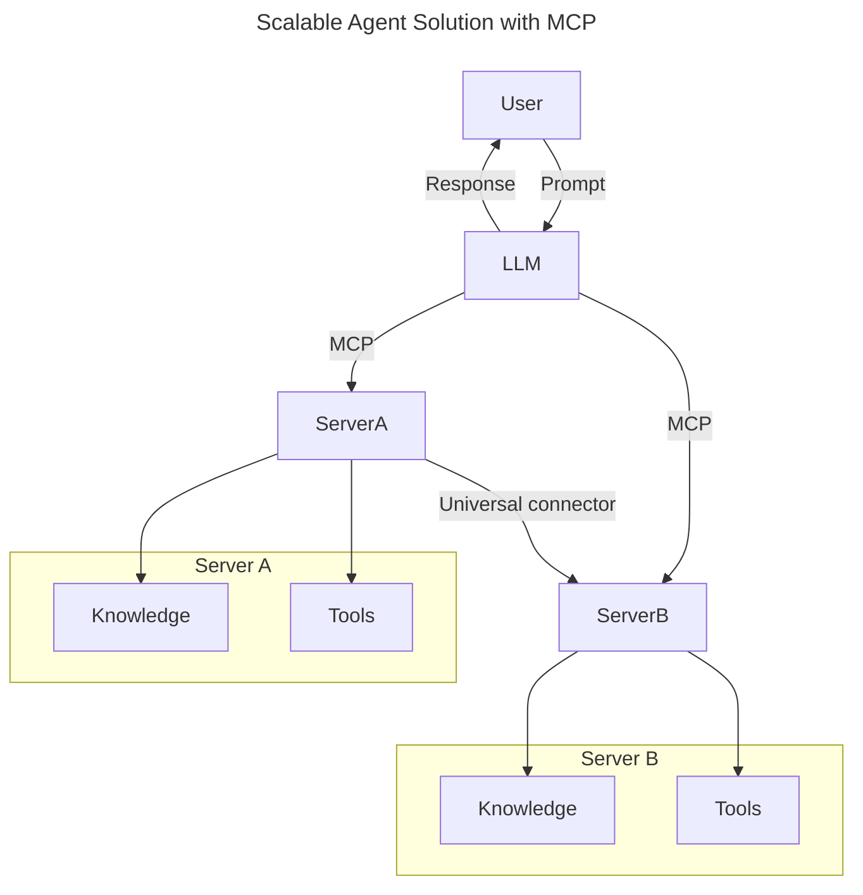
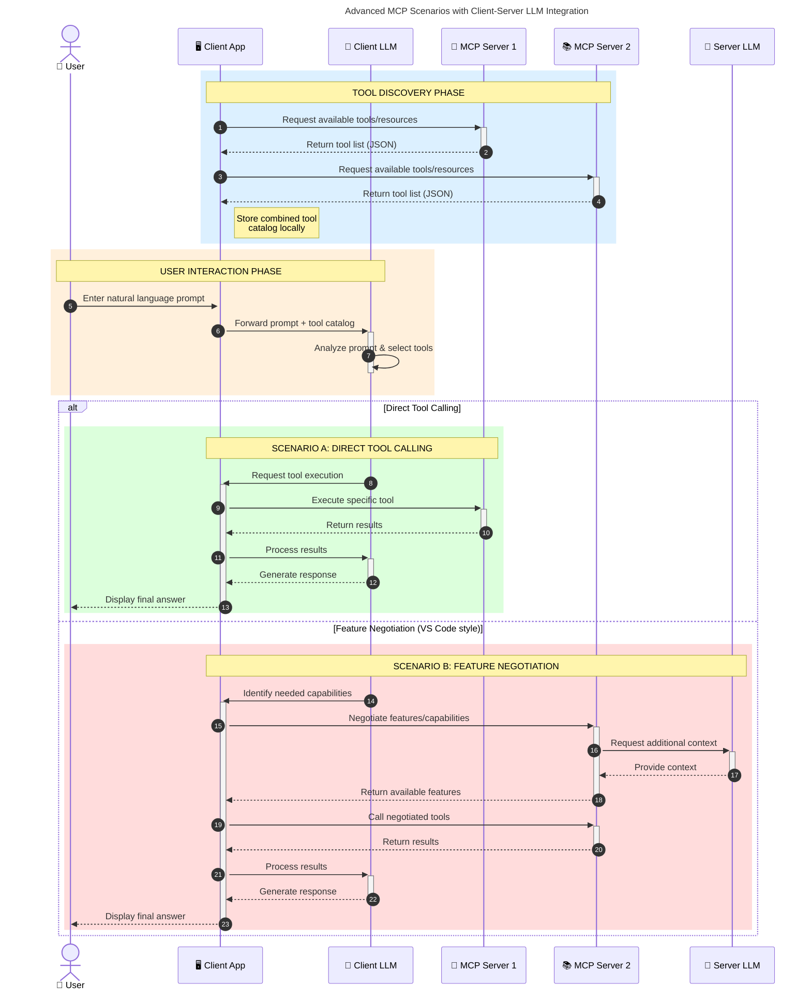

<!--
CO_OP_TRANSLATOR_METADATA:
{
  "original_hash": "0df1ee78a6dd8300f3a040ca5b411c2e",
  "translation_date": "2025-08-18T13:26:43+00:00",
  "source_file": "00-Introduction/README.md",
  "language_code": "ru"
}
-->
# Введение в Протокол Контекста Модели (MCP): Почему это важно для масштабируемых AI-приложений

_(Нажмите на изображение выше, чтобы посмотреть видео этого урока)_

Генеративные AI-приложения — это значительный шаг вперед, так как они часто позволяют пользователям взаимодействовать с приложением с помощью естественного языка. Однако, по мере того как в такие приложения вкладывается больше времени и ресурсов, важно убедиться, что вы можете легко интегрировать функционал и ресурсы таким образом, чтобы их было просто расширять, чтобы ваше приложение могло работать с несколькими моделями и учитывать их особенности. Проще говоря, начать разработку генеративных AI-приложений легко, но по мере их роста и усложнения вам потребуется определить архитектуру и, скорее всего, полагаться на стандарт, чтобы обеспечить их последовательное построение. Именно здесь MCP помогает организовать процесс и предоставляет стандарт.

---

## **🔍 Что такое Протокол Контекста Модели (MCP)?**

**Протокол Контекста Модели (MCP)** — это **открытый стандартизированный интерфейс**, который позволяет большим языковым моделям (LLM) беспрепятственно взаимодействовать с внешними инструментами, API и источниками данных. MCP предоставляет единую архитектуру для расширения функциональности AI-моделей за пределы их обучающих данных, создавая более умные, масштабируемые и отзывчивые AI-системы.

---

## **🎯 Почему стандартизация в AI важна**

По мере усложнения генеративных AI-приложений становится критически важно внедрять стандарты, которые обеспечивают **масштабируемость, расширяемость, поддерживаемость** и **избежание привязки к конкретному поставщику**. MCP решает эти задачи, предоставляя:

- Унификацию интеграции моделей и инструментов
- Устранение хрупких, одноразовых решений
- Возможность сосуществования нескольких моделей от разных поставщиков в одной экосистеме

**Примечание:** Хотя MCP позиционируется как открытый стандарт, в настоящее время нет планов стандартизировать его через существующие организации, такие как IEEE, IETF, W3C, ISO или другие.

---

## **📚 Цели обучения**

К концу этой статьи вы сможете:

- Определить, что такое **Протокол Контекста Модели (MCP)** и его области применения
- Понять, как MCP стандартизирует взаимодействие моделей с инструментами
- Выделить основные компоненты архитектуры MCP
- Изучить реальные примеры использования MCP в корпоративной и разработческой среде

---

## **💡 Почему MCP меняет правила игры**

### **🔗 MCP решает проблему фрагментации в AI-взаимодействиях**

До появления MCP интеграция моделей с инструментами требовала:

- Индивидуального кода для каждой пары инструмент-модель
- Нестандартизированных API для каждого поставщика
- Частых сбоев из-за обновлений
- Плохой масштабируемости при добавлении новых инструментов

### **✅ Преимущества стандартизации MCP**

| **Преимущество**          | **Описание**                                                                   |
|---------------------------|-------------------------------------------------------------------------------|
| Взаимодействие            | LLM беспрепятственно работают с инструментами от разных поставщиков           |
| Последовательность        | Единое поведение на всех платформах и инструментах                            |
| Повторное использование   | Инструменты, созданные один раз, можно использовать в разных проектах и системах |
| Ускоренная разработка     | Сокращение времени разработки благодаря стандартизированным интерфейсам        |

---

## **🧱 Обзор архитектуры MCP на высоком уровне**

MCP следует **модели клиент-сервер**, где:

- **MCP-хосты** запускают AI-модели
- **MCP-клиенты** инициируют запросы
- **MCP-серверы** предоставляют контекст, инструменты и возможности

### **Ключевые компоненты:**

- **Ресурсы** – Статические или динамические данные для моделей  
- **Подсказки** – Предопределенные рабочие процессы для направленного генеративного процесса  
- **Инструменты** – Выполняемые функции, такие как поиск, вычисления  
- **Выборка** – Агентное поведение через рекурсивные взаимодействия  

---

## Как работают MCP-серверы

MCP-серверы функционируют следующим образом:

- **Поток запросов**:
    1. Запрос инициируется конечным пользователем или программой от его имени.
    2. **MCP-клиент** отправляет запрос **MCP-хосту**, который управляет средой выполнения AI-модели.
    3. **AI-модель** получает пользовательскую подсказку и может запросить доступ к внешним инструментам или данным через один или несколько вызовов инструментов.
    4. **MCP-хост**, а не сама модель, взаимодействует с соответствующими **MCP-серверами** с использованием стандартизированного протокола.
- **Функциональность MCP-хоста**:
    - **Реестр инструментов**: Ведет каталог доступных инструментов и их возможностей.
    - **Аутентификация**: Проверяет разрешения на доступ к инструментам.
    - **Обработчик запросов**: Обрабатывает входящие запросы инструментов от модели.
    - **Форматировщик ответов**: Структурирует выходные данные инструментов в формате, понятном модели.
- **Выполнение MCP-сервера**:
    - **MCP-хост** направляет вызовы инструментов на один или несколько **MCP-серверов**, каждый из которых предоставляет специализированные функции (например, поиск, вычисления, запросы к базе данных).
    - **MCP-серверы** выполняют свои операции и возвращают результаты **MCP-хосту** в едином формате.
    - **MCP-хост** форматирует и передает эти результаты **AI-модели**.
- **Завершение ответа**:
    - **AI-модель** включает результаты инструментов в финальный ответ.
    - **MCP-хост** отправляет этот ответ обратно **MCP-клиенту**, который доставляет его конечному пользователю или вызывающему ПО.

## 👨‍💻 Как создать MCP-сервер (с примерами)

MCP-серверы позволяют расширять возможности LLM, предоставляя данные и функционал.

Готовы попробовать? Вот SDK для различных языков и стеков с примерами создания простых MCP-серверов:

- **Python SDK**: https://github.com/modelcontextprotocol/python-sdk

- **TypeScript SDK**: https://github.com/modelcontextprotocol/typescript-sdk

- **Java SDK**: https://github.com/modelcontextprotocol/java-sdk

- **C#/.NET SDK**: https://github.com/modelcontextprotocol/csharp-sdk

---

## 🌍 Реальные примеры использования MCP

MCP открывает широкий спектр приложений, расширяя возможности AI:

| **Приложение**             | **Описание**                                                                   |
|----------------------------|-------------------------------------------------------------------------------|
| Интеграция корпоративных данных | Подключение LLM к базам данных, CRM или внутренним инструментам              |
| Агентные AI-системы        | Создание автономных агентов с доступом к инструментам и рабочими процессами    |
| Мультимодальные приложения | Объединение текста, изображений и аудио в одном AI-приложении                  |
| Интеграция данных в реальном времени | Использование актуальных данных для более точных и современных результатов |

### 🧠 MCP = Универсальный стандарт для AI-взаимодействий

Протокол Контекста Модели (MCP) выступает в роли универсального стандарта для AI-взаимодействий, подобно тому, как USB-C стандартизировал физические соединения для устройств. В мире AI MCP предоставляет единый интерфейс, позволяя моделям (клиентам) беспрепятственно интегрироваться с внешними инструментами и поставщиками данных (серверами). Это устраняет необходимость в разнообразных, индивидуальных протоколах для каждого API или источника данных.

В рамках MCP совместимый инструмент (называемый MCP-сервером) следует единому стандарту. Эти серверы могут перечислять доступные инструменты или действия и выполнять их по запросу AI-агента. Платформы AI-агентов, поддерживающие MCP, способны обнаруживать доступные инструменты на серверах и вызывать их через этот стандартный протокол.

### 💡 Обеспечение доступа к знаниям

Помимо предоставления инструментов, MCP также упрощает доступ к знаниям. Он позволяет приложениям предоставлять контекст большим языковым моделям (LLM), связывая их с различными источниками данных. Например, MCP-сервер может представлять собой репозиторий документов компании, позволяя агентам запрашивать релевантную информацию по мере необходимости. Другой сервер может выполнять конкретные действия, такие как отправка писем или обновление записей. С точки зрения агента, это просто инструменты, которые он может использовать: одни инструменты возвращают данные (контекст знаний), другие выполняют действия. MCP эффективно управляет обоими типами.

Агент, подключающийся к MCP-серверу, автоматически узнает о доступных возможностях и данных сервера через стандартный формат. Эта стандартизация позволяет динамически добавлять инструменты. Например, добавление нового MCP-сервера в систему агента делает его функции сразу доступными без необходимости дополнительной настройки инструкций агента.

Эта упрощенная интеграция соответствует потоку, показанному на следующей диаграмме, где серверы предоставляют как инструменты, так и знания, обеспечивая бесшовное сотрудничество между системами.

### 👉 Пример: Масштабируемое решение для агентов

### 🔄 Расширенные сценарии MCP с интеграцией LLM на стороне клиента

Помимо базовой архитектуры MCP, существуют расширенные сценарии, где как клиент, так и сервер содержат LLM, что позволяет более сложные взаимодействия. На следующей диаграмме **Клиентское приложение** может быть IDE с набором MCP-инструментов, доступных для использования LLM:

---

## 🔐 Практические преимущества MCP

Вот практические преимущества использования MCP:

- **Актуальность**: Модели могут получать доступ к свежей информации за пределами своих обучающих данных
- **Расширение возможностей**: Модели могут использовать специализированные инструменты для задач, на которые они не обучены
- **Снижение галлюцинаций**: Внешние источники данных обеспечивают фактическую основу
- **Конфиденциальность**: Чувствительные данные могут оставаться в защищенных средах, а не встраиваться в подсказки

---

## 📌 Основные выводы

Основные выводы по использованию MCP:

- **MCP** стандартизирует взаимодействие AI-моделей с инструментами и данными
- Способствует **расширяемости, последовательности и совместимости**
- MCP помогает **сократить время разработки, повысить надежность и расширить возможности моделей**
- Архитектура клиент-сервер **обеспечивает гибкие и масштабируемые AI-приложения**

---

## 🧠 Упражнение

Подумайте о AI-приложении, которое вы хотите создать.

- Какие **внешние инструменты или данные** могли бы улучшить его возможности?
- Как MCP может сделать интеграцию **проще и надежнее**?

---

## Дополнительные ресурсы

- [Репозиторий MCP на GitHub](https://github.com/modelcontextprotocol)

---

## Что дальше

Далее: [Глава 1: Основные концепции](../01-CoreConcepts/README.md)

**Отказ от ответственности**:  
Этот документ был переведен с использованием сервиса автоматического перевода [Co-op Translator](https://github.com/Azure/co-op-translator). Хотя мы стремимся к точности, пожалуйста, имейте в виду, что автоматические переводы могут содержать ошибки или неточности. Оригинальный документ на его исходном языке следует считать авторитетным источником. Для получения критически важной информации рекомендуется профессиональный перевод человеком. Мы не несем ответственности за любые недоразумения или неправильные интерпретации, возникшие в результате использования данного перевода.