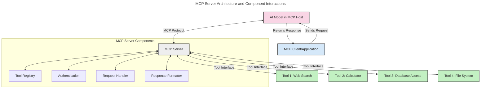
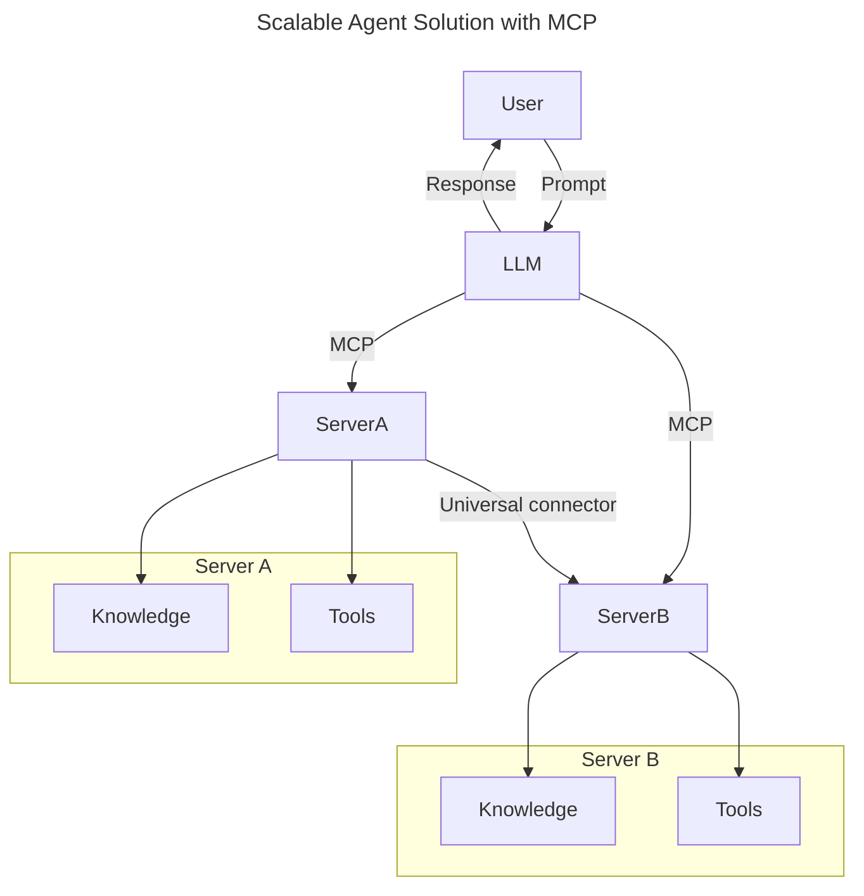
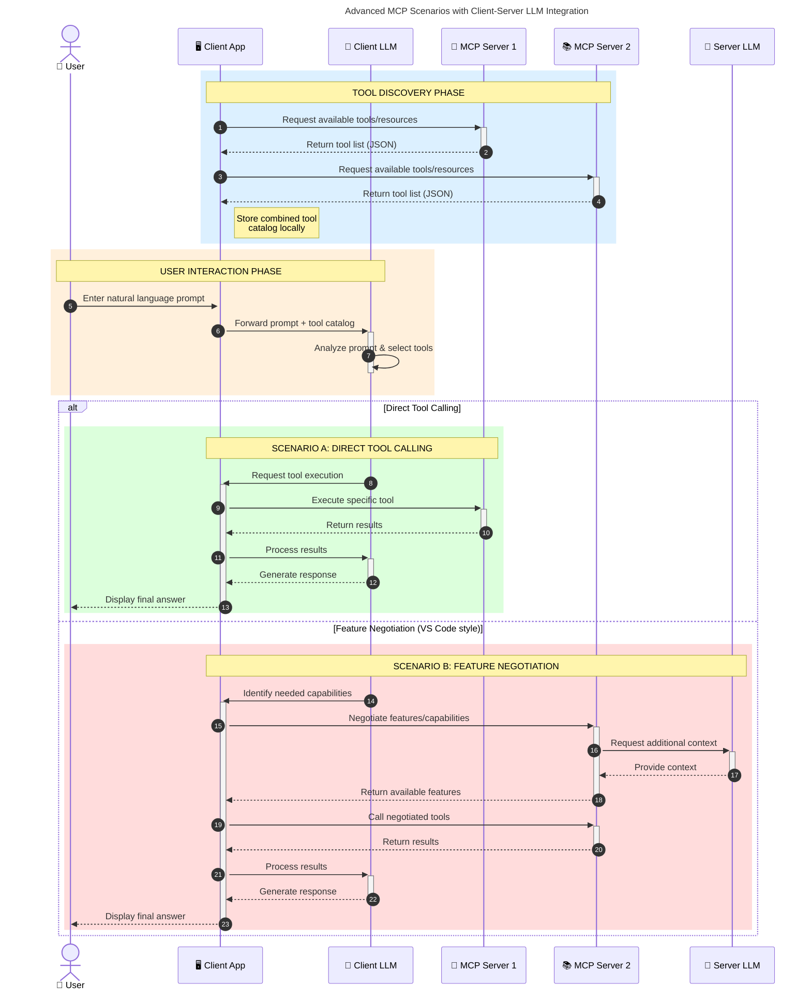

<!--
CO_OP_TRANSLATOR_METADATA:
{
  "original_hash": "105c2ddbb77bc38f7e9df009e1b06e45",
  "translation_date": "2025-07-13T15:25:40+00:00",
  "source_file": "00-Introduction/README.md",
  "language_code": "ru"
}
-->
# Введение в протокол контекста модели (MCP): почему это важно для масштабируемых AI-приложений

Генеративные AI-приложения — это большой шаг вперёд, так как они часто позволяют пользователю взаимодействовать с приложением с помощью естественных языковых запросов. Однако по мере того, как в такие приложения вкладывается больше времени и ресурсов, важно обеспечить лёгкую интеграцию функционала и ресурсов таким образом, чтобы приложение было легко расширять, чтобы оно могло работать с несколькими моделями одновременно и справляться с различными особенностями моделей. Проще говоря, создавать генеративные AI-приложения сначала просто, но по мере их роста и усложнения необходимо определять архитектуру и, скорее всего, опираться на стандарт, чтобы гарантировать единообразие построения приложений. Именно здесь на помощь приходит MCP, который организует процесс и задаёт стандарт.

---

## **🔍 Что такое протокол контекста модели (MCP)?**

**Протокол контекста модели (MCP)** — это **открытый, стандартизированный интерфейс**, который позволяет крупным языковым моделям (LLM) беспрепятственно взаимодействовать с внешними инструментами, API и источниками данных. Он обеспечивает единообразную архитектуру для расширения функционала AI-моделей за пределы их обучающих данных, создавая более умные, масштабируемые и отзывчивые AI-системы.

---

## **🎯 Почему стандартизация в AI важна**

По мере усложнения генеративных AI-приложений становится необходимым внедрение стандартов, которые обеспечивают **масштабируемость, расширяемость** и **удобство поддержки**. MCP решает эти задачи, позволяя:

- Объединить интеграции моделей с инструментами
- Избавиться от хрупких, разовых кастомных решений
- Позволить нескольким моделям сосуществовать в одной экосистеме

---

## **📚 Цели обучения**

К концу этой статьи вы сможете:

- Определить, что такое **протокол контекста модели (MCP)** и где он применяется
- Понять, как MCP стандартизирует коммуникацию между моделью и инструментами
- Выделить ключевые компоненты архитектуры MCP
- Изучить реальные примеры использования MCP в корпоративной и разработческой среде

---

## **💡 Почему протокол контекста модели (MCP) меняет правила игры**

### **🔗 MCP решает проблему фрагментации в AI-взаимодействиях**

До появления MCP интеграция моделей с инструментами требовала:

- Индивидуального кода для каждой пары инструмент-модель
- Нестандартных API от каждого поставщика
- Частых сбоев из-за обновлений
- Плохой масштабируемости при добавлении новых инструментов

### **✅ Преимущества стандартизации MCP**

| **Преимущество**          | **Описание**                                                                   |
|---------------------------|--------------------------------------------------------------------------------|
| Взаимодействие            | LLM беспрепятственно работают с инструментами разных поставщиков              |
| Последовательность        | Единое поведение на разных платформах и инструментах                          |
| Повторное использование   | Инструменты, созданные один раз, можно использовать в разных проектах и системах |
| Ускорение разработки      | Сокращение времени разработки за счёт стандартизированных, готовых к использованию интерфейсов |

---

## **🧱 Обзор архитектуры MCP на высоком уровне**

MCP построен по модели **клиент-сервер**, где:

- **MCP Hosts** запускают AI-модели
- **MCP Clients** инициируют запросы
- **MCP Servers** предоставляют контекст, инструменты и возможности

### **Ключевые компоненты:**

- **Ресурсы** – статические или динамические данные для моделей  
- **Подсказки (Prompts)** – заранее определённые сценарии для направленной генерации  
- **Инструменты** – исполняемые функции, такие как поиск, вычисления  
- **Сэмплинг** – агентное поведение через рекурсивные взаимодействия

---

## Как работают MCP-серверы

MCP-серверы функционируют следующим образом:

- **Поток запросов**:  
    1. MCP Client отправляет запрос AI-модели, запущенной в MCP Host.  
    2. AI-модель определяет, когда ей нужны внешние инструменты или данные.  
    3. Модель взаимодействует с MCP Server через стандартизованный протокол.

- **Функционал MCP Server**:  
    - Реестр инструментов: хранит каталог доступных инструментов и их возможностей.  
    - Аутентификация: проверяет права доступа к инструментам.  
    - Обработчик запросов: обрабатывает входящие запросы на использование инструментов от модели.  
    - Форматировщик ответов: структурирует вывод инструментов в формат, понятный модели.

- **Выполнение инструментов**:  
    - Сервер направляет запросы к соответствующим внешним инструментам  
    - Инструменты выполняют свои специализированные функции (поиск, вычисления, запросы к базам данных и т.д.)  
    - Результаты возвращаются модели в едином формате.

- **Завершение ответа**:  
    - AI-модель интегрирует результаты инструментов в свой ответ.  
    - Итоговый ответ отправляется обратно клиентскому приложению.

## 👨‍💻 Как создать MCP-сервер (с примерами)

MCP-серверы позволяют расширять возможности LLM, предоставляя данные и функционал.

Готовы попробовать? Вот примеры создания простого MCP-сервера на разных языках:

- **Пример на Python**: https://github.com/modelcontextprotocol/python-sdk

- **Пример на TypeScript**: https://github.com/modelcontextprotocol/typescript-sdk

- **Пример на Java**: https://github.com/modelcontextprotocol/java-sdk

- **Пример на C#/.NET**: https://github.com/modelcontextprotocol/csharp-sdk

## 🌍 Реальные сценарии использования MCP

MCP открывает широкий спектр применений, расширяя возможности AI:

| **Применение**             | **Описание**                                                                   |
|----------------------------|--------------------------------------------------------------------------------|
| Интеграция корпоративных данных | Подключение LLM к базам данных, CRM или внутренним инструментам               |
| Агентные AI-системы        | Обеспечение автономных агентов доступом к инструментам и рабочим процессам принятия решений |
| Мультимодальные приложения | Объединение текстовых, графических и аудио-инструментов в одном AI-приложении  |
| Интеграция данных в реальном времени | Внедрение актуальных данных в AI-взаимодействия для более точных и свежих результатов |

### 🧠 MCP = универсальный стандарт для AI-взаимодействий

Протокол контекста модели (MCP) выступает в роли универсального стандарта для AI-взаимодействий, подобно тому, как USB-C стандартизировал физические подключения устройств. В мире AI MCP обеспечивает единый интерфейс, позволяющий моделям (клиентам) беспрепятственно интегрироваться с внешними инструментами и поставщиками данных (серверами). Это устраняет необходимость в разнообразных, индивидуальных протоколах для каждого API или источника данных.

В рамках MCP совместимый инструмент (называемый MCP-сервером) следует единому стандарту. Такие серверы могут перечислять доступные инструменты или действия и выполнять их по запросу AI-агента. Платформы AI-агентов, поддерживающие MCP, способны обнаруживать доступные инструменты на серверах и вызывать их через этот стандартный протокол.

### 💡 Облегчает доступ к знаниям

Помимо предоставления инструментов, MCP облегчает доступ к знаниям. Он позволяет приложениям предоставлять контекст крупным языковым моделям (LLM), связывая их с различными источниками данных. Например, MCP-сервер может представлять собой хранилище документов компании, позволяя агентам получать релевантную информацию по запросу. Другой сервер может выполнять конкретные действия, такие как отправка писем или обновление записей. С точки зрения агента, это просто инструменты — одни возвращают данные (контекст знаний), другие выполняют действия. MCP эффективно управляет обоими типами.

Агент, подключающийся к MCP-серверу, автоматически узнаёт о доступных возможностях и данных сервера через стандартный формат. Такая стандартизация обеспечивает динамическую доступность инструментов. Например, добавление нового MCP-сервера в систему агента сразу же делает его функции доступными без необходимости дополнительной настройки инструкций агента.

Эта упрощённая интеграция соответствует схеме, показанной на диаграмме mermaid, где серверы предоставляют и инструменты, и знания, обеспечивая бесшовное взаимодействие между системами.

### 👉 Пример: масштабируемое агентное решение

### 🔄 Продвинутые сценарии MCP с интеграцией LLM на стороне клиента

Помимо базовой архитектуры MCP, существуют продвинутые сценарии, где и клиент, и сервер содержат LLM, что позволяет реализовать более сложные взаимодействия:

## 🔐 Практические преимущества MCP

Вот основные практические выгоды от использования MCP:

- **Актуальность**: модели получают доступ к свежей информации, выходящей за рамки обучающих данных  
- **Расширение возможностей**: модели могут использовать специализированные инструменты для задач, на которые они не обучены  
- **Снижение галлюцинаций**: внешние источники данных обеспечивают фактическую основу  
- **Конфиденциальность**: чувствительные данные остаются в защищённой среде, а не встраиваются в подсказки

## 📌 Основные выводы

Ключевые моменты использования MCP:

- **MCP** стандартизирует взаимодействие AI-моделей с инструментами и данными  
- Способствует **расширяемости, последовательности и совместимости**  
- MCP помогает **сократить время разработки, повысить надёжность и расширить возможности моделей**  
- Архитектура клиент-сервер **обеспечивает гибкие и расширяемые AI-приложения**

## 🧠 Упражнение

Подумайте о AI-приложении, которое вы хотели бы создать.

- Какие **внешние инструменты или данные** могли бы улучшить его возможности?  
- Как MCP может сделать интеграцию **проще и надёжнее**?

## Дополнительные ресурсы

- [MCP GitHub Repository](https://github.com/modelcontextprotocol)

## Что дальше

Далее: [Глава 1: Основные концепции](../01-CoreConcepts/README.md)

**Отказ от ответственности**:  
Этот документ был переведен с помощью сервиса автоматического перевода [Co-op Translator](https://github.com/Azure/co-op-translator). Несмотря на наши усилия по обеспечению точности, просим учитывать, что автоматический перевод может содержать ошибки или неточности. Оригинальный документ на его исходном языке следует считать авторитетным источником. Для получения критически важной информации рекомендуется обращаться к профессиональному переводу, выполненному человеком. Мы не несем ответственности за любые недоразумения или неправильные толкования, возникшие в результате использования данного перевода.