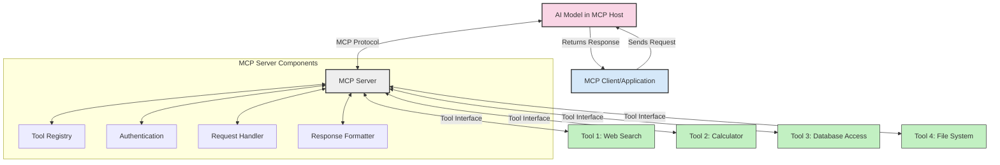
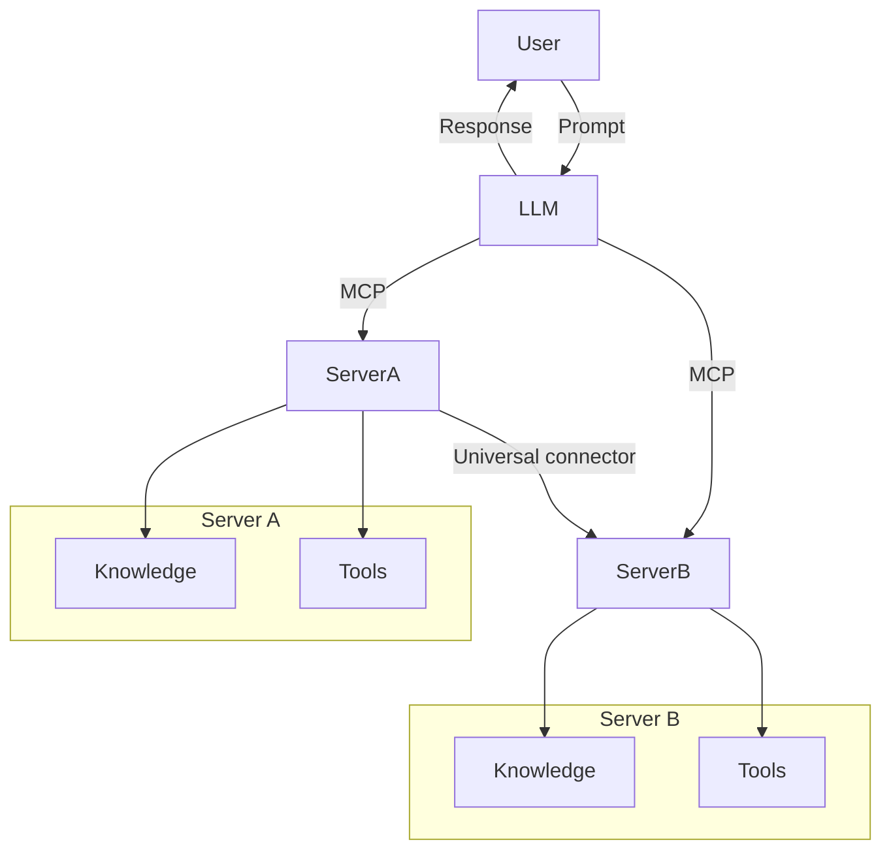

<!--
CO_OP_TRANSLATOR_METADATA:
{
  "original_hash": "cf84f987e1b771d2201408e110dfd2db",
  "translation_date": "2025-05-20T15:42:09+00:00",
  "source_file": "00-Introduction/README.md",
  "language_code": "ru"
}
-->
# Введение в протокол контекста модели (MCP): почему это важно для масштабируемых AI-приложений

Приложения генеративного ИИ — это большой шаг вперёд, так как они часто позволяют пользователю взаимодействовать с приложением с помощью естественных языковых запросов. Однако по мере того, как в такие приложения вкладывается всё больше времени и ресурсов, важно обеспечить лёгкую интеграцию функционала и ресурсов так, чтобы приложение было легко расширять, поддерживало работу с несколькими моделями и учитывало их особенности. Проще говоря, создавать приложения на базе генеративного ИИ сначала легко, но с ростом и усложнением проекта нужно определять архитектуру и, скорее всего, опираться на стандарт, чтобы обеспечить единообразие построения приложений. Именно здесь на помощь приходит MCP, который помогает организовать процесс и задаёт стандарт.

---

## **🔍 Что такое протокол контекста модели (MCP)?**

**Протокол контекста модели (MCP)** — это **открытый стандартизированный интерфейс**, который позволяет большим языковым моделям (LLM) беспрепятственно взаимодействовать с внешними инструментами, API и источниками данных. Он обеспечивает единую архитектуру для расширения функционала ИИ-моделей за пределы их обучающих данных, делая системы умнее, масштабируемее и более отзывчивыми.

---

## **🎯 Почему стандартизация важна в ИИ**

По мере усложнения приложений генеративного ИИ становится необходимым внедрять стандарты, которые обеспечивают **масштабируемость, расширяемость** и **удобство поддержки**. MCP решает эти задачи, позволяя:

- Объединить интеграции моделей с инструментами
- Избавиться от хрупких, разовых кастомных решений
- Поддерживать работу нескольких моделей в одной экосистеме

---

## **📚 Цели обучения**

К концу этой статьи вы сможете:

- Определить, что такое **Model Context Protocol (MCP)** и где он применяется
- Понять, как MCP стандартизирует коммуникацию между моделью и инструментами
- Выделить ключевые компоненты архитектуры MCP
- Ознакомиться с реальными примерами применения MCP в корпоративной среде и разработке

---

## **💡 Почему протокол контекста модели (MCP) меняет правила игры**

### **🔗 MCP решает проблему фрагментации в взаимодействиях ИИ**

До появления MCP интеграция моделей с инструментами требовала:

- Индивидуального кода для каждой пары инструмент-модель
- Несовместимых API от разных поставщиков
- Частых сбоев из-за обновлений
- Плохой масштабируемости при добавлении новых инструментов

### **✅ Преимущества стандартизации MCP**

| **Преимущество**         | **Описание**                                                                  |
|--------------------------|-------------------------------------------------------------------------------|
| Взаимодействие           | LLM беспрепятственно работают с инструментами разных поставщиков             |
| Последовательность       | Единое поведение на всех платформах и инструментах                           |
| Повторное использование  | Инструменты создаются один раз и могут использоваться в разных проектах       |
| Ускорение разработки     | Сокращение времени разработки за счёт стандартизированных, готовых интерфейсов|

---

## **🧱 Обзор архитектуры MCP на высоком уровне**

MCP построен по модели **клиент-сервер**, где:

- **MCP Hosts** запускают AI-модели
- **MCP Clients** инициируют запросы
- **MCP Servers** предоставляют контекст, инструменты и возможности

### **Ключевые компоненты:**

- **Resources** — статичные или динамичные данные для моделей  
- **Prompts** — предопределённые сценарии для управляемой генерации  
- **Tools** — выполняемые функции, такие как поиск, вычисления  
- **Sampling** — агентное поведение через рекурсивные взаимодействия

---

## Как работают MCP-серверы

MCP-серверы функционируют следующим образом:

- **Поток запросов**:  
    1. MCP Client отправляет запрос AI-модели, работающей на MCP Host.  
    2. Модель определяет, когда ей нужны внешние инструменты или данные.  
    3. Модель общается с MCP Server через стандартизованный протокол.

- **Функционал MCP Server**:  
    - Реестр инструментов: ведёт каталог доступных инструментов и их возможностей.  
    - Аутентификация: проверяет права доступа к инструментам.  
    - Обработчик запросов: обрабатывает входящие запросы инструментов от модели.  
    - Форматировщик ответов: структурирует вывод инструментов в формате, понятном модели.

- **Выполнение инструментов**:  
    - Сервер направляет запросы к соответствующим внешним инструментам  
    - Инструменты выполняют специализированные функции (поиск, вычисления, запросы к базе данных и т.д.)  
    - Результаты возвращаются модели в едином формате.

- **Завершение ответа**:  
    - AI-модель включает результаты работы инструментов в свой ответ.  
    - Итоговый ответ отправляется обратно клиентскому приложению.

## 👨‍💻 Как создать MCP-сервер (с примерами)

MCP-серверы позволяют расширять возможности LLM, предоставляя данные и функционал.

Хотите попробовать? Вот примеры создания простого MCP-сервера на разных языках:

- **Пример на Python**: https://github.com/modelcontextprotocol/python-sdk

- **Пример на TypeScript**: https://github.com/modelcontextprotocol/typescript-sdk

- **Пример на Java**: https://github.com/modelcontextprotocol/java-sdk

- **Пример на C#/.NET**: https://github.com/modelcontextprotocol/csharp-sdk

## 🌍 Реальные сценарии использования MCP

MCP расширяет возможности ИИ в самых разных приложениях:

| **Применение**               | **Описание**                                                               |
|-----------------------------|----------------------------------------------------------------------------|
| Интеграция корпоративных данных | Подключение LLM к базам данных, CRM или внутренним инструментам           |
| Агентные ИИ-системы          | Обеспечение автономных агентов доступом к инструментам и рабочим процессам принятия решений |
| Мультимодальные приложения   | Объединение текстовых, графических и аудиотулов в одном AI-приложении      |
| Интеграция данных в реальном времени | Включение живых данных в взаимодействие с ИИ для более точных и актуальных результатов |

### 🧠 MCP = универсальный стандарт для взаимодействия ИИ

Протокол контекста модели (MCP) выступает как универсальный стандарт взаимодействия ИИ, подобно тому, как USB-C стандартизировал физические подключения устройств. В мире ИИ MCP предоставляет единый интерфейс, позволяющий моделям (клиентам) легко интегрироваться с внешними инструментами и поставщиками данных (серверами). Это устраняет необходимость в разнообразных, индивидуальных протоколах для каждого API или источника данных.

В рамках MCP совместимый инструмент (называемый MCP-сервером) следует единому стандарту. Такие серверы могут перечислять доступные инструменты или действия и выполнять их по запросу ИИ-агента. Платформы ИИ-агентов, поддерживающие MCP, способны обнаруживать доступные инструменты на серверах и вызывать их через этот стандартный протокол.

### 💡 Облегчает доступ к знаниям

Помимо предоставления инструментов, MCP также упрощает доступ к знаниям. Он позволяет приложениям предоставлять контекст большим языковым моделям (LLM), связывая их с различными источниками данных. Например, MCP-сервер может представлять собой корпоративное хранилище документов, позволяя агентам запрашивать релевантную информацию по требованию. Другой сервер может выполнять конкретные действия, например, отправку писем или обновление записей. С точки зрения агента, это просто инструменты — одни возвращают данные (контекст знаний), другие выполняют действия. MCP эффективно управляет обоими типами.

Агент, подключаясь к MCP-серверу, автоматически узнаёт о доступных возможностях и данных сервера через стандартный формат. Такая стандартизация позволяет динамически добавлять инструменты. Например, подключение нового MCP-сервера к системе агента сразу же делает его функции доступными без дополнительной настройки инструкций агента.

Эта упрощённая интеграция соответствует потоку, показанному на диаграмме mermaid, где серверы предоставляют как инструменты, так и знания, обеспечивая бесшовное взаимодействие между системами.

### 👉 Пример: масштабируемое агентное решение

## 🔐 Практические преимущества MCP

Вот основные практические выгоды от использования MCP:

- **Актуальность**: модели получают доступ к свежей информации, выходящей за пределы обучающих данных  
- **Расширение возможностей**: модели могут использовать специализированные инструменты для задач, на которых они не обучались  
- **Снижение галлюцинаций**: внешние источники данных обеспечивают фактологическую основу  
- **Конфиденциальность**: чувствительные данные остаются в защищённой среде, а не встраиваются в запросы

## 📌 Основные выводы

Ключевые моменты по использованию MCP:

- **MCP** стандартизирует взаимодействие ИИ-моделей с инструментами и данными  
- Способствует **расширяемости, последовательности и совместимости**  
- MCP помогает **сократить время разработки, повысить надёжность и расширить возможности моделей**  
- Архитектура клиент-сервер **позволяет создавать гибкие и масштабируемые AI-приложения**

## 🧠 Задание

Подумайте о AI-приложении, которое вы хотели бы создать.

- Какие **внешние инструменты или данные** могли бы расширить его возможности?  
- Как MCP мог бы сделать интеграцию **проще и надёжнее**?

## Дополнительные ресурсы

- [MCP GitHub Repository](https://github.com/modelcontextprotocol)

## Что дальше

Далее: [Глава 1: Основные концепции](/01-CoreConcepts/README.md)

**Отказ от ответственности**:  
Этот документ был переведен с помощью сервиса автоматического перевода [Co-op Translator](https://github.com/Azure/co-op-translator). Несмотря на наши усилия по обеспечению точности, просим учитывать, что автоматический перевод может содержать ошибки или неточности. Оригинальный документ на его исходном языке следует считать авторитетным источником. Для критически важной информации рекомендуется использовать профессиональный человеческий перевод. Мы не несем ответственности за любые недоразумения или неправильные толкования, возникшие в результате использования данного перевода.