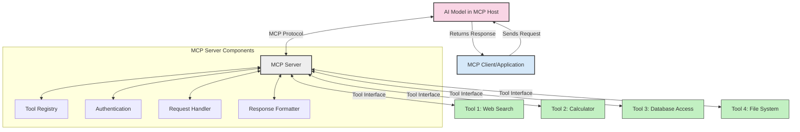
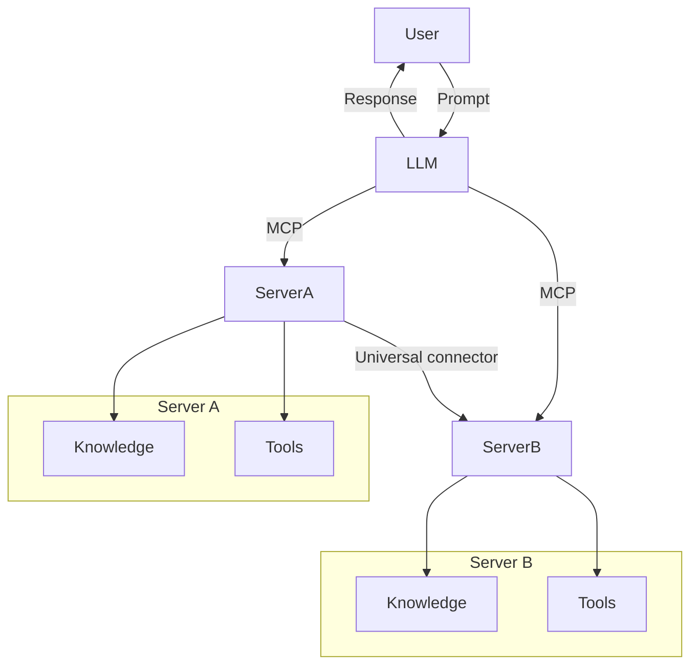

<!--
CO_OP_TRANSLATOR_METADATA:
{
  "original_hash": "02301140adbd807ecf0f17720fa307bc",
  "translation_date": "2025-05-17T05:52:58+00:00",
  "source_file": "00-Introduction/README.md",
  "language_code": "ru"
}
-->
# Введение в Протокол Контекста Модели (MCP): Почему это важно для масштабируемых AI приложений

Генеративные AI приложения - это значительный шаг вперед, поскольку они часто позволяют пользователю взаимодействовать с приложением, используя команды на естественном языке. Однако, по мере вложения большего количества времени и ресурсов в такие приложения, вы хотите быть уверены, что сможете легко интегрировать функциональность и ресурсы таким образом, чтобы это было легко расширять, чтобы ваше приложение могло поддерживать более одного используемого модели и его сложные особенности. Короче говоря, создание Gen AI приложений легко начать, но по мере их роста и усложнения вам нужно начать определять архитектуру и, скорее всего, опираться на стандарт, чтобы ваши приложения строились согласованным образом. Здесь MCP вступает в игру, чтобы организовать вещи и предоставить стандарт.

---

## **🔍 Что такое Протокол Контекста Модели (MCP)?**

**Протокол Контекста Модели (MCP)** - это **открытый, стандартизированный интерфейс**, который позволяет Большим Языковым Моделям (LLM) беспрепятственно взаимодействовать с внешними инструментами, API и источниками данных. Он обеспечивает согласованную архитектуру для улучшения функциональности AI моделей за пределами их обучающих данных, позволяя создавать более умные, масштабируемые и отзывчивые AI системы.

---

## **🎯 Почему стандартизация в AI важна**

По мере усложнения генеративных AI приложений важно принимать стандарты, которые обеспечивают **масштабируемость, расширяемость** и **поддерживаемость**. MCP решает эти задачи путем:

- Объединения интеграции моделей и инструментов
- Снижения хрупкости и уникальных решений
- Позволяет нескольким моделям сосуществовать в одной экосистеме

---

## **📚 Цели обучения**

К концу этой статьи вы сможете:

- Определить **Протокол Контекста Модели (MCP)** и его случаи использования
- Понять, как MCP стандартизирует коммуникацию между моделью и инструментами
- Определить основные компоненты архитектуры MCP
- Исследовать реальные приложения MCP в корпоративных и разработческих контекстах

---

## **💡 Почему Протокол Контекста Модели (MCP) является революционным**

### **🔗 MCP решает проблему фрагментации в AI взаимодействиях**

До MCP интеграция моделей с инструментами требовала:

- Индивидуального кода для каждой пары инструмент-модель
- Нестандартных API для каждого поставщика
- Частых сбоев из-за обновлений
- Плохой масштабируемости с большим количеством инструментов

### **✅ Преимущества стандартизации MCP**

| **Преимущество**           | **Описание**                                                                 |
|----------------------------|-----------------------------------------------------------------------------|
| Взаимодействие             | LLM беспрепятственно работают с инструментами от разных поставщиков         |
| Согласованность            | Единое поведение на всех платформах и инструментах                          |
| Повторное использование    | Инструменты, созданные один раз, могут использоваться в разных проектах     |
| Ускоренное развитие        | Сокращение времени разработки благодаря стандартизированным интерфейсам     |

---

## **🧱 Обзор архитектуры MCP на высоком уровне**

MCP следует модели **клиент-сервер**, где:

- **MCP Хосты** запускают AI модели
- **MCP Клиенты** инициируют запросы
- **MCP Серверы** предоставляют контекст, инструменты и возможности

### **Ключевые компоненты:**

- **Ресурсы** – Статические или динамические данные для моделей  
- **Команды** – Предопределенные рабочие процессы для направленного создания  
- **Инструменты** – Исполнимые функции, такие как поиск, вычисления  
- **Выборка** – Агентское поведение через рекурсивные взаимодействия

---

## Как работают MCP Серверы

MCP серверы функционируют следующим образом:

- **Поток запросов**: 
    1. MCP Клиент отправляет запрос AI Модели, работающей на MCP Хосте.
    2. AI Модель определяет, когда ей нужны внешние инструменты или данные.
    3. Модель взаимодействует с MCP Сервером, используя стандартизированный протокол.

- **Функциональность MCP Серверов**:
    - Реестр инструментов: Поддерживает каталог доступных инструментов и их возможностей.
    - Аутентификация: Проверяет разрешения на доступ к инструментам.
    - Обработчик запросов: Обрабатывает входящие запросы на инструменты от модели.
    - Форматировщик ответов: Структурирует вывод инструментов в формате, понятном модели.

- **Исполнение инструментов**: 
    - Сервер перенаправляет запросы к соответствующим внешним инструментам
    - Инструменты выполняют свои специализированные функции (поиск, вычисление, запросы к базе данных и т.д.)
    - Результаты возвращаются модели в согласованном формате.

- **Завершение ответа**: 
    - AI модель включает выводы инструментов в свой ответ.
    - Финальный ответ отправляется обратно клиентскому приложению.

## 👨‍💻 Как создать MCP Сервер (с примерами)

MCP серверы позволяют расширять возможности LLM, предоставляя данные и функциональность. 

Готовы попробовать? Вот примеры создания простого MCP сервера на разных языках:

- **Пример на Python**: https://github.com/modelcontextprotocol/python-sdk

- **Пример на TypeScript**: https://github.com/modelcontextprotocol/typescript-sdk

- **Пример на Java**: https://github.com/modelcontextprotocol/java-sdk

- **Пример на C#/.NET**: https://github.com/modelcontextprotocol/csharp-sdk

## 🌍 Реальные случаи использования MCP

MCP позволяет реализовать широкий спектр приложений, расширяя возможности AI:

| **Приложение**                  | **Описание**                                                                  |
|---------------------------------|-------------------------------------------------------------------------------|
| Интеграция корпоративных данных | Подключение LLM к базам данных, CRM или внутренним инструментам               |
| Агентские AI системы            | Включение автономных агентов с доступом к инструментам и рабочими процессами принятия решений |
| Мультимодальные приложения      | Объединение текстовых, визуальных и аудио инструментов в одном AI приложении   |
| Интеграция данных в реальном времени | Включение актуальных данных в AI взаимодействия для более точных результатов |

### 🧠 MCP = Универсальный стандарт для AI взаимодействий

Протокол Контекста Модели (MCP) действует как универсальный стандарт для AI взаимодействий, подобно тому, как USB-C стандартизировал физические подключения для устройств. В мире AI MCP предоставляет согласованный интерфейс, позволяющий моделям (клиентам) беспрепятственно интегрироваться с внешними инструментами и поставщиками данных (серверами). Это устраняет необходимость в разнообразных, индивидуальных протоколах для каждого API или источника данных.

Под MCP, совместимый с MCP инструмент (называемый MCP сервером) следует единому стандарту. Эти серверы могут перечислять инструменты или действия, которые они предлагают, и выполнять эти действия по запросу AI агента. Платформы AI агентов, поддерживающие MCP, способны обнаруживать доступные инструменты от серверов и вызывать их через этот стандартный протокол.

### 💡 Обеспечивает доступ к знаниям

Помимо предоставления инструментов, MCP также облегчает доступ к знаниям. Он позволяет приложениям предоставлять контекст большим языковым моделям (LLM), связывая их с различными источниками данных. Например, MCP сервер может представлять собой хранилище документов компании, позволяя агентам запрашивать релевантную информацию по запросу. Другой сервер может обрабатывать конкретные действия, такие как отправка писем или обновление записей. С точки зрения агента, это просто инструменты, которые он может использовать — некоторые инструменты возвращают данные (контекст знаний), в то время как другие выполняют действия. MCP эффективно управляет обоими.

Агент, подключающийся к MCP серверу, автоматически узнает доступные возможности и данные сервера через стандартный формат. Эта стандартизация позволяет динамическую доступность инструментов. Например, добавление нового MCP сервера в систему агента делает его функции сразу доступными без необходимости дальнейшей настройки инструкций агента.

Эта упрощенная интеграция соответствует потоку, изображенному в диаграмме mermaid, где серверы предоставляют как инструменты, так и знания, обеспечивая бесперебойное сотрудничество между системами. 

### 👉 Пример: Масштабируемое решение для агентов

## 🔐 Практические преимущества MCP

Вот некоторые практические преимущества использования MCP:

- **Актуальность**: Модели могут получать актуальную информацию за пределами своих обучающих данных
- **Расширение возможностей**: Модели могут использовать специализированные инструменты для задач, для которых они не обучены
- **Снижение галлюцинаций**: Внешние источники данных обеспечивают фактическую основу
- **Конфиденциальность**: Чувствительные данные могут оставаться в защищенных средах вместо того, чтобы быть встроенными в команды

## 📌 Основные выводы

Следующие основные выводы для использования MCP:

- **MCP** стандартизирует, как AI модели взаимодействуют с инструментами и данными
- Способствует **расширяемости, согласованности и взаимодействию**
- MCP помогает **сократить время разработки, повысить надежность и расширить возможности моделей**
- Архитектура клиент-сервер **позволяет создавать гибкие, расширяемые AI приложения**

## 🧠 Упражнение

Подумайте о AI приложении, которое вы хотите создать.

- Какие **внешние инструменты или данные** могли бы улучшить его возможности?
- Как MCP может сделать интеграцию **проще и надежнее?**

## Дополнительные ресурсы

- [Репозиторий MCP на GitHub](https://github.com/modelcontextprotocol)

## Что дальше

Далее: [Глава 1: Основные концепции](/01-CoreConcepts/README.md)

**Отказ от ответственности**:
Этот документ был переведен с помощью сервиса автоматического перевода [Co-op Translator](https://github.com/Azure/co-op-translator). Хотя мы стремимся к точности, пожалуйста, учитывайте, что автоматические переводы могут содержать ошибки или неточности. Оригинальный документ на его родном языке должен считаться авторитетным источником. Для критической информации рекомендуется профессиональный перевод человеком. Мы не несем ответственности за любые недопонимания или неверные интерпретации, возникающие в результате использования этого перевода.