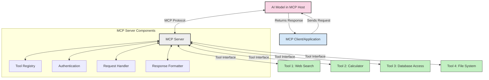
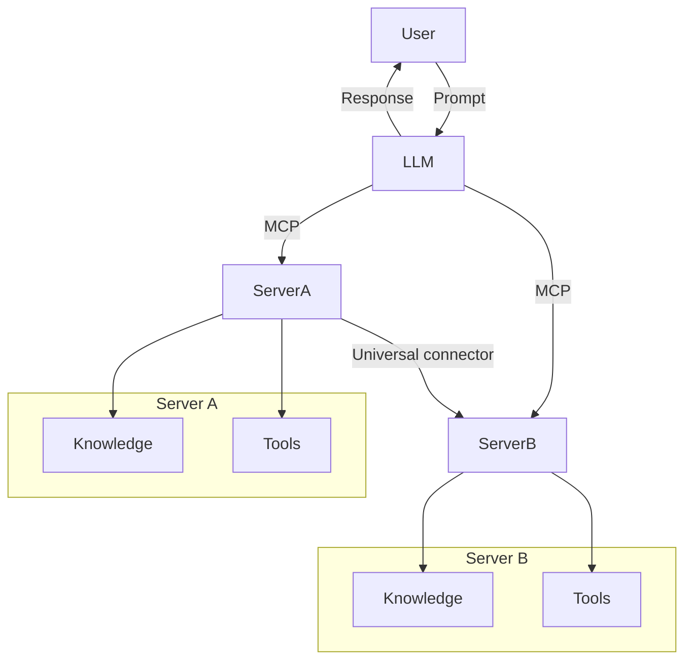

<!--
CO_OP_TRANSLATOR_METADATA:
{
  "original_hash": "1d88dee994dcbb3fa52c271d0c0817b5",
  "translation_date": "2025-05-20T20:15:56+00:00",
  "source_file": "00-Introduction/README.md",
  "language_code": "ru"
}
-->
# Введение в протокол контекста модели (MCP): почему это важно для масштабируемых AI-приложений

Генеративные AI-приложения — это большой шаг вперёд, поскольку они часто позволяют пользователю взаимодействовать с приложением с помощью естественных языковых запросов. Однако по мере увеличения времени и ресурсов, вложенных в такие приложения, важно обеспечить лёгкую интеграцию функционала и ресурсов так, чтобы приложение было легко расширять, чтобы оно могло работать с несколькими моделями и учитывать различные особенности моделей. Проще говоря, создавать генеративные AI-приложения сначала просто, но по мере роста и усложнения нужно начинать определять архитектуру и, скорее всего, опираться на стандарт, чтобы приложения строились единообразно. Здесь на помощь приходит MCP — он организует процесс и задаёт стандарт.

---

## **🔍 Что такое протокол контекста модели (MCP)?**

**Протокол контекста модели (MCP)** — это **открытый, стандартизированный интерфейс**, который позволяет крупным языковым моделям (LLM) беспрепятственно взаимодействовать с внешними инструментами, API и источниками данных. Он обеспечивает единую архитектуру для расширения функционала AI-моделей за пределы их обучающих данных, создавая более умные, масштабируемые и отзывчивые AI-системы.

---

## **🎯 Почему стандартизация в AI важна**

По мере усложнения генеративных AI-приложений становится необходимым внедрять стандарты, которые обеспечивают **масштабируемость, расширяемость** и **поддерживаемость**. MCP решает эти задачи, благодаря:

- Унификации интеграции моделей с инструментами  
- Снижению количества хрупких, разовых решений  
- Возможности одновременного использования нескольких моделей в одной экосистеме

---

## **📚 Цели обучения**

К концу этой статьи вы сможете:

- Определить, что такое **Model Context Protocol (MCP)** и где он применяется  
- Понять, как MCP стандартизирует взаимодействие модели с инструментами  
- Выделить основные компоненты архитектуры MCP  
- Ознакомиться с реальными примерами использования MCP в корпоративной и разработческой среде

---

## **💡 Почему протокол контекста модели (MCP) меняет правила игры**

### **🔗 MCP решает проблему фрагментации в AI-взаимодействиях**

До появления MCP интеграция моделей с инструментами требовала:

- Кастомного кода для каждой пары инструмент-модель  
- Несовместимых API от разных поставщиков  
- Частых сбоев из-за обновлений  
- Плохой масштабируемости при добавлении новых инструментов

### **✅ Преимущества стандартизации MCP**

| **Преимущество**           | **Описание**                                                                 |
|----------------------------|-------------------------------------------------------------------------------|
| Взаимодействие (Interoperability) | LLM бесшовно работают с инструментами от разных поставщиков               |
| Последовательность (Consistency)   | Единое поведение на разных платформах и инструментах                       |
| Повторное использование (Reusability) | Инструменты, созданные один раз, можно применять в разных проектах и системах |
| Ускорение разработки (Accelerated Development) | Сокращение времени разработки благодаря стандартизированным, plug-and-play интерфейсам |

---

## **🧱 Общая архитектура MCP**

MCP построен по модели **клиент-сервер**, где:

- **MCP Hosts** запускают AI-модели  
- **MCP Clients** отправляют запросы  
- **MCP Servers** предоставляют контекст, инструменты и возможности  

### **Ключевые компоненты:**

- **Resources** – статичные или динамичные данные для моделей  
- **Prompts** – заранее определённые сценарии для направленной генерации  
- **Tools** – исполняемые функции, например поиск, вычисления  
- **Sampling** – агентное поведение через рекурсивное взаимодействие

---

## Как работают MCP-серверы

MCP-серверы функционируют следующим образом:

- **Поток запросов**:  
    1. MCP Client отправляет запрос AI-модели, запущенной на MCP Host.  
    2. AI-модель определяет, когда ей нужны внешние инструменты или данные.  
    3. Модель взаимодействует с MCP Server через стандартизованный протокол.

- **Функциональность MCP Server**:  
    - Реестр инструментов: ведёт каталог доступных инструментов и их возможностей.  
    - Аутентификация: проверяет права доступа к инструментам.  
    - Обработчик запросов: обрабатывает входящие запросы на инструменты от модели.  
    - Форматировщик ответов: структурирует результаты инструментов в формате, понятном модели.

- **Выполнение инструментов**:  
    - Сервер направляет запросы к соответствующим внешним инструментам.  
    - Инструменты выполняют свои специализированные функции (поиск, вычисления, запросы к базе данных и т.д.).  
    - Результаты возвращаются модели в едином формате.

- **Завершение ответа**:  
    - AI-модель интегрирует результаты инструментов в свой ответ.  
    - Итоговый ответ отправляется обратно клиентскому приложению.

## 👨‍💻 Как создать MCP-сервер (с примерами)

MCP-серверы позволяют расширять возможности LLM, предоставляя данные и функционал.

Хотите попробовать? Вот примеры создания простого MCP-сервера на разных языках:

- **Пример на Python**: https://github.com/modelcontextprotocol/python-sdk

- **Пример на TypeScript**: https://github.com/modelcontextprotocol/typescript-sdk

- **Пример на Java**: https://github.com/modelcontextprotocol/java-sdk

- **Пример на C#/.NET**: https://github.com/modelcontextprotocol/csharp-sdk

## 🌍 Примеры использования MCP в реальном мире

MCP расширяет возможности AI в различных сферах:

| **Применение**               | **Описание**                                                                 |
|-----------------------------|-------------------------------------------------------------------------------|
| Интеграция корпоративных данных | Подключение LLM к базам данных, CRM или внутренним инструментам              |
| Агентные AI-системы           | Обеспечение автономных агентов с доступом к инструментам и рабочими процессами принятия решений |
| Мультимодальные приложения    | Совмещение текстовых, графических и аудио инструментов в едином AI-приложении |
| Интеграция данных в реальном времени | Внедрение актуальных данных в AI-взаимодействия для более точных и свежих ответов |

### 🧠 MCP = универсальный стандарт для AI-взаимодействий

Протокол контекста модели (MCP) выступает универсальным стандартом для AI-взаимодействий, подобно тому, как USB-C стандартизировал физические подключения устройств. В мире AI MCP обеспечивает единый интерфейс, позволяя моделям (клиентам) беспрепятственно интегрироваться с внешними инструментами и поставщиками данных (серверами). Это исключает необходимость создавать разные, уникальные протоколы для каждого API или источника данных.

В рамках MCP совместимый инструмент (MCP-сервер) следует единому стандарту. Такие серверы могут публиковать список доступных инструментов или действий и выполнять их по запросу AI-агента. Платформы AI-агентов, поддерживающие MCP, способны обнаруживать доступные инструменты на серверах и вызывать их через этот стандартный протокол.

### 💡 Облегчает доступ к знаниям

Помимо предоставления инструментов, MCP также облегчает доступ к знаниям. Он позволяет приложениям предоставлять контекст крупным языковым моделям (LLM), связывая их с различными источниками данных. Например, MCP-сервер может представлять собой хранилище документов компании, позволяя агентам запрашивать релевантную информацию по требованию. Другой сервер может обрабатывать конкретные действия, такие как отправка писем или обновление записей. Для агента это просто инструменты — одни возвращают данные (контекст знаний), другие выполняют действия. MCP эффективно управляет обоими типами.

Агент, подключающийся к MCP-серверу, автоматически узнаёт о доступных возможностях и данных сервера через стандартный формат. Такая стандартизация позволяет динамически расширять набор доступных инструментов. Например, добавление нового MCP-сервера в систему агента сразу делает его функции доступными без дополнительной настройки инструкций агента.

Эта упрощённая интеграция соответствует процессу, изображённому на диаграмме mermaid, где серверы предоставляют и инструменты, и знания, обеспечивая бесшовное взаимодействие между системами.

### 👉 Пример: масштабируемое агентское решение

## 🔐 Практические преимущества MCP

Вот основные преимущества использования MCP:

- **Актуальность**: модели получают доступ к свежей информации вне рамок обучающих данных  
- **Расширение возможностей**: модели могут использовать специализированные инструменты для задач, на которые они не обучались  
- **Снижение галлюцинаций**: внешние источники данных обеспечивают фактическую точность  
- **Конфиденциальность**: чувствительные данные остаются в защищённой среде, а не встраиваются в подсказки

## 📌 Основные выводы

Ключевые выводы по использованию MCP:

- **MCP** стандартизирует взаимодействие AI-моделей с инструментами и данными  
- Способствует **расширяемости, последовательности и совместимости**  
- MCP помогает **сократить время разработки, повысить надёжность и расширить возможности моделей**  
- Архитектура клиент-сервер **обеспечивает гибкие, масштабируемые AI-приложения**

## 🧠 Задание

Подумайте о AI-приложении, которое вы хотите создать.

- Какие **внешние инструменты или данные** могли бы улучшить его возможности?  
- Как MCP может сделать интеграцию **проще и надёжнее**?

## Дополнительные ресурсы

- [MCP GitHub Repository](https://github.com/modelcontextprotocol)

## Что дальше

Далее: [Глава 1: Основные понятия](/01-CoreConcepts/README.md)

**Отказ от ответственности**:  
Этот документ был переведен с помощью сервиса автоматического перевода [Co-op Translator](https://github.com/Azure/co-op-translator). Несмотря на наши усилия обеспечить точность, пожалуйста, имейте в виду, что автоматические переводы могут содержать ошибки или неточности. Оригинальный документ на исходном языке следует считать авторитетным источником. Для критически важной информации рекомендуется использовать профессиональный перевод, выполненный человеком. Мы не несем ответственности за любые недоразумения или неправильные толкования, возникшие в результате использования данного перевода.