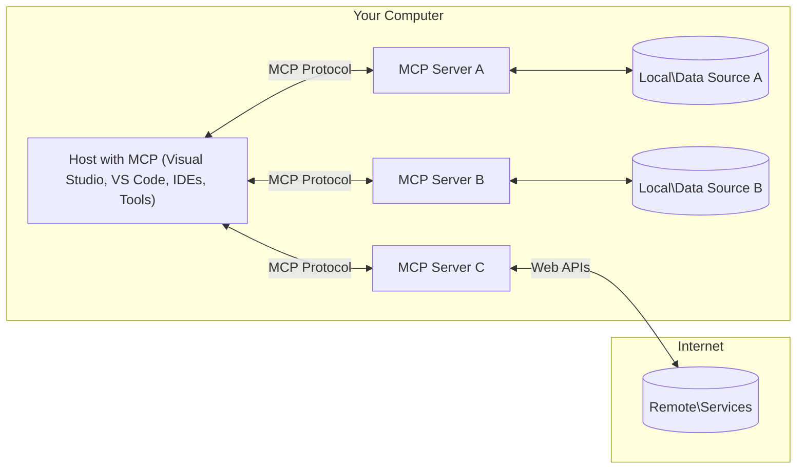

<!--
CO_OP_TRANSLATOR_METADATA:
{
  "original_hash": "904b59de1de9264801242d90a42cdd9d",
  "translation_date": "2025-09-05T10:17:54+00:00",
  "source_file": "01-CoreConcepts/README.md",
  "language_code": "ru"
}
-->
# Основные концепции MCP: освоение протокола контекста модели для интеграции ИИ

[](https://youtu.be/earDzWGtE84)

_(Нажмите на изображение выше, чтобы посмотреть видео урока)_

[Model Context Protocol (MCP)](https://github.com/modelcontextprotocol) — это мощная стандартизированная структура, оптимизирующая взаимодействие между крупными языковыми моделями (LLMs) и внешними инструментами, приложениями и источниками данных. 
Этот гид познакомит вас с основными концепциями MCP. Вы узнаете о его архитектуре клиент-сервер, ключевых компонентах, механике взаимодействия и лучших практиках реализации.

- **Явное согласие пользователя**: Все операции и доступ к данным требуют явного одобрения пользователя перед выполнением. Пользователь должен четко понимать, какие данные будут доступны и какие действия будут выполнены, с возможностью детального управления разрешениями и авторизациями.

- **Защита конфиденциальности данных**: Данные пользователя раскрываются только с явного согласия и должны быть защищены надежными механизмами контроля доступа на протяжении всего жизненного цикла взаимодействия. Реализация должна предотвращать несанкционированную передачу данных и поддерживать строгие границы конфиденциальности.

- **Безопасность выполнения инструментов**: Каждый вызов инструмента требует явного согласия пользователя с четким пониманием функциональности инструмента, параметров и возможного воздействия. Надежные границы безопасности должны предотвращать непреднамеренное, небезопасное или вредоносное выполнение инструментов.

- **Безопасность транспортного уровня**: Все каналы связи должны использовать соответствующие механизмы шифрования и аутентификации. Удаленные соединения должны реализовывать безопасные транспортные протоколы и надлежащее управление учетными данными.

#### Рекомендации по реализации:

- **Управление разрешениями**: Реализуйте системы тонкого управления разрешениями, позволяющие пользователям контролировать доступ к серверам, инструментам и ресурсам.
- **Аутентификация и авторизация**: Используйте безопасные методы аутентификации (OAuth, API-ключи) с надлежащим управлением токенами и сроками их действия.  
- **Валидация ввода**: Проверяйте все параметры и входные данные в соответствии с определенными схемами, чтобы предотвратить атаки внедрения.
- **Журналирование аудита**: Ведите подробные журналы всех операций для мониторинга безопасности и соблюдения требований.

## Обзор

Этот урок исследует фундаментальную архитектуру и компоненты, составляющие экосистему Model Context Protocol (MCP). Вы узнаете о клиент-серверной архитектуре, ключевых компонентах и механизмах взаимодействия, которые обеспечивают работу MCP.

## Основные цели обучения

К концу этого урока вы:

- Поймете архитектуру клиент-сервер MCP.
- Определите роли и обязанности хостов, клиентов и серверов.
- Проанализируете ключевые особенности, которые делают MCP гибким слоем интеграции.
- Узнаете, как информация перемещается внутри экосистемы MCP.
- Получите практические знания через примеры кода на .NET, Java, Python и JavaScript.

## Архитектура MCP: углубленный взгляд

Экосистема MCP построена на модели клиент-сервер. Эта модульная структура позволяет приложениям ИИ эффективно взаимодействовать с инструментами, базами данных, API и контекстными ресурсами. Давайте разберем эту архитектуру на основные компоненты.

В основе MCP лежит клиент-серверная архитектура, где хост-приложение может подключаться к нескольким серверам:



- **Хосты MCP**: Программы, такие как VSCode, Claude Desktop, IDE или инструменты ИИ, которые хотят получить доступ к данным через MCP.
- **Клиенты MCP**: Клиенты протокола, поддерживающие соединения 1:1 с серверами.
- **Серверы MCP**: Легковесные программы, каждая из которых предоставляет определенные возможности через стандартизированный Model Context Protocol.
- **Локальные источники данных**: Файлы, базы данных и службы вашего компьютера, к которым серверы MCP могут безопасно получить доступ.
- **Удаленные службы**: Внешние системы, доступные через интернет, к которым серверы MCP могут подключаться через API.

Протокол MCP — это развивающийся стандарт, использующий версионирование на основе даты (формат YYYY-MM-DD). Текущая версия протокола — **2025-06-18**. Вы можете увидеть последние обновления [спецификации протокола](https://modelcontextprotocol.io/specification/2025-06-18/).

### 1. Хосты

В Model Context Protocol (MCP) **хосты** — это приложения ИИ, которые служат основным интерфейсом, через который пользователи взаимодействуют с протоколом. Хосты координируют и управляют подключениями к нескольким серверам MCP, создавая выделенные клиенты MCP для каждого соединения с сервером. Примеры хостов включают:

- **Приложения ИИ**: Claude Desktop, Visual Studio Code, Claude Code.
- **Среды разработки**: IDE и редакторы кода с интеграцией MCP.  
- **Пользовательские приложения**: Специально разработанные агенты и инструменты ИИ.

**Хосты** — это приложения, которые координируют взаимодействие моделей ИИ. Они:

- **Организуют работу моделей ИИ**: Выполняют или взаимодействуют с LLM для генерации ответов и координации рабочих процессов ИИ.
- **Управляют подключениями клиентов**: Создают и поддерживают одного клиента MCP на каждое соединение с сервером MCP.
- **Контролируют пользовательский интерфейс**: Обрабатывают поток общения, взаимодействие с пользователем и представление ответов.  
- **Обеспечивают безопасность**: Управляют разрешениями, ограничениями безопасности и аутентификацией.
- **Обрабатывают согласие пользователя**: Управляют одобрением пользователя для обмена данными и выполнения инструментов.

### 2. Клиенты

**Клиенты** — это ключевые компоненты, поддерживающие выделенные одно-на-одно соединения между хостами и серверами MCP. Каждый клиент MCP создается хостом для подключения к конкретному серверу MCP, обеспечивая организованные и безопасные каналы связи. Несколько клиентов позволяют хостам одновременно подключаться к нескольким серверам.

**Клиенты** — это компоненты-коннекторы внутри хост-приложения. Они:

- **Протокольное взаимодействие**: Отправляют запросы JSON-RPC 2.0 серверам с подсказками и инструкциями.
- **Согласование возможностей**: Согласовывают поддерживаемые функции и версии протокола с серверами во время инициализации.
- **Выполнение инструментов**: Управляют запросами на выполнение инструментов от моделей и обрабатывают ответы.
- **Обновления в реальном времени**: Обрабатывают уведомления и обновления в реальном времени от серверов.
- **Обработка ответов**: Обрабатывают и форматируют ответы серверов для отображения пользователям.

### 3. Серверы

**Серверы** — это программы, предоставляющие контекст, инструменты и возможности клиентам MCP. Они могут выполняться локально (на той же машине, что и хост) или удаленно (на внешних платформах) и отвечают за обработку запросов клиентов и предоставление структурированных ответов. Серверы предоставляют определенную функциональность через стандартизированный Model Context Protocol.

**Серверы** — это службы, предоставляющие контекст и возможности. Они:

- **Регистрация функций**: Регистрируют и предоставляют доступные примитивы (ресурсы, подсказки, инструменты) клиентам.
- **Обработка запросов**: Получают и выполняют вызовы инструментов, запросы ресурсов и подсказок от клиентов.
- **Предоставление контекста**: Предоставляют контекстную информацию и данные для улучшения ответов модели.
- **Управление состоянием**: Поддерживают состояние сеанса и обрабатывают взаимодействия с сохранением состояния, если это необходимо.
- **Уведомления в реальном времени**: Отправляют уведомления об изменениях возможностей и обновлениях подключенным клиентам.

Серверы могут быть разработаны кем угодно для расширения возможностей модели с помощью специализированной функциональности и поддерживают как локальные, так и удаленные сценарии развертывания.

### 4. Примитивы серверов

Серверы в Model Context Protocol (MCP) предоставляют три основных **примитива**, которые определяют фундаментальные строительные блоки для богатых взаимодействий между клиентами, хостами и языковыми моделями. Эти примитивы определяют типы контекстной информации и действий, доступных через протокол.

Серверы MCP могут предоставлять любую комбинацию следующих трех основных примитивов:

#### Ресурсы

**Ресурсы** — это источники данных, предоставляющие контекстную информацию приложениям ИИ. Они представляют собой статическое или динамическое содержимое, которое может улучшить понимание и принятие решений моделью:

- **Контекстные данные**: Структурированная информация и контекст для потребления моделью ИИ.
- **Базы знаний**: Репозитории документов, статьи, руководства и научные работы.
- **Локальные источники данных**: Файлы, базы данных и информация локальной системы.  
- **Внешние данные**: Ответы API, веб-службы и данные удаленных систем.
- **Динамическое содержимое**: Данные в реальном времени, обновляющиеся в зависимости от внешних условий.

Ресурсы идентифицируются с помощью URI и поддерживают обнаружение через методы `resources/list` и получение через `resources/read`:

```text
file://documents/project-spec.md
database://production/users/schema
api://weather/current
```

#### Подсказки

**Подсказки** — это шаблоны, которые помогают структурировать взаимодействие с языковыми моделями. Они предоставляют стандартизированные шаблоны взаимодействия и рабочие процессы:

- **Шаблонные взаимодействия**: Предварительно структурированные сообщения и начальные точки общения.
- **Шаблоны рабочих процессов**: Стандартизированные последовательности для общих задач и взаимодействий.
- **Примеры Few-shot**: Шаблоны на основе примеров для инструкций модели.
- **Системные подсказки**: Основные подсказки, определяющие поведение модели и контекст.
- **Динамические шаблоны**: Шаблоны с параметрами, адаптирующиеся к конкретным контекстам.

Подсказки поддерживают подстановку переменных и могут быть обнаружены через `prompts/list` и получены с помощью `prompts/get`:

```markdown
Generate a {{task_type}} for {{product}} targeting {{audience}} with the following requirements: {{requirements}}
```

#### Инструменты

**Инструменты** — это исполняемые функции, которые модели ИИ могут вызывать для выполнения определенных действий. Они представляют собой "глаголы" экосистемы MCP, позволяя моделям взаимодействовать с внешними системами:

- **Исполняемые функции**: Дискретные операции, которые модели могут вызывать с определенными параметрами.
- **Интеграция внешних систем**: Вызовы API, запросы к базам данных, операции с файлами, вычисления.
- **Уникальная идентичность**: Каждый инструмент имеет уникальное имя, описание и схему параметров.
- **Структурированный ввод/вывод**: Инструменты принимают проверенные параметры и возвращают структурированные, типизированные ответы.
- **Возможности действий**: Позволяют моделям выполнять реальные действия и получать актуальные данные.

Инструменты определяются с помощью JSON Schema для проверки параметров, обнаруживаются через `tools/list` и выполняются с помощью `tools/call`:

```typescript
server.tool(
  "search_products", 
  {
    query: z.string().describe("Search query for products"),
    category: z.string().optional().describe("Product category filter"),
    max_results: z.number().default(10).describe("Maximum results to return")
  }, 
  async (params) => {
    // Execute search and return structured results
    return await productService.search(params);
  }
);
```

## Примитивы клиентов

В Model Context Protocol (MCP) **клиенты** могут предоставлять примитивы, которые позволяют серверам запрашивать дополнительные возможности у хост-приложения. Эти примитивы на стороне клиента обеспечивают более богатые, интерактивные реализации серверов, которые могут получать доступ к возможностям модели ИИ и взаимодействиям с пользователем.

### Семплинг

**Семплинг** позволяет серверам запрашивать завершения языковой модели у приложения ИИ клиента. Этот примитив дает серверам доступ к возможностям LLM без необходимости включения собственных зависимостей модели:

- **Доступ, независимый от модели**: Серверы могут запрашивать завершения без включения SDK LLM или управления доступом к модели.
- **ИИ, инициируемый сервером**: Позволяет серверам автономно генерировать контент с использованием модели клиента.
- **Рекурсивные взаимодействия LLM**: Поддерживает сложные сценарии, где серверам нужна помощь ИИ для обработки.
- **Генерация динамического контента**: Позволяет серверам создавать контекстуальные ответы с использованием модели хоста.

Семплинг инициируется через метод `sampling/complete`, где серверы отправляют запросы на завершение клиентам.

### Запрос информации  

**Запрос информации** позволяет серверам запрашивать дополнительную информацию или подтверждение от пользователей через интерфейс клиента:

- **Запросы ввода пользователя**: Серверы могут запрашивать дополнительную информацию, необходимую для выполнения инструмента.
- **Диалоги подтверждения**: Запрашивают одобрение пользователя для чувствительных или значимых операций.
- **Интерактивные рабочие процессы**: Позволяют серверам создавать пошаговые взаимодействия с пользователем.
- **Сбор динамических параметров**: Собирают недостающие или необязательные параметры во время выполнения инструмента.

Запросы информации выполняются с помощью метода `elicitation/request` для сбора ввода пользователя через интерфейс клиента.

### Логирование

**Логирование** позволяет серверам отправлять структурированные сообщения журнала клиентам для отладки, мониторинга и видимости операций:

- **Поддержка отладки**: Позволяет серверам предоставлять подробные журналы выполнения для устранения неполадок.
- **Операционный мониторинг**: Отправляет обновления статуса и метрики производительности клиентам.
- **Сообщение об ошибках**: Предоставляет подробный контекст ошибок и диагностическую информацию.
- **Аудиторские следы**: Создает подробные журналы операций и решений сервера.

Сообщения журнала отправляются клиентам для обеспечения прозрачности операций сервера и упрощения отладки.

## Поток информации в MCP

Model Context Protocol (MCP) определяет структурированный поток информации между хостами, клиентами, серверами и моделями. Понимание этого потока помогает прояснить, как обрабатываются запросы пользователей и как внешние инструменты и данные интегрируются в ответы модели.

- **Инициация соединения хостом**  
  Хост-приложение (например, IDE или интерфейс чата) устанавливает соединение с сервером MCP, обычно через STDIO, WebSocket или другой поддерживаемый транспорт.

- **Согласование возможностей**  
  Клиент (встроенный в хост) и сервер обмениваются информацией о поддерживаемых функциях, инструментах, ресурсах и версиях протокола. Это гарантирует, что обе стороны понимают, какие возможности доступны для сеанса.

- **Запрос пользователя**  
  Пользователь взаимодействует с хостом (например, вводит подсказку или команду). Хост собирает этот ввод и передает его клиенту для обработки.

- **Использование ресурса или инструмента**  
  - Клиент может запросить дополнительный контекст или ресурсы у сервера (например, файлы, записи базы данных или статьи базы знаний), чтобы обогатить понимание модели.
  - Если модель определяет, что требуется инструмент (например, для получения данных, выполнения вычислений или вызова API), клиент отправляет запрос на вызов инструмента серверу, указывая имя инструмента и параметры.

- **Выполнение сервером**  
  Сервер получает запрос ресурса или инструмента, выполняет необходимые операции (например, запускает функцию, делает запрос к базе данных или извлекает файл) и возвращает результаты клиенту в структурированном формате.

- **Генерация ответа**  
  Клиент интегрирует ответы сервера (данные ресурса, результаты инструментов и т.д.) в текущую модель взаимодействия. Модель использует эту информацию для генерации комплексного и контекстуально релевантного ответа.

- **Представление результата**  
  Хост получает окончательный вывод от клиента и представляет его пользователю, часто включая как текст, сгенерированный моделью, так и любые результаты выполнения инструментов или поиска ресурсов.

Этот поток позволяет MCP поддерживать продвинутые, интерактивные и контекстно-осведомленные приложения ИИ, бесшовно соединяя модели с внешними инструментами и источниками данных.

## Архитектура протокола и уровни

MCP состоит из двух различных архитектурных уровней, которые работают вместе, чтобы обеспечить полную структуру взаимодействия:

### Уровень данных

**Уровень данных** реализует основной протокол MCP, используя **JSON-RPC 2.0** в качестве основы. Этот уровень определяет структуру сообщений, семантику и шаблоны взаимодействия:

#### Основные компоненты:
- **Протокол JSON-RPC 2.0**: Вся коммуникация использует стандартизированный формат сообщений JSON-RPC 2.0 для вызовов методов, ответов и уведомлений.
- **Управление жизненным циклом**: Обеспечивает инициализацию соединения, согласование возможностей и завершение сеанса между клиентами и серверами.
- **Серверные примитивы**: Позволяет серверам предоставлять основную функциональность через инструменты, ресурсы и шаблоны.
- **Клиентские примитивы**: Позволяет серверам запрашивать выборки из LLM, получать ввод от пользователя и отправлять сообщения журнала.
- **Уведомления в реальном времени**: Поддерживает асинхронные уведомления для динамических обновлений без опроса.

#### Основные особенности:

- **Согласование версии протокола**: Использует версионирование на основе даты (ГГГГ-ММ-ДД) для обеспечения совместимости.
- **Обнаружение возможностей**: Клиенты и серверы обмениваются информацией о поддерживаемых функциях во время инициализации.
- **Сеансы с сохранением состояния**: Поддерживает состояние соединения в рамках нескольких взаимодействий для обеспечения контекста.

### Транспортный уровень

**Транспортный уровень** управляет каналами связи, формированием сообщений и аутентификацией между участниками MCP:

#### Поддерживаемые транспортные механизмы:

1. **Транспорт STDIO**:
   - Использует стандартные потоки ввода/вывода для прямой коммуникации между процессами.
   - Оптимален для локальных процессов на одной машине без сетевых затрат.
   - Часто используется для локальных реализаций серверов MCP.

2. **Транспорт Streamable HTTP**:
   - Использует HTTP POST для сообщений от клиента к серверу.
   - Опциональные события, отправляемые сервером (SSE), для потоковой передачи от сервера к клиенту.
   - Позволяет удаленную коммуникацию с сервером через сети.
   - Поддерживает стандартную аутентификацию HTTP (токены, ключи API, пользовательские заголовки).
   - MCP рекомендует OAuth для безопасной аутентификации на основе токенов.

#### Абстракция транспорта:

Транспортный уровень абстрагирует детали коммуникации от уровня данных, позволяя использовать один и тот же формат сообщений JSON-RPC 2.0 для всех транспортных механизмов. Эта абстракция позволяет приложениям легко переключаться между локальными и удаленными серверами.

### Вопросы безопасности

Реализации MCP должны соблюдать несколько ключевых принципов безопасности, чтобы обеспечить безопасное, надежное и защищенное взаимодействие во всех операциях протокола:

- **Согласие и контроль пользователя**: Пользователи должны давать явное согласие перед доступом к данным или выполнением операций. Они должны иметь четкий контроль над тем, какие данные передаются и какие действия разрешены, с помощью интуитивно понятных интерфейсов для проверки и одобрения действий.

- **Конфиденциальность данных**: Данные пользователя должны быть доступны только с явного согласия и защищены соответствующими механизмами контроля доступа. Реализации MCP должны предотвращать несанкционированную передачу данных и обеспечивать сохранение конфиденциальности во всех взаимодействиях.

- **Безопасность инструментов**: Перед использованием любого инструмента требуется явное согласие пользователя. Пользователи должны четко понимать функциональность каждого инструмента, а строгие границы безопасности должны предотвращать непреднамеренное или небезопасное выполнение инструментов.

Следуя этим принципам безопасности, MCP обеспечивает доверие, конфиденциальность и безопасность пользователей во всех взаимодействиях протокола, одновременно предоставляя мощные интеграции с ИИ.

## Примеры кода: ключевые компоненты

Ниже приведены примеры кода на нескольких популярных языках программирования, демонстрирующие, как реализовать ключевые компоненты серверов MCP и инструменты.

### Пример .NET: Создание простого сервера MCP с инструментами

Практический пример кода на .NET, демонстрирующий, как реализовать простой сервер MCP с пользовательскими инструментами. Этот пример показывает, как определить и зарегистрировать инструменты, обрабатывать запросы и подключить сервер с использованием протокола Model Context Protocol.

```csharp
using System;
using System.Threading.Tasks;
using ModelContextProtocol.Server;
using ModelContextProtocol.Server.Transport;
using ModelContextProtocol.Server.Tools;

public class WeatherServer
{
    public static async Task Main(string[] args)
    {
        // Create an MCP server
        var server = new McpServer(
            name: "Weather MCP Server",
            version: "1.0.0"
        );
        
        // Register our custom weather tool
        server.AddTool<string, WeatherData>("weatherTool", 
            description: "Gets current weather for a location",
            execute: async (location) => {
                // Call weather API (simplified)
                var weatherData = await GetWeatherDataAsync(location);
                return weatherData;
            });
        
        // Connect the server using stdio transport
        var transport = new StdioServerTransport();
        await server.ConnectAsync(transport);
        
        Console.WriteLine("Weather MCP Server started");
        
        // Keep the server running until process is terminated
        await Task.Delay(-1);
    }
    
    private static async Task<WeatherData> GetWeatherDataAsync(string location)
    {
        // This would normally call a weather API
        // Simplified for demonstration
        await Task.Delay(100); // Simulate API call
        return new WeatherData { 
            Temperature = 72.5,
            Conditions = "Sunny",
            Location = location
        };
    }
}

public class WeatherData
{
    public double Temperature { get; set; }
    public string Conditions { get; set; }
    public string Location { get; set; }
}
```

### Пример Java: Компоненты сервера MCP

Этот пример демонстрирует тот же сервер MCP и регистрацию инструментов, что и пример на .NET, но реализован на Java.

```java
import io.modelcontextprotocol.server.McpServer;
import io.modelcontextprotocol.server.McpToolDefinition;
import io.modelcontextprotocol.server.transport.StdioServerTransport;
import io.modelcontextprotocol.server.tool.ToolExecutionContext;
import io.modelcontextprotocol.server.tool.ToolResponse;

public class WeatherMcpServer {
    public static void main(String[] args) throws Exception {
        // Create an MCP server
        McpServer server = McpServer.builder()
            .name("Weather MCP Server")
            .version("1.0.0")
            .build();
            
        // Register a weather tool
        server.registerTool(McpToolDefinition.builder("weatherTool")
            .description("Gets current weather for a location")
            .parameter("location", String.class)
            .execute((ToolExecutionContext ctx) -> {
                String location = ctx.getParameter("location", String.class);
                
                // Get weather data (simplified)
                WeatherData data = getWeatherData(location);
                
                // Return formatted response
                return ToolResponse.content(
                    String.format("Temperature: %.1f°F, Conditions: %s, Location: %s", 
                    data.getTemperature(), 
                    data.getConditions(), 
                    data.getLocation())
                );
            })
            .build());
        
        // Connect the server using stdio transport
        try (StdioServerTransport transport = new StdioServerTransport()) {
            server.connect(transport);
            System.out.println("Weather MCP Server started");
            // Keep server running until process is terminated
            Thread.currentThread().join();
        }
    }
    
    private static WeatherData getWeatherData(String location) {
        // Implementation would call a weather API
        // Simplified for example purposes
        return new WeatherData(72.5, "Sunny", location);
    }
}

class WeatherData {
    private double temperature;
    private String conditions;
    private String location;
    
    public WeatherData(double temperature, String conditions, String location) {
        this.temperature = temperature;
        this.conditions = conditions;
        this.location = location;
    }
    
    public double getTemperature() {
        return temperature;
    }
    
    public String getConditions() {
        return conditions;
    }
    
    public String getLocation() {
        return location;
    }
}
```

### Пример Python: Создание сервера MCP

Этот пример использует fastmcp, убедитесь, что вы установили его заранее:

```python
pip install fastmcp
```  
Пример кода:

```python
#!/usr/bin/env python3
import asyncio
from fastmcp import FastMCP
from fastmcp.transports.stdio import serve_stdio

# Create a FastMCP server
mcp = FastMCP(
    name="Weather MCP Server",
    version="1.0.0"
)

@mcp.tool()
def get_weather(location: str) -> dict:
    """Gets current weather for a location."""
    return {
        "temperature": 72.5,
        "conditions": "Sunny",
        "location": location
    }

# Alternative approach using a class
class WeatherTools:
    @mcp.tool()
    def forecast(self, location: str, days: int = 1) -> dict:
        """Gets weather forecast for a location for the specified number of days."""
        return {
            "location": location,
            "forecast": [
                {"day": i+1, "temperature": 70 + i, "conditions": "Partly Cloudy"}
                for i in range(days)
            ]
        }

# Register class tools
weather_tools = WeatherTools()

# Start the server
if __name__ == "__main__":
    asyncio.run(serve_stdio(mcp))
```

### Пример JavaScript: Создание сервера MCP

Этот пример показывает создание сервера MCP на JavaScript и регистрацию двух инструментов, связанных с погодой.

```javascript
// Using the official Model Context Protocol SDK
import { McpServer } from "@modelcontextprotocol/sdk/server/mcp.js";
import { StdioServerTransport } from "@modelcontextprotocol/sdk/server/stdio.js";
import { z } from "zod"; // For parameter validation

// Create an MCP server
const server = new McpServer({
  name: "Weather MCP Server",
  version: "1.0.0"
});

// Define a weather tool
server.tool(
  "weatherTool",
  {
    location: z.string().describe("The location to get weather for")
  },
  async ({ location }) => {
    // This would normally call a weather API
    // Simplified for demonstration
    const weatherData = await getWeatherData(location);
    
    return {
      content: [
        { 
          type: "text", 
          text: `Temperature: ${weatherData.temperature}°F, Conditions: ${weatherData.conditions}, Location: ${weatherData.location}` 
        }
      ]
    };
  }
);

// Define a forecast tool
server.tool(
  "forecastTool",
  {
    location: z.string(),
    days: z.number().default(3).describe("Number of days for forecast")
  },
  async ({ location, days }) => {
    // This would normally call a weather API
    // Simplified for demonstration
    const forecast = await getForecastData(location, days);
    
    return {
      content: [
        { 
          type: "text", 
          text: `${days}-day forecast for ${location}: ${JSON.stringify(forecast)}` 
        }
      ]
    };
  }
);

// Helper functions
async function getWeatherData(location) {
  // Simulate API call
  return {
    temperature: 72.5,
    conditions: "Sunny",
    location: location
  };
}

async function getForecastData(location, days) {
  // Simulate API call
  return Array.from({ length: days }, (_, i) => ({
    day: i + 1,
    temperature: 70 + Math.floor(Math.random() * 10),
    conditions: i % 2 === 0 ? "Sunny" : "Partly Cloudy"
  }));
}

// Connect the server using stdio transport
const transport = new StdioServerTransport();
server.connect(transport).catch(console.error);

console.log("Weather MCP Server started");
```

Этот пример на JavaScript демонстрирует, как создать клиент MCP, который подключается к серверу, отправляет запрос и обрабатывает ответ, включая вызовы инструментов.

## Безопасность и авторизация

MCP включает несколько встроенных концепций и механизмов для управления безопасностью и авторизацией в рамках протокола:

1. **Контроль разрешений инструментов**:  
   Клиенты могут указать, какие инструменты модель может использовать в течение сеанса. Это гарантирует, что доступны только явно разрешенные инструменты, снижая риск непреднамеренных или небезопасных операций. Разрешения могут быть настроены динамически на основе предпочтений пользователя, организационных политик или контекста взаимодействия.

2. **Аутентификация**:  
   Серверы могут требовать аутентификацию перед предоставлением доступа к инструментам, ресурсам или чувствительным операциям. Это может включать ключи API, токены OAuth или другие схемы аутентификации. Надлежащая аутентификация гарантирует, что только доверенные клиенты и пользователи могут вызывать серверные возможности.

3. **Валидация**:  
   Проверка параметров осуществляется для всех вызовов инструментов. Каждый инструмент определяет ожидаемые типы, форматы и ограничения для своих параметров, а сервер проверяет входящие запросы соответствующим образом. Это предотвращает передачу некорректных или вредоносных данных в реализации инструментов и помогает поддерживать целостность операций.

4. **Ограничение скорости**:  
   Чтобы предотвратить злоупотребления и обеспечить справедливое использование ресурсов сервера, серверы MCP могут реализовать ограничение скорости для вызовов инструментов и доступа к ресурсам. Ограничения скорости могут применяться к пользователю, сеансу или глобально и помогают защитить от атак типа отказ в обслуживании или чрезмерного потребления ресурсов.

Объединяя эти механизмы, MCP предоставляет безопасную основу для интеграции языковых моделей с внешними инструментами и источниками данных, предоставляя пользователям и разработчикам тонкий контроль над доступом и использованием.

## Сообщения протокола и поток взаимодействия

Коммуникация MCP использует структурированные сообщения **JSON-RPC 2.0** для обеспечения четких и надежных взаимодействий между хостами, клиентами и серверами. Протокол определяет конкретные шаблоны сообщений для различных типов операций:

### Основные типы сообщений:

#### **Сообщения инициализации**
- **Запрос `initialize`**: Устанавливает соединение и согласовывает версию протокола и возможности.
- **Ответ `initialize`**: Подтверждает поддерживаемые функции и информацию о сервере.  
- **`notifications/initialized`**: Сигнализирует, что инициализация завершена и сеанс готов.

#### **Сообщения обнаружения**
- **Запрос `tools/list`**: Обнаруживает доступные инструменты на сервере.
- **Запрос `resources/list`**: Список доступных ресурсов (источников данных).
- **Запрос `prompts/list`**: Получает доступные шаблоны запросов.

#### **Сообщения выполнения**  
- **Запрос `tools/call`**: Выполняет конкретный инструмент с предоставленными параметрами.
- **Запрос `resources/read`**: Извлекает содержимое из конкретного ресурса.
- **Запрос `prompts/get`**: Получает шаблон запроса с опциональными параметрами.

#### **Сообщения на стороне клиента**
- **Запрос `sampling/complete`**: Сервер запрашивает завершение LLM от клиента.
- **`elicitation/request`**: Сервер запрашивает ввод пользователя через интерфейс клиента.
- **Сообщения журнала**: Сервер отправляет структурированные сообщения журнала клиенту.

#### **Сообщения уведомлений**
- **`notifications/tools/list_changed`**: Сервер уведомляет клиента об изменениях инструментов.
- **`notifications/resources/list_changed`**: Сервер уведомляет клиента об изменениях ресурсов.  
- **`notifications/prompts/list_changed`**: Сервер уведомляет клиента об изменениях шаблонов запросов.

### Структура сообщений:

Все сообщения MCP следуют формату JSON-RPC 2.0 с:
- **Запросами**: Включают `id`, `method` и опциональные `params`.
- **Ответами**: Включают `id` и либо `result`, либо `error`.  
- **Уведомлениями**: Включают `method` и опциональные `params` (без `id` или ожидаемого ответа).

Эта структурированная коммуникация обеспечивает надежные, отслеживаемые и расширяемые взаимодействия, поддерживающие сложные сценарии, такие как обновления в реальном времени, цепочки инструментов и надежная обработка ошибок.

## Основные выводы

- **Архитектура**: MCP использует архитектуру клиент-сервер, где хосты управляют несколькими клиентскими соединениями с серверами.
- **Участники**: Экосистема включает хосты (приложения ИИ), клиенты (коннекторы протокола) и серверы (поставщики возможностей).
- **Транспортные механизмы**: Коммуникация поддерживает STDIO (локально) и Streamable HTTP с опциональными SSE (удаленно).
- **Основные примитивы**: Серверы предоставляют инструменты (выполняемые функции), ресурсы (источники данных) и шаблоны (запросы).
- **Клиентские примитивы**: Серверы могут запрашивать выборки (завершения LLM), ввод (пользовательский) и ведение журнала от клиентов.
- **Основа протокола**: Построен на JSON-RPC 2.0 с версионированием на основе даты (текущая: 2025-06-18).
- **Возможности в реальном времени**: Поддерживает уведомления для динамических обновлений и синхронизации в реальном времени.
- **Безопасность прежде всего**: Явное согласие пользователя, защита конфиденциальности данных и безопасный транспорт являются основными требованиями.

## Упражнение

Разработайте простой инструмент MCP, который был бы полезен в вашей области. Определите:
1. Как будет называться инструмент.
2. Какие параметры он будет принимать.
3. Какой результат он будет возвращать.
4. Как модель может использовать этот инструмент для решения задач пользователя.

---

## Что дальше

Далее: [Глава 2: Безопасность](../02-Security/README.md)

---

**Отказ от ответственности**:  
Этот документ был переведен с помощью сервиса автоматического перевода [Co-op Translator](https://github.com/Azure/co-op-translator). Хотя мы стремимся к точности, пожалуйста, имейте в виду, что автоматические переводы могут содержать ошибки или неточности. Оригинальный документ на его исходном языке следует считать авторитетным источником. Для получения критически важной информации рекомендуется профессиональный перевод человеком. Мы не несем ответственности за любые недоразумения или неправильные толкования, возникшие в результате использования данного перевода.