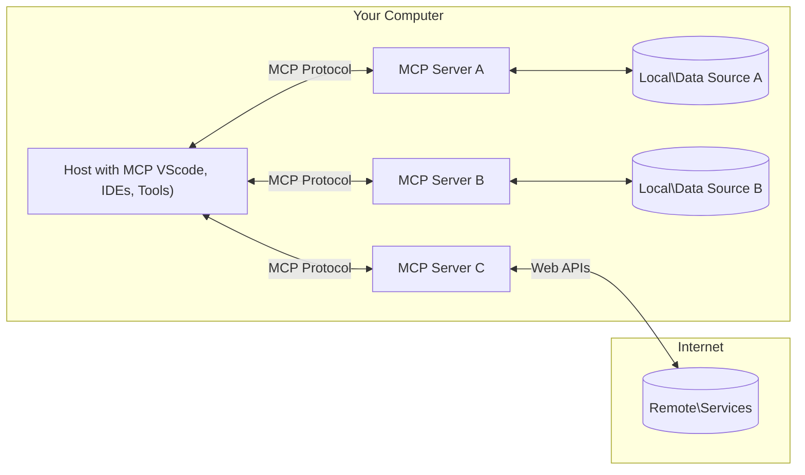

<!--
CO_OP_TRANSLATOR_METADATA:
{
  "original_hash": "355b12a5970c5c9e6db0bee970c751ba",
  "translation_date": "2025-07-04T15:32:55+00:00",
  "source_file": "01-CoreConcepts/README.md",
  "language_code": "ru"
}
-->
# 📖 Основные концепции MCP: Освоение протокола Model Context для интеграции ИИ

[Model Context Protocol (MCP)](https://github.com/modelcontextprotocol) — это мощный стандартизированный фреймворк, который оптимизирует взаимодействие между крупными языковыми моделями (LLM) и внешними инструментами, приложениями и источниками данных. Это SEO-оптимизированное руководство познакомит вас с основными концепциями MCP, поможет понять клиент-серверную архитектуру, ключевые компоненты, механизмы коммуникации и лучшие практики реализации.

## Обзор

В этом уроке рассматривается базовая архитектура и компоненты, составляющие экосистему Model Context Protocol (MCP). Вы узнаете о клиент-серверной архитектуре, ключевых элементах и механизмах взаимодействия, обеспечивающих работу MCP.

## 👩‍🎓 Основные цели обучения

К концу урока вы:

- Поймёте клиент-серверную архитектуру MCP.
- Определите роли и обязанности Hosts, Clients и Servers.
- Проанализируете ключевые особенности, делающие MCP гибким уровнем интеграции.
- Узнаете, как происходит поток информации внутри экосистемы MCP.
- Получите практические знания на примерах кода на .NET, Java, Python и JavaScript.

## 🔎 Архитектура MCP: подробный разбор

Экосистема MCP построена на модели клиент-сервер. Такая модульная структура позволяет AI-приложениям эффективно взаимодействовать с инструментами, базами данных, API и контекстными ресурсами. Давайте разберём эту архитектуру на основные компоненты.

В основе MCP лежит клиент-серверная архитектура, где хост-приложение может подключаться к нескольким серверам:



- **MCP Hosts**: программы, такие как VSCode, Claude Desktop, IDE или AI-инструменты, которые хотят получить доступ к данным через MCP
- **MCP Clients**: клиенты протокола, поддерживающие 1:1 соединения с серверами
- **MCP Servers**: лёгкие программы, предоставляющие определённые возможности через стандартизированный Model Context Protocol
- **Локальные источники данных**: файлы, базы данных и сервисы на вашем компьютере, к которым MCP-серверы могут безопасно обращаться
- **Удалённые сервисы**: внешние системы, доступные через интернет, к которым MCP-серверы подключаются через API

Протокол MCP — это развивающийся стандарт, последние обновления которого можно посмотреть в [спецификации протокола](https://modelcontextprotocol.io/specification/2025-06-18/).

### 1. Hosts

В Model Context Protocol (MCP) Hosts играют ключевую роль как основной интерфейс, через который пользователи взаимодействуют с протоколом. Hosts — это приложения или среды, которые инициируют соединения с MCP-серверами для доступа к данным, инструментам и подсказкам. Примеры Hosts: интегрированные среды разработки (IDE) вроде Visual Studio Code, AI-инструменты, такие как Claude Desktop, или кастомные агенты, созданные для конкретных задач.

**Hosts** — это приложения с LLM, которые инициируют соединения. Они:

- Выполняют или взаимодействуют с AI-моделями для генерации ответов.
- Инициируют соединения с MCP-серверами.
- Управляют ходом диалога и пользовательским интерфейсом.
- Контролируют разрешения и ограничения безопасности.
- Обрабатывают согласие пользователя на обмен данными и выполнение инструментов.

### 2. Clients

Clients — важные компоненты, обеспечивающие взаимодействие между Hosts и MCP-серверами. Они выступают посредниками, позволяя Hosts получать доступ и использовать функционал MCP-серверов. Clients играют ключевую роль в обеспечении плавной коммуникации и эффективного обмена данными внутри архитектуры MCP.

**Clients** — это коннекторы внутри хост-приложения. Они:

- Отправляют запросы серверам с подсказками/инструкциями.
- Ведут переговоры о возможностях с серверами.
- Управляют запросами на выполнение инструментов от моделей.
- Обрабатывают и отображают ответы пользователям.

### 3. Servers

Servers отвечают за обработку запросов от MCP-клиентов и предоставление соответствующих ответов. Они управляют различными операциями, такими как получение данных, выполнение инструментов и генерация подсказок. Servers обеспечивают эффективное и надёжное взаимодействие между клиентами и Hosts, поддерживая целостность процесса общения.

**Servers** — это сервисы, предоставляющие контекст и возможности. Они:

- Регистрируют доступные функции (ресурсы, подсказки, инструменты)
- Принимают и выполняют вызовы инструментов от клиента
- Предоставляют контекстную информацию для улучшения ответов модели
- Возвращают результаты обратно клиенту
- При необходимости сохраняют состояние между взаимодействиями

Servers могут разрабатываться любыми разработчиками для расширения возможностей модели специализированным функционалом.

### 4. Возможности серверов

Серверы в Model Context Protocol (MCP) предоставляют базовые строительные блоки, которые обеспечивают богатое взаимодействие между клиентами, хостами и языковыми моделями. Эти возможности призваны расширить функционал MCP, предлагая структурированный контекст, инструменты и подсказки.

MCP-серверы могут предоставлять любые из следующих возможностей:

#### 📑 Ресурсы

Ресурсы в Model Context Protocol (MCP) включают различные типы контекста и данных, которые могут использоваться пользователями или AI-моделями. К ним относятся:

- **Контекстные данные**: информация и контекст, которые пользователи или AI-модели могут использовать для принятия решений и выполнения задач.
- **Базы знаний и хранилища документов**: коллекции структурированных и неструктурированных данных, таких как статьи, руководства и научные работы, предоставляющие ценные сведения.
- **Локальные файлы и базы данных**: данные, хранящиеся локально на устройствах или в базах данных, доступные для обработки и анализа.
- **API и веб-сервисы**: внешние интерфейсы и сервисы, предоставляющие дополнительные данные и функции, позволяющие интегрироваться с различными онлайн-ресурсами и инструментами.

Пример ресурса — это схема базы данных или файл, к которому можно получить доступ следующим образом:

```text
file://log.txt
database://schema
```

### 🤖 Подсказки

Подсказки в Model Context Protocol (MCP) включают различные заранее определённые шаблоны и схемы взаимодействия, предназначенные для упрощения рабочих процессов пользователей и улучшения коммуникации. К ним относятся:

- **Шаблоны сообщений и рабочих процессов**: заранее структурированные сообщения и процессы, которые направляют пользователей через конкретные задачи и взаимодействия.
- **Предопределённые схемы взаимодействия**: стандартизированные последовательности действий и ответов, обеспечивающие последовательную и эффективную коммуникацию.
- **Специализированные шаблоны диалогов**: настраиваемые шаблоны, адаптированные под определённые типы разговоров, обеспечивающие релевантные и контекстно уместные взаимодействия.

Пример шаблона подсказки может выглядеть так:

```markdown
Generate a product slogan based on the following {{product}} with the following {{keywords}}
```

#### ⛏️ Инструменты

Инструменты в Model Context Protocol (MCP) — это функции, которые AI-модель может выполнять для решения конкретных задач. Эти инструменты призваны расширить возможности AI-модели, предоставляя структурированные и надёжные операции. Основные характеристики:

- **Функции, которые может выполнять AI-модель**: инструменты — это исполняемые функции, которые модель может вызывать для выполнения различных задач.
- **Уникальное имя и описание**: каждый инструмент имеет уникальное имя и подробное описание, объясняющее его назначение и функционал.
- **Параметры и результаты**: инструменты принимают определённые параметры и возвращают структурированные результаты, обеспечивая предсказуемость и согласованность.
- **Отдельные функции**: инструменты выполняют отдельные задачи, такие как веб-поиск, вычисления и запросы к базе данных.

Пример инструмента может выглядеть так:

```typescript
server.tool(
  "GetProducts",
  {
    pageSize: z.string().optional(),
    pageCount: z.string().optional()
  }, () => {
    // return results from API
  }
)
```

## Возможности клиентов

В Model Context Protocol (MCP) клиенты предоставляют серверам несколько ключевых функций, расширяющих общую функциональность и взаимодействие в протоколе. Одной из таких функций является Sampling.

### 👉 Sampling

- **Инициируемые сервером агентные действия**: клиенты позволяют серверам самостоятельно инициировать определённые действия или поведение, расширяя динамические возможности системы.
- **Рекурсивные взаимодействия с LLM**: эта функция позволяет рекурсивно взаимодействовать с крупными языковыми моделями, обеспечивая более сложную и итеративную обработку задач.
- **Запрос дополнительных завершений модели**: серверы могут запрашивать дополнительные варианты ответов от модели, гарантируя полноту и контекстную релевантность ответов.

## Поток информации в MCP

Model Context Protocol (MCP) определяет структурированный поток информации между Hosts, Clients, Servers и моделями. Понимание этого потока помогает понять, как обрабатываются пользовательские запросы и как внешние инструменты и данные интегрируются в ответы модели.

- **Host инициирует соединение**  
  Хост-приложение (например, IDE или чат-интерфейс) устанавливает соединение с MCP-сервером, обычно через STDIO, WebSocket или другой поддерживаемый транспорт.

- **Переговоры о возможностях**  
  Клиент (встроенный в хост) и сервер обмениваются информацией о поддерживаемых функциях, инструментах, ресурсах и версиях протокола. Это гарантирует, что обе стороны понимают доступные возможности для сессии.

- **Пользовательский запрос**  
  Пользователь взаимодействует с хостом (например, вводит подсказку или команду). Хост собирает этот ввод и передаёт его клиенту для обработки.

- **Использование ресурса или инструмента**  
  - Клиент может запросить у сервера дополнительный контекст или ресурсы (например, файлы, записи из базы данных или статьи из базы знаний) для обогащения понимания модели.
  - Если модель определяет необходимость использования инструмента (например, для получения данных, выполнения вычислений или вызова API), клиент отправляет серверу запрос на вызов инструмента с указанием имени и параметров.

- **Выполнение на сервере**  
  Сервер получает запрос на ресурс или инструмент, выполняет необходимые операции (например, запуск функции, запрос к базе данных или получение файла) и возвращает результаты клиенту в структурированном виде.

- **Генерация ответа**  
  Клиент интегрирует ответы сервера (данные ресурсов, результаты инструментов и т.д.) в текущую модельную сессию. Модель использует эту информацию для создания полного и контекстно релевантного ответа.

- **Представление результата**  
  Хост получает окончательный результат от клиента и отображает его пользователю, часто включая как сгенерированный текст модели, так и результаты выполнения инструментов или поиска по ресурсам.

Этот поток обеспечивает поддержку MCP для продвинутых, интерактивных и контекстно-зависимых AI-приложений, бесшовно связывая модели с внешними инструментами и источниками данных.

## Детали протокола

MCP (Model Context Protocol) построен на основе [JSON-RPC 2.0](https://www.jsonrpc.org/), предоставляя стандартизированный, независимый от языка формат сообщений для коммуникации между Hosts, Clients и Servers. Эта основа обеспечивает надёжное, структурированное и расширяемое взаимодействие на различных платформах и языках программирования.

### Ключевые особенности протокола

MCP расширяет JSON-RPC 2.0 дополнительными соглашениями для вызова инструментов, доступа к ресурсам и управления подсказками. Он поддерживает несколько транспортных слоёв (STDIO, WebSocket, SSE) и обеспечивает безопасное, расширяемое и независимое от языка взаимодействие между компонентами.

#### 🧢 Базовый протокол

- **Формат сообщений JSON-RPC**: все запросы и ответы используют спецификацию JSON-RPC 2.0, обеспечивая единообразную структуру вызовов методов, параметров, результатов и обработки ошибок.
- **Состояние соединений**: сессии MCP сохраняют состояние между запросами, поддерживая непрерывные диалоги, накопление контекста и управление ресурсами.
- **Переговоры о возможностях**: при установке соединения клиенты и серверы обмениваются информацией о поддерживаемых функциях, версиях протокола, доступных инструментах и ресурсах. Это гарантирует взаимное понимание возможностей и адаптацию.

#### ➕ Дополнительные утилиты

Ниже перечислены дополнительные утилиты и расширения протокола, которые MCP предоставляет для улучшения опыта разработчиков и поддержки продвинутых сценариев:

- **Опции конфигурации**: MCP позволяет динамически настраивать параметры сессии, такие как разрешения на инструменты, доступ к ресурсам и настройки модели, адаптированные под каждое взаимодействие.
- **Отслеживание прогресса**: длительные операции могут сообщать о ходе выполнения, обеспечивая отзывчивый интерфейс и лучший пользовательский опыт при сложных задачах.
- **Отмена запросов**: клиенты могут отменять текущие запросы, позволяя пользователям прерывать операции, которые больше не нужны или занимают слишком много времени.
- **Отчёты об ошибках**: стандартизированные сообщения и коды ошибок помогают диагностировать проблемы, корректно обрабатывать сбои и предоставлять полезную обратную связь пользователям и разработчикам.
- **Логирование**: клиенты и серверы могут генерировать структурированные логи для аудита, отладки и мониторинга взаимодействий протокола.

Используя эти возможности протокола, MCP обеспечивает надёжное, безопасное и гибкое взаимодействие между языковыми моделями и внешними инструментами или источниками данных.

### 🔐 Вопросы безопасности

Реализации MCP должны придерживаться нескольких ключевых принципов безопасности для обеспечения безопасного и надёжного взаимодействия:

- **Согласие и контроль пользователя**: пользователи должны давать явное согласие перед доступом к данным или выполнением операций. Они должны иметь чёткий контроль над тем, какие данные передаются и какие действия разрешены, поддерживаемый интуитивно понятными интерфейсами для просмотра и одобрения действий.

- **Конфиденциальность данных**: пользовательские данные должны передаваться только с явного согласия и защищаться соответствующими мерами доступа. Реализации MCP обязаны предотвращать несанкционированную передачу данных и обеспечивать сохранность конфиденциальности на всех этапах взаимодействия.

- **Безопасность инструментов**: перед вызовом любого инструмента требуется явное согласие пользователя. Пользователи должны чётко понимать функционал каждого инструмента, а также должны быть реализованы надёжные границы безопасности, предотвращающие непреднамеренное или небезопасное выполнение инструментов.

Следуя этим принципам, MCP гарантирует сохранение доверия пользователей, конфиденциальности и безопасности во всех взаимодействиях протокола.

## Примеры кода: ключевые компоненты

Ниже приведены примеры кода на нескольких популярных языках программирования, демонстрирующие, как реализовать ключевые компоненты MCP-сервера и инструменты.

### Пример на .NET: создание простого MCP-сервера с инструментами

Практический пример на .NET, показывающий, как реализовать простой MCP-сервер с пользовательскими инструментами. В этом примере показано, как определить и зарегистрировать инструменты, обрабатывать запросы и подключить сервер с использованием Model Context Protocol.

```csharp
using System;
using System.Threading.Tasks;
using ModelContextProtocol.Server;
using ModelContextProtocol.Server.Transport;
using ModelContextProtocol.Server.Tools;

public class WeatherServer
{
    public static async Task Main(string[] args)
    {
        // Create an MCP server
        var server = new McpServer(
            name: "Weather MCP Server",
            version: "1.0.0"
        );
        
        // Register our custom weather tool
        server.AddTool<string, WeatherData>("weatherTool", 
            description: "Gets current weather for a location",
            execute: async (location) => {
                // Call weather API (simplified)
                var weatherData = await GetWeatherDataAsync(location);
                return weatherData;
            });
        
        // Connect the server using stdio transport
        var transport = new StdioServerTransport();
        await server.ConnectAsync(transport);
        
        Console.WriteLine("Weather MCP Server started");
        
        // Keep the server running until process is terminated
        await Task.Delay(-1);
    }
    
    private static async Task<WeatherData> GetWeatherDataAsync(string location)
    {
        // This would normally call a weather API
        // Simplified for demonstration
        await Task.Delay(100); // Simulate API call
        return new WeatherData { 
            Temperature = 72.5,
            Conditions = "Sunny",
            Location = location
        };
    }
}

public class WeatherData
{
    public double Temperature { get; set; }
    public string Conditions { get; set; }
    public string Location { get; set; }
}
```

### Пример на Java: компоненты MCP-сервера

Этот пример демонстрирует тот же MCP-сервер и регистрацию инструментов, что и пример на .NET выше, но реализован на Java.

```java
import io.modelcontextprotocol.server.McpServer;
import io.modelcontextprotocol.server.McpToolDefinition;
import io.modelcontextprotocol.server.transport.StdioServerTransport;
import io.modelcontextprotocol.server.tool.ToolExecutionContext;
import io.modelcontextprotocol.server.tool.ToolResponse;

public class WeatherMcpServer {
    public static void main(String[] args) throws Exception {
        // Create an MCP server
        McpServer server = McpServer.builder()
            .name("Weather MCP Server")
            .version("1.0.0")
            .build();
            
        // Register a weather tool
        server.registerTool(McpToolDefinition.builder("weatherTool")
            .description("Gets current weather for a location")
            .parameter("location", String.class)
            .execute((ToolExecutionContext ctx) -> {
                String location = ctx.getParameter("location", String.class);
                
                // Get weather data (simplified)
                WeatherData data = getWeatherData(location);
                
                // Return formatted response
                return ToolResponse.content(
                    String.format("Temperature: %.1f°F, Conditions: %s, Location: %s", 
                    data.getTemperature(), 
                    data.getConditions(), 
                    data.getLocation())
                );
            })
            .build());
        
        // Connect the server using stdio transport
        try (StdioServerTransport transport = new StdioServerTransport()) {
            server.connect(transport);
            System.out.println("Weather MCP Server started");
            // Keep server running until process is terminated
            Thread.currentThread().join();
        }
    }
    
    private static WeatherData getWeatherData(String location) {
        // Implementation would call a weather API
        // Simplified for example purposes
        return new WeatherData(72.5, "Sunny", location);
    }
}

class WeatherData {
    private double temperature;
    private String conditions;
    private String location;
    
    public WeatherData(double temperature, String conditions, String location) {
        this.temperature = temperature;
        this.conditions = conditions;
        this.location = location;
    }
    
    public double getTemperature() {
        return temperature;
    }
    
    public String getConditions() {
        return conditions;
    }
    
    public String getLocation() {
        return location;
    }
}
```

### Пример на Python: создание MCP-сервера

В этом примере показано, как построить MCP-сервер на Python. Также представлены два разных способа создания инструментов.

```python
#!/usr/bin/env python3
import asyncio
from mcp.server.fastmcp import FastMCP
from mcp.server.transports.stdio import serve_stdio

# Create a FastMCP server
mcp = FastMCP(
    name="Weather MCP Server",
    version="1.0.0"
)

@mcp.tool()
def get_weather(location: str) -> dict:
    """Gets current weather for a location."""
    # This would normally call a weather API
    # Simplified for demonstration
    return {
        "temperature": 72.5,
        "conditions": "Sunny",
        "location": location
    }

# Alternative approach using a class
class WeatherTools:
    @mcp.tool()
    def forecast(self, location: str, days: int = 1) -> dict:
        """Gets weather forecast for a location for the specified number of days."""
        # This would normally call a weather API forecast endpoint
        # Simplified for demonstration
        return {
            "location": location,
            "forecast": [
                {"day": i+1, "temperature": 70 + i, "conditions": "Partly Cloudy"}
                for i in range(days)
            ]
        }

# Instantiate the class to register its tools
weather_tools = WeatherTools()

# Start the server using stdio transport
if __name__ == "__main__":
    asyncio.run(serve_stdio(mcp))
```

### Пример на JavaScript: создание MCP-сервера

В этом примере показано создание MCP-сервера на JavaScript и регистрацию двух инструментов, связанных с погодой.

```javascript
// Using the official Model Context Protocol SDK
import { McpServer } from "@modelcontextprotocol/sdk/server/mcp.js";
import { StdioServerTransport } from "@modelcontextprotocol/sdk/server/stdio.js";
import { z } from "zod"; // For parameter validation

// Create an MCP server
const server = new McpServer({
  name: "Weather MCP Server",
  version: "1.0.0"
});

// Define a weather tool
server.tool(
  "weatherTool",
  {
    location: z.string().describe("The location to get weather for")
  },
  async ({ location }) => {
    // This would normally call a weather API
    // Simplified for demonstration
    const weatherData = await getWeatherData(location);
    
    return {
      content: [
        { 
          type: "text", 
          text: `Temperature: ${weatherData.temperature}°F, Conditions: ${weatherData.conditions}, Location: ${weatherData.location}` 
        }
      ]
    };
  }
);

// Define a forecast tool
server.tool(
  "forecastTool",
  {
    location: z.string(),
    days: z.number().default(3).describe("Number of days for forecast")
  },
  async ({ location, days }) => {
    // This would normally call a weather API
    // Simplified for demonstration
    const forecast = await getForecastData(location, days);
    
    return {
      content: [
        { 
          type: "text", 
          text: `${days}-day forecast for ${location}: ${JSON.stringify(forecast)}` 
        }
      ]
    };
  }
);

// Helper functions
async function getWeatherData(location) {
  // Simulate API call
  return {
    temperature: 72.5,
    conditions: "Sunny",
    location: location
  };
}

async function getForecastData(location, days) {
  // Simulate API call
  return Array.from({ length: days }, (_, i) => ({
    day: i + 1,
    temperature: 70 + Math.floor(Math.random() * 10),
    conditions: i % 2 === 0 ? "Sunny" : "Partly Cloudy"
  }));
}

// Connect the server using stdio transport
const transport = new StdioServerTransport();
server.connect(transport).catch(console.error);

console.log("Weather MCP Server started");
```

Этот пример на JavaScript демонстрирует, как создать MCP-клиента, который подключается к серверу, отправляет подсказку и обрабатывает ответ, включая вызовы инструментов.

## Безопасность и авторизация
MCP включает несколько встроенных концепций и механизмов для управления безопасностью и авторизацией на протяжении всего протокола:

1. **Контроль разрешений для инструментов**:  
  Клиенты могут указывать, какими инструментами модель может пользоваться во время сессии. Это гарантирует, что доступны только явно разрешённые инструменты, снижая риск непреднамеренных или небезопасных операций. Разрешения могут настраиваться динамически в зависимости от предпочтений пользователя, политик организации или контекста взаимодействия.

2. **Аутентификация**:  
  Серверы могут требовать аутентификацию перед предоставлением доступа к инструментам, ресурсам или чувствительным операциям. Это может включать API-ключи, OAuth-токены или другие схемы аутентификации. Корректная аутентификация обеспечивает вызов серверных возможностей только доверенными клиентами и пользователями.

3. **Валидация**:  
  Проверка параметров обязательна для всех вызовов инструментов. Каждый инструмент определяет ожидаемые типы, форматы и ограничения для своих параметров, и сервер проверяет входящие запросы согласно этим требованиям. Это предотвращает попадание некорректных или вредоносных данных в реализации инструментов и помогает поддерживать целостность операций.

4. **Ограничение частоты запросов**:  
  Чтобы предотвратить злоупотребления и обеспечить справедливое использование ресурсов сервера, MCP-серверы могут внедрять ограничение частоты вызовов инструментов и доступа к ресурсам. Лимиты могут применяться на пользователя, сессию или глобально, что помогает защититься от атак типа «отказ в обслуживании» и чрезмерного потребления ресурсов.

Объединяя эти механизмы, MCP создаёт надёжную основу для интеграции языковых моделей с внешними инструментами и источниками данных, предоставляя пользователям и разработчикам тонкий контроль над доступом и использованием.

## Сообщения протокола

Общение в MCP происходит с помощью структурированных JSON-сообщений, что обеспечивает чёткое и надёжное взаимодействие между клиентами, серверами и моделями. Основные типы сообщений включают:

- **Запрос клиента**  
  Отправляется клиентом на сервер, обычно содержит:
  - Запрос или команду пользователя
  - Историю диалога для контекста
  - Конфигурацию инструментов и разрешения
  - Дополнительные метаданные или информацию о сессии

- **Ответ модели**  
  Возвращается моделью (через клиента), содержит:
  - Сгенерированный текст или завершение на основе запроса и контекста
  - Опциональные инструкции по вызову инструмента, если модель решает, что инструмент нужно использовать
  - Ссылки на ресурсы или дополнительный контекст при необходимости

- **Запрос инструмента**  
  Отправляется клиентом на сервер, когда нужно выполнить инструмент. Включает:
  - Название инструмента для вызова
  - Параметры, необходимые инструменту (проверяются по схеме инструмента)
  - Контекстную информацию или идентификаторы для отслеживания запроса

- **Ответ инструмента**  
  Возвращается сервером после выполнения инструмента. Содержит:
  - Результаты выполнения инструмента (структурированные данные или содержимое)
  - Ошибки или статус, если вызов инструмента не удался
  - При необходимости — дополнительные метаданные или логи, связанные с выполнением

Эти структурированные сообщения гарантируют, что каждый этап работы MCP ясен, отслеживаем и расширяем, поддерживая сложные сценарии, такие как многошаговые диалоги, цепочки вызовов инструментов и надёжную обработку ошибок.

## Основные выводы

- MCP использует архитектуру клиент-сервер для подключения моделей к внешним возможностям
- Экосистема состоит из клиентов, хостов, серверов, инструментов и источников данных
- Общение может происходить через STDIO, SSE или WebSockets
- Инструменты — это базовые единицы функциональности, доступные моделям
- Структурированные протоколы обеспечивают последовательное взаимодействие

## Упражнение

Разработайте простой инструмент MCP, который был бы полезен в вашей области. Определите:
1. Как будет называться инструмент
2. Какие параметры он будет принимать
3. Какой результат он будет возвращать
4. Как модель может использовать этот инструмент для решения задач пользователя


---

## Что дальше

Далее: [Глава 2: Безопасность](../02-Security/README.md)

**Отказ от ответственности**:  
Этот документ был переведен с помощью сервиса автоматического перевода [Co-op Translator](https://github.com/Azure/co-op-translator). Несмотря на наши усилия по обеспечению точности, просим учитывать, что автоматический перевод может содержать ошибки или неточности. Оригинальный документ на его исходном языке следует считать авторитетным источником. Для получения критически важной информации рекомендуется обращаться к профессиональному переводу, выполненному человеком. Мы не несем ответственности за любые недоразумения или неправильные толкования, возникшие в результате использования данного перевода.