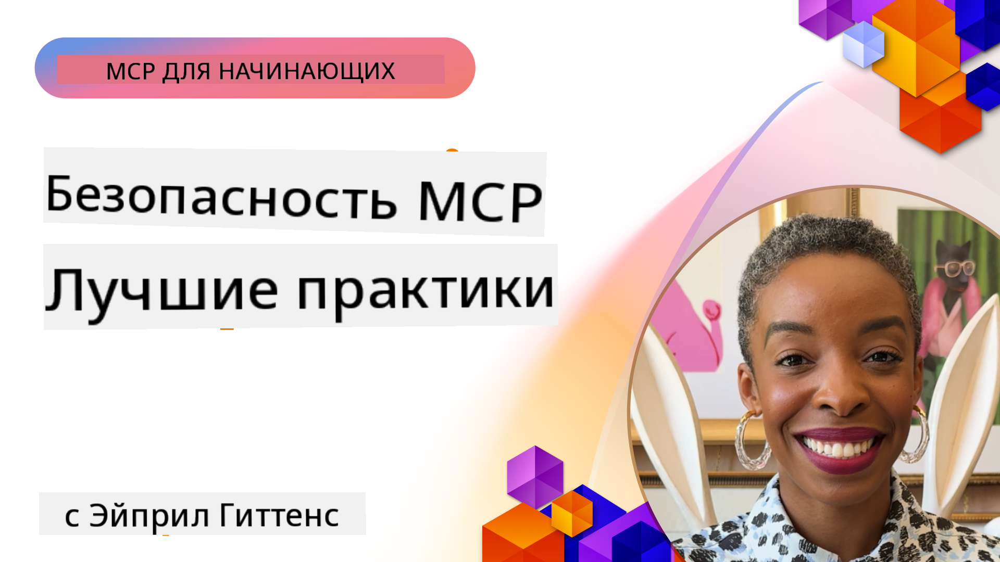

<!--
CO_OP_TRANSLATOR_METADATA:
{
  "original_hash": "1c767a35642f753127dc08545c25a290",
  "translation_date": "2025-08-18T13:16:38+00:00",
  "source_file": "02-Security/README.md",
  "language_code": "ru"
}
-->
# MCP Security: Комплексная защита для AI-систем

_(Нажмите на изображение выше, чтобы посмотреть видео этого урока)_

Безопасность является основой проектирования AI-систем, поэтому мы уделяем ей внимание во второй секции. Это соответствует принципу Microsoft **Secure by Design**, изложенному в [Инициативе безопасного будущего](https://www.microsoft.com/security/blog/2025/04/17/microsofts-secure-by-design-journey-one-year-of-success/).

Протокол Model Context Protocol (MCP) предоставляет мощные новые возможности для приложений на основе AI, но также создает уникальные вызовы безопасности, выходящие за рамки традиционных рисков программного обеспечения. MCP-системы сталкиваются как с уже известными проблемами безопасности (безопасное кодирование, минимизация привилегий, безопасность цепочки поставок), так и с новыми угрозами, специфичными для AI, такими как инъекции подсказок, отравление инструментов, угон сессий, атаки "запутанный заместитель", уязвимости передачи токенов и динамическая модификация возможностей.

Этот урок охватывает наиболее критические риски безопасности в реализации MCP, включая аутентификацию, авторизацию, избыточные разрешения, косвенные инъекции подсказок, безопасность сессий, проблемы "запутанного заместителя", управление токенами и уязвимости цепочки поставок. Вы узнаете о практических мерах и лучших практиках для минимизации этих рисков, а также о решениях Microsoft, таких как Prompt Shields, Azure Content Safety и GitHub Advanced Security, которые помогут укрепить вашу MCP-реализацию.

## Цели обучения

К концу этого урока вы сможете:

- **Определять угрозы, специфичные для MCP**: Распознавать уникальные риски безопасности в MCP-системах, включая инъекции подсказок, отравление инструментов, избыточные разрешения, угон сессий, проблемы "запутанного заместителя", уязвимости передачи токенов и риски цепочки поставок
- **Применять меры безопасности**: Реализовывать эффективные меры, включая надежную аутентификацию, доступ с минимальными привилегиями, безопасное управление токенами, контроль безопасности сессий и проверку цепочки поставок
- **Использовать решения Microsoft для безопасности**: Понимать и внедрять Microsoft Prompt Shields, Azure Content Safety и GitHub Advanced Security для защиты рабочих нагрузок MCP
- **Проверять безопасность инструментов**: Осознавать важность проверки метаданных инструментов, мониторинга динамических изменений и защиты от косвенных инъекций подсказок
- **Интегрировать лучшие практики**: Сочетать проверенные основы безопасности (безопасное кодирование, усиление серверов, нулевое доверие) с мерами, специфичными для MCP, для комплексной защиты

# Архитектура безопасности MCP и меры контроля

Современные реализации MCP требуют многоуровневого подхода к безопасности, который охватывает как традиционные угрозы программного обеспечения, так и специфические для AI риски. Быстро развивающаяся спецификация MCP продолжает совершенствовать свои меры безопасности, обеспечивая лучшую интеграцию с корпоративными архитектурами безопасности и проверенными практиками.

Исследования из [Отчета Microsoft о цифровой защите](https://aka.ms/mddr) показывают, что **98% зарегистрированных нарушений можно было бы предотвратить с помощью надежной гигиены безопасности**. Наиболее эффективная стратегия защиты сочетает базовые меры безопасности с мерами, специфичными для MCP, — проверенные базовые меры остаются наиболее значимыми для снижения общего уровня риска.

## Текущая ситуация в области безопасности

> **Примечание:** Эта информация отражает стандарты безопасности MCP по состоянию на **18 августа 2025 года**. Протокол MCP продолжает быстро развиваться, и будущие реализации могут включать новые шаблоны аутентификации и улучшенные меры контроля. Всегда обращайтесь к актуальной [спецификации MCP](https://spec.modelcontextprotocol.io/), [репозиторию MCP на GitHub](https://github.com/modelcontextprotocol) и [документации по лучшим практикам безопасности](https://modelcontextprotocol.io/specification/2025-06-18/basic/security_best_practices) для получения последней информации.

### Эволюция аутентификации в MCP

Спецификация MCP значительно эволюционировала в подходе к аутентификации и авторизации:

- **Изначальный подход**: Ранние спецификации требовали от разработчиков реализации пользовательских серверов аутентификации, где серверы MCP выступали в роли OAuth 2.0 Authorization Servers, напрямую управляя аутентификацией пользователей
- **Текущий стандарт (2025-06-18)**: Обновленная спецификация позволяет серверам MCP делегировать аутентификацию внешним поставщикам идентификации (таким как Microsoft Entra ID), улучшая уровень безопасности и снижая сложность реализации
- **Безопасность транспортного уровня**: Расширенная поддержка безопасных транспортных механизмов с правильными шаблонами аутентификации как для локальных (STDIO), так и для удаленных (Streamable HTTP) соединений

## Безопасность аутентификации и авторизации

### Текущие вызовы безопасности

Современные реализации MCP сталкиваются с рядом проблем в области аутентификации и авторизации:

### Риски и векторы угроз

- **Ошибочная логика авторизации**: Неправильная реализация авторизации на серверах MCP может привести к утечке конфиденциальных данных и неправильному применению контроля доступа
- **Компрометация OAuth-токенов**: Кража локальных токенов сервера MCP позволяет злоумышленникам выдавать себя за серверы и получать доступ к downstream-сервисам
- **Уязвимости передачи токенов**: Неправильное обращение с токенами создает обходные пути для контроля безопасности и пробелы в учете
- **Избыточные разрешения**: MCP-серверы с избыточными привилегиями нарушают принципы минимальных привилегий и расширяют поверхность атаки

#### Передача токенов: критический анти-паттерн

**Передача токенов строго запрещена** в текущей спецификации авторизации MCP из-за серьезных последствий для безопасности:

##### Обход мер контроля безопасности
- Серверы MCP и downstream API реализуют критически важные меры безопасности (ограничение скорости, проверка запросов, мониторинг трафика), которые зависят от правильной проверки токенов
- Прямое использование токенов клиентами для API обходит эти важные меры защиты, подрывая архитектуру безопасности

##### Проблемы учета и аудита  
- Серверы MCP не могут различать клиентов, использующих токены, выданные upstream, что нарушает учетные записи
- Логи downstream-серверов ресурсов показывают вводящие в заблуждение источники запросов вместо реальных промежуточных серверов MCP
- Расследование инцидентов и аудит соответствия становятся значительно сложнее

##### Риски утечки данных
- Непроверенные утверждения токенов позволяют злоумышленникам с украденными токенами использовать серверы MCP как прокси для утечки данных
- Нарушения границ доверия позволяют несанкционированным шаблонам доступа обходить предусмотренные меры безопасности

##### Векторы атак на несколько сервисов
- Скомпрометированные токены, принимаемые несколькими сервисами, позволяют злоумышленникам перемещаться между связанными системами
- Предположения о доверии между сервисами могут быть нарушены, если происхождение токенов не может быть проверено

### Меры контроля и минимизации рисков

**Критические требования безопасности:**

> **ОБЯЗАТЕЛЬНО**: Серверы MCP **НЕ ДОЛЖНЫ** принимать токены, которые не были явно выданы для сервера MCP

#### Контроль аутентификации и авторизации

- **Тщательная проверка авторизации**: Проводите всесторонние аудиты логики авторизации серверов MCP, чтобы убедиться, что только предполагаемые пользователи и клиенты могут получить доступ к конфиденциальным ресурсам
  - **Руководство по реализации**: [Azure API Management как шлюз аутентификации для серверов MCP](https://techcommunity.microsoft.com/blog/integrationsonazureblog/azure-api-management-your-auth-gateway-for-mcp-servers/4402690)
  - **Интеграция идентификации**: [Использование Microsoft Entra ID для аутентификации серверов MCP](https://den.dev/blog/mcp-server-auth-entra-id-session/)

- **Безопасное управление токенами**: Реализуйте [лучшие практики Microsoft по проверке и жизненному циклу токенов](https://learn.microsoft.com/en-us/entra/identity-platform/access-tokens)
  - Убедитесь, что утверждения аудитории токенов соответствуют идентичности сервера MCP
  - Реализуйте правильную ротацию токенов и политики истечения срока действия
  - Предотвращайте атаки с повторным использованием токенов и несанкционированное использование

- **Защищенное хранение токенов**: Обеспечьте шифрование токенов как в состоянии покоя, так и при передаче
  - **Лучшие практики**: [Руководство по безопасному хранению и шифрованию токенов](https://youtu.be/uRdX37EcCwg?si=6fSChs1G4glwXRy2)

#### Реализация контроля доступа

- **Принцип минимальных привилегий**: Предоставляйте серверам MCP только минимально необходимые разрешения для выполнения их функций
  - Регулярно пересматривайте и обновляйте разрешения, чтобы предотвратить накопление привилегий
  - **Документация Microsoft**: [Безопасный доступ с минимальными привилегиями](https://learn.microsoft.com/entra/identity-platform/secure-least-privileged-access)

- **Ролевое управление доступом (RBAC)**: Реализуйте детализированные назначения ролей
  - Ограничивайте роли конкретными ресурсами и действиями
  - Избегайте широких или ненужных разрешений, которые увеличивают поверхность атаки

- **Непрерывный мониторинг разрешений**: Реализуйте постоянный аудит и мониторинг доступа
  - Отслеживайте шаблоны использования разрешений на наличие аномалий
  - Немедленно устраняйте избыточные или неиспользуемые привилегии

## Угрозы безопасности, специфичные для AI

### Инъекции подсказок и атаки на инструменты

Современные реализации MCP сталкиваются с изощренными векторами атак, специфичными для AI, которые традиционные меры безопасности не могут полностью предотвратить:

#### **Косвенные инъекции подсказок (междоменные инъекции подсказок)**

**Косвенные инъекции подсказок** представляют собой одну из самых критических уязвимостей в AI-системах, поддерживающих MCP. Злоумышленники внедряют вредоносные инструкции в внешний контент — документы, веб-страницы, электронные письма или источники данных, которые AI-системы затем обрабатывают как легитимные команды.

**Сценарии атак:**
- **Инъекции на основе документов**: Вредоносные инструкции, скрытые в обрабатываемых документах, которые вызывают нежелательные действия AI
- **Эксплуатация веб-контента**: Скомпрометированные веб-страницы с внедренными подсказками, манипулирующими поведением AI при их парсинге
- **Атаки через электронную почту**: Вредоносные подсказки в письмах, заставляющие AI-ассистентов утекать информацию или выполнять несанкционированные действия
- **Заражение источников данных**: Скомпрометированные базы данных или API, предоставляющие зараженный контент AI-системам

**Реальные последствия**: Эти атаки могут привести к утечке данных, нарушениям конфиденциальности, генерации вредоносного контента и манипуляции взаимодействиями с пользователями. Для детального анализа см. [Инъекции подсказок в MCP (Саймон Уиллис)](https://simonwillison.net/2025/Apr/9/mcp-prompt-injection/).

#### **Атаки на отравление инструментов**

**Отравление инструментов** нацелено на метаданные, определяющие инструменты MCP, эксплуатируя то, как LLM интерпретируют описания инструментов и параметры для принятия решений об их выполнении.

**Механизмы атак:**
- **Манипуляция метаданными**: Злоумышленники внедряют вредоносные инструкции в описания инструментов, определения параметров или примеры использования
- **Невидимые инструкции**: Скрытые подсказки в метаданных инструментов, которые обрабатываются AI-моделями, но невидимы для пользователей
- **Динамическая модификация инструментов ("Rug Pulls")**: Инструменты, одобренные пользователями, позже модифицируются для выполнения вредоносных действий без ведома пользователя
- **Инъекции параметров**: Вредоносный контент, встроенный в схемы параметров инструментов, влияющий на поведение модели

**Риски для хостинговых серверов**: Удаленные серверы MCP представляют повышенные риски, так как определения инструментов могут быть обновлены после первоначального одобрения пользователем, создавая сценарии, где ранее безопасные инструменты становятся вредоносными. Для полного анализа см. [Атаки на отравление инструментов (Invariant Labs)](https://invariantlabs.ai/blog/mcp-security-notification-tool-poisoning-attacks).

#### **Дополнительные векторы атак на AI**

- **Междоменные инъекции подсказок (XPIA)**: Изощренные атаки, использующие контент из нескольких доменов для обхода мер безопасности
- **Динамическая модификация возможностей**: Изменения возможностей инструментов в реальном времени, которые ускользают от первоначальной оценки безопасности
- **Отравление контекстного окна**: Атаки, манипулирующие большими контекстными окнами для сокрытия вредоносных инструкций
- **Атаки на путаницу модели**: Эксплуатация ограничений модели для создания непредсказуемого или небезопасного поведения

### Влияние рисков безопасности AI

**Последствия высокого уровня:**
- **Утечка данных**: Несанкционированный доступ и кража конфиденциальных данных компании или личной информации
- **Нарушения конфиденциальности**: Разглашение персонально идентифицируемой информации (PII) и конфиденциальных бизнес-данных  
- **Манипуляция системой**: Непреднамеренные изменения в критически важных системах и рабочих процессах
- **Кража учетных данных**: Компрометация токенов аутентификации и учетных данных сервисов
- **Латеральное перемещение**: Использование скомпрометированных AI-систем как точек входа для более широких атак на сеть

### Решения Microsoft для безопасности AI

#### **AI Prompt Shields: Расширенная защита от атак инъекций**

Microsoft **AI Prompt Shields** обеспечивают комплексную защиту от прямых и косвенных атак инъекций подсказок через несколько уровней безопасности:

##### **Основные механизмы защиты:**

1. **Расширенное обнаружение и фильтрация**
   - Алгоритмы машинного обучения и методы NLP обнаруживают вредоносные инструкции во внешнем контенте
   - Анализ документов, веб-страниц, писем и источников данных в реальном времени для выявления встроенных угроз
   - Контекстное понимание различий между легитимными и вредоносными шаблонами подсказок

2. **Техники выделения контекста**  
   - Различение между доверенными системными инструкциями и потенциально скомпрометированными внешними вводами
   - Методы трансформации текста, которые усиливают релевантность модели, изолируя вредоносный контент
   - Помогает AI-системам поддерживать правильную иерархию инструкций и игнорировать внедренные команды

3. **Системы разделителей и маркировки данных**
   - Явное определение границ между доверенными системными сообщениями и внешним вводом текста
   - Специальные маркеры подчеркивают границы между доверенными и недоверенными источниками данных
   - Четкое разделение предотвращает путаницу инструкций и несанкционированное выполнение команд

4. **Непрерывная угроза разведки**
   - Microsoft постоянно отслеживает новые шаблоны атак и обновляет защитные механизмы
   - Проактивный поиск угроз для выявления новых техник инъекций и векторов атак
   - Регулярные обновления моделей безопасности для поддержания эффективности против развивающихся угроз

5. **Интеграция с Azure Content Safety**
   - Часть комплексного пакета Azure AI Content Safety
   - Дополнительное обнаружение попыток обхода, вредоносного контента и нарушений политики безопасности
   - Унифицированные меры безопасности для всех компонентов AI-приложений

**Ресурсы для реализации**: [Документация Microsoft Prompt Shields](https://learn.microsoft.com/azure/ai-services
- **Создание безопасных сессий**: Используйте криптографически защищенные, недетерминированные идентификаторы сессий, сгенерированные с помощью безопасных генераторов случайных чисел  
- **Привязка к пользователю**: Привязывайте идентификаторы сессий к информации о пользователе, используя форматы вроде `<user_id>:<session_id>`, чтобы предотвратить межпользовательское злоупотребление сессиями  
- **Управление жизненным циклом сессий**: Реализуйте корректное истечение срока действия, ротацию и аннулирование сессий для минимизации уязвимостей  
- **Безопасность передачи данных**: Используйте HTTPS для всех коммуникаций, чтобы предотвратить перехват идентификаторов сессий  

### Проблема "запутанного заместителя"

**Проблема запутанного заместителя** возникает, когда серверы MCP выступают в роли прокси-аутентификации между клиентами и сторонними сервисами, создавая возможности для обхода авторизации через эксплуатацию статических идентификаторов клиентов.

#### **Механика атак и риски**

- **Обход согласия через cookie**: Аутентификация предыдущего пользователя создает cookies согласия, которые злоумышленники используют через вредоносные запросы авторизации с поддельными URI перенаправления  
- **Кража кода авторизации**: Существующие cookies согласия могут заставить серверы авторизации пропустить экраны согласия, перенаправляя коды на контролируемые злоумышленником конечные точки  
- **Несанкционированный доступ к API**: Украденные коды авторизации позволяют обменивать их на токены и выдавать себя за пользователя без явного разрешения  

#### **Стратегии предотвращения**

**Обязательные меры:**
- **Требование явного согласия**: MCP-прокси-серверы, использующие статические идентификаторы клиентов, **ОБЯЗАНЫ** получать согласие пользователя для каждого динамически зарегистрированного клиента  
- **Реализация безопасности OAuth 2.1**: Следуйте актуальным рекомендациям по безопасности OAuth, включая использование PKCE (Proof Key for Code Exchange) для всех запросов авторизации  
- **Строгая проверка клиентов**: Реализуйте тщательную проверку URI перенаправления и идентификаторов клиентов, чтобы предотвратить эксплуатацию  

### Уязвимости передачи токенов  

**Передача токенов** представляет собой явный антипаттерн, при котором серверы MCP принимают клиентские токены без должной проверки и пересылают их в нижестоящие API, нарушая спецификации авторизации MCP.

#### **Последствия для безопасности**

- **Обход контроля**: Использование токенов напрямую между клиентом и API обходит важные механизмы ограничения скорости, проверки и мониторинга  
- **Искажение журнала аудита**: Токены, выданные на верхнем уровне, делают невозможной идентификацию клиента, что затрудняет расследование инцидентов  
- **Эксплуатация прокси для утечки данных**: Непроверенные токены позволяют злоумышленникам использовать серверы как прокси для несанкционированного доступа к данным  
- **Нарушение границ доверия**: Предположения о доверии нижестоящих сервисов могут быть нарушены, если происхождение токенов не может быть проверено  
- **Расширение атак на несколько сервисов**: Скомпрометированные токены, принимаемые несколькими сервисами, позволяют злоумышленникам перемещаться между ними  

#### **Необходимые меры безопасности**

**Обязательные требования:**
- **Проверка токенов**: Серверы MCP **НЕ ДОЛЖНЫ** принимать токены, которые не были явно выданы для сервера MCP  
- **Проверка аудитории**: Всегда проверяйте, чтобы заявленные аудитории токенов соответствовали идентичности сервера MCP  
- **Корректный жизненный цикл токенов**: Используйте токены с коротким сроком действия и безопасными практиками ротации  

## Безопасность цепочки поставок для AI-систем

Безопасность цепочки поставок вышла за рамки традиционных программных зависимостей и охватывает весь AI-экосистему. Современные реализации MCP должны тщательно проверять и мониторить все компоненты, связанные с AI, так как каждый из них может стать источником уязвимостей, угрожающих целостности системы.

### Расширенные компоненты цепочки поставок AI

**Традиционные программные зависимости:**
- Библиотеки и фреймворки с открытым исходным кодом  
- Контейнерные образы и базовые системы  
- Инструменты разработки и сборочные конвейеры  
- Инфраструктурные компоненты и сервисы  

**AI-специфические элементы цепочки поставок:**
- **Базовые модели**: Предобученные модели от различных поставщиков, требующие проверки происхождения  
- **Сервисы векторизации**: Внешние сервисы семантического поиска и векторизации  
- **Поставщики контекста**: Источники данных, базы знаний и репозитории документов  
- **Сторонние API**: Внешние AI-сервисы, ML-конвейеры и точки обработки данных  
- **Артефакты моделей**: Веса, конфигурации и варианты моделей с дообучением  
- **Источники данных для обучения**: Наборы данных, используемые для обучения и дообучения моделей  

### Комплексная стратегия безопасности цепочки поставок

#### **Проверка компонентов и доверие**
- **Проверка происхождения**: Убедитесь в происхождении, лицензировании и целостности всех AI-компонентов перед интеграцией  
- **Оценка безопасности**: Проводите сканирование на уязвимости и обзоры безопасности для моделей, источников данных и AI-сервисов  
- **Анализ репутации**: Оценивайте историю безопасности и практики поставщиков AI-сервисов  
- **Проверка соответствия**: Убедитесь, что все компоненты соответствуют требованиям безопасности и нормативным требованиям вашей организации  

#### **Безопасные конвейеры развертывания**  
- **Автоматизированная безопасность CI/CD**: Интегрируйте сканирование безопасности на всех этапах автоматизированных конвейеров развертывания  
- **Целостность артефактов**: Реализуйте криптографическую проверку всех развертываемых артефактов (кода, моделей, конфигураций)  
- **Постепенное развертывание**: Используйте стратегии поэтапного развертывания с проверкой безопасности на каждом этапе  
- **Доверенные репозитории артефактов**: Развертывайте только из проверенных и защищенных репозиториев  

#### **Непрерывный мониторинг и реагирование**
- **Сканирование зависимостей**: Постоянный мониторинг уязвимостей всех программных и AI-компонентов  
- **Мониторинг моделей**: Непрерывная оценка поведения моделей, дрейфа производительности и аномалий безопасности  
- **Отслеживание состояния сервисов**: Мониторинг внешних AI-сервисов на предмет доступности, инцидентов безопасности и изменений политики  
- **Интеграция разведки угроз**: Используйте источники данных об угрозах, специфичных для AI и ML  

#### **Контроль доступа и принцип минимальных привилегий**
- **Разрешения на уровне компонентов**: Ограничьте доступ к моделям, данным и сервисам на основе бизнес-необходимости  
- **Управление учетными записями сервисов**: Используйте выделенные учетные записи сервисов с минимально необходимыми привилегиями  
- **Сегментация сети**: Изолируйте AI-компоненты и ограничьте сетевой доступ между сервисами  
- **Контроль через API-шлюзы**: Используйте централизованные API-шлюзы для управления и мониторинга доступа к внешним AI-сервисам  

#### **Реагирование на инциденты и восстановление**
- **Процедуры быстрого реагирования**: Установленные процессы для исправления или замены скомпрометированных AI-компонентов  
- **Ротация учетных данных**: Автоматизированные системы для ротации секретов, API-ключей и учетных данных сервисов  
- **Возможности отката**: Возможность быстрого возврата к предыдущим проверенным версиям AI-компонентов  
- **Восстановление после компрометации цепочки поставок**: Специфические процедуры для реагирования на компрометацию сторонних AI-сервисов  

### Инструменты безопасности Microsoft и интеграция

**GitHub Advanced Security** предоставляет комплексную защиту цепочки поставок, включая:  
- **Сканирование секретов**: Автоматическое обнаружение учетных данных, API-ключей и токенов в репозиториях  
- **Сканирование зависимостей**: Оценка уязвимостей для зависимостей с открытым исходным кодом  
- **Анализ CodeQL**: Статический анализ кода для выявления уязвимостей и проблем с кодированием  
- **Информация о цепочке поставок**: Видимость состояния безопасности зависимостей  

**Интеграция с Azure DevOps и Azure Repos**:  
- Бесшовная интеграция сканирования безопасности на платформах разработки Microsoft  
- Автоматизированные проверки безопасности в Azure Pipelines для AI-нагрузок  
- Принудительное соблюдение политик для безопасного развертывания AI-компонентов  

**Практики Microsoft**:  
Microsoft реализует обширные меры безопасности цепочки поставок во всех продуктах. Узнайте больше о проверенных подходах в [The Journey to Secure the Software Supply Chain at Microsoft](https://devblogs.microsoft.com/engineering-at-microsoft/the-journey-to-secure-the-software-supply-chain-at-microsoft/).  

### **Решения Microsoft в области безопасности**
- [Документация Microsoft Prompt Shields](https://learn.microsoft.com/azure/ai-services/content-safety/concepts/jailbreak-detection)
- [Служба безопасности контента Azure](https://learn.microsoft.com/azure/ai-services/content-safety/)
- [Безопасность Microsoft Entra ID](https://learn.microsoft.com/entra/identity-platform/secure-least-privileged-access)
- [Рекомендации по управлению токенами Azure](https://learn.microsoft.com/entra/identity-platform/access-tokens)
- [Расширенная безопасность GitHub](https://github.com/security/advanced-security)

### **Руководства по реализации и обучающие материалы**
- [Azure API Management как шлюз аутентификации MCP](https://techcommunity.microsoft.com/blog/integrationsonazureblog/azure-api-management-your-auth-gateway-for-mcp-servers/4402690)
- [Аутентификация Microsoft Entra ID с серверами MCP](https://den.dev/blog/mcp-server-auth-entra-id-session/)
- [Безопасное хранение токенов и их шифрование (видео)](https://youtu.be/uRdX37EcCwg?si=6fSChs1G4glwXRy2)

### **DevOps и безопасность цепочки поставок**
- [Безопасность Azure DevOps](https://azure.microsoft.com/products/devops)
- [Безопасность Azure Repos](https://azure.microsoft.com/products/devops/repos/)
- [Путь Microsoft к безопасности цепочки поставок](https://devblogs.microsoft.com/engineering-at-microsoft/the-journey-to-secure-the-software-supply-chain-at-microsoft/)

## **Дополнительная документация по безопасности**

Для получения подробных рекомендаций по безопасности, обратитесь к специализированным документам в этом разделе:

- **[Лучшие практики безопасности MCP 2025](./mcp-security-best-practices-2025.md)** - Полный набор рекомендаций по безопасности для реализации MCP
- **[Реализация безопасности контента Azure](./azure-content-safety-implementation.md)** - Практические примеры интеграции безопасности контента Azure  
- **[Контроль безопасности MCP 2025](./mcp-security-controls-2025.md)** - Новейшие методы и средства контроля безопасности для развертывания MCP
- **[Краткий справочник лучших практик MCP](./mcp-best-practices.md)** - Справочник по основным практикам безопасности MCP

---

## Что дальше

Далее: [Глава 3: Начало работы](../03-GettingStarted/README.md)

**Отказ от ответственности**:  
Этот документ был переведен с использованием сервиса автоматического перевода [Co-op Translator](https://github.com/Azure/co-op-translator). Несмотря на наши усилия обеспечить точность, автоматические переводы могут содержать ошибки или неточности. Оригинальный документ на его исходном языке следует считать авторитетным источником. Для получения критически важной информации рекомендуется профессиональный перевод человеком. Мы не несем ответственности за любые недоразумения или неправильные интерпретации, возникающие в результате использования данного перевода.