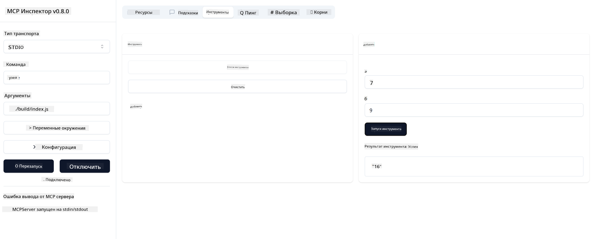

<!--
CO_OP_TRANSLATOR_METADATA:
{
  "original_hash": "5331ffd328a54b90f76706c52b673e27",
  "translation_date": "2025-05-17T08:18:01+00:00",
  "source_file": "03-GettingStarted/01-first-server/README.md",
  "language_code": "ru"
}
-->
# Начало работы с MCP

Добро пожаловать в ваши первые шаги с Model Context Protocol (MCP)! Независимо от того, новичок ли вы в MCP или хотите углубить свои знания, это руководство проведет вас через процесс настройки и разработки. Вы узнаете, как MCP обеспечивает бесшовную интеграцию между AI-моделями и приложениями, и научитесь быстро готовить свою среду для создания и тестирования решений на базе MCP.

> TLDR; Если вы создаете AI-приложения, вы знаете, что можете добавлять инструменты и другие ресурсы в вашу LLM (большую языковую модель), чтобы сделать LLM более осведомленной. Однако если вы разместите эти инструменты и ресурсы на сервере, возможности приложения и сервера могут быть использованы любым клиентом с LLM или без него.

## Обзор

Этот урок предоставляет практическое руководство по настройке среды MCP и созданию ваших первых приложений MCP. Вы узнаете, как настроить необходимые инструменты и фреймворки, создать базовые серверы MCP, создать хост-приложения и протестировать ваши реализации.

Model Context Protocol (MCP) — это открытый протокол, который стандартизирует то, как приложения предоставляют контекст для LLM. Представьте MCP как порт USB-C для AI-приложений — он предоставляет стандартизированный способ подключения AI-моделей к различным источникам данных и инструментам.

## Цели обучения

К концу этого урока вы сможете:

- Настроить среды разработки для MCP на C#, Java, Python, TypeScript и JavaScript
- Создать и развернуть базовые серверы MCP с пользовательскими функциями (ресурсы, подсказки и инструменты)
- Создать хост-приложения, которые подключаются к серверам MCP
- Тестировать и отлаживать реализации MCP

## Настройка вашей среды MCP

Прежде чем начать работу с MCP, важно подготовить вашу среду разработки и понять основной рабочий процесс. Этот раздел проведет вас через начальные шаги настройки, чтобы обеспечить плавное начало работы с MCP.

### Предварительные условия

Прежде чем погрузиться в разработку MCP, убедитесь, что у вас есть:

- **Среда разработки**: Для выбранного вами языка (C#, Java, Python, TypeScript или JavaScript)
- **IDE/Редактор**: Visual Studio, Visual Studio Code, IntelliJ, Eclipse, PyCharm или любой современный редактор кода
- **Менеджеры пакетов**: NuGet, Maven/Gradle, pip или npm/yarn
- **API-ключи**: Для любых AI-сервисов, которые вы планируете использовать в ваших хост-приложениях

## Базовая структура сервера MCP

Сервер MCP обычно включает:

- **Конфигурация сервера**: Настройка порта, аутентификации и других параметров
- **Ресурсы**: Данные и контекст, доступные для LLM
- **Инструменты**: Функциональность, которую модели могут вызвать
- **Подсказки**: Шаблоны для генерации или структурирования текста

Вот упрощенный пример на TypeScript:

```typescript
import { Server, Tool, Resource } from "@modelcontextprotocol/typescript-server-sdk";

// Create a new MCP server
const server = new Server({
  port: 3000,
  name: "Example MCP Server",
  version: "1.0.0"
});

// Register a tool
server.registerTool({
  name: "calculator",
  description: "Performs basic calculations",
  parameters: {
    expression: {
      type: "string",
      description: "The math expression to evaluate"
    }
  },
  handler: async (params) => {
    const result = eval(params.expression);
    return { result };
  }
});

// Start the server
server.start();
```

В приведенном выше коде мы:

- Импортируем необходимые классы из MCP TypeScript SDK.
- Создаем и настраиваем новый экземпляр сервера MCP.
- Регистрируем пользовательский инструмент (`calculator`) с функцией обработчика.
- Запускаем сервер для прослушивания входящих запросов MCP.

## Тестирование и отладка

Прежде чем начать тестирование вашего сервера MCP, важно понять доступные инструменты и лучшие практики для отладки. Эффективное тестирование обеспечивает правильное поведение вашего сервера и помогает быстро выявлять и устранять проблемы. Следующий раздел описывает рекомендуемые подходы для проверки вашей реализации MCP.

MCP предоставляет инструменты, которые помогут вам тестировать и отлаживать ваши серверы:

- **Инструмент инспектора**, этот графический интерфейс позволяет подключаться к вашему серверу и тестировать ваши инструменты, подсказки и ресурсы.
- **curl**, вы также можете подключиться к вашему серверу, используя командную строку, такую как curl или другие клиенты, которые могут создавать и выполнять HTTP-команды.

### Использование MCP Inspector

[MCP Inspector](https://github.com/modelcontextprotocol/inspector) — это инструмент визуального тестирования, который помогает вам:

1. **Обнаружить возможности сервера**: Автоматически обнаруживать доступные ресурсы, инструменты и подсказки
2. **Тестировать выполнение инструментов**: Пробовать различные параметры и видеть ответы в реальном времени
3. **Просматривать метаданные сервера**: Изучать информацию о сервере, схемы и конфигурации

```bash
# ex TypeScript, installing and running MCP Inspector
npx @modelcontextprotocol/inspector node build/index.js
```

Когда вы выполните вышеуказанные команды, MCP Inspector запустит локальный веб-интерфейс в вашем браузере. Вы можете ожидать увидеть панель управления, отображающую ваши зарегистрированные серверы MCP, их доступные инструменты, ресурсы и подсказки. Интерфейс позволяет интерактивно тестировать выполнение инструментов, инспектировать метаданные сервера и просматривать ответы в реальном времени, что облегчает проверку и отладку ваших реализаций сервера MCP.

Вот скриншот того, как это может выглядеть:


## Общие проблемы настройки и их решения

| Проблема | Возможное решение |
|---------|-------------------|
| Отказ в подключении | Проверьте, работает ли сервер и правильность порта |
| Ошибки выполнения инструментов | Проверьте проверку параметров и обработку ошибок |
| Ошибки аутентификации | Проверьте API-ключи и разрешения |
| Ошибки проверки схемы | Убедитесь, что параметры соответствуют определенной схеме |
| Сервер не запускается | Проверьте конфликты портов или отсутствующие зависимости |
| Ошибки CORS | Настройте правильные заголовки CORS для запросов из других источников |
| Проблемы аутентификации | Проверьте действительность токена и разрешения |

## Локальная разработка

Для локальной разработки и тестирования вы можете запускать серверы MCP непосредственно на вашем компьютере:

1. **Запустите процесс сервера**: Запустите приложение вашего сервера MCP
2. **Настройте сеть**: Убедитесь, что сервер доступен на ожидаемом порту
3. **Подключите клиентов**: Используйте локальные URL-адреса подключения, такие как `http://localhost:3000`

```bash
# Example: Running a TypeScript MCP server locally
npm run start
# Server running at http://localhost:3000
```

## Создание вашего первого сервера MCP

Мы рассмотрели [Основные концепции](/01-CoreConcepts/README.md) в предыдущем уроке, теперь пришло время применить эти знания.

### Что может делать сервер

Прежде чем мы начнем писать код, давайте просто напомним себе, что может делать сервер:

Сервер MCP может, например:

- Доступ к локальным файлам и базам данных
- Подключение к удаленным API
- Выполнение вычислений
- Интеграция с другими инструментами и сервисами
- Предоставление пользовательского интерфейса для взаимодействия

Отлично, теперь, когда мы знаем, что можем сделать для него, давайте начнем кодировать.

## Упражнение: Создание сервера

Чтобы создать сервер, вам нужно выполнить следующие шаги:

- Установить MCP SDK.
- Создать проект и настроить структуру проекта.
- Написать код сервера.
- Протестировать сервер.

### -1- Установите SDK

Это немного отличается в зависимости от выбранного вами времени выполнения, поэтому выберите одно из времени выполнения ниже:

Генеративный AI может генерировать текст, изображения и даже код.
Вы обучены на данных до октября 2023 года.

### -2- Создание проекта

Теперь, когда у вас установлен SDK, давайте создадим проект:

### -3- Создание файлов проекта

### -4- Создание кода сервера

### -5- Добавление инструмента и ресурса

Добавьте инструмент и ресурс, добавив следующий код:

### -6 Финальный код

Давайте добавим последний код, который нам нужен, чтобы сервер мог запуститься:

### -7- Тестирование сервера

Запустите сервер с помощью следующей команды:

### -8- Запуск с использованием инспектора

Инспектор — это отличный инструмент, который может запустить ваш сервер и позволяет взаимодействовать с ним, чтобы вы могли убедиться, что он работает. Давайте запустим его:

> [!NOTE]
> он может выглядеть иначе в поле "команда", так как содержит команду для запуска сервера с вашим конкретным временем выполнения.

Вы должны увидеть следующий пользовательский интерфейс:


1. Подключитесь к серверу, выбрав кнопку Connect
   После подключения к серверу вы должны увидеть следующее:

   

1. Выберите "Tools" и "listTools", вы должны увидеть "Add", выберите "Add" и заполните значения параметров.

   Вы должны увидеть следующий ответ, то есть результат от инструмента "add":

   

Поздравляем, вы создали и запустили ваш первый сервер!

### Официальные SDK

MCP предоставляет официальные SDK для нескольких языков:
- [C# SDK](https://github.com/modelcontextprotocol/csharp-sdk) - Поддерживается в сотрудничестве с Microsoft
- [Java SDK](https://github.com/modelcontextprotocol/java-sdk) - Поддерживается в сотрудничестве с Spring AI
- [TypeScript SDK](https://github.com/modelcontextprotocol/typescript-sdk) - Официальная реализация TypeScript
- [Python SDK](https://github.com/modelcontextprotocol/python-sdk) - Официальная реализация Python
- [Kotlin SDK](https://github.com/modelcontextprotocol/kotlin-sdk) - Официальная реализация Kotlin
- [Swift SDK](https://github.com/modelcontextprotocol/swift-sdk) - Поддерживается в сотрудничестве с Loopwork AI
- [Rust SDK](https://github.com/modelcontextprotocol/rust-sdk) - Официальная реализация Rust

## Основные выводы

- Настройка среды разработки MCP проста с языковыми SDK
- Создание серверов MCP включает создание и регистрацию инструментов с четкими схемами
- Тестирование и отладка важны для надежных реализаций MCP

## Примеры

- [Java Calculator](../samples/java/calculator/README.md)
- [.Net Calculator](../../../../03-GettingStarted/samples/csharp)
- [JavaScript Calculator](../samples/javascript/README.md)
- [TypeScript Calculator](../samples/typescript/README.md)
- [Python Calculator](../../../../03-GettingStarted/samples/python)

## Задание

Создайте простой сервер MCP с инструментом на ваш выбор:
1. Реализуйте инструмент на выбранном вами языке (.NET, Java, Python или JavaScript).
2. Определите входные параметры и возвращаемые значения.
3. Запустите инструмент инспектора, чтобы убедиться, что сервер работает должным образом.
4. Протестируйте реализацию с различными входными данными.

## Решение

[Решение](./solution/README.md)

## Дополнительные ресурсы

- [MCP GitHub Repository](https://github.com/microsoft/mcp-for-beginners)

## Что дальше

Далее: [Начало работы с клиентами MCP](/03-GettingStarted/02-client/README.md)

**Отказ от ответственности**:  
Этот документ был переведен с помощью службы автоматического перевода [Co-op Translator](https://github.com/Azure/co-op-translator). Мы стремимся к точности, однако, пожалуйста, имейте в виду, что автоматизированные переводы могут содержать ошибки или неточности. Оригинальный документ на его родном языке должен рассматриваться как авторитетный источник. Для получения критической информации рекомендуется профессиональный перевод человеком. Мы не несем ответственности за недоразумения или неправильные интерпретации, возникающие в результате использования этого перевода.