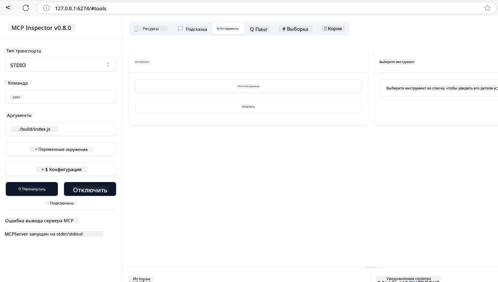

<!--
CO_OP_TRANSLATOR_METADATA:
{
  "original_hash": "ec11ee93f31fdadd94facd3e3d22f9e6",
  "translation_date": "2025-09-09T21:22:34+00:00",
  "source_file": "03-GettingStarted/01-first-server/README.md",
  "language_code": "ru"
}
-->
# Начало работы с MCP

Добро пожаловать в первые шаги с Model Context Protocol (MCP)! Независимо от того, новичок ли вы в MCP или хотите углубить свои знания, этот гид проведет вас через основные этапы настройки и разработки. Вы узнаете, как MCP обеспечивает бесшовную интеграцию между AI-моделями и приложениями, а также как быстро подготовить среду для создания и тестирования решений на основе MCP.

> TLDR; Если вы создаете AI-приложения, вы знаете, что можете добавлять инструменты и другие ресурсы к вашему LLM (large language model), чтобы сделать его более информированным. Однако, если вы разместите эти инструменты и ресурсы на сервере, возможности приложения и сервера могут быть использованы любым клиентом с LLM или без него.

## Обзор

Этот урок предоставляет практическое руководство по настройке среды MCP и созданию ваших первых приложений на основе MCP. Вы узнаете, как настроить необходимые инструменты и фреймворки, создать базовые MCP-серверы, разработать хост-приложения и протестировать ваши реализации.

Model Context Protocol (MCP) — это открытый протокол, который стандартизирует способ предоставления контекста LLM. Представьте MCP как порт USB-C для AI-приложений — он обеспечивает стандартизированный способ подключения AI-моделей к различным источникам данных и инструментам.

## Цели обучения

К концу этого урока вы сможете:

- Настроить среды разработки для MCP на C#, Java, Python, TypeScript и Rust
- Создавать и развертывать базовые MCP-серверы с пользовательскими функциями (ресурсы, подсказки и инструменты)
- Разрабатывать хост-приложения, которые подключаются к MCP-серверам
- Тестировать и отлаживать реализации MCP

## Настройка среды MCP

Перед началом работы с MCP важно подготовить вашу среду разработки и понять базовый рабочий процесс. Этот раздел проведет вас через начальные шаги настройки, чтобы обеспечить плавный старт с MCP.

### Предварительные требования

Перед началом разработки MCP убедитесь, что у вас есть:

- **Среда разработки**: Для выбранного вами языка (C#, Java, Python, TypeScript или Rust)
- **IDE/Редактор**: Visual Studio, Visual Studio Code, IntelliJ, Eclipse, PyCharm или любой современный редактор кода
- **Менеджеры пакетов**: NuGet, Maven/Gradle, pip, npm/yarn или Cargo
- **API-ключи**: Для любых AI-сервисов, которые вы планируете использовать в ваших хост-приложениях

## Базовая структура MCP-сервера

Типичный MCP-сервер включает:

- **Конфигурацию сервера**: Настройка порта, аутентификации и других параметров
- **Ресурсы**: Данные и контекст, доступные для LLM
- **Инструменты**: Функциональность, которую модели могут вызывать
- **Подсказки**: Шаблоны для генерации или структурирования текста

Вот упрощенный пример на TypeScript:

```typescript
import { McpServer, ResourceTemplate } from "@modelcontextprotocol/sdk/server/mcp.js";
import { StdioServerTransport } from "@modelcontextprotocol/sdk/server/stdio.js";
import { z } from "zod";

// Create an MCP server
const server = new McpServer({
  name: "Demo",
  version: "1.0.0"
});

// Add an addition tool
server.tool("add",
  { a: z.number(), b: z.number() },
  async ({ a, b }) => ({
    content: [{ type: "text", text: String(a + b) }]
  })
);

// Add a dynamic greeting resource
server.resource(
  "file",
  // The 'list' parameter controls how the resource lists available files. Setting it to undefined disables listing for this resource.
  new ResourceTemplate("file://{path}", { list: undefined }),
  async (uri, { path }) => ({
    contents: [{
      uri: uri.href,
      text: `File, ${path}!`
    }]
  })
);

// Add a file resource that reads the file contents
server.resource(
  "file",
  new ResourceTemplate("file://{path}", { list: undefined }),
  async (uri, { path }) => {
    let text;
    try {
      text = await fs.readFile(path, "utf8");
    } catch (err) {
      text = `Error reading file: ${err.message}`;
    }
    return {
      contents: [{
        uri: uri.href,
        text
      }]
    };
  }
);

server.prompt(
  "review-code",
  { code: z.string() },
  ({ code }) => ({
    messages: [{
      role: "user",
      content: {
        type: "text",
        text: `Please review this code:\n\n${code}`
      }
    }]
  })
);

// Start receiving messages on stdin and sending messages on stdout
const transport = new StdioServerTransport();
await server.connect(transport);
```

В приведенном выше коде мы:

- Импортируем необходимые классы из MCP SDK для TypeScript.
- Создаем и настраиваем новый экземпляр MCP-сервера.
- Регистрируем пользовательский инструмент (`calculator`) с функцией-обработчиком.
- Запускаем сервер для обработки входящих запросов MCP.

## Тестирование и отладка

Перед началом тестирования вашего MCP-сервера важно понять доступные инструменты и лучшие практики для отладки. Эффективное тестирование гарантирует, что ваш сервер работает как ожидается, и помогает быстро выявлять и устранять проблемы. В следующем разделе описаны рекомендуемые подходы к проверке вашей реализации MCP.

MCP предоставляет инструменты для тестирования и отладки серверов:

- **Инструмент Inspector**: Графический интерфейс, который позволяет подключаться к вашему серверу и тестировать инструменты, подсказки и ресурсы.
- **curl**: Вы также можете подключаться к серверу с помощью командной строки, используя curl или другие клиенты, которые могут создавать и выполнять HTTP-команды.

### Использование MCP Inspector

[MCP Inspector](https://github.com/modelcontextprotocol/inspector) — это визуальный инструмент тестирования, который помогает:

1. **Обнаруживать возможности сервера**: Автоматически определять доступные ресурсы, инструменты и подсказки
2. **Тестировать выполнение инструментов**: Пробовать разные параметры и видеть ответы в реальном времени
3. **Просматривать метаданные сервера**: Изучать информацию о сервере, схемы и конфигурации

```bash
# ex TypeScript, installing and running MCP Inspector
npx @modelcontextprotocol/inspector node build/index.js
```

После выполнения вышеуказанных команд MCP Inspector запустит локальный веб-интерфейс в вашем браузере. Вы увидите панель управления, отображающую зарегистрированные MCP-серверы, их доступные инструменты, ресурсы и подсказки. Интерфейс позволяет интерактивно тестировать выполнение инструментов, изучать метаданные сервера и просматривать ответы в реальном времени, что упрощает проверку и отладку ваших реализаций MCP-сервера.

Вот пример того, как это может выглядеть:



## Частые проблемы при настройке и их решения

| Проблема | Возможное решение |
|----------|-------------------|
| Отказ в подключении | Убедитесь, что сервер запущен и порт указан правильно |
| Ошибки выполнения инструментов | Проверьте валидацию параметров и обработку ошибок |
| Ошибки аутентификации | Убедитесь в правильности API-ключей и разрешений |
| Ошибки проверки схемы | Убедитесь, что параметры соответствуют определенной схеме |
| Сервер не запускается | Проверьте конфликты портов или отсутствующие зависимости |
| Ошибки CORS | Настройте правильные заголовки CORS для запросов из других источников |
| Проблемы с аутентификацией | Проверьте действительность токенов и разрешений |

## Локальная разработка

Для локальной разработки и тестирования вы можете запускать MCP-серверы непосредственно на вашем компьютере:

1. **Запустите процесс сервера**: Запустите приложение MCP-сервера
2. **Настройте сеть**: Убедитесь, что сервер доступен на ожидаемом порту
3. **Подключите клиентов**: Используйте локальные URL-адреса подключения, такие как `http://localhost:3000`

```bash
# Example: Running a TypeScript MCP server locally
npm run start
# Server running at http://localhost:3000
```

## Создание вашего первого MCP-сервера

Мы рассмотрели [Основные концепции](/01-CoreConcepts/README.md) в предыдущем уроке, теперь пришло время применить эти знания на практике.

### Что может делать сервер

Прежде чем начать писать код, давайте напомним себе, что может делать сервер:

MCP-сервер может, например:

- Получать доступ к локальным файлам и базам данных
- Подключаться к удаленным API
- Выполнять вычисления
- Интегрироваться с другими инструментами и сервисами
- Предоставлять пользовательский интерфейс для взаимодействия

Отлично, теперь, когда мы знаем, что он может делать, давайте начнем писать код.

## Упражнение: Создание сервера

Чтобы создать сервер, вам нужно выполнить следующие шаги:

- Установить MCP SDK.
- Создать проект и настроить структуру проекта.
- Написать код сервера.
- Протестировать сервер.

### -1- Создание проекта

#### TypeScript

```sh
# Create project directory and initialize npm project
mkdir calculator-server
cd calculator-server
npm init -y
```

#### Python

```sh
# Create project dir
mkdir calculator-server
cd calculator-server
# Open the folder in Visual Studio Code - Skip this if you are using a different IDE
code .
```

#### .NET

```sh
dotnet new console -n McpCalculatorServer
cd McpCalculatorServer
```

#### Java

Для Java создайте проект Spring Boot:

```bash
curl https://start.spring.io/starter.zip \
  -d dependencies=web \
  -d javaVersion=21 \
  -d type=maven-project \
  -d groupId=com.example \
  -d artifactId=calculator-server \
  -d name=McpServer \
  -d packageName=com.microsoft.mcp.sample.server \
  -o calculator-server.zip
```

Распакуйте zip-файл:

```bash
unzip calculator-server.zip -d calculator-server
cd calculator-server
# optional remove the unused test
rm -rf src/test/java
```

Добавьте следующую полную конфигурацию в ваш файл *pom.xml*:

```xml
<?xml version="1.0" encoding="UTF-8"?>
<project xmlns="http://maven.apache.org/POM/4.0.0"
    xmlns:xsi="http://www.w3.org/2001/XMLSchema-instance"
    xsi:schemaLocation="http://maven.apache.org/POM/4.0.0 http://maven.apache.org/xsd/maven-4.0.0.xsd">
    <modelVersion>4.0.0</modelVersion>
    
    <!-- Spring Boot parent for dependency management -->
    <parent>
        <groupId>org.springframework.boot</groupId>
        <artifactId>spring-boot-starter-parent</artifactId>
        <version>3.5.0</version>
        <relativePath />
    </parent>

    <!-- Project coordinates -->
    <groupId>com.example</groupId>
    <artifactId>calculator-server</artifactId>
    <version>0.0.1-SNAPSHOT</version>
    <name>Calculator Server</name>
    <description>Basic calculator MCP service for beginners</description>

    <!-- Properties -->
    <properties>
        <java.version>21</java.version>
        <maven.compiler.source>21</maven.compiler.source>
        <maven.compiler.target>21</maven.compiler.target>
    </properties>

    <!-- Spring AI BOM for version management -->
    <dependencyManagement>
        <dependencies>
            <dependency>
                <groupId>org.springframework.ai</groupId>
                <artifactId>spring-ai-bom</artifactId>
                <version>1.0.0-SNAPSHOT</version>
                <type>pom</type>
                <scope>import</scope>
            </dependency>
        </dependencies>
    </dependencyManagement>

    <!-- Dependencies -->
    <dependencies>
        <dependency>
            <groupId>org.springframework.ai</groupId>
            <artifactId>spring-ai-starter-mcp-server-webflux</artifactId>
        </dependency>
        <dependency>
            <groupId>org.springframework.boot</groupId>
            <artifactId>spring-boot-starter-actuator</artifactId>
        </dependency>
        <dependency>
         <groupId>org.springframework.boot</groupId>
         <artifactId>spring-boot-starter-test</artifactId>
         <scope>test</scope>
      </dependency>
    </dependencies>

    <!-- Build configuration -->
    <build>
        <plugins>
            <plugin>
                <groupId>org.springframework.boot</groupId>
                <artifactId>spring-boot-maven-plugin</artifactId>
            </plugin>
            <plugin>
                <groupId>org.apache.maven.plugins</groupId>
                <artifactId>maven-compiler-plugin</artifactId>
                <configuration>
                    <release>21</release>
                </configuration>
            </plugin>
        </plugins>
    </build>

    <!-- Repositories for Spring AI snapshots -->
    <repositories>
        <repository>
            <id>spring-milestones</id>
            <name>Spring Milestones</name>
            <url>https://repo.spring.io/milestone</url>
            <snapshots>
                <enabled>false</enabled>
            </snapshots>
        </repository>
        <repository>
            <id>spring-snapshots</id>
            <name>Spring Snapshots</name>
            <url>https://repo.spring.io/snapshot</url>
            <releases>
                <enabled>false</enabled>
            </releases>
        </repository>
    </repositories>
</project>
```

#### Rust

```sh
mkdir calculator-server
cd calculator-server
cargo init
```

### -2- Добавление зависимостей

Теперь, когда ваш проект создан, давайте добавим зависимости:

#### TypeScript

```sh
# If not already installed, install TypeScript globally
npm install typescript -g

# Install the MCP SDK and Zod for schema validation
npm install @modelcontextprotocol/sdk zod
npm install -D @types/node typescript
```

#### Python

```sh
# Create a virtual env and install dependencies
python -m venv venv
venv\Scripts\activate
pip install "mcp[cli]"
```

#### Java

```bash
cd calculator-server
./mvnw clean install -DskipTests
```

#### Rust

```sh
cargo add rmcp --features server,transport-io
cargo add serde
cargo add tokio --features rt-multi-thread
```

### -3- Создание файлов проекта

#### TypeScript

Откройте файл *package.json* и замените его содержимое следующим, чтобы убедиться, что вы можете собрать и запустить сервер:

```json
{
  "name": "calculator-server",
  "version": "1.0.0",
  "main": "index.js",
  "type": "module",
  "scripts": {
    "start": "tsc && node ./build/index.js",
    "build": "tsc && node ./build/index.js"
  },
  "keywords": [],
  "author": "",
  "license": "ISC",
  "description": "A simple calculator server using Model Context Protocol",
  "dependencies": {
    "@modelcontextprotocol/sdk": "^1.16.0",
    "zod": "^3.25.76"
  },
  "devDependencies": {
    "@types/node": "^24.0.14",
    "typescript": "^5.8.3"
  }
}
```

Создайте файл *tsconfig.json* со следующим содержимым:

```json
{
  "compilerOptions": {
    "target": "ES2022",
    "module": "Node16",
    "moduleResolution": "Node16",
    "outDir": "./build",
    "rootDir": "./src",
    "strict": true,
    "esModuleInterop": true,
    "skipLibCheck": true,
    "forceConsistentCasingInFileNames": true
  },
  "include": ["src/**/*"],
  "exclude": ["node_modules"]
}
```

Создайте директорию для исходного кода:

```sh
mkdir src
touch src/index.ts
```

#### Python

Создайте файл *server.py*

```sh
touch server.py
```

#### .NET

Установите необходимые пакеты NuGet:

```sh
dotnet add package ModelContextProtocol --prerelease
dotnet add package Microsoft.Extensions.Hosting
```

#### Java

Для проектов Java Spring Boot структура проекта создается автоматически.

#### Rust

Для Rust файл *src/main.rs* создается по умолчанию при выполнении команды `cargo init`. Откройте файл и удалите стандартный код.

### -4- Написание кода сервера

#### TypeScript

Создайте файл *index.ts* и добавьте следующий код:

```typescript
import { McpServer, ResourceTemplate } from "@modelcontextprotocol/sdk/server/mcp.js";
import { StdioServerTransport } from "@modelcontextprotocol/sdk/server/stdio.js";
import { z } from "zod";
 
// Create an MCP server
const server = new McpServer({
  name: "Calculator MCP Server",
  version: "1.0.0"
});
```

Теперь у вас есть сервер, но он пока ничего не делает. Давайте это исправим.

#### Python

```python
# server.py
from mcp.server.fastmcp import FastMCP

# Create an MCP server
mcp = FastMCP("Demo")
```

#### .NET

```csharp
using Microsoft.Extensions.DependencyInjection;
using Microsoft.Extensions.Hosting;
using Microsoft.Extensions.Logging;
using ModelContextProtocol.Server;
using System.ComponentModel;

var builder = Host.CreateApplicationBuilder(args);
builder.Logging.AddConsole(consoleLogOptions =>
{
    // Configure all logs to go to stderr
    consoleLogOptions.LogToStandardErrorThreshold = LogLevel.Trace;
});

builder.Services
    .AddMcpServer()
    .WithStdioServerTransport()
    .WithToolsFromAssembly();
await builder.Build().RunAsync();

// add features
```

#### Java

Для Java создайте основные компоненты сервера. Сначала измените основной класс приложения:

*src/main/java/com/microsoft/mcp/sample/server/McpServerApplication.java*:

```java
package com.microsoft.mcp.sample.server;

import org.springframework.ai.tool.ToolCallbackProvider;
import org.springframework.ai.tool.method.MethodToolCallbackProvider;
import org.springframework.boot.SpringApplication;
import org.springframework.boot.autoconfigure.SpringBootApplication;
import org.springframework.context.annotation.Bean;
import com.microsoft.mcp.sample.server.service.CalculatorService;

@SpringBootApplication
public class McpServerApplication {

    public static void main(String[] args) {
        SpringApplication.run(McpServerApplication.class, args);
    }
    
    @Bean
    public ToolCallbackProvider calculatorTools(CalculatorService calculator) {
        return MethodToolCallbackProvider.builder().toolObjects(calculator).build();
    }
}
```

Создайте сервис калькулятора *src/main/java/com/microsoft/mcp/sample/server/service/CalculatorService.java*:

```java
package com.microsoft.mcp.sample.server.service;

import org.springframework.ai.tool.annotation.Tool;
import org.springframework.stereotype.Service;

/**
 * Service for basic calculator operations.
 * This service provides simple calculator functionality through MCP.
 */
@Service
public class CalculatorService {

    /**
     * Add two numbers
     * @param a The first number
     * @param b The second number
     * @return The sum of the two numbers
     */
    @Tool(description = "Add two numbers together")
    public String add(double a, double b) {
        double result = a + b;
        return formatResult(a, "+", b, result);
    }

    /**
     * Subtract one number from another
     * @param a The number to subtract from
     * @param b The number to subtract
     * @return The result of the subtraction
     */
    @Tool(description = "Subtract the second number from the first number")
    public String subtract(double a, double b) {
        double result = a - b;
        return formatResult(a, "-", b, result);
    }

    /**
     * Multiply two numbers
     * @param a The first number
     * @param b The second number
     * @return The product of the two numbers
     */
    @Tool(description = "Multiply two numbers together")
    public String multiply(double a, double b) {
        double result = a * b;
        return formatResult(a, "*", b, result);
    }

    /**
     * Divide one number by another
     * @param a The numerator
     * @param b The denominator
     * @return The result of the division
     */
    @Tool(description = "Divide the first number by the second number")
    public String divide(double a, double b) {
        if (b == 0) {
            return "Error: Cannot divide by zero";
        }
        double result = a / b;
        return formatResult(a, "/", b, result);
    }

    /**
     * Calculate the power of a number
     * @param base The base number
     * @param exponent The exponent
     * @return The result of raising the base to the exponent
     */
    @Tool(description = "Calculate the power of a number (base raised to an exponent)")
    public String power(double base, double exponent) {
        double result = Math.pow(base, exponent);
        return formatResult(base, "^", exponent, result);
    }

    /**
     * Calculate the square root of a number
     * @param number The number to find the square root of
     * @return The square root of the number
     */
    @Tool(description = "Calculate the square root of a number")
    public String squareRoot(double number) {
        if (number < 0) {
            return "Error: Cannot calculate square root of a negative number";
        }
        double result = Math.sqrt(number);
        return String.format("√%.2f = %.2f", number, result);
    }

    /**
     * Calculate the modulus (remainder) of division
     * @param a The dividend
     * @param b The divisor
     * @return The remainder of the division
     */
    @Tool(description = "Calculate the remainder when one number is divided by another")
    public String modulus(double a, double b) {
        if (b == 0) {
            return "Error: Cannot divide by zero";
        }
        double result = a % b;
        return formatResult(a, "%", b, result);
    }

    /**
     * Calculate the absolute value of a number
     * @param number The number to find the absolute value of
     * @return The absolute value of the number
     */
    @Tool(description = "Calculate the absolute value of a number")
    public String absolute(double number) {
        double result = Math.abs(number);
        return String.format("|%.2f| = %.2f", number, result);
    }

    /**
     * Get help about available calculator operations
     * @return Information about available operations
     */
    @Tool(description = "Get help about available calculator operations")
    public String help() {
        return "Basic Calculator MCP Service\n\n" +
               "Available operations:\n" +
               "1. add(a, b) - Adds two numbers\n" +
               "2. subtract(a, b) - Subtracts the second number from the first\n" +
               "3. multiply(a, b) - Multiplies two numbers\n" +
               "4. divide(a, b) - Divides the first number by the second\n" +
               "5. power(base, exponent) - Raises a number to a power\n" +
               "6. squareRoot(number) - Calculates the square root\n" + 
               "7. modulus(a, b) - Calculates the remainder of division\n" +
               "8. absolute(number) - Calculates the absolute value\n\n" +
               "Example usage: add(5, 3) will return 5 + 3 = 8";
    }

    /**
     * Format the result of a calculation
     */
    private String formatResult(double a, String operator, double b, double result) {
        return String.format("%.2f %s %.2f = %.2f", a, operator, b, result);
    }
}
```

**Дополнительные компоненты для готового к производству сервиса:**

Создайте конфигурацию запуска *src/main/java/com/microsoft/mcp/sample/server/config/StartupConfig.java*:

```java
package com.microsoft.mcp.sample.server.config;

import org.springframework.boot.CommandLineRunner;
import org.springframework.context.annotation.Bean;
import org.springframework.context.annotation.Configuration;

@Configuration
public class StartupConfig {
    
    @Bean
    public CommandLineRunner startupInfo() {
        return args -> {
            System.out.println("\n" + "=".repeat(60));
            System.out.println("Calculator MCP Server is starting...");
            System.out.println("SSE endpoint: http://localhost:8080/sse");
            System.out.println("Health check: http://localhost:8080/actuator/health");
            System.out.println("=".repeat(60) + "\n");
        };
    }
}
```

Создайте контроллер состояния *src/main/java/com/microsoft/mcp/sample/server/controller/HealthController.java*:

```java
package com.microsoft.mcp.sample.server.controller;

import org.springframework.http.ResponseEntity;
import org.springframework.web.bind.annotation.GetMapping;
import org.springframework.web.bind.annotation.RestController;
import java.time.LocalDateTime;
import java.util.HashMap;
import java.util.Map;

@RestController
public class HealthController {
    
    @GetMapping("/health")
    public ResponseEntity<Map<String, Object>> healthCheck() {
        Map<String, Object> response = new HashMap<>();
        response.put("status", "UP");
        response.put("timestamp", LocalDateTime.now().toString());
        response.put("service", "Calculator MCP Server");
        return ResponseEntity.ok(response);
    }
}
```

Создайте обработчик исключений *src/main/java/com/microsoft/mcp/sample/server/exception/GlobalExceptionHandler.java*:

```java
package com.microsoft.mcp.sample.server.exception;

import org.springframework.http.HttpStatus;
import org.springframework.http.ResponseEntity;
import org.springframework.web.bind.annotation.ExceptionHandler;
import org.springframework.web.bind.annotation.RestControllerAdvice;

@RestControllerAdvice
public class GlobalExceptionHandler {

    @ExceptionHandler(IllegalArgumentException.class)
    public ResponseEntity<ErrorResponse> handleIllegalArgumentException(IllegalArgumentException ex) {
        ErrorResponse error = new ErrorResponse(
            "Invalid_Input", 
            "Invalid input parameter: " + ex.getMessage());
        return new ResponseEntity<>(error, HttpStatus.BAD_REQUEST);
    }

    public static class ErrorResponse {
        private String code;
        private String message;

        public ErrorResponse(String code, String message) {
            this.code = code;
            this.message = message;
        }

        // Getters
        public String getCode() { return code; }
        public String getMessage() { return message; }
    }
}
```

Создайте пользовательский баннер *src/main/resources/banner.txt*:

```text
_____      _            _       _             
 / ____|    | |          | |     | |            
| |     __ _| | ___ _   _| | __ _| |_ ___  _ __ 
| |    / _` | |/ __| | | | |/ _` | __/ _ \| '__|
| |___| (_| | | (__| |_| | | (_| | || (_) | |   
 \_____\__,_|_|\___|\__,_|_|\__,_|\__\___/|_|   
                                                
Calculator MCP Server v1.0
Spring Boot MCP Application
```

#### Rust

Добавьте следующий код в начало файла *src/main.rs*. Это импортирует необходимые библиотеки и модули для вашего MCP-сервера.

```rust
use rmcp::{
    handler::server::{router::tool::ToolRouter, tool::Parameters},
    model::{ServerCapabilities, ServerInfo},
    schemars, tool, tool_handler, tool_router,
    transport::stdio,
    ServerHandler, ServiceExt,
};
use std::error::Error;
```

Сервер калькулятора будет простым и сможет складывать два числа. Давайте создадим структуру для представления запроса калькулятора.

```rust
#[derive(Debug, serde::Deserialize, schemars::JsonSchema)]
pub struct CalculatorRequest {
    pub a: f64,
    pub b: f64,
}
```

Далее создайте структуру для представления сервера калькулятора. Эта структура будет содержать маршрутизатор инструментов, который используется для регистрации инструментов.

```rust
#[derive(Debug, Clone)]
pub struct Calculator {
    tool_router: ToolRouter<Self>,
}
```

Теперь мы можем реализовать структуру `Calculator`, чтобы создать новый экземпляр сервера и реализовать обработчик сервера для предоставления информации о сервере.

```rust
#[tool_router]
impl Calculator {
    pub fn new() -> Self {
        Self {
            tool_router: Self::tool_router(),
        }
    }
}

#[tool_handler]
impl ServerHandler for Calculator {
    fn get_info(&self) -> ServerInfo {
        ServerInfo {
            instructions: Some("A simple calculator tool".into()),
            capabilities: ServerCapabilities::builder().enable_tools().build(),
            ..Default::default()
        }
    }
}
```

Наконец, нам нужно реализовать основную функцию для запуска сервера. Эта функция создаст экземпляр структуры `Calculator` и будет обслуживать его через стандартный ввод/вывод.

```rust
#[tokio::main]
async fn main() -> Result<(), Box<dyn Error>> {
    let service = Calculator::new().serve(stdio()).await?;
    service.waiting().await?;
    Ok(())
}
```

Сервер теперь настроен для предоставления базовой информации о себе. Далее мы добавим инструмент для выполнения сложения.

### -5- Добавление инструмента и ресурса

Добавьте инструмент и ресурс, добавив следующий код:

#### TypeScript

```typescript
server.tool(
  "add",
  { a: z.number(), b: z.number() },
  async ({ a, b }) => ({
    content: [{ type: "text", text: String(a + b) }]
  })
);

server.resource(
  "greeting",
  new ResourceTemplate("greeting://{name}", { list: undefined }),
  async (uri, { name }) => ({
    contents: [{
      uri: uri.href,
      text: `Hello, ${name}!`
    }]
  })
);
```

Ваш инструмент принимает параметры `a` и `b` и выполняет функцию, которая возвращает ответ в формате:

```typescript
{
  contents: [{
    type: "text", content: "some content"
  }]
}
```

Ваш ресурс доступен через строку "greeting" и принимает параметр `name`, возвращая ответ, аналогичный инструменту:

```typescript
{
  uri: "<href>",
  text: "a text"
}
```

#### Python

```python
# Add an addition tool
@mcp.tool()
def add(a: int, b: int) -> int:
    """Add two numbers"""
    return a + b


# Add a dynamic greeting resource
@mcp.resource("greeting://{name}")
def get_greeting(name: str) -> str:
    """Get a personalized greeting"""
    return f"Hello, {name}!"
```

В приведенном выше коде мы:

- Определили инструмент `add`, который принимает параметры `a` и `p`, оба целые числа.
- Создали ресурс под названием `greeting`, который принимает параметр `name`.

#### .NET

Добавьте это в ваш файл Program.cs:

```csharp
[McpServerToolType]
public static class CalculatorTool
{
    [McpServerTool, Description("Adds two numbers")]
    public static string Add(int a, int b) => $"Sum {a + b}";
}
```

#### Java

Инструменты уже были созданы на предыдущем шаге.

#### Rust

Добавьте новый инструмент внутри блока `impl Calculator`:

```rust
#[tool(description = "Adds a and b")]
async fn add(
    &self,
    Parameters(CalculatorRequest { a, b }): Parameters<CalculatorRequest>,
) -> String {
    (a + b).to_string()
}
```

### -6- Финальный код

Добавим последний код, необходимый для запуска сервера:

#### TypeScript

```typescript
// Start receiving messages on stdin and sending messages on stdout
const transport = new StdioServerTransport();
await server.connect(transport);
```

Вот полный код:

```typescript
// index.ts
import { McpServer, ResourceTemplate } from "@modelcontextprotocol/sdk/server/mcp.js";
import { StdioServerTransport } from "@modelcontextprotocol/sdk/server/stdio.js";
import { z } from "zod";

// Create an MCP server
const server = new McpServer({
  name: "Calculator MCP Server",
  version: "1.0.0"
});

// Add an addition tool
server.tool(
  "add",
  { a: z.number(), b: z.number() },
  async ({ a, b }) => ({
    content: [{ type: "text", text: String(a + b) }]
  })
);

// Add a dynamic greeting resource
server.resource(
  "greeting",
  new ResourceTemplate("greeting://{name}", { list: undefined }),
  async (uri, { name }) => ({
    contents: [{
      uri: uri.href,
      text: `Hello, ${name}!`
    }]
  })
);

// Start receiving messages on stdin and sending messages on stdout
const transport = new StdioServerTransport();
server.connect(transport);
```

#### Python

```python
# server.py
from mcp.server.fastmcp import FastMCP

# Create an MCP server
mcp = FastMCP("Demo")


# Add an addition tool
@mcp.tool()
def add(a: int, b: int) -> int:
    """Add two numbers"""
    return a + b


# Add a dynamic greeting resource
@mcp.resource("greeting://{name}")
def get_greeting(name: str) -> str:
    """Get a personalized greeting"""
    return f"Hello, {name}!"

# Main execution block - this is required to run the server
if __name__ == "__main__":
    mcp.run()
```

#### .NET

Создайте файл Program.cs со следующим содержимым:

```csharp
using Microsoft.Extensions.DependencyInjection;
using Microsoft.Extensions.Hosting;
using Microsoft.Extensions.Logging;
using ModelContextProtocol.Server;
using System.ComponentModel;

var builder = Host.CreateApplicationBuilder(args);
builder.Logging.AddConsole(consoleLogOptions =>
{
    // Configure all logs to go to stderr
    consoleLogOptions.LogToStandardErrorThreshold = LogLevel.Trace;
});

builder.Services
    .AddMcpServer()
    .WithStdioServerTransport()
    .WithToolsFromAssembly();
await builder.Build().RunAsync();

[McpServerToolType]
public static class CalculatorTool
{
    [McpServerTool, Description("Adds two numbers")]
    public static string Add(int a, int b) => $"Sum {a + b}";
}
```

#### Java

Ваш полный основной класс приложения должен выглядеть так:

```java
// McpServerApplication.java
package com.microsoft.mcp.sample.server;

import org.springframework.ai.tool.ToolCallbackProvider;
import org.springframework.ai.tool.method.MethodToolCallbackProvider;
import org.springframework.boot.SpringApplication;
import org.springframework.boot.autoconfigure.SpringBootApplication;
import org.springframework.context.annotation.Bean;
import com.microsoft.mcp.sample.server.service.CalculatorService;

@SpringBootApplication
public class McpServerApplication {

    public static void main(String[] args) {
        SpringApplication.run(McpServerApplication.class, args);
    }
    
    @Bean
    public ToolCallbackProvider calculatorTools(CalculatorService calculator) {
        return MethodToolCallbackProvider.builder().toolObjects(calculator).build();
    }
}
```

#### Rust

Финальный код для сервера на Rust должен выглядеть так:

```rust
use rmcp::{
    ServerHandler, ServiceExt,
    handler::server::{router::tool::ToolRouter, tool::Parameters},
    model::{ServerCapabilities, ServerInfo},
    schemars, tool, tool_handler, tool_router,
    transport::stdio,
};
use std::error::Error;

#[derive(Debug, serde::Deserialize, schemars::JsonSchema)]
pub struct CalculatorRequest {
    pub a: f64,
    pub b: f64,
}

#[derive(Debug, Clone)]
pub struct Calculator {
    tool_router: ToolRouter<Self>,
}

#[tool_router]
impl Calculator {
    pub fn new() -> Self {
        Self {
            tool_router: Self::tool_router(),
        }
    }
    
    #[tool(description = "Adds a and b")]
    async fn add(
        &self,
        Parameters(CalculatorRequest { a, b }): Parameters<CalculatorRequest>,
    ) -> String {
        (a + b).to_string()
    }
}

#[tool_handler]
impl ServerHandler for Calculator {
    fn get_info(&self) -> ServerInfo {
        ServerInfo {
            instructions: Some("A simple calculator tool".into()),
            capabilities: ServerCapabilities::builder().enable_tools().build(),
            ..Default::default()
        }
    }
}

#[tokio::main]
async fn main() -> Result<(), Box<dyn Error>> {
    let service = Calculator::new().serve(stdio()).await?;
    service.waiting().await?;
    Ok(())
}
```

### -7- Тестирование сервера

Запустите сервер с помощью следующей команды:

#### TypeScript

```sh
npm run build
```

#### Python

```sh
mcp run server.py
```

> Чтобы использовать MCP Inspector, используйте `mcp dev server.py`, который автоматически запускает Inspector и предоставляет необходимый токен сеанса прокси. Если вы используете `mcp run server.py`, вам нужно будет вручную запустить Inspector и настроить подключение.

#### .NET

Убедитесь, что вы находитесь в директории вашего проекта:

```sh
cd McpCalculatorServer
dotnet run
```

#### Java

```bash
./mvnw clean install -DskipTests
java -jar target/calculator-server-0.0.1-SNAPSHOT.jar
```

#### Rust

Выполните следующие команды для форматирования и запуска сервера:

```sh
cargo fmt
cargo run
```

### -8- Запуск с использованием Inspector

Inspector — это отличный инструмент, который может запустить ваш сервер и позволяет взаимодействовать с ним, чтобы проверить его работу. Давайте его запустим:

> [!NOTE]
> В поле "command" может отображаться другая команда, так как она содержит команду для запуска сервера с вашим конкретным runtime.

#### TypeScript

```sh
npx @modelcontextprotocol/inspector node build/index.js
```

или добавьте это в ваш *package.json* как `"inspector": "npx @modelcontextprotocol/inspector node build/index.js"` и затем выполните `npm run inspector`.

Python использует инструмент Node.js под названием inspector. Его можно вызвать следующим образом:

```sh
mcp dev server.py
```

Однако он не реализует все доступные методы инструмента, поэтому рекомендуется запускать инструмент Node.js напрямую, как показано ниже:

```sh
npx @modelcontextprotocol/inspector mcp run server.py
```

Если вы используете инструмент или IDE, который позволяет настраивать команды и аргументы для запуска скриптов, убедитесь, что в поле `Command` указано `python`, а в `Arguments` — `server.py`. Это гарантирует правильный запуск скрипта.

#### .NET

Убедитесь, что вы находитесь в директории вашего проекта:

```sh
cd McpCalculatorServer
npx @modelcontextprotocol/inspector dotnet run
```

#### Java

Убедитесь, что сервер калькулятора запущен. Затем запустите Inspector:

```cmd
npx @modelcontextprotocol/inspector
```

В веб-интерфейсе Inspector:

1. Выберите "SSE" как тип транспорта
2. Установите URL: `http://localhost:8080/sse`
3. Нажмите "Connect"


**Теперь вы подключены к серверу**  
**Раздел тестирования Java-сервера завершен**

Следующий раздел посвящен взаимодействию с сервером.

Вы должны увидеть следующий пользовательский интерфейс:


1. Подключитесь к серверу, выбрав кнопку "Connect".  
   После подключения к серверу вы должны увидеть следующее:

   

2. Выберите "Tools" и "listTools", затем вы должны увидеть "Add". Выберите "Add" и заполните значения параметров.

   Вы должны увидеть следующий ответ, то есть результат работы инструмента "add":

   

Поздравляем, вы успешно создали и запустили свой первый сервер!

#### Rust

Чтобы запустить сервер на Rust с помощью MCP Inspector CLI, используйте следующую команду:

```sh
npx @modelcontextprotocol/inspector cargo run --cli --method tools/call --tool-name add --tool-arg a=1 b=2
```

### Официальные SDK

MCP предоставляет официальные SDK для нескольких языков:

- [C# SDK](https://github.com/modelcontextprotocol/csharp-sdk) - поддерживается совместно с Microsoft
- [Java SDK](https://github.com/modelcontextprotocol/java-sdk) - поддерживается совместно с Spring AI
- [TypeScript SDK](https://github.com/modelcontextprotocol/typescript-sdk) - официальная реализация на TypeScript
- [Python SDK](https://github.com/modelcontextprotocol/python-sdk) - официальная реализация на Python
- [Kotlin SDK](https://github.com/modelcontextprotocol/kotlin-sdk) - официальная реализация на Kotlin
- [Swift SDK](https://github.com/modelcontextprotocol/swift-sdk) - поддерживается совместно с Loopwork AI
- [Rust SDK](https://github.com/modelcontextprotocol/rust-sdk) - официальная реализация на Rust

## Основные выводы

- Настройка среды разработки MCP проста благодаря SDK для конкретных языков.
- Создание серверов MCP включает разработку и регистрацию инструментов с четкими схемами.
- Тестирование и отладка необходимы для надежной реализации MCP.

## Примеры

- [Java Calculator](../samples/java/calculator/README.md)  
- [.Net Calculator](../../../../03-GettingStarted/samples/csharp)  
- [JavaScript Calculator](../samples/javascript/README.md)  
- [TypeScript Calculator](../samples/typescript/README.md)  
- [Python Calculator](../../../../03-GettingStarted/samples/python)  
- [Rust Calculator](../../../../03-GettingStarted/samples/rust)  

## Задание

Создайте простой сервер MCP с инструментом на ваш выбор:

1. Реализуйте инструмент на предпочитаемом языке (.NET, Java, Python, TypeScript или Rust).  
2. Определите входные параметры и возвращаемые значения.  
3. Запустите инструмент инспектора, чтобы убедиться, что сервер работает корректно.  
4. Протестируйте реализацию с различными входными данными.

## Решение

[Решение](./solution/README.md)

## Дополнительные ресурсы

- [Создание агентов с использованием Model Context Protocol на Azure](https://learn.microsoft.com/azure/developer/ai/intro-agents-mcp)  
- [Удаленный MCP с Azure Container Apps (Node.js/TypeScript/JavaScript)](https://learn.microsoft.com/samples/azure-samples/mcp-container-ts/mcp-container-ts/)  
- [.NET OpenAI MCP Agent](https://learn.microsoft.com/samples/azure-samples/openai-mcp-agent-dotnet/openai-mcp-agent-dotnet/)  

## Что дальше

Далее: [Начало работы с MCP-клиентами](../02-client/README.md)  

---

**Отказ от ответственности**:  
Этот документ был переведен с помощью сервиса автоматического перевода [Co-op Translator](https://github.com/Azure/co-op-translator). Несмотря на наши усилия обеспечить точность, автоматические переводы могут содержать ошибки или неточности. Оригинальный документ на его родном языке следует считать авторитетным источником. Для получения критически важной информации рекомендуется профессиональный перевод человеком. Мы не несем ответственности за любые недоразумения или неправильные интерпретации, возникшие в результате использования данного перевода.