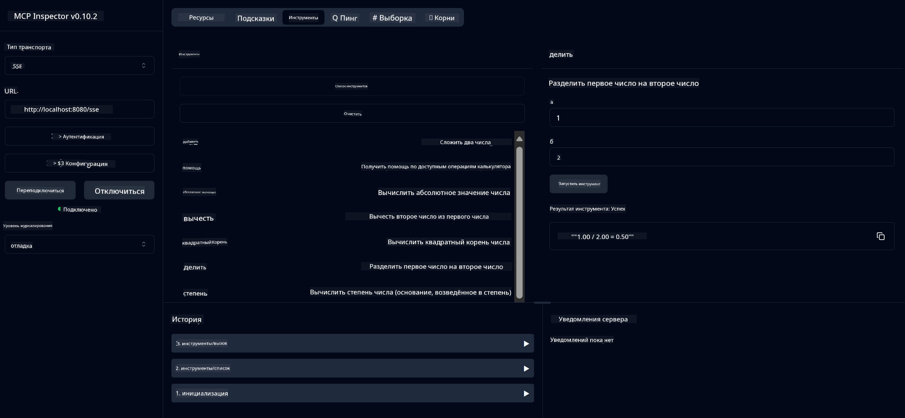

<!--
CO_OP_TRANSLATOR_METADATA:
{
  "original_hash": "ed9cab32cc67c12d8969b407aa47100a",
  "translation_date": "2025-07-13T17:51:55+00:00",
  "source_file": "03-GettingStarted/01-first-server/solution/java/README.md",
  "language_code": "ru"
}
-->
# Сервис базового калькулятора MCP

Этот сервис предоставляет базовые операции калькулятора через протокол Model Context Protocol (MCP) с использованием Spring Boot и транспорта WebFlux. Он создан как простой пример для начинающих, изучающих реализацию MCP.

Для получения дополнительной информации смотрите справочную документацию [MCP Server Boot Starter](https://docs.spring.io/spring-ai/reference/api/mcp/mcp-server-boot-starter-docs.html).


## Использование сервиса

Сервис предоставляет следующие API-эндпоинты через протокол MCP:

- `add(a, b)`: Сложить два числа
- `subtract(a, b)`: Вычесть второе число из первого
- `multiply(a, b)`: Умножить два числа
- `divide(a, b)`: Разделить первое число на второе (с проверкой на ноль)
- `power(base, exponent)`: Возвести число в степень
- `squareRoot(number)`: Вычислить квадратный корень (с проверкой на отрицательное число)
- `modulus(a, b)`: Вычислить остаток от деления
- `absolute(number)`: Вычислить абсолютное значение

## Зависимости

Проект требует следующих ключевых зависимостей:

```xml
<dependency>
    <groupId>org.springframework.ai</groupId>
    <artifactId>spring-ai-starter-mcp-server-webflux</artifactId>
</dependency>
```

## Сборка проекта

Соберите проект с помощью Maven:
```bash
./mvnw clean install -DskipTests
```

## Запуск сервера

### Использование Java

```bash
java -jar target/calculator-server-0.0.1-SNAPSHOT.jar
```

### Использование MCP Inspector

MCP Inspector — удобный инструмент для взаимодействия с MCP-сервисами. Чтобы использовать его с этим калькулятором:

1. **Установите и запустите MCP Inspector** в новом окне терминала:
   ```bash
   npx @modelcontextprotocol/inspector
   ```

2. **Откройте веб-интерфейс**, перейдя по URL, который покажет приложение (обычно http://localhost:6274)

3. **Настройте подключение**:
   - Выберите тип транспорта "SSE"
   - Укажите URL SSE-эндпоинта вашего запущенного сервера: `http://localhost:8080/sse`
   - Нажмите "Connect"

4. **Используйте инструменты**:
   - Нажмите "List Tools", чтобы увидеть доступные операции калькулятора
   - Выберите инструмент и нажмите "Run Tool" для выполнения операции



**Отказ от ответственности**:  
Этот документ был переведен с помощью сервиса автоматического перевода [Co-op Translator](https://github.com/Azure/co-op-translator). Несмотря на наши усилия по обеспечению точности, просим учитывать, что автоматический перевод может содержать ошибки или неточности. Оригинальный документ на его исходном языке следует считать авторитетным источником. Для получения критически важной информации рекомендуется обращаться к профессиональному переводу, выполненному человеком. Мы не несем ответственности за любые недоразумения или неправильные толкования, возникшие в результате использования данного перевода.