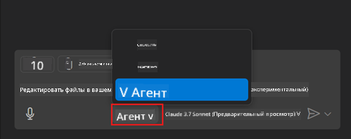
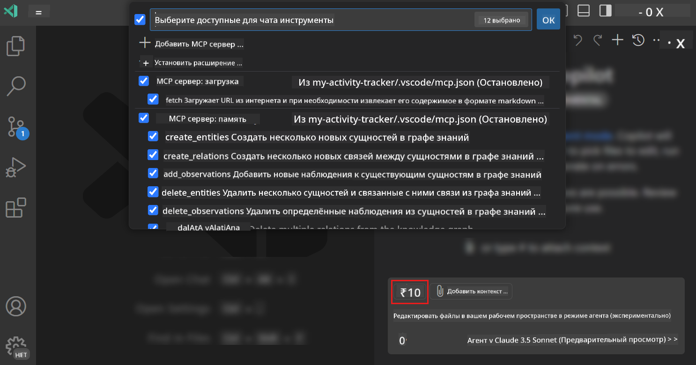
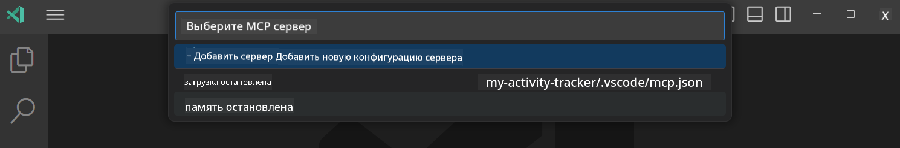
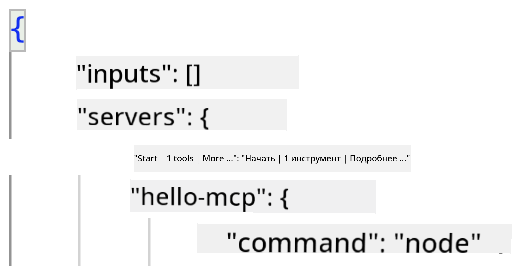
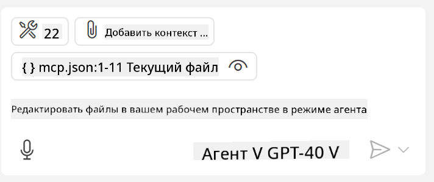

<!--
CO_OP_TRANSLATOR_METADATA:
{
  "original_hash": "d940b5e0af75e3a3a4d1c3179120d1d9",
  "translation_date": "2025-08-26T17:07:01+00:00",
  "source_file": "03-GettingStarted/04-vscode/README.md",
  "language_code": "ru"
}
-->
# Использование сервера в режиме агента GitHub Copilot

Visual Studio Code и GitHub Copilot могут выступать в роли клиента и взаимодействовать с MCP сервером. Зачем это нужно, спросите вы? Это означает, что любые функции MCP сервера теперь можно использовать прямо из вашей IDE. Представьте, что вы добавили, например, MCP сервер GitHub — это позволит управлять GitHub с помощью подсказок вместо ввода конкретных команд в терминале. Или представьте что-то, что в целом улучшит ваш опыт разработки, управляемое с помощью естественного языка. Теперь вы понимаете, в чем преимущество, верно?

## Обзор

В этом уроке мы рассмотрим, как использовать Visual Studio Code и режим агента GitHub Copilot в качестве клиента для вашего MCP сервера.

## Цели обучения

К концу этого урока вы сможете:

- Использовать MCP сервер через Visual Studio Code.
- Запускать функции, такие как инструменты, через GitHub Copilot.
- Настраивать Visual Studio Code для поиска и управления вашим MCP сервером.

## Использование

Вы можете управлять вашим MCP сервером двумя способами:

- Через пользовательский интерфейс. Как это сделать, будет показано позже в этой главе.
- Через терминал. Вы можете управлять сервером из терминала, используя исполняемый файл `code`:

  Чтобы добавить MCP сервер в ваш пользовательский профиль, используйте команду `--add-mcp` и предоставьте конфигурацию сервера в формате JSON: {\"name\":\"server-name\",\"command\":...}.

  ```
  code --add-mcp "{\"name\":\"my-server\",\"command\": \"uvx\",\"args\": [\"mcp-server-fetch\"]}"
  ```

### Скриншоты





Давайте подробнее обсудим, как использовать визуальный интерфейс, в следующих разделах.

## Подход

Вот общий подход к выполнению задачи:

- Настроить файл для поиска вашего MCP сервера.
- Запустить/подключиться к серверу, чтобы получить список его возможностей.
- Использовать эти возможности через интерфейс чата GitHub Copilot.

Отлично, теперь, когда мы понимаем общий процесс, давайте попробуем использовать MCP сервер через Visual Studio Code в рамках упражнения.

## Упражнение: Использование сервера

В этом упражнении мы настроим Visual Studio Code для поиска вашего MCP сервера, чтобы его можно было использовать через интерфейс чата GitHub Copilot.

### -0- Предварительный шаг: включение обнаружения MCP сервера

Возможно, вам потребуется включить обнаружение MCP серверов.

1. Перейдите в `Файл -> Настройки -> Параметры` в Visual Studio Code.

1. Найдите "MCP" и включите параметр `chat.mcp.discovery.enabled` в файле settings.json.

### -1- Создание конфигурационного файла

Начните с создания конфигурационного файла в корне вашего проекта. Вам понадобится файл с именем MCP.json, который нужно поместить в папку .vscode. Он должен выглядеть следующим образом:

```text
.vscode
|-- mcp.json
```

Теперь давайте посмотрим, как добавить запись о сервере.

### -2- Настройка сервера

Добавьте следующий контент в файл *mcp.json*:

```json
{
    "inputs": [],
    "servers": {
       "hello-mcp": {
           "command": "node",
           "args": [
               "build/index.js"
           ]
       }
    }
}
```

Приведенный выше пример показывает, как запустить сервер, написанный на Node.js. Для других сред выполнения укажите соответствующую команду для запуска сервера, используя `command` и `args`.

### -3- Запуск сервера

Теперь, когда вы добавили запись, давайте запустим сервер:

1. Найдите вашу запись в *mcp.json* и убедитесь, что вы видите значок "воспроизведения":

    

1. Нажмите на значок "воспроизведения". Вы должны увидеть, как значок инструментов в чате GitHub Copilot увеличивает количество доступных инструментов. Если вы нажмете на этот значок инструментов, вы увидите список зарегистрированных инструментов. Вы можете отметить/снять отметку с каждого инструмента в зависимости от того, хотите ли вы, чтобы GitHub Copilot использовал их как контекст:

  

1. Чтобы запустить инструмент, введите подсказку, которая соответствует описанию одного из ваших инструментов, например, такую подсказку: "add 22 to 1":

  

  Вы должны увидеть ответ "23".

## Задание

Попробуйте добавить запись о сервере в ваш файл *mcp.json* и убедитесь, что вы можете запускать/останавливать сервер. Убедитесь также, что вы можете взаимодействовать с инструментами на вашем сервере через интерфейс чата GitHub Copilot.

## Решение

[Решение](./solution/README.md)

## Основные выводы

Основные выводы из этой главы:

- Visual Studio Code — отличный клиент, который позволяет использовать несколько MCP серверов и их инструменты.
- Интерфейс чата GitHub Copilot — это способ взаимодействия с серверами.
- Вы можете запрашивать у пользователя ввод, например, API ключи, которые можно передать MCP серверу при настройке записи о сервере в файле *mcp.json*.

## Примеры

- [Калькулятор на Java](../samples/java/calculator/README.md)
- [Калькулятор на .Net](../../../../03-GettingStarted/samples/csharp)
- [Калькулятор на JavaScript](../samples/javascript/README.md)
- [Калькулятор на TypeScript](../samples/typescript/README.md)
- [Калькулятор на Python](../../../../03-GettingStarted/samples/python)

## Дополнительные ресурсы

- [Документация Visual Studio](https://code.visualstudio.com/docs/copilot/chat/mcp-servers)

## Что дальше

- Далее: [Создание stdio сервера](../05-stdio-server/README.md)

---

**Отказ от ответственности**:  
Этот документ был переведен с помощью сервиса автоматического перевода [Co-op Translator](https://github.com/Azure/co-op-translator). Несмотря на наши усилия обеспечить точность, автоматические переводы могут содержать ошибки или неточности. Оригинальный документ на его родном языке следует считать авторитетным источником. Для получения критически важной информации рекомендуется профессиональный перевод человеком. Мы не несем ответственности за любые недоразумения или неправильные интерпретации, возникшие в результате использования данного перевода.