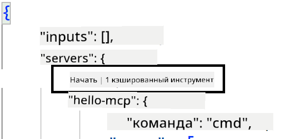
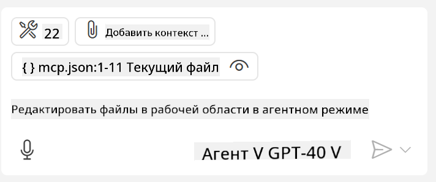

<!--
CO_OP_TRANSLATOR_METADATA:
{
  "original_hash": "c37fabfbc0dcbc9a4afb6d17e7d3be9f",
  "translation_date": "2025-05-17T11:00:19+00:00",
  "source_file": "03-GettingStarted/04-vscode/README.md",
  "language_code": "ru"
}
-->
Давайте подробнее поговорим о том, как мы используем визуальный интерфейс в следующих разделах.

## Подход

Вот как мы должны подойти к этому на высоком уровне:

- Настроить файл для поиска нашего MCP сервера.
- Запустить/подключиться к этому серверу, чтобы он перечислил свои возможности.
- Использовать эти возможности через интерфейс чата GitHub Copilot.

Отлично, теперь, когда мы понимаем процесс, давайте попробуем использовать MCP сервер через Visual Studio Code на практике.

## Упражнение: Использование сервера

В этом упражнении мы настроим Visual Studio Code для поиска вашего MCP сервера, чтобы его можно было использовать через интерфейс чата GitHub Copilot.

### -0- Подготовительный шаг, включение обнаружения MCP сервера

Возможно, вам потребуется включить обнаружение MCP серверов.

1. Перейдите в `File -> Preferences -> Settings` in Visual Studio Code.

1. Search for "MCP" and enable `chat.mcp.discovery.enabled` в файле settings.json.

### -1- Создание конфигурационного файла

Начните с создания конфигурационного файла в корне вашего проекта, вам понадобится файл под названием MCP.json и разместить его в папке .vscode. Он должен выглядеть следующим образом:

```text
.vscode
|-- mcp.json
```

Далее, давайте посмотрим, как мы можем добавить запись о сервере.

### -2- Настройка сервера

Добавьте следующее содержимое в *mcp.json*:

```json
{
    "inputs": [],
    "servers": {
       "hello-mcp": {
           "command": "cmd",
           "args": [
               "/c", "node", "<absolute path>\\build\\index.js"
           ]
       }
    }
}
```

Простой пример выше показывает, как запустить сервер, написанный на Node.js, для других сред выполнения укажите правильную команду для запуска сервера, используя `command` and `args`.

### -3- Запуск сервера

Теперь, когда вы добавили запись, давайте запустим сервер:

1. Найдите вашу запись в *mcp.json* и убедитесь, что вы видите значок "воспроизведения":

    

1. Нажмите на значок "воспроизведения", вы должны увидеть, как значок инструментов в чате GitHub Copilot увеличивает количество доступных инструментов. Если вы нажмете на этот значок инструментов, вы увидите список зарегистрированных инструментов. Вы можете отмечать/снимать отметки с каждого инструмента в зависимости от того, хотите ли вы, чтобы GitHub Copilot использовал их в качестве контекста:

  

1. Чтобы запустить инструмент, введите запрос, который, как вы знаете, будет соответствовать описанию одного из ваших инструментов, например, запрос "добавить 22 к 1":

  

  Вы должны увидеть ответ, равный 23.

## Задание

Попробуйте добавить запись о сервере в ваш файл *mcp.json* и убедитесь, что вы можете запустить/остановить сервер. Убедитесь, что вы также можете взаимодействовать с инструментами на вашем сервере через интерфейс чата GitHub Copilot.

## Решение

[Решение](./solution/README.md)

## Основные выводы

Основные выводы из этой главы следующие:

- Visual Studio Code - отличный клиент, который позволяет использовать несколько MCP серверов и их инструменты.
- Интерфейс чата GitHub Copilot - это способ взаимодействия с серверами.
- Вы можете запрашивать у пользователя ввод данных, таких как API ключи, которые могут быть переданы MCP серверу при настройке записи о сервере в файле *mcp.json*.

## Примеры

- [Калькулятор на Java](../samples/java/calculator/README.md)
- [Калькулятор на .Net](../../../../03-GettingStarted/samples/csharp)
- [Калькулятор на JavaScript](../samples/javascript/README.md)
- [Калькулятор на TypeScript](../samples/typescript/README.md)
- [Калькулятор на Python](../../../../03-GettingStarted/samples/python)

## Дополнительные ресурсы

- [Документация Visual Studio](https://code.visualstudio.com/docs/copilot/chat/mcp-servers)

## Что дальше

- Далее: [Создание SSE сервера](/03-GettingStarted/05-sse-server/README.md)

**Отказ от ответственности**:  
Этот документ был переведен с помощью службы автоматического перевода [Co-op Translator](https://github.com/Azure/co-op-translator). Хотя мы стремимся к точности, пожалуйста, имейте в виду, что автоматические переводы могут содержать ошибки или неточности. Оригинальный документ на его родном языке следует считать авторитетным источником. Для получения критической информации рекомендуется профессиональный перевод человеком. Мы не несем ответственности за любые недоразумения или неправильные интерпретации, возникающие в результате использования этого перевода.