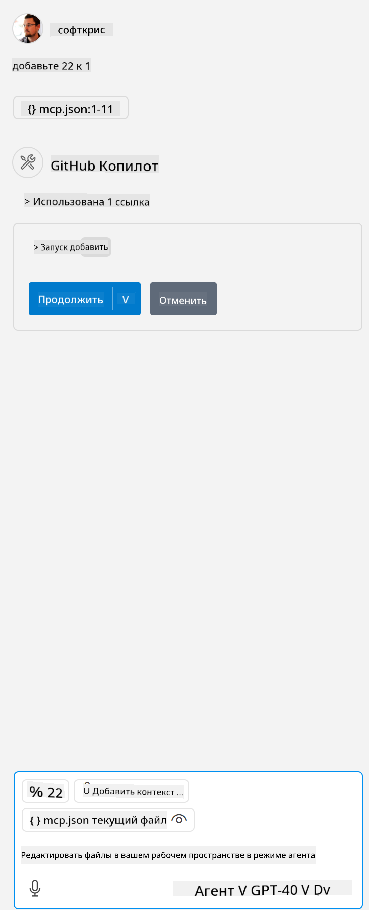

<!--
CO_OP_TRANSLATOR_METADATA:
{
  "original_hash": "96e08a8c1049dab757deb64cce4ea1e8",
  "translation_date": "2025-05-17T11:18:02+00:00",
  "source_file": "03-GettingStarted/04-vscode/solution/README.md",
  "language_code": "ru"
}
-->
# Запуск примера

Здесь мы предполагаем, что у вас уже есть рабочий код сервера. Пожалуйста, найдите сервер из одной из предыдущих глав.

## Настройка mcp.json

Вот файл, который вы используете в качестве справочного, [mcp.json](../../../../../03-GettingStarted/04-vscode/solution/mcp.json).

Измените запись сервера по мере необходимости, чтобы указать абсолютный путь к вашему серверу, включая полную команду для запуска.

В приведенном выше примере файл записи сервера выглядит следующим образом:

```json
"hello-mcp": {
    "command": "cmd",
    "args": [
        "/c", "node", "<absolute path>\\build\\index.js"
    ]
}
```

Это соответствует запуску команды, такой как: `cmd /c node <absolute path>\\build\index.js`. 

- Change this server entry to fit where your server file is located or to what's needed to startup your server depending on your chosen runtime and server location.

## Consume the features in the server

- Click the `play` icon, once you've added *mcp.json* to *./vscode* folder, 

    Observe the tooling icon change to increase the number of available tools. Tooling icon is located right above the chat field in GitHub Copilot.

## Run a tool

- Type a prompt in your chat window that matches the description of your tool. For example to trigger the tool `add` введите что-то вроде "добавить 3 к 20".

Вы должны увидеть инструмент, отображаемый над текстовым полем чата, указывающий, что вы должны выбрать запуск инструмента, как на этом изображении:



Выбор инструмента должен дать числовой результат "23", если ваш запрос был таким, как мы упомянули ранее.

**Отказ от ответственности**:  
Этот документ был переведен с помощью службы автоматического перевода [Co-op Translator](https://github.com/Azure/co-op-translator). Мы стремимся к точности, однако, пожалуйста, учитывайте, что автоматические переводы могут содержать ошибки или неточности. Оригинальный документ на его родном языке следует считать авторитетным источником. Для критически важной информации рекомендуется профессиональный перевод человеком. Мы не несем ответственности за любые недоразумения или неверные толкования, возникшие в результате использования этого перевода.