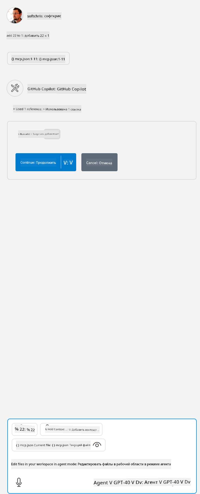

<!--
CO_OP_TRANSLATOR_METADATA:
{
  "original_hash": "5ef8f5821c1a04f7b1fc4f15098ecab8",
  "translation_date": "2025-07-13T19:38:50+00:00",
  "source_file": "03-GettingStarted/04-vscode/solution/README.md",
  "language_code": "ru"
}
-->
Это соответствует выполнению команды вида: `node build/index.js`.

- Измените этот параметр сервера так, чтобы он указывал на расположение вашего серверного файла или соответствовал необходимой команде запуска сервера в зависимости от выбранного времени выполнения и местоположения сервера.

## Использование функций на сервере

- Нажмите на иконку `play`, после того как вы добавите *mcp.json* в папку *./vscode*,

    Обратите внимание, что иконка инструментов изменится, увеличив количество доступных инструментов. Иконка инструментов расположена прямо над полем чата в GitHub Copilot.

## Запуск инструмента

- Введите запрос в окно чата, который соответствует описанию вашего инструмента. Например, чтобы вызвать инструмент `add`, введите что-то вроде "add 3 to 20".

    Вы увидите, что над текстовым полем чата появится инструмент, предлагающий выбрать его для запуска, как показано на этом изображении:

    

    Выбор инструмента должен вывести числовой результат "23", если ваш запрос был таким, как мы указали выше.

**Отказ от ответственности**:  
Этот документ был переведен с помощью сервиса автоматического перевода [Co-op Translator](https://github.com/Azure/co-op-translator). Несмотря на наши усилия по обеспечению точности, просим учитывать, что автоматический перевод может содержать ошибки или неточности. Оригинальный документ на его исходном языке следует считать авторитетным источником. Для получения критически важной информации рекомендуется обращаться к профессиональному переводу, выполненному человеком. Мы не несем ответственности за любые недоразумения или неправильные толкования, возникшие в результате использования данного перевода.