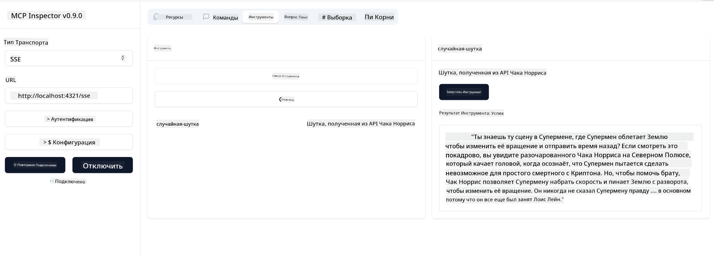

<!--
CO_OP_TRANSLATOR_METADATA:
{
  "original_hash": "0a8086dc4bf89448f83e7936db972c42",
  "translation_date": "2025-05-17T11:25:41+00:00",
  "source_file": "03-GettingStarted/05-sse-server/README.md",
  "language_code": "ru"
}
-->
Теперь, когда мы знаем немного больше о SSE, давайте создадим SSE сервер.

## Упражнение: Создание SSE сервера

Чтобы создать наш сервер, нужно помнить о двух вещах:

- Нам нужно использовать веб-сервер для открытия конечных точек для соединения и сообщений.
- Построить наш сервер так же, как мы обычно это делаем с инструментами, ресурсами и подсказками, когда мы использовали stdio.

### -1- Создание экземпляра сервера

Для создания нашего сервера мы используем те же типы, что и с stdio. Однако для транспорта нам нужно выбрать SSE.

Давайте добавим необходимые маршруты.

### -2- Добавление маршрутов

Давайте добавим маршруты, которые будут обрабатывать соединение и входящие сообщения:

Давайте добавим возможности серверу.

### -3- Добавление возможностей серверу

Теперь, когда мы определили все, что связано с SSE, давайте добавим возможности серверу, такие как инструменты, подсказки и ресурсы.

Ваш полный код должен выглядеть следующим образом:

Отлично, у нас есть сервер, использующий SSE, давайте теперь протестируем его.

## Упражнение: Отладка SSE сервера с помощью Inspector

Inspector — отличный инструмент, который мы видели в предыдущем уроке [Создание вашего первого сервера](/03-GettingStarted/01-first-server/README.md). Давайте посмотрим, сможем ли мы использовать Inspector и здесь:

### -1- Запуск Inspector

Чтобы запустить Inspector, сначала необходимо, чтобы SSE сервер был запущен, так что давайте сделаем это:

1. Запустите сервер

1. Запустите Inspector

    > ![NOTE]
    > Запустите это в отдельном окне терминала от того, в котором работает сервер. Также обратите внимание, что вам нужно будет настроить команду ниже, чтобы она соответствовала URL, где работает ваш сервер.

    ```sh
    npx @modelcontextprotocol/inspector --cli http://localhost:8000/sse --method tools/list
    ```

    Запуск Inspector выглядит одинаково во всех средах выполнения. Обратите внимание, как вместо передачи пути к нашему серверу и команды для его запуска мы передаем URL, где сервер работает, и также указываем маршрут `/sse`.

### -2- Испытание инструмента

Подключите сервер, выбрав SSE в выпадающем списке и заполнив поле URL, где работает ваш сервер, например http:localhost:4321/sse. Теперь нажмите кнопку "Connect". Как и прежде, выберите список инструментов, выберите инструмент и введите входные значения. Вы должны увидеть результат, как ниже:



Отлично, вы можете работать с Inspector, давайте теперь посмотрим, как можно работать с Visual Studio Code.

## Задание

Попробуйте расширить ваш сервер, добавив больше возможностей. Посмотрите [эту страницу](https://api.chucknorris.io/), чтобы, например, добавить инструмент, который вызывает API, вы сами решаете, как должен выглядеть сервер. Удачи :)

## Решение

[Решение](./solution/README.md) Вот возможное решение с работающим кодом.

## Основные выводы

Основные выводы из этой главы следующие:

- SSE — это второй поддерживаемый транспорт наряду с stdio.
- Чтобы поддерживать SSE, вам нужно управлять входящими соединениями и сообщениями с помощью веб-фреймворка.
- Вы можете использовать как Inspector, так и Visual Studio Code для работы с SSE сервером, так же как и с серверами stdio. Обратите внимание, что есть небольшие различия между stdio и SSE. Для SSE вам нужно отдельно запустить сервер, а затем запустить ваш инструмент Inspector. Для инструмента Inspector также есть некоторые различия в том, что вам нужно указать URL.

## Примеры

- [Калькулятор на Java](../samples/java/calculator/README.md)
- [.Net Калькулятор](../../../../03-GettingStarted/samples/csharp)
- [Калькулятор на JavaScript](../samples/javascript/README.md)
- [Калькулятор на TypeScript](../samples/typescript/README.md)
- [Калькулятор на Python](../../../../03-GettingStarted/samples/python)

## Дополнительные ресурсы

- [SSE](https://developer.mozilla.org/en-US/docs/Web/API/Server-sent_events)

## Что дальше

- Далее: [Начало работы с AI Toolkit для VSCode](/03-GettingStarted/06-aitk/README.md)

**Отказ от ответственности**:  
Этот документ был переведен с помощью службы автоматического перевода [Co-op Translator](https://github.com/Azure/co-op-translator). Мы стремимся к точности, однако, пожалуйста, учтите, что автоматизированные переводы могут содержать ошибки или неточности. Оригинальный документ на его родном языке следует считать авторитетным источником. Для критически важной информации рекомендуется профессиональный перевод человеком. Мы не несем ответственности за любые недоразумения или неверные толкования, возникающие в результате использования этого перевода.