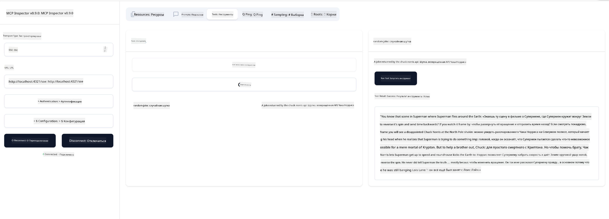

<!--
CO_OP_TRANSLATOR_METADATA:
{
  "original_hash": "d90ca3d326c48fab2ac0ebd3a9876f59",
  "translation_date": "2025-07-13T19:48:44+00:00",
  "source_file": "03-GettingStarted/05-sse-server/README.md",
  "language_code": "ru"
}
-->
Теперь, когда мы немного больше узнали о SSE, давайте создадим SSE-сервер.

## Упражнение: Создание SSE-сервера

Чтобы создать наш сервер, нужно помнить о двух вещах:

- Нам нужен веб-сервер для предоставления конечных точек для подключения и сообщений.
- Строим сервер так же, как обычно, используя инструменты, ресурсы и подсказки, как мы делали с stdio.

### -1- Создание экземпляра сервера

Для создания сервера мы используем те же типы, что и с stdio. Однако для транспорта нужно выбрать SSE.

---

Давайте добавим необходимые маршруты.

### -2- Добавление маршрутов

Добавим маршруты, которые будут обрабатывать подключение и входящие сообщения:

---

Теперь добавим возможности серверу.

### -3- Добавление возможностей серверу

Теперь, когда мы определили все, что связано с SSE, добавим возможности сервера, такие как инструменты, подсказки и ресурсы.

---

Ваш полный код должен выглядеть так:

---

Отлично, у нас есть сервер на SSE, давайте теперь его протестируем.

## Упражнение: Отладка SSE-сервера с помощью Inspector

Inspector — отличный инструмент, который мы уже видели в предыдущем уроке [Создание вашего первого сервера](/03-GettingStarted/01-first-server/README.md). Посмотрим, сможем ли мы использовать Inspector и здесь:

### -1- Запуск Inspector

Для запуска Inspector сначала нужно запустить SSE-сервер, сделаем это:

1. Запустите сервер

---

1. Запустите Inspector

    > ![NOTE]
    > Запускайте это в отдельном окне терминала, отличном от того, где запущен сервер. Также обратите внимание, что команду ниже нужно подстроить под URL, по которому работает ваш сервер.

    ```sh
    npx @modelcontextprotocol/inspector --cli http://localhost:8000/sse --method tools/list
    ```

Запуск Inspector выглядит одинаково во всех средах выполнения. Обратите внимание, что вместо передачи пути к серверу и команды для его запуска мы передаем URL, по которому сервер работает, и указываем маршрут `/sse`.

### -2- Проверка инструмента

Подключитесь к серверу, выбрав SSE в выпадающем списке, и введите URL, по которому работает ваш сервер, например http://localhost:4321/sse. Затем нажмите кнопку "Connect". Как и раньше, выберите список инструментов, выберите инструмент и введите значения. Вы должны увидеть результат, похожий на изображение ниже:



Отлично, вы можете работать с Inspector, теперь посмотрим, как работать с Visual Studio Code.

## Задание

Попробуйте расширить ваш сервер дополнительными возможностями. Посмотрите [эту страницу](https://api.chucknorris.io/), чтобы, например, добавить инструмент, который вызывает API. Решайте сами, каким должен быть ваш сервер. Удачи :)

## Решение

[Решение](./solution/README.md) Вот возможное решение с рабочим кодом.

## Основные выводы

Основные выводы из этой главы:

- SSE — это второй поддерживаемый тип транспорта после stdio.
- Для поддержки SSE нужно управлять входящими подключениями и сообщениями с помощью веб-фреймворка.
- Вы можете использовать как Inspector, так и Visual Studio Code для работы с SSE-сервером, так же как и с серверами stdio. Обратите внимание, что есть небольшие отличия между stdio и SSE. Для SSE сервер нужно запускать отдельно, а затем запускать инструмент Inspector. Для Inspector также есть отличия — нужно указывать URL.

## Примеры

- [Java Calculator](../samples/java/calculator/README.md)
- [.Net Calculator](../../../../03-GettingStarted/samples/csharp)
- [JavaScript Calculator](../samples/javascript/README.md)
- [TypeScript Calculator](../samples/typescript/README.md)
- [Python Calculator](../../../../03-GettingStarted/samples/python)

## Дополнительные ресурсы

- [SSE](https://developer.mozilla.org/en-US/docs/Web/API/Server-sent_events)

## Что дальше

- Далее: [HTTP Streaming с MCP (Streamable HTTP)](../06-http-streaming/README.md)

**Отказ от ответственности**:  
Этот документ был переведен с помощью сервиса автоматического перевода [Co-op Translator](https://github.com/Azure/co-op-translator). Несмотря на наши усилия по обеспечению точности, просим учитывать, что автоматические переводы могут содержать ошибки или неточности. Оригинальный документ на его исходном языке следует считать авторитетным источником. Для получения критически важной информации рекомендуется обращаться к профессиональному человеческому переводу. Мы не несем ответственности за любые недоразумения или неправильные толкования, возникшие в результате использования данного перевода.