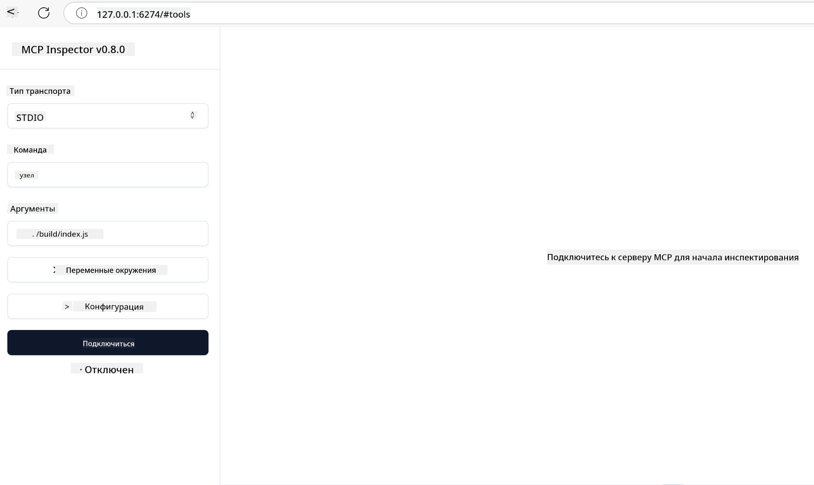

<!--
CO_OP_TRANSLATOR_METADATA:
{
  "original_hash": "717f34718a773f6cf52d8445e40a96bf",
  "translation_date": "2025-05-17T12:39:13+00:00",
  "source_file": "03-GettingStarted/07-testing/README.md",
  "language_code": "ru"
}
-->
## Тестирование и отладка

Прежде чем начать тестирование вашего MCP сервера, важно понять, какие инструменты доступны и какие лучшие практики отладки существуют. Эффективное тестирование гарантирует, что ваш сервер работает так, как ожидается, и помогает быстро выявлять и решать проблемы. В следующем разделе описаны рекомендуемые подходы для проверки вашей реализации MCP.

## Обзор

Этот урок охватывает выбор правильного подхода к тестированию и наиболее эффективного инструмента для тестирования.

## Цели обучения

К концу этого урока вы сможете:

- Описывать различные подходы к тестированию.
- Использовать различные инструменты для эффективного тестирования вашего кода.

## Тестирование MCP серверов

MCP предоставляет инструменты, которые помогут вам тестировать и отлаживать ваши серверы:

- **MCP Inspector**: Инструмент командной строки, который можно использовать как CLI инструмент и как визуальный инструмент.
- **Ручное тестирование**: Вы можете использовать инструмент, такой как curl, для выполнения веб-запросов, но подойдет любой инструмент, способный работать с HTTP.
- **Модульное тестирование**: Можно использовать предпочитаемую вами тестовую структуру для тестирования функций как сервера, так и клиента.

### Использование MCP Inspector

Мы описали использование этого инструмента в предыдущих уроках, но давайте поговорим о нем немного на высоком уровне. Это инструмент, построенный на Node.js, и вы можете использовать его, вызвав исполняемый файл `npx`, который временно загрузит и установит сам инструмент и очистит себя после завершения выполнения вашего запроса.

[MCP Inspector](https://github.com/modelcontextprotocol/inspector) помогает вам:

- **Обнаруживать возможности сервера**: Автоматически определять доступные ресурсы, инструменты и подсказки
- **Тестировать выполнение инструментов**: Пробовать разные параметры и видеть ответы в реальном времени
- **Просматривать метаданные сервера**: Изучать информацию о сервере, схемы и конфигурации

Типичный запуск инструмента выглядит так:

```bash
npx @modelcontextprotocol/inspector node build/index.js
```

Вышеуказанная команда запускает MCP и его визуальный интерфейс и открывает локальный веб-интерфейс в вашем браузере. Вы можете ожидать увидеть панель управления, отображающую ваши зарегистрированные MCP серверы, их доступные инструменты, ресурсы и подсказки. Интерфейс позволяет интерактивно тестировать выполнение инструментов, просматривать метаданные сервера и видеть ответы в реальном времени, что упрощает проверку и отладку ваших реализаций MCP сервера.

Вот как это может выглядеть: 

Вы также можете запустить этот инструмент в режиме CLI, в этом случае добавьте атрибут `--cli`. Вот пример запуска инструмента в режиме "CLI", который перечисляет все инструменты на сервере:

```sh
npx @modelcontextprotocol/inspector --cli node build/index.js --method tools/list
```

### Ручное тестирование

Помимо запуска инструмента инспектора для тестирования возможностей сервера, другой аналогичный подход - запустить клиент, способный использовать HTTP, например, curl.

С помощью curl вы можете напрямую тестировать MCP серверы, используя HTTP запросы:

```bash
# Example: Test server metadata
curl http://localhost:3000/v1/metadata

# Example: Execute a tool
curl -X POST http://localhost:3000/v1/tools/execute \
  -H "Content-Type: application/json" \
  -d '{"name": "calculator", "parameters": {"expression": "2+2"}}'
```

Как видно из использования curl выше, вы используете POST запрос для вызова инструмента с помощью полезной нагрузки, состоящей из имени инструмента и его параметров. Используйте подход, который вам больше всего подходит. CLI инструменты, как правило, быстрее в использовании и могут быть легко автоматизированы, что может быть полезно в среде CI/CD.

### Модульное тестирование

Создайте модульные тесты для ваших инструментов и ресурсов, чтобы убедиться, что они работают так, как ожидается. Вот пример кода для тестирования.

```python
import pytest

from mcp.server.fastmcp import FastMCP
from mcp.shared.memory import (
    create_connected_server_and_client_session as create_session,
)

# Mark the whole module for async tests
pytestmark = pytest.mark.anyio


async def test_list_tools_cursor_parameter():
    """Test that the cursor parameter is accepted for list_tools.

    Note: FastMCP doesn't currently implement pagination, so this test
    only verifies that the cursor parameter is accepted by the client.
    """

 server = FastMCP("test")

    # Create a couple of test tools
    @server.tool(name="test_tool_1")
    async def test_tool_1() -> str:
        """First test tool"""
        return "Result 1"

    @server.tool(name="test_tool_2")
    async def test_tool_2() -> str:
        """Second test tool"""
        return "Result 2"

    async with create_session(server._mcp_server) as client_session:
        # Test without cursor parameter (omitted)
        result1 = await client_session.list_tools()
        assert len(result1.tools) == 2

        # Test with cursor=None
        result2 = await client_session.list_tools(cursor=None)
        assert len(result2.tools) == 2

        # Test with cursor as string
        result3 = await client_session.list_tools(cursor="some_cursor_value")
        assert len(result3.tools) == 2

        # Test with empty string cursor
        result4 = await client_session.list_tools(cursor="")
        assert len(result4.tools) == 2
    
```

Предыдущий код делает следующее:

- Использует фреймворк pytest, который позволяет создавать тесты в виде функций и использовать утверждения assert.
- Создает MCP сервер с двумя различными инструментами.
- Использует утверждение `assert`, чтобы проверить, что определенные условия выполнены.

Посмотрите [полный файл здесь](https://github.com/modelcontextprotocol/python-sdk/blob/main/tests/client/test_list_methods_cursor.py)

Учитывая вышеуказанный файл, вы можете протестировать свой собственный сервер, чтобы убедиться, что возможности созданы так, как должны.

Все основные SDK имеют аналогичные разделы тестирования, поэтому вы можете адаптироваться к выбранной вами среде выполнения.

## Примеры

- [Java Calculator](../samples/java/calculator/README.md)
- [.Net Calculator](../../../../03-GettingStarted/samples/csharp)
- [JavaScript Calculator](../samples/javascript/README.md)
- [TypeScript Calculator](../samples/typescript/README.md)
- [Python Calculator](../../../../03-GettingStarted/samples/python)

## Дополнительные ресурсы

- [Python SDK](https://github.com/modelcontextprotocol/python-sdk)

## Что дальше

- Далее: [Развертывание](/03-GettingStarted/08-deployment/README.md)

**Отказ от ответственности**:  
Этот документ был переведен с использованием службы автоматического перевода [Co-op Translator](https://github.com/Azure/co-op-translator). Мы стремимся к точности, однако, пожалуйста, учитывайте, что автоматические переводы могут содержать ошибки или неточности. Оригинальный документ на его родном языке следует считать авторитетным источником. Для получения критически важной информации рекомендуется профессиональный перевод человеком. Мы не несём ответственности за любые недопонимания или неверные интерпретации, возникающие в результате использования этого перевода.