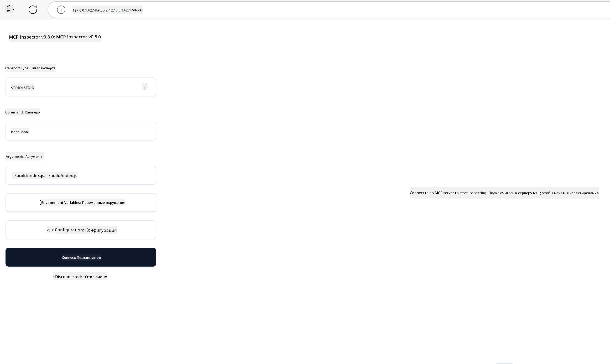

<!--
CO_OP_TRANSLATOR_METADATA:
{
  "original_hash": "4e34e34e84f013e73c7eaa6d09884756",
  "translation_date": "2025-07-13T21:56:48+00:00",
  "source_file": "03-GettingStarted/08-testing/README.md",
  "language_code": "ru"
}
-->
## Тестирование и отладка

Прежде чем начать тестировать ваш MCP сервер, важно понять доступные инструменты и лучшие практики отладки. Эффективное тестирование гарантирует, что сервер работает как задумано, и помогает быстро выявлять и устранять проблемы. В следующем разделе описаны рекомендуемые подходы для проверки вашей реализации MCP.

## Обзор

В этом уроке рассматривается, как выбрать правильный подход к тестированию и наиболее эффективный инструмент.

## Цели обучения

К концу урока вы сможете:

- Описывать различные подходы к тестированию.
- Использовать разные инструменты для эффективного тестирования кода.

## Тестирование MCP серверов

MCP предоставляет инструменты для тестирования и отладки ваших серверов:

- **MCP Inspector**: инструмент командной строки, который можно запускать как в CLI, так и в визуальном режиме.
- **Ручное тестирование**: можно использовать такие инструменты, как curl, для выполнения веб-запросов, но подойдет любой инструмент, поддерживающий HTTP.
- **Модульное тестирование**: можно использовать предпочитаемый фреймворк для тестирования функций как сервера, так и клиента.

### Использование MCP Inspector

Мы уже описывали использование этого инструмента в предыдущих уроках, но давайте кратко повторим. Это инструмент, написанный на Node.js, который можно запустить через `npx`. Он временно скачает и установит инструмент, выполнит ваш запрос и затем очистит себя.

[MCP Inspector](https://github.com/modelcontextprotocol/inspector) помогает:

- **Обнаруживать возможности сервера**: автоматически определяет доступные ресурсы, инструменты и подсказки
- **Тестировать выполнение инструментов**: пробовать разные параметры и видеть ответы в реальном времени
- **Просматривать метаданные сервера**: изучать информацию о сервере, схемы и конфигурации

Типичный запуск инструмента выглядит так:

```bash
npx @modelcontextprotocol/inspector node build/index.js
```

Эта команда запускает MCP и его визуальный интерфейс, открывая локальный веб-интерфейс в вашем браузере. Вы увидите панель управления с зарегистрированными MCP серверами, их доступными инструментами, ресурсами и подсказками. Интерфейс позволяет интерактивно тестировать выполнение инструментов, просматривать метаданные сервера и получать ответы в реальном времени, что облегчает проверку и отладку реализации MCP сервера.

Вот как это может выглядеть: 

Также можно запустить этот инструмент в режиме CLI, добавив атрибут `--cli`. Пример запуска в режиме "CLI", который выводит список всех инструментов на сервере:

```sh
npx @modelcontextprotocol/inspector --cli node build/index.js --method tools/list
```

### Ручное тестирование

Помимо использования MCP Inspector для проверки возможностей сервера, можно использовать клиент, поддерживающий HTTP, например curl.

С помощью curl вы можете тестировать MCP серверы напрямую через HTTP-запросы:

```bash
# Example: Test server metadata
curl http://localhost:3000/v1/metadata

# Example: Execute a tool
curl -X POST http://localhost:3000/v1/tools/execute \
  -H "Content-Type: application/json" \
  -d '{"name": "calculator", "parameters": {"expression": "2+2"}}'
```

Как видно из примера с curl, вы используете POST-запрос для вызова инструмента с полезной нагрузкой, содержащей имя инструмента и его параметры. Выбирайте подход, который вам удобнее. CLI-инструменты обычно работают быстрее и их легко автоматизировать, что полезно в CI/CD средах.

### Модульное тестирование

Создавайте модульные тесты для ваших инструментов и ресурсов, чтобы убедиться, что они работают корректно. Вот пример тестового кода.

```python
import pytest

from mcp.server.fastmcp import FastMCP
from mcp.shared.memory import (
    create_connected_server_and_client_session as create_session,
)

# Mark the whole module for async tests
pytestmark = pytest.mark.anyio


async def test_list_tools_cursor_parameter():
    """Test that the cursor parameter is accepted for list_tools.

    Note: FastMCP doesn't currently implement pagination, so this test
    only verifies that the cursor parameter is accepted by the client.
    """

 server = FastMCP("test")

    # Create a couple of test tools
    @server.tool(name="test_tool_1")
    async def test_tool_1() -> str:
        """First test tool"""
        return "Result 1"

    @server.tool(name="test_tool_2")
    async def test_tool_2() -> str:
        """Second test tool"""
        return "Result 2"

    async with create_session(server._mcp_server) as client_session:
        # Test without cursor parameter (omitted)
        result1 = await client_session.list_tools()
        assert len(result1.tools) == 2

        # Test with cursor=None
        result2 = await client_session.list_tools(cursor=None)
        assert len(result2.tools) == 2

        # Test with cursor as string
        result3 = await client_session.list_tools(cursor="some_cursor_value")
        assert len(result3.tools) == 2

        # Test with empty string cursor
        result4 = await client_session.list_tools(cursor="")
        assert len(result4.tools) == 2
    
```

Приведённый код делает следующее:

- Использует фреймворк pytest, который позволяет создавать тесты в виде функций и использовать assert для проверок.
- Создаёт MCP сервер с двумя разными инструментами.
- Использует оператор `assert` для проверки выполнения определённых условий.

Полный файл можно посмотреть [здесь](https://github.com/modelcontextprotocol/python-sdk/blob/main/tests/client/test_list_methods_cursor.py)

Используя этот файл, вы можете протестировать свой сервер и убедиться, что возможности создаются корректно.

Все основные SDK имеют похожие разделы для тестирования, так что вы можете адаптировать их под выбранную среду выполнения.

## Примеры

- [Java Calculator](../samples/java/calculator/README.md)
- [.Net Calculator](../../../../03-GettingStarted/samples/csharp)
- [JavaScript Calculator](../samples/javascript/README.md)
- [TypeScript Calculator](../samples/typescript/README.md)
- [Python Calculator](../../../../03-GettingStarted/samples/python)

## Дополнительные ресурсы

- [Python SDK](https://github.com/modelcontextprotocol/python-sdk)

## Что дальше

- Далее: [Развертывание](../09-deployment/README.md)

**Отказ от ответственности**:  
Этот документ был переведен с помощью сервиса автоматического перевода [Co-op Translator](https://github.com/Azure/co-op-translator). Несмотря на наши усилия по обеспечению точности, просим учитывать, что автоматические переводы могут содержать ошибки или неточности. Оригинальный документ на его исходном языке следует считать авторитетным источником. Для получения критически важной информации рекомендуется обращаться к профессиональному человеческому переводу. Мы не несем ответственности за любые недоразумения или неправильные толкования, возникшие в результате использования данного перевода.