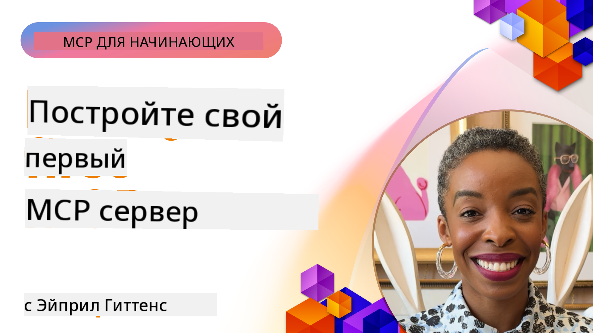

<!--
CO_OP_TRANSLATOR_METADATA:
{
  "original_hash": "1197b6dbde36773e04a5ae826557fdb9",
  "translation_date": "2025-08-26T17:06:41+00:00",
  "source_file": "03-GettingStarted/README.md",
  "language_code": "ru"
}
-->
## Начало работы  

_(Нажмите на изображение выше, чтобы посмотреть видео этого урока)_

Этот раздел состоит из нескольких уроков:

- **1 Ваш первый сервер**. В этом первом уроке вы научитесь создавать свой первый сервер и исследовать его с помощью инструмента инспектора — полезного способа тестировать и отлаживать ваш сервер, [к уроку](01-first-server/README.md)

- **2 Клиент**. В этом уроке вы научитесь писать клиент, который может подключаться к вашему серверу, [к уроку](02-client/README.md)

- **3 Клиент с LLM**. Ещё более эффективный способ написания клиента — добавить в него LLM, чтобы он мог "договариваться" с вашим сервером о том, что делать, [к уроку](03-llm-client/README.md)

- **4 Использование режима GitHub Copilot Agent для сервера в Visual Studio Code**. Здесь мы рассмотрим запуск нашего MCP сервера в Visual Studio Code, [к уроку](04-vscode/README.md)

- **5 Сервер с транспортом stdio**. Транспорт stdio является рекомендуемым стандартом для связи между сервером и клиентом MCP в текущей спецификации, обеспечивая безопасное взаимодействие на основе подпроцессов, [к уроку](05-stdio-server/README.md)

- **6 HTTP стриминг с MCP (Streamable HTTP)**. Узнайте о современном HTTP стриминге, уведомлениях о прогрессе и о том, как реализовать масштабируемые, работающие в реальном времени MCP серверы и клиенты с использованием Streamable HTTP, [к уроку](06-http-streaming/README.md)

- **7 Использование AI Toolkit для VSCode** для работы с вашими MCP клиентами и серверами, [к уроку](07-aitk/README.md)

- **8 Тестирование**. Здесь мы сосредоточимся на различных способах тестирования вашего сервера и клиента, [к уроку](08-testing/README.md)

- **9 Развёртывание**. В этой главе мы рассмотрим различные способы развёртывания ваших MCP решений, [к уроку](09-deployment/README.md)

Протокол Model Context Protocol (MCP) — это открытый протокол, стандартизирующий способ предоставления контекста LLM. Представьте MCP как порт USB-C для AI приложений — он обеспечивает стандартизированный способ подключения AI моделей к различным источникам данных и инструментам.

## Цели обучения

К концу этого урока вы сможете:

- Настроить среды разработки для MCP на C#, Java, Python, TypeScript и JavaScript
- Создавать и развёртывать базовые MCP серверы с пользовательскими функциями (ресурсы, подсказки и инструменты)
- Создавать хост-приложения, которые подключаются к MCP серверам
- Тестировать и отлаживать реализации MCP
- Понимать распространённые проблемы настройки и их решения
- Подключать ваши реализации MCP к популярным LLM сервисам

## Настройка среды для MCP

Прежде чем начать работу с MCP, важно подготовить вашу среду разработки и понять базовый рабочий процесс. Этот раздел проведёт вас через начальные шаги настройки, чтобы обеспечить плавный старт с MCP.

### Предварительные требования

Перед началом разработки MCP убедитесь, что у вас есть:

- **Среда разработки**: Для выбранного вами языка (C#, Java, Python, TypeScript или JavaScript)
- **IDE/Редактор**: Visual Studio, Visual Studio Code, IntelliJ, Eclipse, PyCharm или любой современный редактор кода
- **Менеджеры пакетов**: NuGet, Maven/Gradle, pip или npm/yarn
- **API ключи**: Для любых AI сервисов, которые вы планируете использовать в ваших хост-приложениях

### Официальные SDK

В следующих главах вы увидите решения, построенные с использованием Python, TypeScript, Java и .NET. Вот все официально поддерживаемые SDK.

MCP предоставляет официальные SDK для нескольких языков:
- [C# SDK](https://github.com/modelcontextprotocol/csharp-sdk) — поддерживается совместно с Microsoft
- [Java SDK](https://github.com/modelcontextprotocol/java-sdk) — поддерживается совместно с Spring AI
- [TypeScript SDK](https://github.com/modelcontextprotocol/typescript-sdk) — официальная реализация для TypeScript
- [Python SDK](https://github.com/modelcontextprotocol/python-sdk) — официальная реализация для Python
- [Kotlin SDK](https://github.com/modelcontextprotocol/kotlin-sdk) — официальная реализация для Kotlin
- [Swift SDK](https://github.com/modelcontextprotocol/swift-sdk) — поддерживается совместно с Loopwork AI
- [Rust SDK](https://github.com/modelcontextprotocol/rust-sdk) — официальная реализация для Rust

## Основные выводы

- Настройка среды разработки MCP проста с использованием SDK для конкретных языков
- Создание MCP серверов включает создание и регистрацию инструментов с чёткими схемами
- MCP клиенты подключаются к серверам и моделям для использования расширенных возможностей
- Тестирование и отладка необходимы для надёжных реализаций MCP
- Варианты развёртывания варьируются от локальной разработки до облачных решений

## Практика

У нас есть набор примеров, дополняющих упражнения, которые вы увидите во всех главах этого раздела. Кроме того, каждая глава содержит свои собственные упражнения и задания.

- [Калькулятор на Java](./samples/java/calculator/README.md)
- [Калькулятор на .Net](../../../03-GettingStarted/samples/csharp)
- [Калькулятор на JavaScript](./samples/javascript/README.md)
- [Калькулятор на TypeScript](./samples/typescript/README.md)
- [Калькулятор на Python](../../../03-GettingStarted/samples/python)

## Дополнительные ресурсы

- [Создание агентов с использованием Model Context Protocol на Azure](https://learn.microsoft.com/azure/developer/ai/intro-agents-mcp)
- [Удалённый MCP с Azure Container Apps (Node.js/TypeScript/JavaScript)](https://learn.microsoft.com/samples/azure-samples/mcp-container-ts/mcp-container-ts/)
- [.NET OpenAI MCP Agent](https://learn.microsoft.com/samples/azure-samples/openai-mcp-agent-dotnet/openai-mcp-agent-dotnet/)

## Что дальше

Далее: [Создание вашего первого MCP сервера](01-first-server/README.md)

---

**Отказ от ответственности**:  
Этот документ был переведен с помощью сервиса автоматического перевода [Co-op Translator](https://github.com/Azure/co-op-translator). Хотя мы стремимся к точности, пожалуйста, учитывайте, что автоматические переводы могут содержать ошибки или неточности. Оригинальный документ на его исходном языке следует считать авторитетным источником. Для получения критически важной информации рекомендуется профессиональный перевод человеком. Мы не несем ответственности за любые недоразумения или неправильные интерпретации, возникшие в результате использования данного перевода.