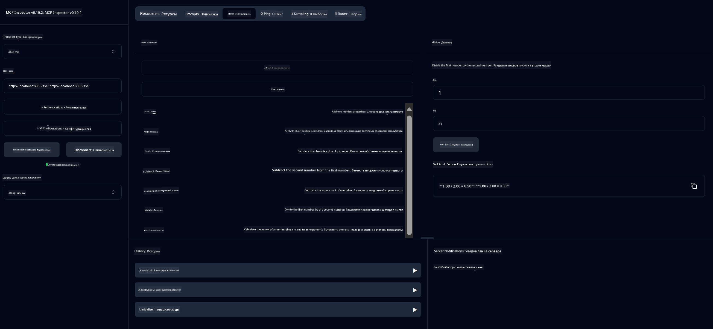

<!--
CO_OP_TRANSLATOR_METADATA:
{
  "original_hash": "13231e9951b68efd9df8c56bd5cdb27e",
  "translation_date": "2025-07-13T22:21:10+00:00",
  "source_file": "03-GettingStarted/samples/java/calculator/README.md",
  "language_code": "ru"
}
-->
# Basic Calculator MCP Service

Этот сервис предоставляет базовые операции калькулятора через Model Context Protocol (MCP) с использованием Spring Boot и транспорта WebFlux. Он создан как простой пример для начинающих, изучающих реализацию MCP.

Для дополнительной информации смотрите справочную документацию [MCP Server Boot Starter](https://docs.spring.io/spring-ai/reference/api/mcp/mcp-server-boot-starter-docs.html).

## Обзор

Сервис демонстрирует:
- Поддержку SSE (Server-Sent Events)
- Автоматическую регистрацию инструментов с помощью аннотации Spring AI `@Tool`
- Основные функции калькулятора:
  - Сложение, вычитание, умножение, деление
  - Возведение в степень и вычисление квадратного корня
  - Остаток от деления и абсолютное значение
  - Функция помощи с описанием операций

## Возможности

Этот калькулятор предлагает следующие функции:

1. **Базовые арифметические операции**:
   - Сложение двух чисел
   - Вычитание одного числа из другого
   - Умножение двух чисел
   - Деление одного числа на другое (с проверкой деления на ноль)

2. **Расширенные операции**:
   - Возведение в степень (основание в степень)
   - Вычисление квадратного корня (с проверкой на отрицательное число)
   - Вычисление остатка от деления
   - Вычисление абсолютного значения

3. **Система помощи**:
   - Встроенная функция помощи, объясняющая все доступные операции

## Использование сервиса

Сервис предоставляет следующие API-эндпоинты через протокол MCP:

- `add(a, b)`: Сложить два числа
- `subtract(a, b)`: Вычесть второе число из первого
- `multiply(a, b)`: Умножить два числа
- `divide(a, b)`: Разделить первое число на второе (с проверкой на ноль)
- `power(base, exponent)`: Вычислить степень числа
- `squareRoot(number)`: Вычислить квадратный корень (с проверкой на отрицательное число)
- `modulus(a, b)`: Вычислить остаток от деления
- `absolute(number)`: Вычислить абсолютное значение
- `help()`: Получить информацию о доступных операциях

## Тестовый клиент

Простой тестовый клиент включён в пакет `com.microsoft.mcp.sample.client`. Класс `SampleCalculatorClient` демонстрирует доступные операции калькулятора.

## Использование клиента LangChain4j

В проекте есть пример клиента LangChain4j в `com.microsoft.mcp.sample.client.LangChain4jClient`, который показывает, как интегрировать сервис калькулятора с LangChain4j и моделями GitHub:

### Требования

1. **Настройка GitHub токена**:
   
   Для использования AI-моделей GitHub (например, phi-4) нужен персональный токен доступа GitHub:

   a. Перейдите в настройки аккаунта GitHub: https://github.com/settings/tokens
   
   b. Нажмите "Generate new token" → "Generate new token (classic)"
   
   c. Дайте токену описательное имя
   
   d. Выберите следующие области доступа:
      - `repo` (полный доступ к приватным репозиториям)
      - `read:org` (чтение информации об организациях и командах, чтение проектов организации)
      - `gist` (создание gists)
      - `user:email` (доступ к email пользователя (только для чтения))
   
   e. Нажмите "Generate token" и скопируйте новый токен
   
   f. Установите его как переменную окружения:
      
      В Windows:
      ```
      set GITHUB_TOKEN=your-github-token
      ```
      
      В macOS/Linux:
      ```bash
      export GITHUB_TOKEN=your-github-token
      ```

   g. Для постоянной настройки добавьте переменную в системные переменные окружения

2. Добавьте зависимость LangChain4j GitHub в проект (уже включена в pom.xml):
   ```xml
   <dependency>
       <groupId>dev.langchain4j</groupId>
       <artifactId>langchain4j-github</artifactId>
       <version>${langchain4j.version}</version>
   </dependency>
   ```

3. Убедитесь, что сервер калькулятора запущен на `localhost:8080`

### Запуск клиента LangChain4j

Пример демонстрирует:
- Подключение к серверу калькулятора MCP через транспорт SSE
- Использование LangChain4j для создания чат-бота, который использует операции калькулятора
- Интеграцию с AI-моделями GitHub (сейчас используется модель phi-4)

Клиент отправляет следующие примерные запросы для демонстрации работы:
1. Вычисление суммы двух чисел
2. Нахождение квадратного корня числа
3. Получение информации о доступных операциях калькулятора

Запустите пример и посмотрите вывод в консоли, чтобы увидеть, как AI-модель использует инструменты калькулятора для ответов.

### Конфигурация модели GitHub

Клиент LangChain4j настроен на использование модели phi-4 GitHub со следующими параметрами:

```java
ChatLanguageModel model = GitHubChatModel.builder()
    .apiKey(System.getenv("GITHUB_TOKEN"))
    .timeout(Duration.ofSeconds(60))
    .modelName("phi-4")
    .logRequests(true)
    .logResponses(true)
    .build();
```

Чтобы использовать другие модели GitHub, просто измените параметр `modelName` на другую поддерживаемую модель (например, "claude-3-haiku-20240307", "llama-3-70b-8192" и т.д.).

## Зависимости

Проект требует следующих ключевых зависимостей:

```xml
<!-- For MCP Server -->
<dependency>
    <groupId>org.springframework.ai</groupId>
    <artifactId>spring-ai-starter-mcp-server-webflux</artifactId>
</dependency>

<!-- For LangChain4j integration -->
<dependency>
    <groupId>dev.langchain4j</groupId>
    <artifactId>langchain4j-mcp</artifactId>
    <version>${langchain4j.version}</version>
</dependency>

<!-- For GitHub models support -->
<dependency>
    <groupId>dev.langchain4j</groupId>
    <artifactId>langchain4j-github</artifactId>
    <version>${langchain4j.version}</version>
</dependency>
```

## Сборка проекта

Соберите проект с помощью Maven:
```bash
./mvnw clean install -DskipTests
```

## Запуск сервера

### Использование Java

```bash
java -jar target/calculator-server-0.0.1-SNAPSHOT.jar
```

### Использование MCP Inspector

MCP Inspector — удобный инструмент для взаимодействия с MCP-сервисами. Чтобы использовать его с этим сервисом калькулятора:

1. **Установите и запустите MCP Inspector** в новом окне терминала:
   ```bash
   npx @modelcontextprotocol/inspector
   ```

2. **Откройте веб-интерфейс**, перейдя по URL, который покажет приложение (обычно http://localhost:6274)

3. **Настройте подключение**:
   - Выберите тип транспорта "SSE"
   - Укажите URL SSE-эндпоинта вашего сервера: `http://localhost:8080/sse`
   - Нажмите "Connect"

4. **Используйте инструменты**:
   - Нажмите "List Tools", чтобы увидеть доступные операции калькулятора
   - Выберите инструмент и нажмите "Run Tool" для выполнения операции



### Использование Docker

В проекте есть Dockerfile для контейнеризации:

1. **Соберите Docker-образ**:
   ```bash
   docker build -t calculator-mcp-service .
   ```

2. **Запустите Docker-контейнер**:
   ```bash
   docker run -p 8080:8080 calculator-mcp-service
   ```

Это позволит:
- Собрать многоступенчатый Docker-образ с Maven 3.9.9 и Eclipse Temurin 24 JDK
- Создать оптимизированный образ контейнера
- Открыть порт 8080 для сервиса
- Запустить MCP калькулятор внутри контейнера

После запуска контейнера сервис будет доступен по адресу `http://localhost:8080`.

## Устранение неполадок

### Распространённые проблемы с GitHub токеном

1. **Проблемы с правами токена**: Если возникает ошибка 403 Forbidden, проверьте, что у токена есть все необходимые права, указанные в требованиях.

2. **Токен не найден**: Если появляется ошибка "No API key found", убедитесь, что переменная окружения GITHUB_TOKEN установлена правильно.

3. **Ограничение по количеству запросов**: GitHub API имеет лимиты. Если вы получили ошибку с кодом 429, подождите несколько минут и попробуйте снова.

4. **Истечение срока действия токена**: Токены GitHub могут истекать. Если после некоторого времени появляются ошибки аутентификации, создайте новый токен и обновите переменную окружения.

Если нужна дополнительная помощь, смотрите [документацию LangChain4j](https://github.com/langchain4j/langchain4j) или [документацию GitHub API](https://docs.github.com/en/rest).

**Отказ от ответственности**:  
Этот документ был переведен с помощью сервиса автоматического перевода [Co-op Translator](https://github.com/Azure/co-op-translator). Несмотря на наши усилия по обеспечению точности, просим учитывать, что автоматический перевод может содержать ошибки или неточности. Оригинальный документ на его исходном языке следует считать авторитетным источником. Для получения критически важной информации рекомендуется обращаться к профессиональному переводу, выполненному человеком. Мы не несем ответственности за любые недоразумения или неправильные толкования, возникшие в результате использования данного перевода.