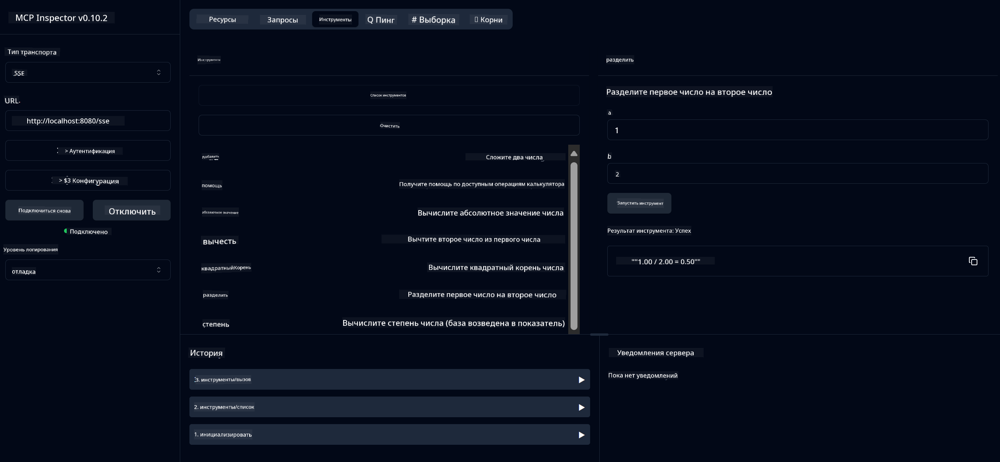

<!--
CO_OP_TRANSLATOR_METADATA:
{
  "original_hash": "13231e9951b68efd9df8c56bd5cdb27e",
  "translation_date": "2025-05-17T13:04:51+00:00",
  "source_file": "03-GettingStarted/samples/java/calculator/README.md",
  "language_code": "ru"
}
-->
# Базовый калькулятор MCP Service

Этот сервис предоставляет базовые операции калькулятора через протокол Model Context Protocol (MCP) с использованием Spring Boot и WebFlux транспорт. Он разработан как простой пример для начинающих, изучающих реализации MCP.

Для получения дополнительной информации см. справочную документацию [MCP Server Boot Starter](https://docs.spring.io/spring-ai/reference/api/mcp/mcp-server-boot-starter-docs.html).

## Обзор

Сервис демонстрирует:
- Поддержку SSE (события, отправляемые сервером)
- Автоматическую регистрацию инструментов с использованием аннотации `@Tool` Spring AI
- Основные функции калькулятора:
  - Сложение, вычитание, умножение, деление
  - Возведение в степень и извлечение квадратного корня
  - Остаток от деления и модуль числа
  - Функция помощи для описания операций

## Возможности

Этот калькулятор предлагает следующие возможности:

1. **Основные арифметические операции**:
   - Сложение двух чисел
   - Вычитание одного числа из другого
   - Умножение двух чисел
   - Деление одного числа на другое (с проверкой деления на ноль)

2. **Расширенные операции**:
   - Возведение в степень (возведение основания в степень)
   - Вычисление квадратного корня (с проверкой отрицательных чисел)
   - Вычисление остатка от деления
   - Вычисление абсолютного значения

3. **Система помощи**:
   - Встроенная функция помощи, объясняющая все доступные операции

## Использование сервиса

Сервис предоставляет следующие конечные точки API через протокол MCP:

- `add(a, b)`: Сложить два числа
- `subtract(a, b)`: Вычесть второе число из первого
- `multiply(a, b)`: Умножить два числа
- `divide(a, b)`: Разделить первое число на второе (с проверкой на ноль)
- `power(base, exponent)`: Вычислить степень числа
- `squareRoot(number)`: Вычислить квадратный корень (с проверкой отрицательных чисел)
- `modulus(a, b)`: Вычислить остаток от деления
- `absolute(number)`: Вычислить абсолютное значение
- `help()`: Получить информацию о доступных операциях

## Тестовый клиент

Простой тестовый клиент включен в пакет `com.microsoft.mcp.sample.client`. Класс `SampleCalculatorClient` демонстрирует доступные операции сервиса калькулятора.

## Использование клиента LangChain4j

Проект включает пример клиента LangChain4j в `com.microsoft.mcp.sample.client.LangChain4jClient`, который демонстрирует, как интегрировать сервис калькулятора с LangChain4j и моделями GitHub:

### Предварительные требования

1. **Настройка токена GitHub**:
   
   Чтобы использовать модели AI GitHub (например, phi-4), вам нужен личный токен доступа GitHub:

   a. Перейдите в настройки вашей учетной записи GitHub: https://github.com/settings/tokens
   
   b. Нажмите "Generate new token" → "Generate new token (classic)"
   
   c. Дайте вашему токену описательное имя
   
   d. Выберите следующие области:
      - `repo` (Полный контроль над приватными репозиториями)
      - `read:org` (Чтение членства в организации и команды, чтение проектов организации)
      - `gist` (Создание gists)
      - `user:email` (Доступ к адресам электронной почты пользователя (только для чтения))
   
   e. Нажмите "Generate token" и скопируйте ваш новый токен
   
   f. Установите его в качестве переменной окружения:
      
      На Windows:
      ```
      set GITHUB_TOKEN=your-github-token
      ```
      
      На macOS/Linux:
      ```bash
      export GITHUB_TOKEN=your-github-token
      ```

   g. Для постоянной настройки добавьте его в переменные окружения через системные настройки

2. Добавьте зависимость LangChain4j GitHub в ваш проект (уже включена в pom.xml):
   ```xml
   <dependency>
       <groupId>dev.langchain4j</groupId>
       <artifactId>langchain4j-github</artifactId>
       <version>${langchain4j.version}</version>
   </dependency>
   ```

3. Убедитесь, что сервер калькулятора работает на `localhost:8080`

### Запуск клиента LangChain4j

Этот пример демонстрирует:
- Подключение к серверу калькулятора MCP через транспорт SSE
- Использование LangChain4j для создания чат-бота, использующего операции калькулятора
- Интеграцию с моделями AI GitHub (сейчас используется модель phi-4)

Клиент отправляет следующие примерные запросы для демонстрации функциональности:
1. Вычисление суммы двух чисел
2. Нахождение квадратного корня числа
3. Получение информации о доступных операциях калькулятора

Запустите пример и проверьте вывод в консоли, чтобы увидеть, как модель AI использует инструменты калькулятора для ответа на запросы.

### Конфигурация модели GitHub

Клиент LangChain4j настроен на использование модели phi-4 GitHub со следующими настройками:

```java
ChatLanguageModel model = GitHubChatModel.builder()
    .apiKey(System.getenv("GITHUB_TOKEN"))
    .timeout(Duration.ofSeconds(60))
    .modelName("phi-4")
    .logRequests(true)
    .logResponses(true)
    .build();
```

Чтобы использовать другие модели GitHub, просто измените параметр `modelName` на другую поддерживаемую модель (например, "claude-3-haiku-20240307", "llama-3-70b-8192" и т.д.).

## Зависимости

Проект требует следующих ключевых зависимостей:

```xml
<!-- For MCP Server -->
<dependency>
    <groupId>org.springframework.ai</groupId>
    <artifactId>spring-ai-starter-mcp-server-webflux</artifactId>
</dependency>

<!-- For LangChain4j integration -->
<dependency>
    <groupId>dev.langchain4j</groupId>
    <artifactId>langchain4j-mcp</artifactId>
    <version>${langchain4j.version}</version>
</dependency>

<!-- For GitHub models support -->
<dependency>
    <groupId>dev.langchain4j</groupId>
    <artifactId>langchain4j-github</artifactId>
    <version>${langchain4j.version}</version>
</dependency>
```

## Сборка проекта

Соберите проект с помощью Maven:
```bash
./mvnw clean install -DskipTests
```

## Запуск сервера

### Использование Java

```bash
java -jar target/calculator-server-0.0.1-SNAPSHOT.jar
```

### Использование MCP Inspector

MCP Inspector — это полезный инструмент для взаимодействия с сервисами MCP. Чтобы использовать его с этим сервисом калькулятора:

1. **Установите и запустите MCP Inspector** в новом терминале:
   ```bash
   npx @modelcontextprotocol/inspector
   ```

2. **Доступ к веб-интерфейсу**: нажмите на URL, отображаемый приложением (обычно http://localhost:6274)

3. **Настройте подключение**:
   - Установите тип транспорта на "SSE"
   - Установите URL-адрес на конечную точку SSE вашего работающего сервера: `http://localhost:8080/sse`
   - Нажмите "Connect"

4. **Используйте инструменты**:
   - Нажмите "List Tools", чтобы увидеть доступные операции калькулятора
   - Выберите инструмент и нажмите "Run Tool", чтобы выполнить операцию



### Использование Docker

Проект включает Dockerfile для контейнерной развертки:

1. **Соберите образ Docker**:
   ```bash
   docker build -t calculator-mcp-service .
   ```

2. **Запустите контейнер Docker**:
   ```bash
   docker run -p 8080:8080 calculator-mcp-service
   ```

Это позволит:
- Собрать многоэтапный образ Docker с Maven 3.9.9 и Eclipse Temurin 24 JDK
- Создать оптимизированный образ контейнера
- Открыть сервис на порту 8080
- Запустить сервис MCP калькулятора внутри контейнера

Вы можете получить доступ к сервису по адресу `http://localhost:8080`, как только контейнер будет запущен.

## Устранение неполадок

### Общие проблемы с токеном GitHub

1. **Проблемы с разрешениями токена**: если вы получаете ошибку 403 Forbidden, проверьте, что ваш токен имеет правильные разрешения, как указано в предварительных требованиях.

2. **Токен не найден**: если вы получаете ошибку "No API key found", убедитесь, что переменная окружения GITHUB_TOKEN правильно установлена.

3. **Ограничение скорости**: API GitHub имеет ограничения по скорости. Если вы сталкиваетесь с ошибкой ограничения скорости (код состояния 429), подождите несколько минут перед повторной попыткой.

4. **Истечение срока действия токена**: токены GitHub могут истекать. Если вы получаете ошибки аутентификации через некоторое время, создайте новый токен и обновите вашу переменную окружения.

Если вам нужна дополнительная помощь, ознакомьтесь с [документацией LangChain4j](https://github.com/langchain4j/langchain4j) или [документацией GitHub API](https://docs.github.com/en/rest).

**Отказ от ответственности**:
Этот документ был переведен с помощью службы автоматического перевода [Co-op Translator](https://github.com/Azure/co-op-translator). Хотя мы стремимся к точности, пожалуйста, учтите, что автоматические переводы могут содержать ошибки или неточности. Оригинальный документ на его родном языке следует считать авторитетным источником. Для получения важной информации рекомендуется профессиональный перевод человеком. Мы не несем ответственности за недопонимание или неправильное толкование, возникшие в результате использования этого перевода.