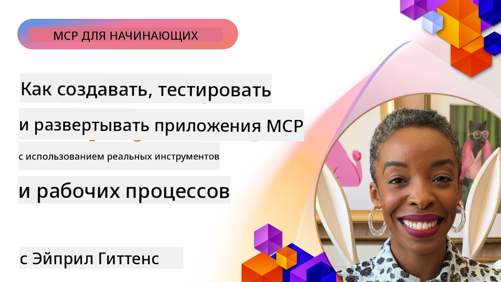

<!--
CO_OP_TRANSLATOR_METADATA:
{
  "original_hash": "83efa75a69bc831277263a6f1ae53669",
  "translation_date": "2025-08-18T13:11:42+00:00",
  "source_file": "04-PracticalImplementation/README.md",
  "language_code": "ru"
}
-->
# Практическая реализация

[](https://youtu.be/vCN9-mKBDfQ)

_(Нажмите на изображение выше, чтобы посмотреть видео этого урока)_

Практическая реализация — это момент, когда мощь протокола Model Context Protocol (MCP) становится ощутимой. Хотя понимание теории и архитектуры MCP важно, настоящая ценность проявляется, когда вы применяете эти концепции для создания, тестирования и развертывания решений, которые решают реальные задачи. Эта глава соединяет концептуальные знания с практической разработкой, помогая вам воплотить приложения на основе MCP в жизнь.

Независимо от того, разрабатываете ли вы интеллектуальных помощников, интегрируете ИИ в бизнес-процессы или создаете пользовательские инструменты для обработки данных, MCP предоставляет гибкую основу. Его независимый от языка дизайн и официальные SDK для популярных языков программирования делают его доступным для широкого круга разработчиков. Используя эти SDK, вы можете быстро создавать прототипы, итеративно улучшать и масштабировать свои решения на различных платформах и в разных средах.

В следующих разделах вы найдете практические примеры, образцы кода и стратегии развертывания, которые демонстрируют, как реализовать MCP на C#, Java с Spring, TypeScript, JavaScript и Python. Вы также узнаете, как отлаживать и тестировать серверы MCP, управлять API и развертывать решения в облаке с использованием Azure. Эти практические ресурсы предназначены для ускорения вашего обучения и уверенного создания надежных приложений MCP, готовых к производству.

## Обзор

Этот урок сосредоточен на практических аспектах реализации MCP на различных языках программирования. Мы рассмотрим, как использовать SDK MCP на C#, Java с Spring, TypeScript, JavaScript и Python для создания надежных приложений, отладки и тестирования серверов MCP, а также создания повторно используемых ресурсов, подсказок и инструментов.

## Цели обучения

К концу этого урока вы сможете:

- Реализовать решения MCP с использованием официальных SDK на различных языках программирования
- Систематически отлаживать и тестировать серверы MCP
- Создавать и использовать функции сервера (Ресурсы, Подсказки и Инструменты)
- Разрабатывать эффективные рабочие процессы MCP для сложных задач
- Оптимизировать реализации MCP для повышения производительности и надежности

## Официальные ресурсы SDK

Протокол Model Context Protocol предлагает официальные SDK для нескольких языков:

- [C# SDK](https://github.com/modelcontextprotocol/csharp-sdk)
- [Java с Spring SDK](https://github.com/modelcontextprotocol/java-sdk) **Примечание:** требует зависимости от [Project Reactor](https://projectreactor.io). (См. [обсуждение issue 246](https://github.com/orgs/modelcontextprotocol/discussions/246).)
- [TypeScript SDK](https://github.com/modelcontextprotocol/typescript-sdk)
- [Python SDK](https://github.com/modelcontextprotocol/python-sdk)
- [Kotlin SDK](https://github.com/modelcontextprotocol/kotlin-sdk)

## Работа с SDK MCP

Этот раздел предоставляет практические примеры реализации MCP на различных языках программирования. Вы можете найти примеры кода в каталоге `samples`, организованном по языкам.

### Доступные примеры

Репозиторий включает [примеры реализации](../../../04-PracticalImplementation/samples) на следующих языках:

- [C#](./samples/csharp/README.md)
- [Java с Spring](./samples/java/containerapp/README.md)
- [TypeScript](./samples/typescript/README.md)
- [JavaScript](./samples/javascript/README.md)
- [Python](./samples/python/README.md)

Каждый пример демонстрирует ключевые концепции MCP и шаблоны реализации для конкретного языка и экосистемы.

## Основные функции сервера

Серверы MCP могут реализовывать любую комбинацию следующих функций:

### Ресурсы

Ресурсы предоставляют контекст и данные для использования пользователем или моделью ИИ:

- Репозитории документов
- Базы знаний
- Структурированные источники данных
- Файловые системы

### Подсказки

Подсказки — это шаблонные сообщения и рабочие процессы для пользователей:

- Предопределенные шаблоны разговоров
- Шаблоны направленного взаимодействия
- Специализированные структуры диалога

### Инструменты

Инструменты — это функции, которые модель ИИ может выполнять:

- Утилиты обработки данных
- Интеграции с внешними API
- Вычислительные возможности
- Функциональность поиска

## Примеры реализации: Реализация на C#

Официальный репозиторий SDK C# содержит несколько примеров реализации, демонстрирующих различные аспекты MCP:

- **Базовый клиент MCP**: Простой пример создания клиента MCP и вызова инструментов
- **Базовый сервер MCP**: Минимальная реализация сервера с базовой регистрацией инструментов
- **Расширенный сервер MCP**: Полнофункциональный сервер с регистрацией инструментов, аутентификацией и обработкой ошибок
- **Интеграция с ASP.NET**: Примеры интеграции с ASP.NET Core
- **Шаблоны реализации инструментов**: Различные шаблоны реализации инструментов с разным уровнем сложности

SDK MCP для C# находится в стадии предварительного просмотра, и API могут измениться. Мы будем регулярно обновлять этот блог по мере развития SDK.

### Основные функции

- [C# MCP Nuget ModelContextProtocol](https://www.nuget.org/packages/ModelContextProtocol)
- Создание вашего [первого сервера MCP](https://devblogs.microsoft.com/dotnet/build-a-model-context-protocol-mcp-server-in-csharp/).

Для получения полных примеров реализации на C# посетите [официальный репозиторий примеров SDK C#](https://github.com/modelcontextprotocol/csharp-sdk)

## Пример реализации: Реализация на Java с Spring

SDK Java с Spring предлагает надежные варианты реализации MCP с функциями корпоративного уровня.

### Основные функции

- Интеграция с Spring Framework
- Сильная типизация
- Поддержка реактивного программирования
- Комплексная обработка ошибок

Для полного примера реализации на Java с Spring см. [Пример Java с Spring](samples/java/containerapp/README.md) в каталоге примеров.

## Пример реализации: Реализация на JavaScript

SDK JavaScript предоставляет легкий и гибкий подход к реализации MCP.

### Основные функции

- Поддержка Node.js и браузеров
- API на основе Promise
- Легкая интеграция с Express и другими фреймворками
- Поддержка WebSocket для потоковой передачи

Для полного примера реализации на JavaScript см. [Пример JavaScript](samples/javascript/README.md) в каталоге примеров.

## Пример реализации: Реализация на Python

SDK Python предлагает подход, соответствующий стилю Python, для реализации MCP с отличной интеграцией с ML-фреймворками.

### Основные функции

- Поддержка async/await с asyncio
- Интеграция с FastAPI
- Простая регистрация инструментов
- Нативная интеграция с популярными библиотеками ML

Для полного примера реализации на Python см. [Пример Python](samples/python/README.md) в каталоге примеров.

## Управление API

Azure API Management — отличный способ обеспечить безопасность серверов MCP. Идея заключается в том, чтобы разместить экземпляр Azure API Management перед вашим сервером MCP и позволить ему обрабатывать функции, которые вам, вероятно, понадобятся, такие как:

- ограничение скорости
- управление токенами
- мониторинг
- балансировка нагрузки
- безопасность

### Пример Azure

Вот пример Azure, который делает именно это, а именно [создание сервера MCP и обеспечение его безопасности с помощью Azure API Management](https://github.com/Azure-Samples/remote-mcp-apim-functions-python).

Посмотрите, как происходит поток авторизации на изображении ниже:


На изображении выше происходит следующее:

- Аутентификация/Авторизация осуществляется с использованием Microsoft Entra.
- Azure API Management действует как шлюз и использует политики для направления и управления трафиком.
- Azure Monitor регистрирует все запросы для дальнейшего анализа.

#### Поток авторизации

Давайте рассмотрим поток авторизации более подробно:


#### Спецификация авторизации MCP

Узнайте больше о [спецификации авторизации MCP](https://modelcontextprotocol.io/specification/2025-03-26/basic/authorization#2-10-third-party-authorization-flow)

## Развертывание удаленного сервера MCP в Azure

Давайте посмотрим, сможем ли мы развернуть упомянутый ранее пример:

1. Клонируйте репозиторий

    ```bash
    git clone https://github.com/Azure-Samples/remote-mcp-apim-functions-python.git
    cd remote-mcp-apim-functions-python
    ```

1. Зарегистрируйте поставщика ресурсов `Microsoft.App`.

   - Если вы используете Azure CLI, выполните команду `az provider register --namespace Microsoft.App --wait`.
   - Если вы используете Azure PowerShell, выполните команду `Register-AzResourceProvider -ProviderNamespace Microsoft.App`. Затем выполните `(Get-AzResourceProvider -ProviderNamespace Microsoft.App).RegistrationState` через некоторое время, чтобы проверить, завершена ли регистрация.

1. Выполните эту команду [azd](https://aka.ms/azd) для создания службы управления API, функции приложения (с кодом) и всех других необходимых ресурсов Azure

    ```shell
    azd up
    ```

    Эта команда должна развернуть все облачные ресурсы в Azure.

### Тестирование вашего сервера с MCP Inspector

1. В **новом окне терминала** установите и запустите MCP Inspector

    ```shell
    npx @modelcontextprotocol/inspector
    ```

    Вы должны увидеть интерфейс, похожий на:

    

1. Нажмите CTRL, чтобы загрузить веб-приложение MCP Inspector по URL, отображаемому приложением (например, [http://127.0.0.1:6274/#resources](http://127.0.0.1:6274/#resources))
1. Установите тип транспорта на `SSE`
1. Установите URL вашего работающего конечного точки API Management SSE, отображаемого после `azd up`, и **Подключитесь**:

    ```shell
    https://<apim-servicename-from-azd-output>.azure-api.net/mcp/sse
    ```

1. **Список инструментов**. Нажмите на инструмент и **Запустите инструмент**.

Если все шаги выполнены успешно, вы должны быть подключены к серверу MCP и смогли вызвать инструмент.

## Серверы MCP для Azure

[Remote-mcp-functions](https://github.com/Azure-Samples/remote-mcp-functions-dotnet): Этот набор репозиториев представляет собой шаблон быстрого старта для создания и развертывания пользовательских удаленных серверов MCP (Model Context Protocol) с использованием Azure Functions на Python, C# .NET или Node/TypeScript.

Примеры предоставляют полное решение, которое позволяет разработчикам:

- Локальная разработка и запуск: Разработка и отладка сервера MCP на локальной машине
- Развертывание в Azure: Легкое развертывание в облаке с помощью простой команды azd up
- Подключение от клиентов: Подключение к серверу MCP из различных клиентов, включая режим агента Copilot в VS Code и инструмент MCP Inspector

### Основные функции

- Безопасность по умолчанию: Сервер MCP защищен с использованием ключей и HTTPS
- Варианты аутентификации: Поддержка OAuth с использованием встроенной аутентификации и/или управления API
- Изоляция сети: Возможность изоляции сети с использованием виртуальных сетей Azure (VNET)
- Безсерверная архитектура: Использование Azure Functions для масштабируемого, событийного выполнения
- Локальная разработка: Полная поддержка локальной разработки и отладки
- Простое развертывание: Упрощенный процесс развертывания в Azure

Репозиторий включает все необходимые конфигурационные файлы, исходный код и определения инфраструктуры для быстрого начала работы с готовой к производству реализацией сервера MCP.

- [Azure Remote MCP Functions Python](https://github.com/Azure-Samples/remote-mcp-functions-python) - Пример реализации MCP с использованием Azure Functions на Python

- [Azure Remote MCP Functions .NET](https://github.com/Azure-Samples/remote-mcp-functions-dotnet) - Пример реализации MCP с использованием Azure Functions на C# .NET

- [Azure Remote MCP Functions Node/Typescript](https://github.com/Azure-Samples/remote-mcp-functions-typescript) - Пример реализации MCP с использованием Azure Functions на Node/TypeScript.

## Основные выводы

- SDK MCP предоставляют инструменты, специфичные для языка, для реализации надежных решений MCP
- Процесс отладки и тестирования критически важен для надежных приложений MCP
- Повторно используемые шаблоны подсказок обеспечивают последовательное взаимодействие ИИ
- Хорошо спроектированные рабочие процессы могут организовывать сложные задачи с использованием нескольких инструментов
- Реализация решений MCP требует учета безопасности, производительности и обработки ошибок

## Упражнение

Разработайте практический рабочий процесс MCP, который решает реальную задачу в вашей области:

1. Определите 3-4 инструмента, которые будут полезны для решения этой задачи
2. Создайте диаграмму рабочего процесса, показывающую, как эти инструменты взаимодействуют
3. Реализуйте базовую версию одного из инструментов на вашем предпочтительном языке
4. Создайте шаблон подсказки, который поможет модели эффективно использовать ваш инструмент

## Дополнительные ресурсы

---

Далее: [Продвинутые темы](../05-AdvancedTopics/README.md)

**Отказ от ответственности**:  
Этот документ был переведен с помощью сервиса автоматического перевода [Co-op Translator](https://github.com/Azure/co-op-translator). Несмотря на наши усилия обеспечить точность, автоматические переводы могут содержать ошибки или неточности. Оригинальный документ на его исходном языке следует считать авторитетным источником. Для получения критически важной информации рекомендуется профессиональный перевод человеком. Мы не несем ответственности за любые недоразумения или неправильные толкования, возникшие в результате использования данного перевода.