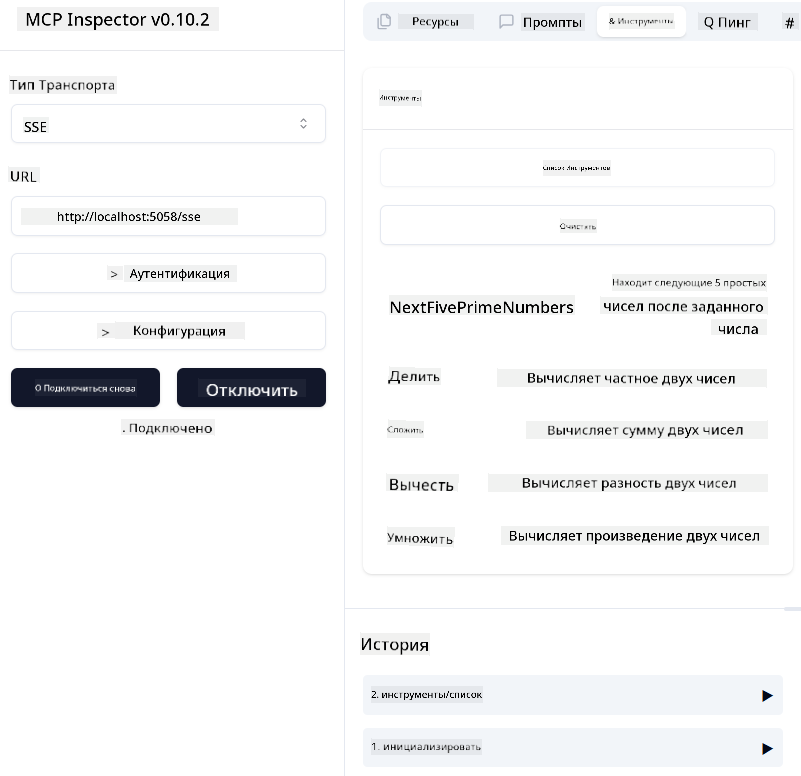

<!--
CO_OP_TRANSLATOR_METADATA:
{
  "original_hash": "5020a3e1a1c7f30c00f9e37f1fa208e3",
  "translation_date": "2025-05-17T14:05:02+00:00",
  "source_file": "04-PracticalImplementation/samples/csharp/README.md",
  "language_code": "ru"
}
-->
# Пример

Предыдущий пример показывает, как использовать локальный .NET проект с типом `sdio` и как запустить сервер локально в контейнере. Это хорошее решение во многих ситуациях. Однако может быть полезно, чтобы сервер работал удаленно, например, в облачной среде. Здесь пригодится тип `http`.

Смотря на решение в папке `04-PracticalImplementation`, оно может показаться гораздо более сложным, чем предыдущее. Но на самом деле это не так. Если внимательно посмотреть на проект `src/mcpserver/mcpserver.csproj`, вы увидите, что он в основном состоит из того же кода, что и предыдущий пример. Единственное отличие заключается в том, что мы используем другую библиотеку `ModelContextProtocol.AspNetCore` для обработки HTTP-запросов. И мы изменили метод `IsPrime`, сделав его приватным, просто чтобы показать, что вы можете иметь приватные методы в своем коде. Остальной код такой же, как и раньше.

Другие проекты взяты из [.NET Aspire](https://learn.microsoft.com/dotnet/aspire/get-started/aspire-overview). Наличие .NET Aspire в решении улучшит опыт разработчика при разработке и тестировании и поможет с наблюдаемостью. Это не обязательно для запуска сервера, но является хорошей практикой иметь его в вашем решении.

## Запуск сервера локально

1. Из VS Code (с расширением C# DevKit), откройте решение `04-PracticalImplementation\samples\csharp\src\Calculator-chap4.sln`.
2. Нажмите `F5`, чтобы запустить сервер. Он должен открыть веб-браузер с панелью управления .NET Aspire.

или

1. Из терминала перейдите в папку `04-PracticalImplementation\samples\csharp\src`.
2. Выполните следующую команду для запуска сервера:
   ```bash
    dotnet run --project .\AppHost
   ```

3. На панели управления обратите внимание на URL `http`. Он должен быть похож на `http://localhost:5058/`.

## Test `SSE` с инспектором протокола ModelContext.

Если у вас есть Node.js 22.7.5 и выше, вы можете использовать инспектор протокола ModelContext для тестирования вашего сервера.

Запустите сервер и выполните следующую команду в терминале:

```bash
npx @modelcontextprotocol/inspector@latest
```



- Выберите `SSE` as the Transport type. SSE stand for Server-Sent Events. 
- In the Url field, enter the URL of the server noted earlier,and append `/sse`. Он должен быть `http` (не `https`) something like `http://localhost:5058/sse`.
- select the Connect button.

A nice thing about the Inspector is that it provide a nice visibility on what is happening.

- Try listing the availables tools
- Try some of them, it should works just like before.


## Test `SSE` with Github Copilot Chat in VS Code

To use the `SSE` transport with Github Copilot Chat, change the configuration of the `mcp-calc` сервер, созданный ранее, чтобы выглядеть так:

```json
"mcp-calc": {
    "type": "sse",
    "url": "http://localhost:5058/sse"
}
```

Проведите несколько тестов:
- Попросите 3 простых числа после 6780. Обратите внимание, как Copilot использует новые инструменты `NextFivePrimeNumbers` и возвращает только первые 3 простых числа.
- Попросите 7 простых чисел после 111, чтобы увидеть, что произойдет.

# Развертывание сервера в Azure

Давайте развернем сервер в Azure, чтобы больше людей могли его использовать.

Из терминала перейдите в папку `04-PracticalImplementation\samples\csharp\src` и выполните следующую команду:

```bash
azd init
```

Это создаст несколько файлов локально для сохранения конфигурации ресурсов Azure и вашей инфраструктуры как кода (IaC).

Затем выполните следующую команду для развертывания сервера в Azure:

```bash
azd up
```

После завершения развертывания вы должны увидеть сообщение, подобное этому:


Перейдите на панель управления Aspire и обратите внимание на URL `HTTP`, чтобы использовать его в MCP Inspector и в чате Github Copilot.

## Что дальше?

Мы пробуем разные типы транспорта, инструменты тестирования и также развертываем наш MCP сервер в Azure. Но что, если наш сервер нуждается в доступе к приватным ресурсам? Например, к базе данных или приватному API? В следующей главе мы увидим, как мы можем улучшить безопасность нашего сервера.

**Отказ от ответственности**:  
Этот документ был переведен с помощью службы автоматического перевода [Co-op Translator](https://github.com/Azure/co-op-translator). Мы стремимся к точности, однако, пожалуйста, имейте в виду, что автоматические переводы могут содержать ошибки или неточности. Оригинальный документ на его родном языке следует считать авторитетным источником. Для получения критически важной информации рекомендуется профессиональный перевод человеком. Мы не несем ответственности за недоразумения или неправильные толкования, возникшие в результате использования этого перевода.