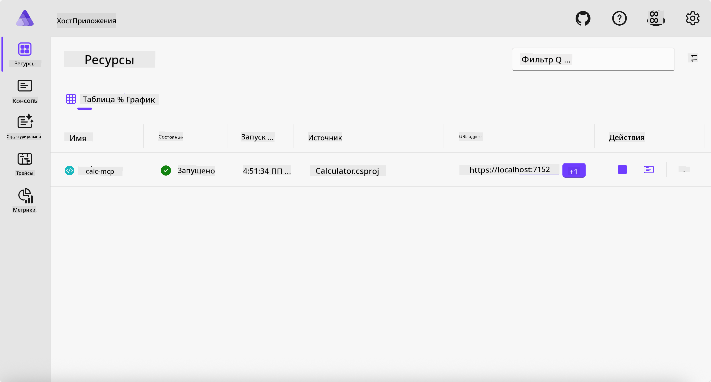
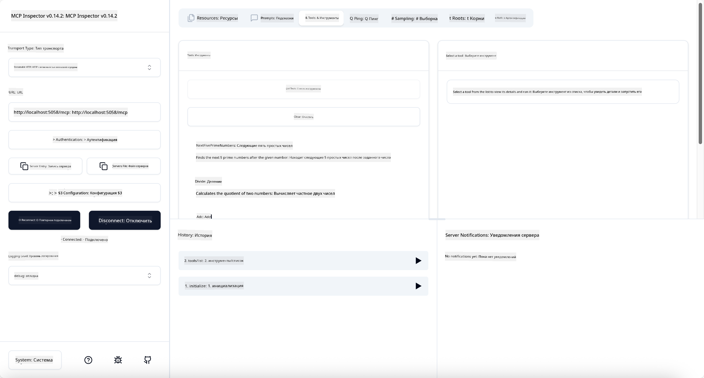
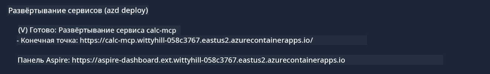

<!--
CO_OP_TRANSLATOR_METADATA:
{
  "original_hash": "0bc7bd48f55f1565f1d95ccb2c16f728",
  "translation_date": "2025-06-18T07:46:30+00:00",
  "source_file": "04-PracticalImplementation/samples/csharp/README.md",
  "language_code": "ru"
}
-->
# Пример

В предыдущем примере показано, как использовать локальный проект .NET с типом `stdio`. А также как запустить сервер локально в контейнере. Это хорошее решение во многих случаях. Однако иногда полезно, чтобы сервер работал удалённо, например, в облачной среде. Для этого и предназначен тип `http`.

Если посмотреть на решение в папке `04-PracticalImplementation`, оно может показаться гораздо сложнее предыдущего. Но на самом деле это не так. Если внимательно взглянуть на проект `src/Calculator`, вы увидите, что там в основном тот же код, что и в предыдущем примере. Единственное отличие — мы используем другую библиотеку `ModelContextProtocol.AspNetCore` для обработки HTTP-запросов. И меняем метод `IsPrime` на приватный, чтобы показать, что в вашем коде могут быть приватные методы. Остальной код остался без изменений.

Остальные проекты взяты из [.NET Aspire](https://learn.microsoft.com/dotnet/aspire/get-started/aspire-overview). Наличие .NET Aspire в решении улучшит опыт разработчика при разработке и тестировании, а также поможет с наблюдаемостью. Для запуска сервера это не обязательно, но хорошая практика иметь его в своём решении.

## Запуск сервера локально

1. В VS Code (с расширением C# DevKit) перейдите в каталог `04-PracticalImplementation/samples/csharp`.
1. Выполните следующую команду, чтобы запустить сервер:

   ```bash
    dotnet watch run --project ./src/AppHost
   ```

1. Когда в браузере откроется панель управления .NET Aspire, обратите внимание на URL `http`. Он должен выглядеть примерно так: `http://localhost:5058/`.

   

## Тестирование Streamable HTTP с помощью MCP Inspector

Если у вас установлен Node.js версии 22.7.5 или выше, вы можете использовать MCP Inspector для тестирования вашего сервера.

Запустите сервер и выполните следующую команду в терминале:

```bash
npx @modelcontextprotocol/inspector http://localhost:5058
```



- Выберите `Streamable HTTP` as the Transport type.
- In the Url field, enter the URL of the server noted earlier, and append `/mcp`. Это должен быть `http` (а не `https`) something like `http://localhost:5058/mcp`.
- select the Connect button.

A nice thing about the Inspector is that it provide a nice visibility on what is happening.

- Try listing the available tools
- Try some of them, it should works just like before.

## Test MCP Server with GitHub Copilot Chat in VS Code

To use the Streamable HTTP transport with GitHub Copilot Chat, change the configuration of the `calc-mcp`), сервер, созданный ранее, чтобы он выглядел так:

```jsonc
// .vscode/mcp.json
{
  "servers": {
    "calc-mcp": {
      "type": "http",
      "url": "http://localhost:5058/mcp"
    }
  }
}
```

Проведите несколько тестов:

- Запросите «3 простых числа после 6780». Обратите внимание, как Copilot использует новые инструменты `NextFivePrimeNumbers` и возвращает только первые 3 простых числа.
- Запросите «7 простых чисел после 111», чтобы посмотреть, что произойдёт.
- Запросите «У Джона 24 леденца, и он хочет раздать их своим 3 детям. Сколько леденцов получит каждый ребёнок?», чтобы увидеть результат.

## Развёртывание сервера в Azure

Давайте развернём сервер в Azure, чтобы им могли пользоваться больше людей.

В терминале перейдите в папку `04-PracticalImplementation/samples/csharp` и выполните следующую команду:

```bash
azd up
```

После завершения развертывания вы увидите сообщение примерно такого вида:



Скопируйте URL и используйте его в MCP Inspector и в GitHub Copilot Chat.

```jsonc
// .vscode/mcp.json
{
  "servers": {
    "calc-mcp": {
      "type": "http",
      "url": "https://calc-mcp.gentleriver-3977fbcf.australiaeast.azurecontainerapps.io/mcp"
    }
  }
}
```

## Что дальше?

Мы попробовали разные типы транспорта и инструменты тестирования. Также развернули ваш MCP сервер в Azure. Но что если наш сервер должен иметь доступ к приватным ресурсам? Например, к базе данных или приватному API? В следующей главе мы рассмотрим, как можно повысить безопасность нашего сервера.

**Отказ от ответственности**:  
Этот документ был переведен с помощью сервиса автоматического перевода [Co-op Translator](https://github.com/Azure/co-op-translator). Несмотря на наши усилия по обеспечению точности, пожалуйста, имейте в виду, что автоматические переводы могут содержать ошибки или неточности. Оригинальный документ на его исходном языке следует считать авторитетным источником. Для получения критически важной информации рекомендуется профессиональный перевод человеком. Мы не несем ответственности за любые недоразумения или неправильные толкования, возникшие в результате использования данного перевода.