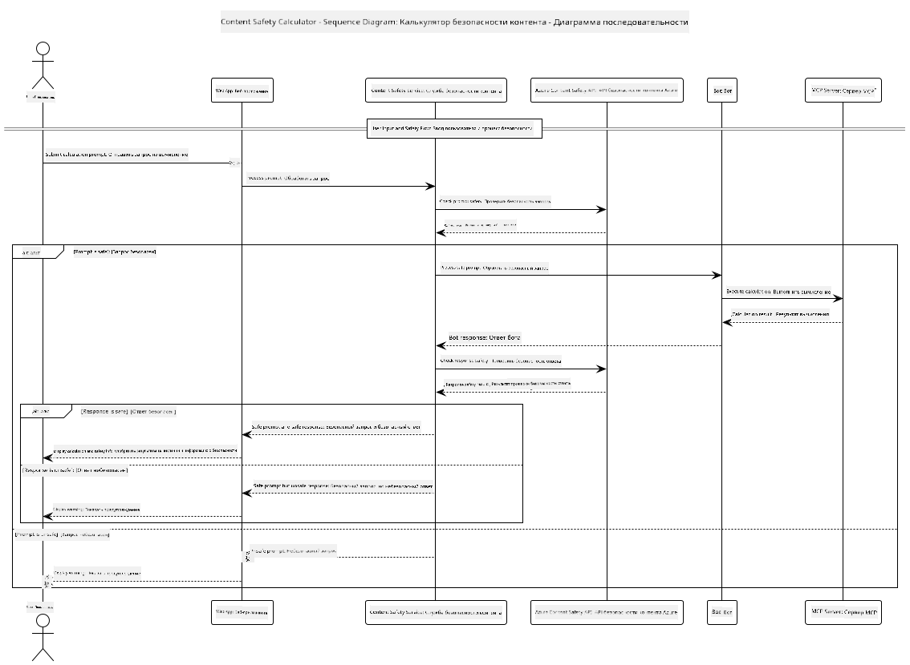

<!--
CO_OP_TRANSLATOR_METADATA:
{
  "original_hash": "e5ea5e7582f70008ea9bec3b3820f20a",
  "translation_date": "2025-07-13T23:11:49+00:00",
  "source_file": "04-PracticalImplementation/samples/java/containerapp/README.md",
  "language_code": "ru"
}
-->
## Архитектура системы

Этот проект демонстрирует веб-приложение, которое использует проверку безопасности контента перед передачей пользовательских запросов в сервис калькулятора через Model Context Protocol (MCP).



### Как это работает

1. **Ввод пользователя**: пользователь вводит запрос на вычисление в веб-интерфейсе  
2. **Проверка безопасности контента (вход)**: запрос анализируется с помощью Azure Content Safety API  
3. **Решение по безопасности (вход)**:  
   - Если контент безопасен (уровень серьезности < 2 во всех категориях), запрос передается в калькулятор  
   - Если контент помечен как потенциально опасный, процесс останавливается и возвращается предупреждение  
4. **Интеграция с калькулятором**: безопасный контент обрабатывается LangChain4j, который взаимодействует с сервером калькулятора MCP  
5. **Проверка безопасности контента (выход)**: ответ бота анализируется Azure Content Safety API  
6. **Решение по безопасности (выход)**:  
   - Если ответ бота безопасен, он отображается пользователю  
   - Если ответ бота помечен как потенциально опасный, он заменяется предупреждением  
7. **Ответ**: результаты (если они безопасны) отображаются пользователю вместе с обоими анализами безопасности

## Использование Model Context Protocol (MCP) с сервисами калькулятора

Этот проект демонстрирует, как использовать Model Context Protocol (MCP) для вызова сервисов калькулятора MCP из LangChain4j. В реализации используется локальный MCP-сервер, работающий на порту 8080, для предоставления операций калькулятора.

### Настройка сервиса Azure Content Safety

Перед использованием функций безопасности контента необходимо создать ресурс Azure Content Safety:

1. Войдите в [Azure Portal](https://portal.azure.com)  
2. Нажмите «Создать ресурс» и найдите «Content Safety»  
3. Выберите «Content Safety» и нажмите «Создать»  
4. Введите уникальное имя для вашего ресурса  
5. Выберите подписку и группу ресурсов (или создайте новую)  
6. Выберите поддерживаемый регион (подробности смотрите в [Доступность регионов](https://azure.microsoft.com/en-us/global-infrastructure/services/?products=cognitive-services))  
7. Выберите подходящий тарифный план  
8. Нажмите «Создать» для развертывания ресурса  
9. После завершения развертывания нажмите «Перейти к ресурсу»  
10. В левой панели в разделе «Управление ресурсом» выберите «Ключи и конечная точка»  
11. Скопируйте любой из ключей и URL конечной точки для использования на следующем шаге

### Настройка переменных окружения

Установите переменную окружения `GITHUB_TOKEN` для аутентификации моделей GitHub:  
```sh
export GITHUB_TOKEN=<your_github_token>
```

Для функций безопасности контента установите:  
```sh
export CONTENT_SAFETY_ENDPOINT=<your_content_safety_endpoint>
export CONTENT_SAFETY_KEY=<your_content_safety_key>
```

Эти переменные окружения используются приложением для аутентификации в сервисе Azure Content Safety. Если переменные не заданы, приложение будет использовать демонстрационные значения-заполнители, но функции безопасности контента работать корректно не будут.

### Запуск MCP-сервера калькулятора

Перед запуском клиента необходимо запустить MCP-сервер калькулятора в режиме SSE на localhost:8080.

## Описание проекта

Этот проект демонстрирует интеграцию Model Context Protocol (MCP) с LangChain4j для вызова сервисов калькулятора. Основные возможности включают:

- Использование MCP для подключения к сервису калькулятора для базовых математических операций  
- Двухуровневая проверка безопасности контента как для пользовательских запросов, так и для ответов бота  
- Интеграция с моделью gpt-4.1-nano от GitHub через LangChain4j  
- Использование Server-Sent Events (SSE) для транспорта MCP

## Интеграция безопасности контента

Проект включает комплексные функции безопасности контента, чтобы гарантировать, что и пользовательские вводы, и системные ответы не содержат вредоносного контента:

1. **Проверка входных данных**: все пользовательские запросы анализируются на наличие вредоносного контента, такого как речь ненависти, насилие, самоповреждение и сексуальный контент, перед обработкой.  

2. **Проверка выходных данных**: даже при использовании потенциально неограниченных моделей система проверяет все сгенерированные ответы через те же фильтры безопасности контента перед отображением пользователю.

Такой двухуровневый подход обеспечивает безопасность системы вне зависимости от используемой модели ИИ, защищая пользователей как от вредоносных запросов, так и от потенциально проблемных ответов ИИ.

## Веб-клиент

Приложение включает удобный веб-интерфейс, который позволяет пользователям взаимодействовать с системой Content Safety Calculator:

### Особенности веб-интерфейса

- Простой и интуитивно понятный формуляр для ввода запросов на вычисления  
- Двухуровневая проверка безопасности контента (вход и выход)  
- Обратная связь в реальном времени о безопасности запроса и ответа  
- Цветовые индикаторы безопасности для удобного восприятия  
- Чистый, адаптивный дизайн, работающий на различных устройствах  
- Примеры безопасных запросов для помощи пользователям

### Использование веб-клиента

1. Запустите приложение:  
   ```sh
   mvn spring-boot:run
   ```

2. Откройте браузер и перейдите по адресу `http://localhost:8087`

3. Введите запрос на вычисление в предоставленное текстовое поле (например, «Вычислить сумму 24.5 и 17.3»)

4. Нажмите «Отправить» для обработки запроса

5. Просмотрите результаты, которые будут включать:  
   - Анализ безопасности вашего запроса  
   - Результат вычисления (если запрос был безопасен)  
   - Анализ безопасности ответа бота  
   - Предупреждения о безопасности, если вход или выход были помечены

Веб-клиент автоматически обрабатывает обе проверки безопасности контента, обеспечивая безопасность и корректность всех взаимодействий вне зависимости от используемой модели ИИ.

**Отказ от ответственности**:  
Этот документ был переведен с помощью сервиса автоматического перевода [Co-op Translator](https://github.com/Azure/co-op-translator). Несмотря на наши усилия по обеспечению точности, просим учитывать, что автоматический перевод может содержать ошибки или неточности. Оригинальный документ на его исходном языке следует считать авторитетным источником. Для получения критически важной информации рекомендуется обращаться к профессиональному переводу, выполненному человеком. Мы не несем ответственности за любые недоразумения или неправильные толкования, возникшие в результате использования данного перевода.