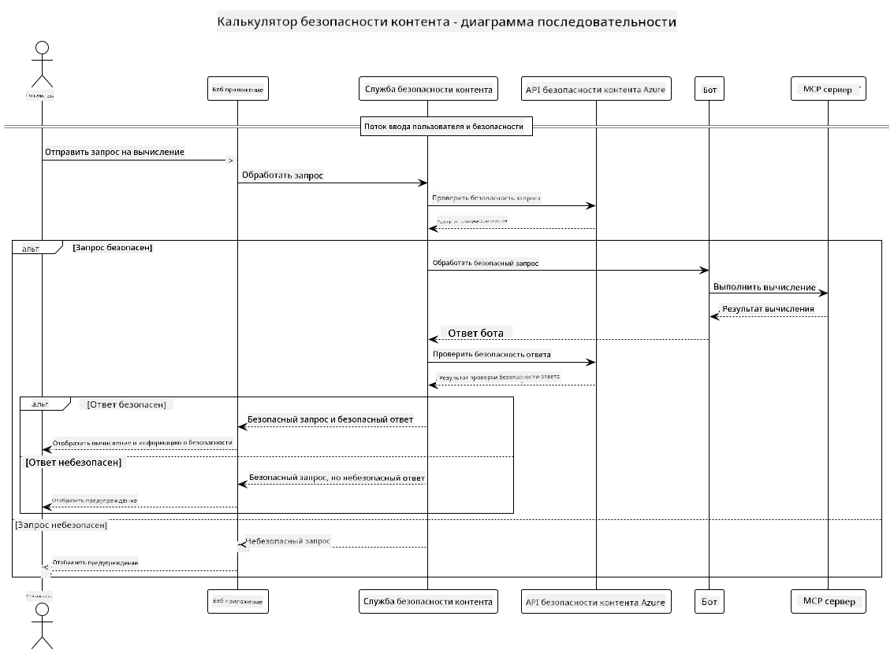

<!--
CO_OP_TRANSLATOR_METADATA:
{
  "original_hash": "e5ea5e7582f70008ea9bec3b3820f20a",
  "translation_date": "2025-05-17T14:21:30+00:00",
  "source_file": "04-PracticalImplementation/samples/java/containerapp/README.md",
  "language_code": "ru"
}
-->
## Архитектура системы

Этот проект демонстрирует веб-приложение, которое использует проверку безопасности контента перед передачей пользовательских запросов в сервис калькулятора через протокол Model Context Protocol (MCP).



### Как это работает

1. **Ввод пользователя**: Пользователь вводит запрос на расчет в веб-интерфейсе
2. **Проверка безопасности контента (ввод)**: Запрос анализируется API безопасности контента Azure
3. **Решение по безопасности (ввод)**:
   - Если контент безопасен (уровень серьезности < 2 во всех категориях), он передается в калькулятор
   - Если контент отмечен как потенциально опасный, процесс останавливается и возвращается предупреждение
4. **Интеграция калькулятора**: Безопасный контент обрабатывается LangChain4j, который взаимодействует с сервером калькулятора MCP
5. **Проверка безопасности контента (вывод)**: Ответ бота анализируется API безопасности контента Azure
6. **Решение по безопасности (вывод)**:
   - Если ответ бота безопасен, он отображается пользователю
   - Если ответ бота отмечен как потенциально опасный, он заменяется предупреждением
7. **Ответ**: Результаты (если безопасны) отображаются пользователю вместе с обоими анализами безопасности

## Использование Model Context Protocol (MCP) с сервисами калькулятора

Этот проект демонстрирует, как использовать Model Context Protocol (MCP) для вызова сервисов калькулятора MCP из LangChain4j. Реализация использует локальный сервер MCP, работающий на порту 8080, для предоставления операций калькулятора.

### Настройка сервиса безопасности контента Azure

Перед использованием функций безопасности контента необходимо создать ресурс службы безопасности контента Azure:

1. Войдите в [Azure Portal](https://portal.azure.com)
2. Нажмите "Создать ресурс" и найдите "Content Safety"
3. Выберите "Content Safety" и нажмите "Создать"
4. Введите уникальное имя для вашего ресурса
5. Выберите вашу подписку и группу ресурсов (или создайте новую)
6. Выберите поддерживаемый регион (проверьте [Доступность региона](https://azure.microsoft.com/en-us/global-infrastructure/services/?products=cognitive-services) для деталей)
7. Выберите подходящий уровень цен
8. Нажмите "Создать" для развертывания ресурса
9. После завершения развертывания нажмите "Перейти к ресурсу"
10. В левой панели, в разделе "Управление ресурсами", выберите "Ключи и конечная точка"
11. Скопируйте один из ключей и URL конечной точки для использования на следующем шаге

### Настройка переменных окружения

Установите переменную окружения `GITHUB_TOKEN` для аутентификации моделей GitHub:
```sh
export GITHUB_TOKEN=<your_github_token>
```

Для функций безопасности контента установите:
```sh
export CONTENT_SAFETY_ENDPOINT=<your_content_safety_endpoint>
export CONTENT_SAFETY_KEY=<your_content_safety_key>
```

Эти переменные окружения используются приложением для аутентификации с сервисом безопасности контента Azure. Если эти переменные не установлены, приложение будет использовать значения-заполнители для демонстрации, но функции безопасности контента не будут работать должным образом.

### Запуск сервера калькулятора MCP

Перед запуском клиента необходимо запустить сервер калькулятора MCP в режиме SSE на localhost:8080.

## Описание проекта

Этот проект демонстрирует интеграцию Model Context Protocol (MCP) с LangChain4j для вызова сервисов калькулятора. Основные функции включают:

- Использование MCP для подключения к сервису калькулятора для выполнения базовых математических операций
- Двухуровневая проверка безопасности контента для пользовательских запросов и ответов бота
- Интеграция с моделью gpt-4.1-nano GitHub через LangChain4j
- Использование событий, отправленных сервером (SSE), для транспорта MCP

## Интеграция безопасности контента

Проект включает комплексные функции безопасности контента для обеспечения того, чтобы как пользовательские вводы, так и системные ответы не содержали вредоносного контента:

1. **Проверка ввода**: Все пользовательские запросы анализируются на наличие категорий вредоносного контента, таких как ненависть, насилие, самоповреждение и сексуальный контент перед обработкой.

2. **Проверка вывода**: Даже при использовании потенциально нецензурированных моделей система проверяет все сгенерированные ответы через те же фильтры безопасности контента перед их отображением пользователю.

Этот двухуровневый подход гарантирует, что система остается безопасной независимо от того, какая AI модель используется, защищая пользователей как от вредоносных вводов, так и от потенциально проблемных AI-сгенерированных выводов.

## Веб-клиент

Приложение включает удобный веб-интерфейс, который позволяет пользователям взаимодействовать с системой Content Safety Calculator:

### Функции веб-интерфейса

- Простой, интуитивно понятный форма для ввода запросов на расчет
- Двухуровневая проверка безопасности контента (ввод и вывод)
- Обратная связь в реальном времени по безопасности запроса и ответа
- Индикаторы безопасности, кодированные цветом, для легкой интерпретации
- Чистый, адаптивный дизайн, который работает на различных устройствах
- Примеры безопасных запросов для помощи пользователям

### Использование веб-клиента

1. Запустите приложение:
   ```sh
   mvn spring-boot:run
   ```

2. Откройте ваш браузер и перейдите на `http://localhost:8087`

3. Введите запрос на расчет в предоставленной текстовой области (например, "Calculate the sum of 24.5 and 17.3")

4. Нажмите "Отправить" для обработки вашего запроса

5. Просмотрите результаты, которые будут включать:
   - Анализ безопасности контента вашего запроса
   - Вычисленный результат (если запрос был безопасен)
   - Анализ безопасности контента ответа бота
   - Любые предупреждения о безопасности, если либо ввод, либо вывод были отмечены

Веб-клиент автоматически обрабатывает оба процесса проверки безопасности контента, обеспечивая безопасность и соответствие всех взаимодействий независимо от того, какая AI модель используется.

**Отказ от ответственности**:  
Этот документ был переведен с помощью службы автоматического перевода [Co-op Translator](https://github.com/Azure/co-op-translator). Мы стремимся к точности, однако имейте в виду, что автоматические переводы могут содержать ошибки или неточности. Оригинальный документ на его родном языке следует считать авторитетным источником. Для получения критически важной информации рекомендуется профессиональный перевод человеком. Мы не несем ответственности за любые недоразумения или неправильные интерпретации, возникшие в результате использования этого перевода.