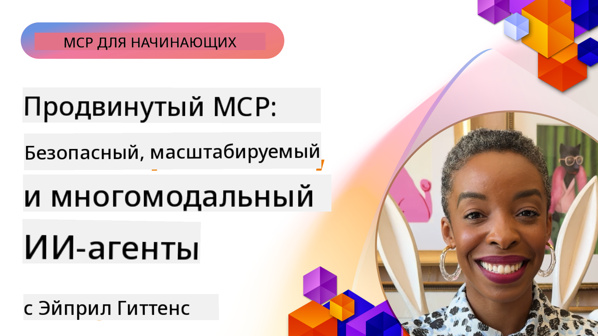

<!--
CO_OP_TRANSLATOR_METADATA:
{
  "original_hash": "d204bc94ea6027d06a703b21b711ca57",
  "translation_date": "2025-08-18T13:13:15+00:00",
  "source_file": "05-AdvancedTopics/README.md",
  "language_code": "ru"
}
-->
# Продвинутые темы в MCP

_(Нажмите на изображение выше, чтобы посмотреть видео урока)_

В этой главе рассматриваются ряд продвинутых тем по реализации Model Context Protocol (MCP), включая мультимодальную интеграцию, масштабируемость, лучшие практики безопасности и интеграцию с корпоративными системами. Эти темы важны для создания надежных и готовых к производству MCP приложений, способных удовлетворить требования современных AI систем.

## Обзор

Этот урок посвящен изучению продвинутых концепций реализации Model Context Protocol, с акцентом на мультимодальную интеграцию, масштабируемость, лучшие практики безопасности и корпоративную интеграцию. Эти темы необходимы для создания MCP приложений промышленного уровня, способных справляться с комплексными требованиями в корпоративной среде.

## Цели обучения

К концу этого урока вы сможете:

- Реализовать мультимодальные возможности в рамках MCP
- Разрабатывать масштабируемые архитектуры MCP для сценариев с высокой нагрузкой
- Применять лучшие практики безопасности в соответствии с принципами безопасности MCP
- Интегрировать MCP с корпоративными AI системами и фреймворками
- Оптимизировать производительность и надежность в производственных средах

## Уроки и примеры проектов

| Ссылка | Название | Описание |
|--------|----------|----------|
| [5.1 Интеграция с Azure](./mcp-integration/README.md) | Интеграция с Azure | Узнайте, как интегрировать ваш MCP сервер с Azure |
| [5.2 Пример мультимодальности](./mcp-multi-modality/README.md) | Примеры мультимодальности MCP | Примеры для аудио, изображений и мультимодальных ответов |
| [5.3 Пример MCP OAuth2](../../../05-AdvancedTopics/mcp-oauth2-demo) | Демонстрация MCP OAuth2 | Минимальное приложение Spring Boot, демонстрирующее OAuth2 с MCP, как сервер авторизации и сервер ресурсов. Показывает безопасную выдачу токенов, защищенные конечные точки, развертывание в Azure Container Apps и интеграцию с API Management. |
| [5.4 Корневые контексты](./mcp-root-contexts/README.md) | Корневые контексты | Узнайте больше о корневых контекстах и их реализации |
| [5.5 Маршрутизация](./mcp-routing/README.md) | Маршрутизация | Узнайте о различных типах маршрутизации |
| [5.6 Семплирование](./mcp-sampling/README.md) | Семплирование | Узнайте, как работать с семплированием |
| [5.7 Масштабирование](./mcp-scaling/README.md) | Масштабирование | Узнайте о масштабировании |
| [5.8 Безопасность](./mcp-security/README.md) | Безопасность | Защитите ваш MCP сервер |
| [5.9 Пример веб-поиска](./web-search-mcp/README.md) | MCP веб-поиск | Python MCP сервер и клиент, интегрирующийся с SerpAPI для поиска в реальном времени, новостей, продуктов и Q&A. Демонстрирует оркестрацию мультитулов, интеграцию внешних API и надежную обработку ошибок. |
| [5.10 Потоковая передача в реальном времени](./mcp-realtimestreaming/README.md) | Потоковая передача | Потоковая передача данных в реальном времени стала необходимой в современном мире, где бизнес и приложения требуют немедленного доступа к информации для своевременного принятия решений. |
| [5.11 Веб-поиск в реальном времени](./mcp-realtimesearch/README.md) | Веб-поиск | Узнайте, как MCP трансформирует веб-поиск в реальном времени, предоставляя стандартизированный подход к управлению контекстом между AI моделями, поисковыми системами и приложениями. |
| [5.12 Аутентификация Entra ID для серверов Model Context Protocol](./mcp-security-entra/README.md) | Аутентификация Entra ID | Microsoft Entra ID предоставляет надежное облачное решение для управления идентификацией и доступом, помогая гарантировать, что только авторизованные пользователи и приложения могут взаимодействовать с вашим MCP сервером. |
| [5.13 Интеграция с агентами Azure AI Foundry](./mcp-foundry-agent-integration/README.md) | Интеграция с Azure AI Foundry | Узнайте, как интегрировать серверы Model Context Protocol с агентами Azure AI Foundry, обеспечивая мощную оркестрацию инструментов и корпоративные AI возможности с стандартизированными подключениями к внешним источникам данных. |
| [5.14 Инженерия контекста](./mcp-contextengineering/README.md) | Инженерия контекста | Перспективы инженерии контекста для серверов MCP, включая оптимизацию контекста, динамическое управление контекстом и стратегии эффективной инженерии подсказок в рамках MCP. |

## Дополнительные ссылки

Для получения самой актуальной информации о продвинутых темах MCP, обратитесь к:
- [Документация MCP](https://modelcontextprotocol.io/)
- [Спецификация MCP](https://spec.modelcontextprotocol.io/)
- [GitHub репозиторий](https://github.com/modelcontextprotocol)

## Основные выводы

- Мультимодальные реализации MCP расширяют возможности AI за пределы обработки текста
- Масштабируемость важна для корпоративных развертываний и может быть достигнута через горизонтальное и вертикальное масштабирование
- Комплексные меры безопасности защищают данные и обеспечивают надлежащий контроль доступа
- Интеграция с корпоративными платформами, такими как Azure OpenAI и Microsoft AI Foundry, усиливает возможности MCP
- Продвинутые реализации MCP выигрывают от оптимизированных архитектур и тщательного управления ресурсами

## Упражнение

Разработайте корпоративную реализацию MCP для конкретного сценария:

1. Определите мультимодальные требования для вашего сценария
2. Опишите меры безопасности, необходимые для защиты конфиденциальных данных
3. Спроектируйте масштабируемую архитектуру, способную справляться с переменной нагрузкой
4. Запланируйте точки интеграции с корпоративными AI системами
5. Задокументируйте потенциальные узкие места производительности и стратегии их устранения

## Дополнительные ресурсы

- [Документация Azure OpenAI](https://learn.microsoft.com/en-us/azure/ai-services/openai/)
- [Документация Microsoft AI Foundry](https://learn.microsoft.com/en-us/ai-services/)

---

## Что дальше

- [5.1 Интеграция MCP](./mcp-integration/README.md)

**Отказ от ответственности**:  
Этот документ был переведен с использованием сервиса автоматического перевода [Co-op Translator](https://github.com/Azure/co-op-translator). Хотя мы стремимся к точности, пожалуйста, учитывайте, что автоматические переводы могут содержать ошибки или неточности. Оригинальный документ на его родном языке следует считать авторитетным источником. Для получения критически важной информации рекомендуется профессиональный перевод человеком. Мы не несем ответственности за любые недоразумения или неправильные интерпретации, возникшие в результате использования данного перевода.