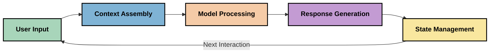
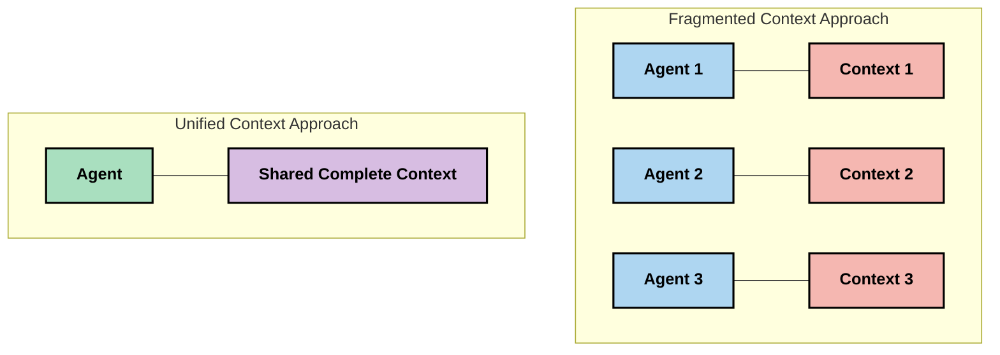
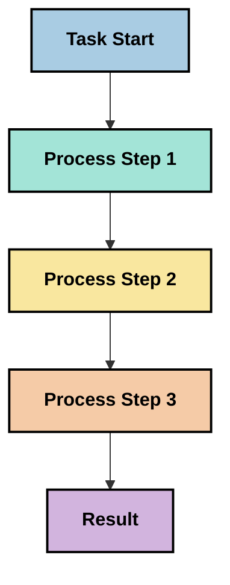
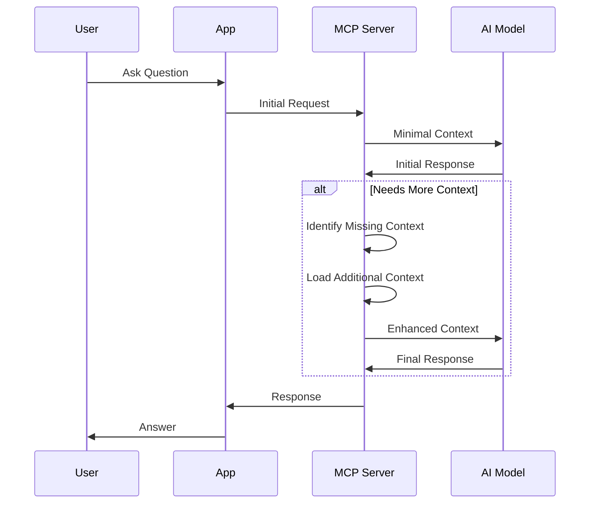
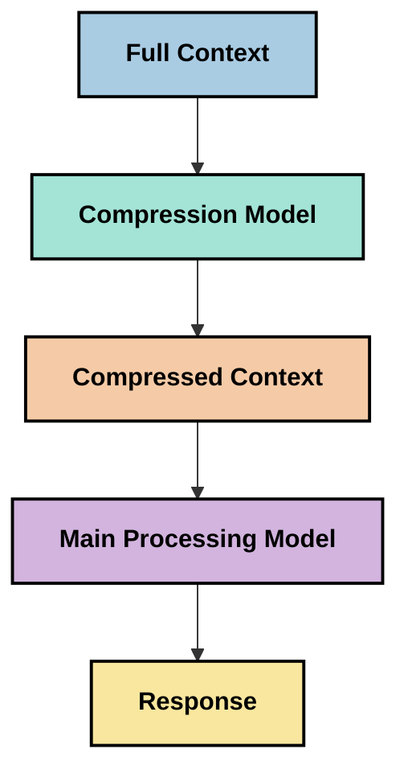
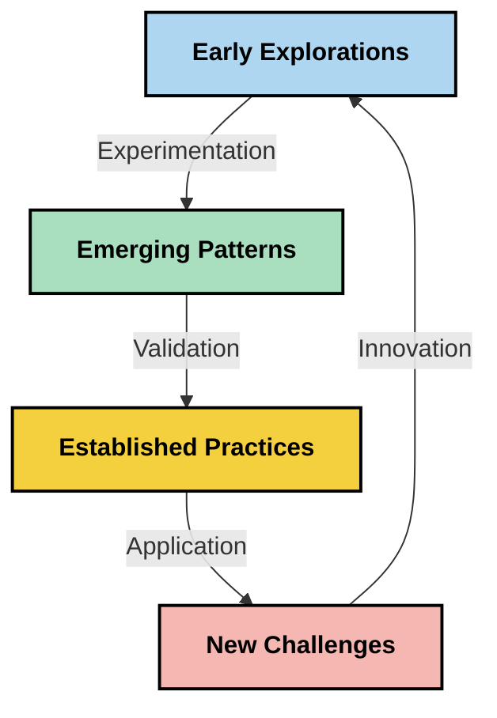

<!--
CO_OP_TRANSLATOR_METADATA:
{
  "original_hash": "5762e8e74dd99d8b7dbb31e69a82561e",
  "translation_date": "2025-07-17T01:36:25+00:00",
  "source_file": "05-AdvancedTopics/mcp-contextengineering/README.md",
  "language_code": "ru"
}
-->
# Контекстная инженерия: новая концепция в экосистеме MCP

## Обзор

Контекстная инженерия — это новая концепция в области ИИ, которая изучает, как информация структурируется, передаётся и поддерживается в ходе взаимодействия между клиентами и ИИ-сервисами. По мере развития экосистемы Model Context Protocol (MCP) понимание эффективного управления контекстом становится всё более важным. В этом модуле представлена концепция контекстной инженерии и рассмотрены её потенциальные применения в реализации MCP.

## Цели обучения

К концу этого модуля вы сможете:

- Понять новую концепцию контекстной инженерии и её возможную роль в приложениях MCP
- Выявить ключевые проблемы управления контекстом, которые решает протокол MCP
- Изучить методы улучшения производительности моделей за счёт более эффективного управления контекстом
- Рассмотреть подходы к измерению и оценке эффективности контекста
- Применять эти новые концепции для улучшения ИИ-опыта через фреймворк MCP

## Введение в контекстную инженерию

Контекстная инженерия — это новая область, сосредоточенная на осознанном проектировании и управлении потоком информации между пользователями, приложениями и ИИ-моделями. В отличие от устоявшихся направлений, таких как prompt engineering, контекстная инженерия всё ещё формируется практиками, которые решают уникальные задачи по предоставлению моделям ИИ нужной информации в нужное время.

С развитием больших языковых моделей (LLM) важность контекста стала очевидной. Качество, релевантность и структура предоставляемого контекста напрямую влияют на результаты модели. Контекстная инженерия исследует эту взаимосвязь и стремится разработать принципы эффективного управления контекстом.

> «В 2025 году модели невероятно умны. Но даже самый умный человек не сможет эффективно выполнять свою работу без контекста того, что от него требуют... "Контекстная инженерия" — это следующий уровень prompt engineering. Речь идёт о том, чтобы делать это автоматически в динамической системе.» — Walden Yan, Cognition AI

Контекстная инженерия может включать:

1. **Выбор контекста**: определение, какая информация важна для конкретной задачи  
2. **Структурирование контекста**: организация информации для максимального понимания моделью  
3. **Доставку контекста**: оптимизация способа и времени передачи информации моделям  
4. **Поддержание контекста**: управление состоянием и развитием контекста со временем  
5. **Оценку контекста**: измерение и улучшение эффективности контекста  

Эти направления особенно актуальны для экосистемы MCP, которая предоставляет стандартизированный способ передачи контекста LLM.

## Перспектива пути контекста

Один из способов визуализировать контекстную инженерию — проследить путь информации через систему MCP:



### Ключевые этапы пути контекста:

1. **Ввод пользователя**: исходная информация от пользователя (текст, изображения, документы)  
2. **Сборка контекста**: объединение пользовательского ввода с системным контекстом, историей диалога и другой полученной информацией  
3. **Обработка моделью**: ИИ-модель обрабатывает собранный контекст  
4. **Генерация ответа**: модель формирует выводы на основе предоставленного контекста  
5. **Управление состоянием**: система обновляет внутреннее состояние на основе взаимодействия  

Этот взгляд подчёркивает динамичность контекста в ИИ-системах и поднимает важные вопросы о том, как лучше управлять информацией на каждом этапе.

## Основные принципы контекстной инженерии

По мере формирования области контекстной инженерии практики начинают выделять некоторые базовые принципы, которые могут помочь в реализации MCP:

### Принцип 1: Полное совместное использование контекста

Контекст должен полностью передаваться между всеми компонентами системы, а не быть раздробленным между разными агентами или процессами. При распределённом контексте решения, принятые в одной части системы, могут противоречить решениям в другой.



В приложениях MCP это означает проектирование систем, где контекст плавно проходит через весь конвейер, а не разделяется на отдельные части.

### Принцип 2: Понимать, что действия несут скрытые решения

Каждое действие модели содержит скрытые решения о том, как интерпретировать контекст. Когда разные компоненты работают с разным контекстом, эти скрытые решения могут конфликтовать, приводя к непоследовательным результатам.

Этот принцип важен для приложений MCP:
- Предпочитать линейную обработку сложных задач вместо параллельного выполнения с раздробленным контекстом  
- Обеспечить доступ всех точек принятия решений к одному и тому же контексту  
- Проектировать системы так, чтобы последующие этапы видели полный контекст предыдущих решений  

### Принцип 3: Балансировать глубину контекста с ограничениями окна

По мере увеличения длины диалогов и процессов окна контекста переполняются. Эффективная контекстная инженерия исследует способы управления этим балансом между полнотой контекста и техническими ограничениями.

Рассматриваемые подходы включают:
- Сжатие контекста с сохранением ключевой информации и уменьшением количества токенов  
- Постепенная загрузка контекста в зависимости от актуальности  
- Суммирование предыдущих взаимодействий с сохранением важных решений и фактов  

## Проблемы контекста и дизайн протокола MCP

Протокол Model Context Protocol (MCP) был разработан с учётом уникальных проблем управления контекстом. Понимание этих проблем помогает объяснить ключевые аспекты дизайна протокола MCP:

### Проблема 1: Ограничения окна контекста  
Большинство ИИ-моделей имеют фиксированный размер окна контекста, ограничивающий объём обрабатываемой информации.

**Реакция MCP:**  
- Протокол поддерживает структурированный контекст на основе ресурсов, к которым можно эффективно обращаться  
- Ресурсы могут быть разбиты на страницы и загружаться постепенно  

### Проблема 2: Определение релевантности  
Трудно определить, какая информация наиболее важна для включения в контекст.

**Реакция MCP:**  
- Гибкие инструменты позволяют динамически получать информацию по мере необходимости  
- Структурированные подсказки обеспечивают последовательную организацию контекста  

### Проблема 3: Сохранение контекста  
Управление состоянием между взаимодействиями требует тщательного отслеживания контекста.

**Реакция MCP:**  
- Стандартизированное управление сессиями  
- Чётко определённые шаблоны взаимодействия для развития контекста  

### Проблема 4: Мультимодальный контекст  
Разные типы данных (текст, изображения, структурированные данные) требуют разного подхода.

**Реакция MCP:**  
- Дизайн протокола учитывает различные типы контента  
- Стандартизированное представление мультимодальной информации  

### Проблема 5: Безопасность и конфиденциальность  
Контекст часто содержит чувствительную информацию, которую нужно защищать.

**Реакция MCP:**  
- Чёткое разграничение обязанностей клиента и сервера  
- Возможности локальной обработки для минимизации раскрытия данных  

Понимание этих проблем и способов их решения в MCP создаёт основу для изучения более продвинутых методов контекстной инженерии.

## Новые подходы в контекстной инженерии

По мере развития области контекстной инженерии появляются несколько перспективных подходов. Они отражают текущее мышление, а не устоявшиеся практики, и, вероятно, будут эволюционировать с накоплением опыта в реализации MCP.

### 1. Однопоточная линейная обработка

В отличие от многокомпонентных архитектур с распределённым контекстом, некоторые специалисты обнаруживают, что однопоточная линейная обработка даёт более последовательные результаты. Это соответствует принципу поддержания единого контекста.



Хотя такой подход может казаться менее эффективным по сравнению с параллельной обработкой, он часто даёт более связные и надёжные результаты, поскольку каждый шаг строится на полном понимании предыдущих решений.

### 2. Разбиение и приоритизация контекста

Деление больших контекстов на управляемые части и выделение наиболее важных.

```python
# Conceptual Example: Context Chunking and Prioritization
def process_with_chunked_context(documents, query):
    # 1. Break documents into smaller chunks
    chunks = chunk_documents(documents)
    
    # 2. Calculate relevance scores for each chunk
    scored_chunks = [(chunk, calculate_relevance(chunk, query)) for chunk in chunks]
    
    # 3. Sort chunks by relevance score
    sorted_chunks = sorted(scored_chunks, key=lambda x: x[1], reverse=True)
    
    # 4. Use the most relevant chunks as context
    context = create_context_from_chunks([chunk for chunk, score in sorted_chunks[:5]])
    
    # 5. Process with the prioritized context
    return generate_response(context, query)
```

Приведённая концепция показывает, как можно разбивать большие документы на части и выбирать только самые релевантные для контекста. Такой подход помогает работать в рамках ограничений окна контекста, используя при этом большие базы знаний.

### 3. Постепенная загрузка контекста

Загрузка контекста по мере необходимости, а не сразу целиком.



Постепенная загрузка начинается с минимального контекста и расширяется только при необходимости. Это значительно снижает использование токенов для простых запросов, сохраняя возможность обработки сложных вопросов.

### 4. Сжатие и суммирование контекста

Уменьшение размера контекста при сохранении ключевой информации.



Сжатие контекста включает:  
- Удаление избыточной информации  
- Суммирование длинного содержимого  
- Выделение ключевых фактов и деталей  
- Сохранение критически важных элементов контекста  
- Оптимизацию использования токенов  

Этот подход особенно полезен для поддержания длинных диалогов в рамках окна контекста или для эффективной обработки больших документов. Некоторые специалисты используют специализированные модели именно для сжатия и суммирования истории диалогов.

## Важные аспекты для изучения в контекстной инженерии

При изучении контекстной инженерии в рамках MCP стоит учитывать несколько моментов. Это не жёсткие рекомендации, а области для экспериментов, которые могут улучшить ваш конкретный кейс.

### Определите цели контекста

Перед внедрением сложных решений по управлению контекстом чётко сформулируйте, чего хотите достичь:  
- Какая конкретная информация нужна модели для успешной работы?  
- Что является обязательным, а что — дополнительным?  
- Какие у вас ограничения по производительности (задержка, лимиты токенов, затраты)?  

### Изучите многослойные подходы к контексту

Некоторые специалисты успешно используют контекст, организованный в концептуальные слои:  
- **Основной слой**: информация, необходимая модели всегда  
- **Ситуационный слой**: контекст, специфичный для текущего взаимодействия  
- **Поддерживающий слой**: дополнительная полезная информация  
- **Резервный слой**: информация, доступная только при необходимости  

### Исследуйте стратегии поиска

Эффективность контекста часто зависит от способа получения информации:  
- Семантический поиск и эмбеддинги для нахождения концептуально релевантной информации  
- Поиск по ключевым словам для конкретных фактов  
- Гибридные методы, сочетающие несколько подходов  
- Фильтрация по метаданным для сужения области по категориям, датам или источникам  

### Экспериментируйте с когерентностью контекста

Структура и последовательность контекста могут влиять на понимание модели:  
- Группировка связанной информации  
- Использование единообразного форматирования и организации  
- Поддержание логического или хронологического порядка, где это уместно  
- Избегание противоречивой информации  

### Взвесьте плюсы и минусы многокомпонентных архитектур

Хотя многокомпонентные архитектуры популярны во многих ИИ-системах, они создают серьёзные сложности в управлении контекстом:  
- Фрагментация контекста может привести к непоследовательным решениям между агентами  
- Параллельная обработка может вызвать конфликты, которые сложно разрешить  
- Коммуникационные издержки между агентами могут нивелировать выигрыш в производительности  
- Требуется сложное управление состоянием для поддержания когерентности  

Во многих случаях однопоточный подход с комплексным управлением контекстом даёт более надёжные результаты, чем несколько специализированных агентов с раздробленным контекстом.

### Разрабатывайте методы оценки

Чтобы улучшать контекстную инженерию со временем, подумайте, как будете измерять успех:  
- A/B тестирование разных структур контекста  
- Мониторинг использования токенов и времени отклика  
- Отслеживание удовлетворённости пользователей и успешности выполнения задач  
- Анализ случаев, когда стратегии контекста не срабатывают  

Эти аспекты представляют собой активные направления исследований в области контекстной инженерии. По мере развития области появятся более чёткие шаблоны и практики.

## Измерение эффективности контекста: развивающаяся система

По мере становления контекстной инженерии практики начинают исследовать, как можно измерять её эффективность. Пока нет устоявшейся системы, но рассматриваются различные метрики, которые могут помочь в будущем.

### Возможные измеряемые параметры

#### 1. Эффективность ввода

- **Соотношение контекста и ответа**: сколько контекста требуется относительно размера ответа?  
- **Использование токенов**: какой процент токенов контекста влияет на ответ?  
- **Сокращение контекста**: насколько эффективно можно сжать исходную информацию?  

#### 2. Производительность

- **Влияние на задержку**: как управление контекстом влияет на время отклика?  
- **Экономия токенов**: оптимизируем ли мы использование токенов?  
- **Точность поиска**: насколько релевантна полученная информация?  
- **Использование ресурсов**: какие вычислительные ресурсы требуются?  

#### 3. Качество

- **Релевантность ответа**: насколько ответ соответствует запросу?  
- **Фактическая точность**: улучшает ли управление контекстом достоверность?  
- **Последовательность**: насколько ответы последовательны при похожих запросах?  
- **Уровень галлюцинаций**: снижает ли лучший контекст появление ошибок модели?  

#### 4. Пользовательский опыт

- **Частота уточнений**: как часто пользователям требуется дополнительное пояснение?  
- **Выполнение задач**: успешно ли пользователи достигают целей?  
- **Индикаторы удовлетворённости**: как пользователи оценивают опыт взаимодействия?  

### Экспериментальные подходы к измерению

При экспериментах с контекстной инженерией в MCP рассмотрите следующие методы:

1. **Сравнение с базовым уровнем**: сначала установите базовый уровень с простыми подходами к контексту, затем тестируйте более сложные  
2. **Пошагенные изменения**: меняйте по одному аспекту управления контекстом, чтобы изолировать эффект  
3. **Оценка с учётом пользователя**: сочетайте количественные метрики с качественной обратной связью от пользователей  
4. **Анализ неудач**: изучайте случаи, когда стратегии контекста не сработали, чтобы понять, как улучшить  
5. **Многомерная оценка**: учитывайте компромиссы между эффективностью, качеством и пользовательским опытом  

Такой экспериментальный и комплексный подход к измерению соответствует развивающейся природе контекстной инженерии.

## Заключительные мысли

Контекстная инженерия — это новая область исследований, которая может стать ключевой для эффективных приложений MCP. Внимательное рассмотрение того, как информация проходит через вашу систему, позволит создавать ИИ-опыты, которые будут более эффективными, точными и полезными для пользователей.

Методы и подходы, описанные в этом модуле, отражают ранние идеи в этой области, а не устоявшиеся практики. Контекстная инженерия может превратиться в более чёткую дисциплину по мере развития возможностей ИИ и углубления нашего понимания. Пока что экспериментирование в сочетании с тщательным измерением кажется наиболее продуктивным подходом.

## Возможные направления развития

Область контекстной инженерии пока находится на ранних этапах, но уже выделяются перспективные направления:

- Принципы контекстной инженерии могут существенно повлиять на производительность моделей, эффективность, пользовательский опыт и надёжность  
- Однопоточные подходы с комплексным управлением контекстом могут превзойти многокомпонентные архитектуры во многих случаях  
- Специализированные модели для сжатия контекста могут стать стандартными элементами ИИ-конвейеров  
- Напряжение между полнотой контекста и ограничениями по токенам, вероятно, станет драйвером инноваций в управлении контекстом  
- По мере того как модели станут лучше в эффективном общении, настоящая многокомпонентная коллаборация может стать более жизнеспособной  
- Реализации MCP могут эволюционировать, стандартизируя паттерны управления контекстом, которые появятся в ходе текущих экспериментов  



## Ресурсы

### Официальные ресурсы MCP
- [Model Context Protocol Website](https://modelcontextprotocol.io/)
- [Model Context Protocol Specification](https://github.com/modelcontextprotocol/modelcontextprotocol)
- [MCP Documentation](https://modelcontextprotocol.io/docs)
- [MCP C# SDK](https://github.com/modelcontextprotocol/csharp-sdk)
- [MCP Python SDK](https://github.com/modelcontextprotocol/python-sdk)
- [MCP TypeScript SDK](https://github.com/modelcontextprotocol/typescript-sdk)
- [MCP Inspector](https://github.com/modelcontextprotocol/inspector) - Визуальный инструмент для тестирования MCP серверов

### Статьи по контекстной инженерии
- [Не создавайте мультиагентов: принципы контекстной инженерии](https://cognition.ai/blog/dont-build-multi-agents) - Мнения Уолдена Яна о принципах контекстной инженерии
- [Практическое руководство по созданию агентов](https://cdn.openai.com/business-guides-and-resources/a-practical-guide-to-building-agents.pdf) - Руководство OpenAI по эффективному проектированию агентов
- [Создание эффективных агентов](https://www.anthropic.com/engineering/building-effective-agents) - Подход Anthropic к разработке агентов

### Связанные исследования
- [Динамическое расширение поиска для больших языковых моделей](https://arxiv.org/abs/2310.01487) - Исследование динамических методов поиска
- [Потерянные посередине: как языковые модели используют длинные контексты](https://arxiv.org/abs/2307.03172) - Важное исследование паттернов обработки контекста
- [Иерархическая генерация изображений на основе текста с использованием CLIP Latents](https://arxiv.org/abs/2204.06125) - Статья о DALL-E 2 с идеями по структурированию контекста
- [Изучение роли контекста в архитектурах больших языковых моделей](https://aclanthology.org/2023.findings-emnlp.124/) - Недавние исследования по обработке контекста
- [Сотрудничество мультиагентов: обзор](https://arxiv.org/abs/2304.03442) - Исследование мультиагентных систем и их проблем

### Дополнительные ресурсы
- [Техники оптимизации окна контекста](https://learn.microsoft.com/en-us/azure/ai-services/openai/concepts/context-window)
- [Продвинутые методы RAG](https://www.microsoft.com/en-us/research/blog/retrieval-augmented-generation-rag-and-frontier-models/)
- [Документация Semantic Kernel](https://github.com/microsoft/semantic-kernel)
- [Набор инструментов ИИ для управления контекстом](https://github.com/microsoft/aitoolkit)

## Что дальше
- [6. Вклад сообщества](../../06-CommunityContributions/README.md)

**Отказ от ответственности**:  
Этот документ был переведен с помощью сервиса автоматического перевода [Co-op Translator](https://github.com/Azure/co-op-translator). Несмотря на наши усилия по обеспечению точности, просим учитывать, что автоматический перевод может содержать ошибки или неточности. Оригинальный документ на его исходном языке следует считать авторитетным источником. Для получения критически важной информации рекомендуется обращаться к профессиональному переводу, выполненному человеком. Мы не несем ответственности за любые недоразумения или неправильные толкования, возникшие в результате использования данного перевода.