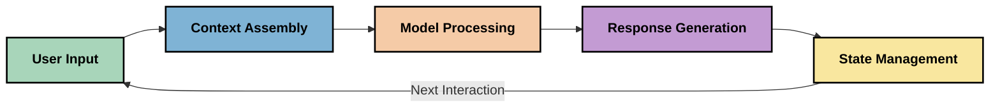
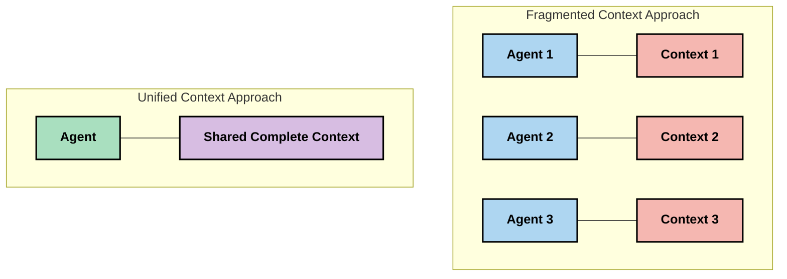
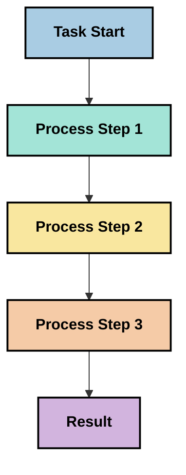
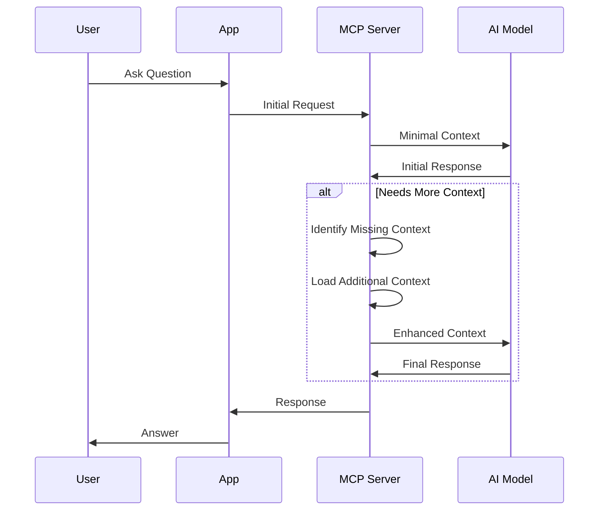
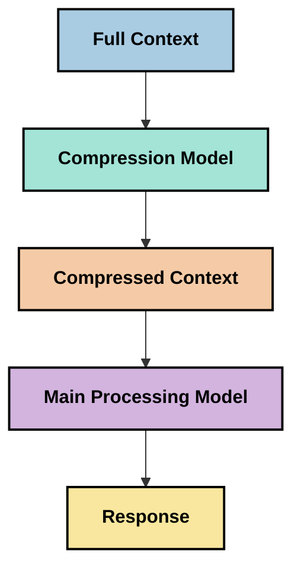
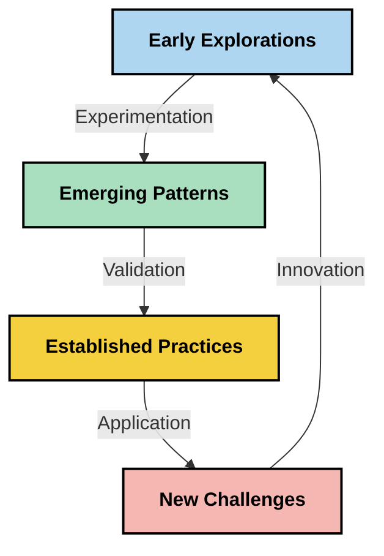

<!--
CO_OP_TRANSLATOR_METADATA:
{
  "original_hash": "fd169ca3071b81b5ee282e194bc823df",
  "translation_date": "2025-09-15T19:42:00+00:00",
  "source_file": "05-AdvancedTopics/mcp-contextengineering/README.md",
  "language_code": "ru"
}
-->
# Контекстная инженерия: новый концепт в экосистеме MCP

## Обзор

Контекстная инженерия — это новый концепт в области искусственного интеллекта, который изучает, как информация структурируется, передается и поддерживается в ходе взаимодействия между клиентами и AI-сервисами. По мере развития экосистемы Model Context Protocol (MCP) понимание эффективного управления контекстом становится все более важным. Этот модуль вводит понятие контекстной инженерии и исследует ее потенциальные применения в реализации MCP.

## Цели обучения

К концу этого модуля вы сможете:

- Понять новый концепт контекстной инженерии и ее возможную роль в приложениях MCP
- Выявить ключевые проблемы управления контекстом, которые решает дизайн MCP протокола
- Изучить методы улучшения производительности моделей через более эффективное управление контекстом
- Рассмотреть подходы к измерению и оценке эффективности контекста
- Применить эти новые концепты для улучшения AI-опыта через MCP-фреймворк

## Введение в контекстную инженерию

Контекстная инженерия — это новый подход, сосредоточенный на целенаправленном проектировании и управлении потоком информации между пользователями, приложениями и AI-моделями. В отличие от таких устоявшихся областей, как инженерия подсказок, контекстная инженерия все еще формируется практиками, которые работают над решением уникальных задач предоставления AI-моделям нужной информации в нужное время.

С развитием больших языковых моделей (LLMs) важность контекста становится все более очевидной. Качество, релевантность и структура предоставляемого контекста напрямую влияют на результаты работы модели. Контекстная инженерия изучает эту взаимосвязь и стремится разработать принципы эффективного управления контекстом.

> "В 2025 году существующие модели будут чрезвычайно умными. Но даже самый умный человек не сможет эффективно выполнять свою работу без контекста того, что от него требуется... 'Контекстная инженерия' — это следующий уровень инженерии подсказок. Она заключается в автоматизации этого процесса в динамической системе." — Уолден Ян, Cognition AI

Контекстная инженерия может включать:

1. **Выбор контекста**: Определение, какая информация релевантна для конкретной задачи
2. **Структурирование контекста**: Организация информации для максимального понимания моделью
3. **Передача контекста**: Оптимизация того, как и когда информация отправляется моделям
4. **Поддержание контекста**: Управление состоянием и эволюцией контекста со временем
5. **Оценка контекста**: Измерение и улучшение эффективности контекста

Эти аспекты особенно актуальны для экосистемы MCP, которая предоставляет стандартизированный способ передачи контекста LLM.

## Перспектива "Путешествия контекста"

Один из способов визуализировать контекстную инженерию — это проследить путь, который информация проходит через систему MCP:



### Основные этапы "путешествия контекста":

1. **Ввод пользователя**: Исходная информация от пользователя (текст, изображения, документы)
2. **Сборка контекста**: Объединение ввода пользователя с системным контекстом, историей взаимодействий и другой извлеченной информацией
3. **Обработка моделью**: AI-модель обрабатывает собранный контекст
4. **Генерация ответа**: Модель создает результаты на основе предоставленного контекста
5. **Управление состоянием**: Система обновляет свое внутреннее состояние на основе взаимодействия

Этот подход подчеркивает динамическую природу контекста в AI-системах и ставит важные вопросы о том, как лучше управлять информацией на каждом этапе.

## Новые принципы контекстной инженерии

По мере формирования области контекстной инженерии начинают появляться первые принципы, которые могут помочь в выборе подходов к реализации MCP.

### Принцип 1: Полное разделение контекста

Контекст должен полностью разделяться между всеми компонентами системы, а не быть фрагментированным между несколькими агентами или процессами. Когда контекст распределен, решения, принятые в одной части системы, могут противоречить решениям, принятым в другой.



В приложениях MCP это предполагает проектирование систем, где контекст плавно проходит через весь процесс, а не разделяется на части.

### Принцип 2: Действия несут в себе скрытые решения

Каждое действие модели включает скрытые решения о том, как интерпретировать контекст. Когда несколько компонентов работают с разными контекстами, эти скрытые решения могут конфликтовать, приводя к несогласованным результатам.

Этот принцип имеет важные последствия для приложений MCP:
- Предпочитайте линейную обработку сложных задач вместо параллельного выполнения с фрагментированным контекстом
- Убедитесь, что все точки принятия решений имеют доступ к одному и тому же контексту
- Проектируйте системы, где последующие шаги могут видеть полный контекст предыдущих решений

### Принцип 3: Баланс глубины контекста и ограничений окна

По мере увеличения длины взаимодействий и процессов окна контекста в конечном итоге переполняются. Эффективная контекстная инженерия исследует подходы к управлению этим напряжением между полным контекстом и техническими ограничениями.

Возможные подходы включают:
- Сжатие контекста, которое сохраняет важную информацию, уменьшая использование токенов
- Прогрессивная загрузка контекста на основе его актуальности для текущих нужд
- Суммирование предыдущих взаимодействий с сохранением ключевых решений и фактов

## Проблемы контекста и дизайн MCP протокола

Model Context Protocol (MCP) был разработан с учетом уникальных проблем управления контекстом. Понимание этих проблем помогает объяснить ключевые аспекты дизайна MCP протокола:

### Проблема 1: Ограничения окна контекста
Большинство AI-моделей имеют фиксированные размеры окон контекста, ограничивающие объем информации, которую они могут обработать за один раз.

**Ответ дизайна MCP:** 
- Протокол поддерживает структурированный контекст на основе ресурсов, который можно эффективно ссылаться
- Ресурсы могут быть разбиты на страницы и загружены постепенно

### Проблема 2: Определение релевантности
Определение, какая информация наиболее релевантна для включения в контекст, является сложной задачей.

**Ответ дизайна MCP:**
- Гибкие инструменты позволяют динамически извлекать информацию в зависимости от потребностей
- Структурированные подсказки обеспечивают последовательную организацию контекста

### Проблема 3: Сохранение контекста
Управление состоянием между взаимодействиями требует тщательного отслеживания контекста.

**Ответ дизайна MCP:**
- Стандартизированное управление сессиями
- Четко определенные шаблоны взаимодействия для эволюции контекста

### Проблема 4: Мультимодальный контекст
Различные типы данных (текст, изображения, структурированные данные) требуют разного подхода.

**Ответ дизайна MCP:**
- Дизайн протокола учитывает различные типы контента
- Стандартизированное представление мультимодальной информации

### Проблема 5: Безопасность и конфиденциальность
Контекст часто содержит конфиденциальную информацию, которую необходимо защищать.

**Ответ дизайна MCP:**
- Четкие границы между обязанностями клиента и сервера
- Опции локальной обработки для минимизации утечки данных

Понимание этих проблем и того, как MCP их решает, создает основу для изучения более сложных техник контекстной инженерии.

## Новые подходы к контекстной инженерии

По мере развития области контекстной инженерии появляются несколько перспективных подходов. Они представляют текущие идеи, а не устоявшиеся лучшие практики, и, вероятно, будут развиваться с накоплением опыта в реализации MCP.

### 1. Линейная обработка в одном потоке

В отличие от архитектур с несколькими агентами, которые распределяют контекст, некоторые практики обнаруживают, что линейная обработка в одном потоке дает более последовательные результаты. Это соответствует принципу сохранения единого контекста.



Хотя этот подход может показаться менее эффективным, чем параллельная обработка, он часто обеспечивает более связные и надежные результаты, так как каждый шаг основывается на полном понимании предыдущих решений.

### 2. Разделение контекста на части и приоритизация

Разделение больших объемов контекста на управляемые части и приоритизация наиболее важного.

```python
# Conceptual Example: Context Chunking and Prioritization
def process_with_chunked_context(documents, query):
    # 1. Break documents into smaller chunks
    chunks = chunk_documents(documents)
    
    # 2. Calculate relevance scores for each chunk
    scored_chunks = [(chunk, calculate_relevance(chunk, query)) for chunk in chunks]
    
    # 3. Sort chunks by relevance score
    sorted_chunks = sorted(scored_chunks, key=lambda x: x[1], reverse=True)
    
    # 4. Use the most relevant chunks as context
    context = create_context_from_chunks([chunk for chunk, score in sorted_chunks[:5]])
    
    # 5. Process with the prioritized context
    return generate_response(context, query)
```

Этот подход помогает работать в рамках ограничений окна контекста, одновременно используя большие базы знаний.

### 3. Прогрессивная загрузка контекста

Загрузка контекста постепенно, по мере необходимости, а не сразу.



Прогрессивная загрузка контекста начинается с минимального объема и расширяется только при необходимости. Это может значительно сократить использование токенов для простых запросов, сохраняя возможность обработки сложных вопросов.

### 4. Сжатие и суммирование контекста

Уменьшение размера контекста при сохранении важной информации.



Сжатие контекста фокусируется на:
- Удалении избыточной информации
- Суммировании длинного контента
- Извлечении ключевых фактов и деталей
- Сохранении критических элементов контекста
- Оптимизации использования токенов

Этот подход особенно полезен для поддержания длинных разговоров в рамках окон контекста или для эффективной обработки больших документов. Некоторые практики используют специализированные модели для сжатия контекста и суммирования истории взаимодействий.

## Исследовательские аспекты контекстной инженерии

При изучении новой области контекстной инженерии стоит учитывать несколько аспектов при работе с реализациями MCP. Это не предписывающие лучшие практики, а скорее области исследования, которые могут привести к улучшениям в вашем конкретном случае.

### Определите цели контекста

Прежде чем внедрять сложные решения управления контекстом, четко сформулируйте, чего вы хотите достичь:
- Какая конкретная информация нужна модели для успеха?
- Какая информация является важной, а какая — дополнительной?
- Каковы ваши ограничения производительности (задержка, лимиты токенов, затраты)?

### Исследуйте подходы к многослойному контексту

Некоторые практики добиваются успеха, организуя контекст в концептуальные слои:
- **Основной слой**: Важная информация, которая всегда нужна модели
- **Ситуационный слой**: Контекст, специфичный для текущего взаимодействия
- **Поддерживающий слой**: Дополнительная информация, которая может быть полезной
- **Резервный слой**: Информация, доступная только при необходимости

### Исследуйте стратегии извлечения

Эффективность вашего контекста часто зависит от того, как вы извлекаете информацию:
- Семантический поиск и эмбеддинги для нахождения концептуально релевантной информации
- Поиск по ключевым словам для конкретных фактических деталей
- Гибридные подходы, объединяющие несколько методов извлечения
- Фильтрация метаданных для сужения области поиска по категориям, датам или источникам

### Экспериментируйте с согласованностью контекста

Структура и поток вашего контекста могут влиять на понимание модели:
- Группировка связанной информации
- Использование последовательного форматирования и организации
- Сохранение логического или хронологического порядка, где это уместно
- Избегание противоречивой информации

### Взвесьте плюсы и минусы архитектур с несколькими агентами

Хотя архитектуры с несколькими агентами популярны во многих AI-фреймворках, они имеют значительные проблемы для управления контекстом:
- Фрагментация контекста может привести к несогласованным решениям между агентами
- Параллельная обработка может вводить конфликты, которые трудно разрешить
- Затраты на коммуникацию между агентами могут нивелировать прирост производительности
- Сложное управление состоянием требуется для поддержания согласованности

Во многих случаях подход с одним агентом и комплексным управлением контекстом может давать более надежные результаты, чем несколько специализированных агентов с фрагментированным контекстом.

### Разработайте методы оценки

Чтобы улучшать контекстную инженерию со временем, подумайте, как вы будете измерять успех:
- A/B-тестирование различных структур контекста
- Мониторинг использования токенов и времени отклика
- Отслеживание удовлетворенности пользователей и уровня выполнения задач
- Анализ случаев, когда стратегии контекста терпят неудачу

Эти аспекты представляют активные области исследования в контекстной инженерии. По мере развития области, вероятно, появятся более четкие шаблоны и практики.

## Измерение эффективности контекста: развивающаяся структура

По мере появления концепта контекстной инженерии практики начинают исследовать, как можно измерить ее эффективность. Пока не существует устоявшейся структуры, но рассматриваются различные метрики, которые могут помочь направить дальнейшую работу.

### Потенциальные измерения


#### 1. Эффективность ввода

- **Соотношение контекста к ответу**: Сколько контекста требуется относительно размера ответа?
- **Использование токенов**: Какой процент предоставленных токенов контекста влияет на ответ?
- **Сокращение контекста**: Насколько эффективно можно сжать исходную информацию?

#### 2. Производительность

- **Влияние на задержку**: Как управление контекстом влияет на время отклика?
- **Экономия токенов**: Оптимизируем ли мы использование токенов?
- **Точность извлечения**: Насколько релевантна извлеченная информация?
- **Использование ресурсов**: Какие вычислительные ресурсы требуются?

#### 3. Качество

- **Релевантность ответа**: Насколько хорошо ответ соответствует запросу?
- **Фактическая точность**: Улучшает ли управление контекстом фактическую корректность?
- **Согласованность**: Являются ли ответы последовательными для похожих запросов?
- **Уровень галлюцинаций**: Снижает ли улучшенный контекст количество галлюцинаций модели?

#### 4. Пользовательский опыт

- **Частота уточнений**: Как часто пользователи нуждаются в дополнительной информации?
- **Выполнение задач**: Успешно ли пользователи достигают своих целей?
- **Индикаторы удовлетворенности**: Как пользователи оценивают свой опыт?

### Исследовательские подходы к измерению

При экспериментировании с контекстной инженерией в реализациях MCP рассмотрите следующие подходы:

1. **Сравнение с базовым уровнем**: Установите базовый уровень с простыми подходами к контексту перед тестированием более сложных методов

2. **Постепенные изменения**: Меняйте один аспект управления контекстом за раз, чтобы изолировать его эффекты

3. **Оценка, ориентированная на пользователя**: Совмещайте количественные метрики с качественной обратной связью от пользователей

4. **Анализ неудач**: Изучайте случаи, когда стратегии контекста терпят неудачу, чтобы понять возможные улучшения

5. **Многомерная оценка**: Учитывайте компромиссы между эффективностью, качеством и пользовательским опытом

Этот экспериментальный, многогранный подход к измерению соответствует развивающейся природе контекстной инженерии.

## Заключительные мысли

Контекстная инженерия — это новая область исследования, которая может стать ключевой для эффективных приложений MCP. Тщательно продумывая, как информация проходит через вашу систему, вы можете создать AI-опыт, который будет более эффективным, точным и ценным для пользователей.

Методы и подходы, описанные в этом модуле, представляют собой ранние идеи в этой области, а не устоявшиеся практики. Контекстная инженерия может развиться в более определенную дисциплину по мере развития возможностей AI и углубления нашего понимания. Пока что наиболее продуктивным подходом кажется экспериментирование, совмещенное с тщательным измерением.

## Потенциальные направления развития

Область контекстной инженерии все еще находится на ранних стадиях, но появляются несколько перспективных направлений:

- Принципы контекстной инженерии могут существенно повлиять на производительность моделей, эффективность, пользовательский опыт и надежность
- Подходы с одним потоком и комплексным управлением контекстом могут превзойти архитектуры с несколькими агентами для многих случаев использования
- Специализированные модели для сжатия контекста могут стать стандартными компонентами AI-пайплайнов
- Напряжение между полнотой контекста и ограничениями токенов, вероятно, будет стимулировать инновации в управлении контекстом
- По мере того, как модели становятся более способными к эффективной коммуникации, похожей на человеческую, настоящая многослойная коллаборация может стать более жизнеспособной
- Реализации MCP могут развиваться, чтобы стандартизировать шаблоны управления контекстом, которые появляются в результате текущих экспериментов



## Ресурсы

### Официальные ресурсы MCP
- [Model Context Protocol Website](https://modelcontextprotocol.io/)  
- [Model Context Protocol Specification](https://github.com/modelcontextprotocol/modelcontextprotocol)  
- [MCP Documentation](https://modelcontextprotocol.io/docs)  
- [MCP C# SDK](https://github.com/modelcontextprotocol/csharp-sdk)  
- [MCP Python SDK](https://github.com/modelcontextprotocol/python-sdk)  
- [MCP TypeScript SDK](https://github.com/modelcontextprotocol/typescript-sdk)  
- [MCP Inspector](https://github.com/modelcontextprotocol/inspector) - Визуальный инструмент тестирования серверов MCP  

### Статьи о контекстной инженерии  
- [Не создавайте мульти-агентов: Принципы контекстной инженерии](https://cognition.ai/blog/dont-build-multi-agents) - Мнение Уолдена Яна о принципах контекстной инженерии  
- [Практическое руководство по созданию агентов](https://cdn.openai.com/business-guides-and-resources/a-practical-guide-to-building-agents.pdf) - Руководство OpenAI по эффективному проектированию агентов  
- [Создание эффективных агентов](https://www.anthropic.com/engineering/building-effective-agents) - Подход Anthropic к разработке агентов  

### Связанное исследование  
- [Динамическое дополнение извлечения для больших языковых моделей](https://arxiv.org/abs/2310.01487) - Исследование подходов к динамическому извлечению  
- [Потерянные в середине: Как языковые модели используют длинные контексты](https://arxiv.org/abs/2307.03172) - Важное исследование о паттернах обработки контекста  
- [Иерархическая генерация изображений с текстовыми условиями с использованием CLIP Latents](https://arxiv.org/abs/2204.06125) - Статья о DALL-E 2 с инсайтами о структурировании контекста  
- [Исследование роли контекста в архитектурах больших языковых моделей](https://aclanthology.org/2023.findings-emnlp.124/) - Недавнее исследование обработки контекста  
- [Сотрудничество мульти-агентов: Обзор](https://arxiv.org/abs/2304.03442) - Исследование систем мульти-агентов и их проблем  

### Дополнительные ресурсы  
- [Техники оптимизации окна контекста](https://learn.microsoft.com/en-us/azure/ai-services/openai/concepts/context-window)  
- [Продвинутые техники RAG](https://www.microsoft.com/en-us/research/blog/retrieval-augmented-generation-rag-and-frontier-models/)  
- [Документация Semantic Kernel](https://github.com/microsoft/semantic-kernel)  
- [AI Toolkit для управления контекстом](https://github.com/microsoft/aitoolkit)  

## Что дальше  

- [5.15 MCP Custom Transport](../mcp-transport/README.md)  

---

**Отказ от ответственности**:  
Этот документ был переведен с помощью сервиса автоматического перевода [Co-op Translator](https://github.com/Azure/co-op-translator). Несмотря на наши усилия по обеспечению точности, пожалуйста, учитывайте, что автоматические переводы могут содержать ошибки или неточности. Оригинальный документ на его родном языке следует считать авторитетным источником. Для получения критически важной информации рекомендуется профессиональный перевод человеком. Мы не несем ответственности за любые недоразумения или неправильные интерпретации, возникшие в результате использования данного перевода.