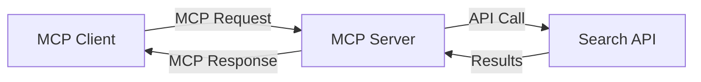
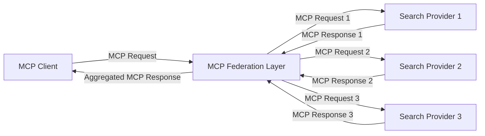
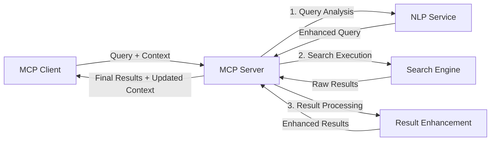

<!--
CO_OP_TRANSLATOR_METADATA:
{
  "original_hash": "eb12652eb7bd17f2193b835a344425c6",
  "translation_date": "2025-06-26T13:37:18+00:00",
  "source_file": "05-AdvancedTopics/mcp-realtimesearch/README.md",
  "language_code": "ru"
}
-->
## Отказ от ответственности по примерам кода

> **Важное замечание**: приведённые ниже примеры кода демонстрируют интеграцию Model Context Protocol (MCP) с функциональностью веб-поиска. Хотя они следуют паттернам и структурам официальных SDK MCP, они упрощены в образовательных целях.
> 
> Эти примеры показывают:
> 
> 1. **Реализация на Python**: сервер FastMCP, предоставляющий инструмент веб-поиска и подключающийся к внешнему поисковому API. В примере демонстрируется правильное управление жизненным циклом, обработка контекста и реализация инструмента согласно паттернам [официального Python SDK MCP](https://github.com/modelcontextprotocol/python-sdk). Сервер использует рекомендуемый транспорт Streamable HTTP, который заменил устаревший SSE-транспорт для продакшн-развертываний.
> 
> 2. **Реализация на JavaScript**: TypeScript/JavaScript реализация с использованием паттерна FastMCP из [официального TypeScript SDK MCP](https://github.com/modelcontextprotocol/typescript-sdk) для создания поискового сервера с корректным определением инструментов и подключением клиентов. Следует последним рекомендациям по управлению сессиями и сохранению контекста.
> 
> Для использования в продакшне этим примерам потребуется дополнительная обработка ошибок, аутентификация и специфичная интеграция с API. Указанные конечные точки поискового API (`https://api.search-service.example/search`) являются заглушками и должны быть заменены на реальные сервисы.
> 
> Для полного понимания и актуальных методов реализации обращайтесь к [официальной спецификации MCP](https://spec.modelcontextprotocol.io/) и документации SDK.

## Основные концепции

### Фреймворк Model Context Protocol (MCP)

В своей основе MCP предоставляет стандартизированный способ обмена контекстом между AI-моделями, приложениями и сервисами. В реальном времени веб-поиска этот фреймворк необходим для создания связных поисковых сценариев с несколькими шагами. Ключевые компоненты включают:

1. **Архитектура клиент-сервер**: MCP чётко разделяет поисковых клиентов (запрашивающих) и поисковые серверы (поставщиков), что позволяет гибко настраивать модели развертывания.

2. **Коммуникация JSON-RPC**: протокол использует JSON-RPC для обмена сообщениями, что обеспечивает совместимость с веб-технологиями и простоту реализации на разных платформах.

3. **Управление контекстом**: MCP определяет структурированные методы для сохранения, обновления и использования поискового контекста в ходе нескольких взаимодействий.

4. **Определения инструментов**: возможности поиска представлены в виде стандартизированных инструментов с чётко заданными параметрами и возвращаемыми значениями.

5. **Поддержка потоковой передачи**: протокол поддерживает потоковую передачу результатов, что критично для реального времени, когда результаты могут поступать поэтапно.

### Паттерны интеграции веб-поиска

При интеграции MCP с веб-поиском выделяются несколько паттернов:

#### 1. Прямая интеграция с провайдером поиска

В этом паттерне MCP-сервер напрямую взаимодействует с одним или несколькими поисковыми API, преобразуя запросы MCP в специфичные вызовы API и форматируя результаты в ответы MCP.

#### 2. Федеративный поиск с сохранением контекста

Этот паттерн распределяет поисковые запросы между несколькими MCP-совместимыми провайдерами, каждый из которых может специализироваться на разных типах контента или возможностях поиска, при этом поддерживается единый контекст.

#### 3. Цепочка поиска с улучшением контекста

В этом паттерне процесс поиска разделён на несколько этапов, на каждом из которых контекст обогащается, что приводит к постепенному улучшению релевантности результатов.

### Компоненты поискового контекста

В MCP-ориентированном веб-поиске контекст обычно включает:

- **Историю запросов**: предыдущие поисковые запросы в сессии
- **Предпочтения пользователя**: язык, регион, настройки безопасного поиска
- **Историю взаимодействий**: какие результаты были открыты, время, проведённое на страницах
- **Параметры поиска**: фильтры, порядок сортировки и другие модификаторы
- **Доменные знания**: предметно-специфичный контекст, относящийся к поиску
- **Временной контекст**: факторы релевантности, связанные со временем
- **Предпочтения источников**: доверенные или предпочитаемые источники информации

## Сценарии использования и приложения

### Исследования и сбор информации

MCP улучшает исследовательские процессы за счёт:

- Сохранения контекста исследований между сессиями поиска
- Обеспечения более сложных и контекстуально релевантных запросов
- Поддержки федеративного поиска по нескольким источникам
- Облегчения извлечения знаний из результатов поиска

### Мониторинг новостей и трендов в реальном времени

Поиск на базе MCP предлагает преимущества для мониторинга новостей:

- Почти мгновенное обнаружение новых новостных сюжетов
- Контекстуальная фильтрация релевантной информации
- Отслеживание тем и сущностей по разным источникам
- Персонализированные новости на основе контекста пользователя

### AI-усиленный браузинг и исследование

MCP открывает новые возможности для AI-усиленного браузинга:

- Контекстуальные предложения поиска на основе текущей активности в браузере
- Бесшовная интеграция веб-поиска с помощниками на базе больших языковых моделей (LLM)
- Многошаговое уточнение поиска с сохранённым контекстом
- Улучшенная проверка фактов и верификация информации

## Будущие тренды и инновации

### Эволюция MCP в веб-поиске

В будущем ожидается развитие MCP в следующих направлениях:

- **Мультимодальный поиск**: интеграция текстового, графического, аудио- и видеопоиска с сохранённым контекстом
- **Децентрализованный поиск**: поддержка распределённых и федеративных поисковых экосистем
- **Конфиденциальность поиска**: контекстно-зависимые механизмы поиска с защитой приватности
- **Понимание запросов**: глубокий семантический разбор естественно-языковых поисковых запросов

### Потенциальные технологические достижения

Новые технологии, формирующие будущее MCP-поиска:

1. **Нейронные поисковые архитектуры**: системы поиска на основе эмбеддингов, оптимизированные для MCP
2. **Персонализированный поисковый контекст**: обучение индивидуальным паттернам поиска пользователей со временем
3. **Интеграция графов знаний**: контекстуальный поиск с использованием предметно-специфичных графов знаний
4. **Кросс-модальный контекст**: сохранение контекста между разными модальностями поиска

## Практические упражнения

### Упражнение 1: Настройка базового MCP поискового конвейера

В этом упражнении вы научитесь:
- Конфигурировать базовую MCP-среду для поиска
- Реализовывать обработчики контекста для веб-поиска
- Тестировать и проверять сохранение контекста между итерациями поиска

### Упражнение 2: Создание ассистента для исследований с MCP-поиском

Создайте полноценное приложение, которое:
- Обрабатывает вопросы на естественном языке для исследований
- Выполняет контекстно-зависимый веб-поиск
- Синтезирует информацию из нескольких источников
- Представляет организованные результаты исследований

### Упражнение 3: Реализация федеративного поиска с MCP по нескольким источникам

Продвинутое упражнение, включающее:
- Контекстно-зависимую маршрутизацию запросов к нескольким поисковым системам
- Ранжирование и агрегацию результатов
- Контекстуальное удаление дубликатов в результатах поиска
- Обработку метаданных, специфичных для источников

## Дополнительные ресурсы

- [Спецификация Model Context Protocol](https://spec.modelcontextprotocol.io/) – Официальная спецификация MCP и подробная документация протокола
- [Документация Model Context Protocol](https://modelcontextprotocol.io/) – Подробные руководства и примеры реализации
- [MCP Python SDK](https://github.com/modelcontextprotocol/python-sdk) – Официальная реализация MCP на Python
- [MCP TypeScript SDK](https://github.com/modelcontextprotocol/typescript-sdk) – Официальная реализация MCP на TypeScript
- [Справочные MCP-серверы](https://github.com/modelcontextprotocol/servers) – Реализации MCP-серверов
- [Документация Bing Web Search API](https://learn.microsoft.com/en-us/bing/search-apis/bing-web-search/overview) – Поисковое API Microsoft
- [Google Custom Search JSON API](https://developers.google.com/custom-search/v1/overview) – Программируемый поисковый движок Google
- [Документация SerpAPI](https://serpapi.com/search-api) – API страниц результатов поисковых систем
- [Документация Meilisearch](https://www.meilisearch.com/docs) – Открытый поисковый движок
- [Документация Elasticsearch](https://www.elastic.co/guide/index.html) – Распределённый движок поиска и аналитики
- [Документация LangChain](https://python.langchain.com/docs/get_started/introduction) – Создание приложений с LLM

## Результаты обучения

После прохождения этого модуля вы сможете:

- Понимать основы веб-поиска в реальном времени и связанные с ним вызовы
- Объяснять, как Model Context Protocol (MCP) расширяет возможности веб-поиска в реальном времени
- Реализовывать решения поиска на базе MCP с использованием популярных фреймворков и API
- Проектировать и развёртывать масштабируемые и высокопроизводительные архитектуры поиска с MCP
- Применять концепции MCP в различных сценариях, включая семантический поиск, помощь в исследованиях и AI-усиленный браузинг
- Оценивать новые тренды и будущие инновации в технологиях поиска на базе MCP

### Вопросы доверия и безопасности

При реализации MCP-ориентированных решений веб-поиска учитывайте следующие важные принципы из спецификации MCP:

1. **Согласие и контроль пользователя**: Пользователи должны явно давать согласие и понимать все операции с данными. Особенно это важно для реализаций веб-поиска, которые могут обращаться к внешним источникам данных.

2. **Конфиденциальность данных**: Обеспечьте надлежащую обработку поисковых запросов и результатов, особенно если они могут содержать чувствительную информацию. Реализуйте соответствующие механизмы контроля доступа для защиты данных пользователей.

3. **Безопасность инструментов**: Обеспечьте правильную авторизацию и валидацию для поисковых инструментов, так как они могут представлять угрозу безопасности из-за выполнения произвольного кода. Описания поведения инструментов следует считать ненадёжными, если они не получены с доверенного сервера.

4. **Чёткая документация**: Предоставьте ясную документацию о возможностях, ограничениях и вопросах безопасности вашей реализации MCP-поиска, следуя рекомендациям спецификации MCP.

5. **Надёжные процессы согласия**: Создавайте устойчивые процессы согласия и авторизации, которые чётко объясняют назначение каждого инструмента перед его использованием, особенно для инструментов, взаимодействующих с внешними веб-ресурсами.

Полные детали по безопасности и вопросам доверия MCP доступны в [официальной документации](https://modelcontextprotocol.io/specification/2025-03-26#security-and-trust-%26-safety).

## Что дальше

- [5.11 Аутентификация Entra ID для серверов Model Context Protocol](../mcp-security-entra/README.md)

**Отказ от ответственности**:  
Этот документ был переведен с помощью сервиса автоматического перевода [Co-op Translator](https://github.com/Azure/co-op-translator). Несмотря на наши усилия по обеспечению точности, просим учитывать, что автоматический перевод может содержать ошибки или неточности. Оригинальный документ на его исходном языке следует считать авторитетным источником. Для получения критически важной информации рекомендуется обращаться к профессиональному переводу, выполненному человеком. Мы не несем ответственности за любые недоразумения или неверные толкования, возникшие в результате использования данного перевода.