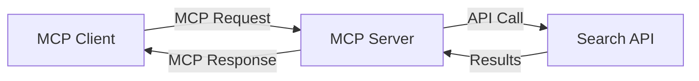
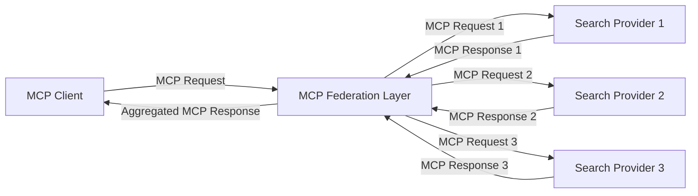
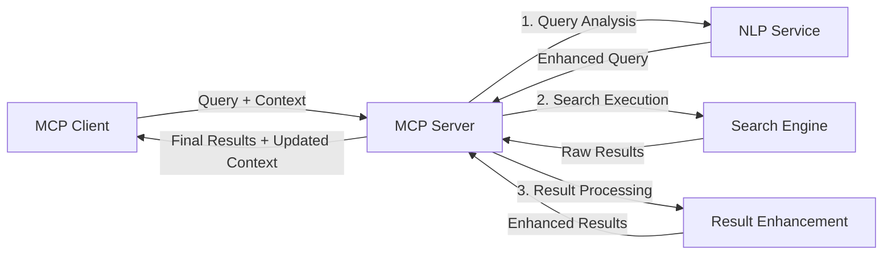

<!--
CO_OP_TRANSLATOR_METADATA:
{
  "original_hash": "16bef2c93c6a86d4ca6a8ce9e120e384",
  "translation_date": "2025-06-13T02:35:11+00:00",
  "source_file": "05-AdvancedTopics/mcp-realtimesearch/README.md",
  "language_code": "ru"
}
-->
## Отказ от ответственности по примерам кода

> **Важное замечание**: приведённые ниже примеры кода демонстрируют интеграцию Model Context Protocol (MCP) с функциями веб-поиска. Хотя они следуют паттернам и структурам официальных SDK MCP, они упрощены в образовательных целях.
> 
> В этих примерах показано:
> 
> 1. **Реализация на Python**: сервер FastMCP, предоставляющий инструмент веб-поиска и подключающийся к внешнему API поиска. Пример демонстрирует правильное управление временем жизни, обработку контекста и реализацию инструмента в соответствии с паттернами [официального MCP Python SDK](https://github.com/modelcontextprotocol/python-sdk). Сервер использует рекомендуемый Streamable HTTP транспорт, который заменил устаревший SSE транспорт для продакшен-развёртываний.
> 
> 2. **Реализация на JavaScript**: TypeScript/JavaScript реализация с использованием паттерна FastMCP из [официального MCP TypeScript SDK](https://github.com/modelcontextprotocol/typescript-sdk) для создания поискового сервера с корректным определением инструментов и клиентскими подключениями. Следует последним рекомендациям по управлению сессиями и сохранению контекста.
> 
> Для продакшен-использования эти примеры потребуют дополнительной обработки ошибок, аутентификации и интеграции с конкретными API. Показанные конечные точки поискового API (`https://api.search-service.example/search`) являются заполнителями и должны быть заменены реальными сервисами поиска.
> 
> Для полного понимания реализации и актуальных подходов обращайтесь к [официальной спецификации MCP](https://spec.modelcontextprotocol.io/) и документации SDK.

## Основные концепции

### Фреймворк Model Context Protocol (MCP)

В своей основе Model Context Protocol предоставляет стандартизированный способ обмена контекстом между AI-моделями, приложениями и сервисами. В реальном времени веб-поиска этот фреймворк необходим для создания связного многократного поиска с учётом контекста. Ключевые компоненты включают:

1. **Клиент-серверная архитектура**: MCP устанавливает чёткое разделение между клиентами поиска (запрашивающими) и серверами поиска (поставщиками), позволяя гибко развёртывать систему.

2. **Обмен сообщениями JSON-RPC**: протокол использует JSON-RPC для обмена сообщениями, что обеспечивает совместимость с веб-технологиями и простоту реализации на разных платформах.

3. **Управление контекстом**: MCP определяет структурированные методы для поддержания, обновления и использования контекста поиска в нескольких взаимодействиях.

4. **Определения инструментов**: возможности поиска представлены в виде стандартизированных инструментов с чётко описанными параметрами и возвращаемыми значениями.

5. **Поддержка потоковой передачи**: протокол поддерживает потоковую передачу результатов, что важно для реального времени, когда результаты могут поступать поэтапно.

### Паттерны интеграции веб-поиска

При интеграции MCP с веб-поиском выделяются несколько паттернов:

#### 1. Прямая интеграция с поставщиком поиска

В этом паттерне сервер MCP напрямую взаимодействует с одним или несколькими поисковыми API, преобразуя запросы MCP в API-специфичные вызовы и форматируя результаты в ответы MCP.

#### 2. Федеративный поиск с сохранением контекста

Этот паттерн распределяет поисковые запросы между несколькими совместимыми с MCP поставщиками, каждый из которых может специализироваться на разных типах контента или функциональности поиска, при этом сохраняя единый контекст.

#### 3. Цепочка поиска с улучшением контекста

Здесь процесс поиска разделён на несколько этапов, на каждом из которых контекст обогащается, что приводит к постепенному улучшению релевантности результатов.

### Компоненты контекста поиска

В веб-поиске на базе MCP контекст обычно включает:

- **История запросов**: предыдущие поисковые запросы в сессии
- **Предпочтения пользователя**: язык, регион, настройки безопасного поиска
- **История взаимодействий**: какие результаты были кликнуты, время, проведённое на страницах
- **Параметры поиска**: фильтры, порядок сортировки и другие модификаторы поиска
- **Доменные знания**: специфический для темы контекст, релевантный поиску
- **Временной контекст**: факторы релевантности, связанные со временем
- **Предпочтения источников**: доверенные или предпочтительные источники информации

## Сценарии использования и приложения

### Исследования и сбор информации

MCP улучшает исследовательские процессы за счёт:

- Сохранения исследовательского контекста между сессиями поиска
- Возможности создавать более сложные и контекстуально релевантные запросы
- Поддержки федерации поиска по нескольким источникам
- Облегчения извлечения знаний из результатов поиска

### Мониторинг новостей и трендов в реальном времени

Поиск на базе MCP предлагает преимущества для мониторинга новостей:

- Почти мгновенное обнаружение новых новостных сюжетов
- Контекстуальная фильтрация релевантной информации
- Отслеживание тем и сущностей по разным источникам
- Персонализированные уведомления о новостях на основе контекста пользователя

### AI-ассистированное браузинг и исследование

MCP открывает новые возможности для AI-ассистированного браузинга:

- Контекстуальные предложения поиска, основанные на текущей активности браузера
- Бесшовная интеграция веб-поиска с ассистентами на базе LLM
- Многократное уточнение поиска с сохранённым контекстом
- Улучшенная проверка фактов и верификация информации

## Будущие тренды и инновации

### Эволюция MCP в веб-поиске

В перспективе MCP будет развиваться, чтобы решать задачи:

- **Мультимодальный поиск**: интеграция поиска по тексту, изображениям, аудио и видео с сохранённым контекстом
- **Децентрализованный поиск**: поддержка распределённых и федеративных экосистем поиска
- **Конфиденциальность поиска**: механизмы поиска с учётом конфиденциальности и контекста
- **Понимание запросов**: глубокий семантический разбор естественно-языковых запросов

### Потенциальные технологические достижения

Новые технологии, которые повлияют на будущее MCP-поиска:

1. **Нейронные архитектуры поиска**: системы поиска на основе эмбеддингов, оптимизированные для MCP
2. **Персонализированный контекст поиска**: изучение индивидуальных моделей поиска пользователей со временем
3. **Интеграция графов знаний**: контекстуальный поиск с использованием доменных графов знаний
4. **Кросс-модальный контекст**: поддержка контекста между разными типами поиска

## Практические упражнения

### Упражнение 1: Настройка базового MCP-поискового конвейера

В этом упражнении вы научитесь:
- Настраивать базовую среду MCP-поиска
- Реализовывать обработчики контекста для веб-поиска
- Тестировать и проверять сохранение контекста между поисковыми итерациями

### Упражнение 2: Создание ассистента для исследований с MCP-поиском

Создайте полноценное приложение, которое:
- Обрабатывает вопросы на естественном языке для исследований
- Выполняет контекстно-осознанный веб-поиск
- Синтезирует информацию из нескольких источников
- Представляет организованные результаты исследований

### Упражнение 3: Реализация федеративного поиска с несколькими источниками через MCP

Продвинутый урок, охватывающий:
- Контекстно-осознанную отправку запросов к разным поисковым системам
- Ранжирование и агрегацию результатов
- Контекстуальное удаление дубликатов в результатах поиска
- Обработку метаданных, специфичных для источников

## Дополнительные ресурсы

- [Спецификация Model Context Protocol](https://spec.modelcontextprotocol.io/) — официальная спецификация MCP и подробная документация протокола
- [Документация Model Context Protocol](https://modelcontextprotocol.io/) — подробные руководства и учебные материалы
- [MCP Python SDK](https://github.com/modelcontextprotocol/python-sdk) — официальная реализация MCP на Python
- [MCP TypeScript SDK](https://github.com/modelcontextprotocol/typescript-sdk) — официальная реализация MCP на TypeScript
- [Референсные серверы MCP](https://github.com/modelcontextprotocol/servers) — примеры реализации MCP-серверов
- [Документация Bing Web Search API](https://learn.microsoft.com/en-us/bing/search-apis/bing-web-search/overview) — API веб-поиска Microsoft
- [Google Custom Search JSON API](https://developers.google.com/custom-search/v1/overview) — программируемый поисковый движок Google
- [Документация SerpAPI](https://serpapi.com/search-api) — API страниц результатов поиска
- [Документация Meilisearch](https://www.meilisearch.com/docs) — поисковый движок с открытым исходным кодом
- [Документация Elasticsearch](https://www.elastic.co/guide/index.html) — распределённый движок поиска и аналитики
- [Документация LangChain](https://python.langchain.com/docs/get_started/introduction) — создание приложений с LLM

## Результаты обучения

Завершив этот модуль, вы сможете:

- Понимать основы веб-поиска в реальном времени и связанные с ним задачи
- Объяснять, как Model Context Protocol (MCP) улучшает возможности веб-поиска в реальном времени
- Реализовывать поисковые решения на базе MCP с использованием популярных фреймворков и API
- Проектировать и развёртывать масштабируемые высокопроизводительные поисковые архитектуры с MCP
- Применять концепции MCP в различных сценариях, включая семантический поиск, исследовательскую помощь и AI-ассистированный браузинг
- Оценивать новые тренды и будущие инновации в технологиях поиска на базе MCP

### Вопросы доверия и безопасности

При реализации веб-поисковых решений на базе MCP важно соблюдать следующие принципы из спецификации MCP:

1. **Согласие и контроль пользователя**: пользователи должны явно давать согласие и понимать все операции и доступ к данным. Это особенно важно для реализации веб-поиска, который может обращаться к внешним источникам данных.

2. **Конфиденциальность данных**: обеспечьте надлежащую обработку поисковых запросов и результатов, особенно если они могут содержать чувствительную информацию. Внедряйте соответствующие механизмы контроля доступа для защиты данных пользователей.

3. **Безопасность инструментов**: реализуйте правильную авторизацию и проверку инструментов поиска, поскольку они могут представлять потенциальные риски безопасности через выполнение произвольного кода. Описания поведения инструментов следует считать ненадёжными, если они не получены от доверенного сервера.

4. **Чёткая документация**: предоставляйте ясную документацию о возможностях, ограничениях и аспектах безопасности вашей реализации поиска на базе MCP, следуя рекомендациям спецификации MCP.

5. **Надёжные механизмы согласия**: создавайте устойчивые процессы согласия и авторизации, которые ясно объясняют функции каждого инструмента перед разрешением его использования, особенно для инструментов, взаимодействующих с внешними веб-ресурсами.

Для полного ознакомления с вопросами безопасности и доверия MCP обратитесь к [официальной документации](https://modelcontextprotocol.io/specification/2025-03-26#security-and-trust-%26-safety).

## Что дальше

- [6. Вклад сообщества](../../06-CommunityContributions/README.md)

**Отказ от ответственности**:  
Этот документ был переведен с помощью сервиса автоматического перевода [Co-op Translator](https://github.com/Azure/co-op-translator). Несмотря на наши усилия по обеспечению точности, просим учитывать, что автоматический перевод может содержать ошибки или неточности. Оригинальный документ на его исходном языке следует считать авторитетным источником. Для критически важной информации рекомендуется обратиться к профессиональному человеческому переводу. Мы не несем ответственности за любые недоразумения или неправильные толкования, возникшие в результате использования данного перевода.