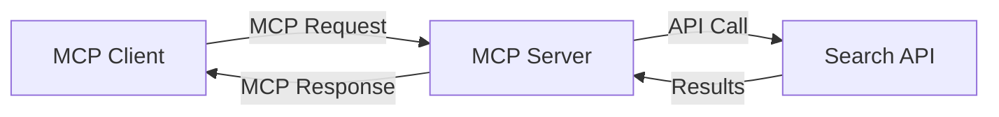
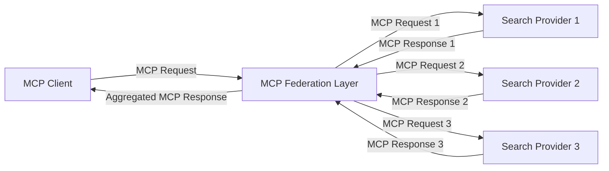
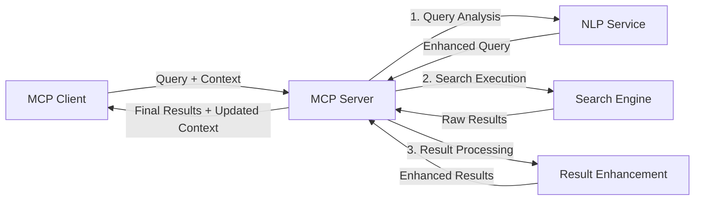

<!--
CO_OP_TRANSLATOR_METADATA:
{
  "original_hash": "333a03e51f90bdf3e6f1ba1694c73f36",
  "translation_date": "2025-07-16T23:26:50+00:00",
  "source_file": "05-AdvancedTopics/mcp-realtimesearch/README.md",
  "language_code": "ru"
}
-->
## Отказ от ответственности по примерам кода

> **Важное замечание**: приведённые ниже примеры кода демонстрируют интеграцию Model Context Protocol (MCP) с функционалом веб-поиска. Хотя они следуют паттернам и структурам официальных SDK MCP, они упрощены для образовательных целей.
> 
> В этих примерах показано:
> 
> 1. **Реализация на Python**: сервер FastMCP, предоставляющий инструмент веб-поиска и подключающийся к внешнему поисковому API. Этот пример демонстрирует правильное управление временем жизни, обработку контекста и реализацию инструмента в соответствии с паттернами [официального MCP Python SDK](https://github.com/modelcontextprotocol/python-sdk). Сервер использует рекомендуемый транспорт Streamable HTTP, который заменил устаревший SSE транспорт для продакшн-развёртываний.
> 
> 2. **Реализация на JavaScript**: реализация на TypeScript/JavaScript с использованием паттерна FastMCP из [официального MCP TypeScript SDK](https://github.com/modelcontextprotocol/typescript-sdk) для создания поискового сервера с корректным определением инструментов и подключением клиентов. Следует последним рекомендованным паттернам управления сессиями и сохранения контекста.
> 
> Для использования в продакшне этим примерам потребуется добавить обработку ошибок, аутентификацию и специфичный код интеграции с API. Показанные конечные точки поискового API (`https://api.search-service.example/search`) являются заглушками и должны быть заменены на реальные адреса поисковых сервисов.
> 
> Для полного описания реализации и самых актуальных подходов обращайтесь к [официальной спецификации MCP](https://spec.modelcontextprotocol.io/) и документации SDK.

## Основные концепции

### Фреймворк Model Context Protocol (MCP)

В своей основе Model Context Protocol предоставляет стандартизированный способ обмена контекстом между AI-моделями, приложениями и сервисами. В реальном времени веб-поиска этот фреймворк необходим для создания связных многошаговых поисковых взаимодействий. Ключевые компоненты включают:

1. **Клиент-серверная архитектура**: MCP устанавливает чёткое разделение между поисковыми клиентами (запрашивающими) и поисковыми серверами (поставщиками), что позволяет гибко развертывать систему.

2. **Обмен сообщениями через JSON-RPC**: протокол использует JSON-RPC для обмена сообщениями, что обеспечивает совместимость с веб-технологиями и простоту реализации на разных платформах.

3. **Управление контекстом**: MCP определяет структурированные методы для поддержания, обновления и использования поискового контекста в ходе нескольких взаимодействий.

4. **Определения инструментов**: поисковые возможности представлены в виде стандартизированных инструментов с чётко определёнными параметрами и возвращаемыми значениями.

5. **Поддержка потоковой передачи**: протокол поддерживает потоковую передачу результатов, что важно для реального времени, когда результаты могут поступать поэтапно.

### Паттерны интеграции веб-поиска

При интеграции MCP с веб-поиском выделяются несколько паттернов:

#### 1. Прямая интеграция с провайдером поиска

В этом паттерне сервер MCP напрямую взаимодействует с одним или несколькими поисковыми API, преобразуя запросы MCP в вызовы API и форматируя результаты в ответы MCP.

#### 2. Федеративный поиск с сохранением контекста

Этот паттерн распределяет поисковые запросы между несколькими совместимыми с MCP провайдерами поиска, каждый из которых может специализироваться на разных типах контента или возможностях поиска, при этом поддерживается единый контекст.

#### 3. Цепочка поиска с обогащением контекста

В этом паттерне процесс поиска разделён на несколько этапов, на каждом из которых контекст дополняется, что приводит к постепенному улучшению релевантности результатов.

### Компоненты поискового контекста

В веб-поиске на базе MCP контекст обычно включает:

- **Историю запросов**: предыдущие поисковые запросы в сессии
- **Предпочтения пользователя**: язык, регион, настройки безопасного поиска
- **Историю взаимодействий**: какие результаты были выбраны, время, проведённое на результатах
- **Параметры поиска**: фильтры, порядок сортировки и другие модификаторы поиска
- **Доменные знания**: предметно-специфический контекст, релевантный поиску
- **Временной контекст**: факторы релевантности, зависящие от времени
- **Предпочтения источников**: доверенные или предпочтительные источники информации

## Сценарии использования и приложения

### Исследования и сбор информации

MCP улучшает рабочие процессы исследований за счёт:

- Сохранения контекста исследований между сессиями поиска
- Позволяет создавать более сложные и контекстно релевантные запросы
- Поддержки федеративного поиска по нескольким источникам
- Облегчения извлечения знаний из результатов поиска

### Мониторинг новостей и трендов в реальном времени

Поиск на базе MCP предлагает преимущества для мониторинга новостей:

- Почти мгновенное обнаружение новых новостных сюжетов
- Контекстная фильтрация релевантной информации
- Отслеживание тем и сущностей по множеству источников
- Персонализированные новостные оповещения на основе контекста пользователя

### AI-расширенный браузинг и исследование

MCP открывает новые возможности для AI-расширенного браузинга:

- Контекстные поисковые подсказки на основе текущей активности в браузере
- Бесшовная интеграция веб-поиска с ассистентами на базе LLM
- Многошаговое уточнение поиска с сохранением контекста
- Улучшенная проверка фактов и верификация информации

## Будущие тренды и инновации

### Эволюция MCP в веб-поиске

В будущем ожидается развитие MCP в направлении:

- **Мультимодального поиска**: интеграция текстового, графического, аудио- и видеопоиска с сохранением контекста
- **Децентрализованного поиска**: поддержка распределённых и федеративных поисковых экосистем
- **Конфиденциальность поиска**: Механизмы поиска с сохранением конфиденциальности, учитывающие контекст  
- **Понимание запросов**: Глубокий семантический разбор поисковых запросов на естественном языке

### Потенциальные технологические достижения

Новые технологии, которые будут формировать будущее поиска с использованием MCP:

1. **Нейронные архитектуры поиска**: Системы поиска на основе эмбеддингов, оптимизированные для MCP  
2. **Персонализированный контекст поиска**: Обучение индивидуальным паттернам поиска пользователя со временем  
3. **Интеграция графов знаний**: Контекстный поиск с использованием специализированных графов знаний  
4. **Кросс-модальный контекст**: Поддержание контекста между разными режимами поиска

## Практические упражнения

### Упражнение 1: Настройка базового конвейера поиска MCP

В этом упражнении вы научитесь:  
- Настраивать базовую среду поиска MCP  
- Реализовывать обработчики контекста для веб-поиска  
- Тестировать и проверять сохранение контекста между итерациями поиска

### Упражнение 2: Создание исследовательского помощника с MCP

Создайте полноценное приложение, которое:  
- Обрабатывает вопросы на естественном языке  
- Выполняет контекстно-зависимый веб-поиск  
- Синтезирует информацию из нескольких источников  
- Представляет структурированные результаты исследования

### Упражнение 3: Реализация федерации поиска из нескольких источников с MCP

Продвинутое упражнение, включающее:  
- Контекстно-зависимую отправку запросов на несколько поисковых систем  
- Ранжирование и агрегацию результатов  
- Контекстное устранение дубликатов в результатах поиска  
- Обработку метаданных, специфичных для источников

## Дополнительные ресурсы

- [Model Context Protocol Specification](https://spec.modelcontextprotocol.io/) — Официальная спецификация MCP и подробная документация протокола  
- [Model Context Protocol Documentation](https://modelcontextprotocol.io/) — Подробные руководства и инструкции по реализации  
- [MCP Python SDK](https://github.com/modelcontextprotocol/python-sdk) — Официальная реализация MCP на Python  
- [MCP TypeScript SDK](https://github.com/modelcontextprotocol/typescript-sdk) — Официальная реализация MCP на TypeScript  
- [MCP Reference Servers](https://github.com/modelcontextprotocol/servers) — Референсные реализации серверов MCP  
- [Bing Web Search API Documentation](https://learn.microsoft.com/en-us/bing/search-apis/bing-web-search/overview) — API веб-поиска Microsoft  
- [Google Custom Search JSON API](https://developers.google.com/custom-search/v1/overview) — Программируемый поисковый движок Google  
- [SerpAPI Documentation](https://serpapi.com/search-api) — API для страниц результатов поисковых систем  
- [Meilisearch Documentation](https://www.meilisearch.com/docs) — Открытый поисковый движок  
- [Elasticsearch Documentation](https://www.elastic.co/guide/index.html) — Распределённый движок поиска и аналитики  
- [LangChain Documentation](https://python.langchain.com/docs/get_started/introduction) — Создание приложений с использованием LLM

## Результаты обучения

После прохождения этого модуля вы сможете:

- Понимать основы поиска в реальном времени в интернете и связанные с ним сложности  
- Объяснять, как Model Context Protocol (MCP) улучшает возможности поиска в реальном времени  
- Реализовывать решения для поиска на базе MCP с использованием популярных фреймворков и API  
- Проектировать и развёртывать масштабируемые и высокопроизводительные архитектуры поиска с MCP  
- Применять концепции MCP в различных сценариях, включая семантический поиск, помощь в исследованиях и AI-усиленный просмотр  
- Оценивать новые тенденции и будущие инновации в технологиях поиска на базе MCP

### Вопросы доверия и безопасности

При реализации решений для веб-поиска на базе MCP учитывайте следующие важные принципы из спецификации MCP:

1. **Согласие и контроль пользователя**: Пользователи должны явно давать согласие и понимать все операции с данными. Это особенно важно для веб-поиска, который может обращаться к внешним источникам данных.

2. **Конфиденциальность данных**: Обеспечьте надлежащую обработку поисковых запросов и результатов, особенно если они могут содержать чувствительную информацию. Внедрите соответствующие меры контроля доступа для защиты данных пользователей.

3. **Безопасность инструментов**: Реализуйте правильную авторизацию и проверку для поисковых инструментов, так как они могут представлять угрозу безопасности из-за возможности выполнения произвольного кода. Описания поведения инструментов следует считать ненадёжными, если они не получены с доверенного сервера.

4. **Чёткая документация**: Предоставьте понятную документацию о возможностях, ограничениях и вопросах безопасности вашей реализации поиска на базе MCP, следуя рекомендациям спецификации MCP.

5. **Надёжные процессы согласия**: Постройте надёжные процессы согласия и авторизации, которые ясно объясняют функции каждого инструмента до его использования, особенно для инструментов, взаимодействующих с внешними веб-ресурсами.

Для полного ознакомления с вопросами безопасности и доверия MCP обратитесь к [официальной документации](https://modelcontextprotocol.io/specification/2025-03-26#security-and-trust-%26-safety).

## Что дальше

- [5.12 Аутентификация Entra ID для серверов Model Context Protocol](../mcp-security-entra/README.md)

**Отказ от ответственности**:  
Этот документ был переведен с помощью сервиса автоматического перевода [Co-op Translator](https://github.com/Azure/co-op-translator). Несмотря на наши усилия по обеспечению точности, просим учитывать, что автоматические переводы могут содержать ошибки или неточности. Оригинальный документ на его исходном языке следует считать авторитетным источником. Для получения критически важной информации рекомендуется обращаться к профессиональному человеческому переводу. Мы не несем ответственности за любые недоразумения или неправильные толкования, возникшие в результате использования данного перевода.