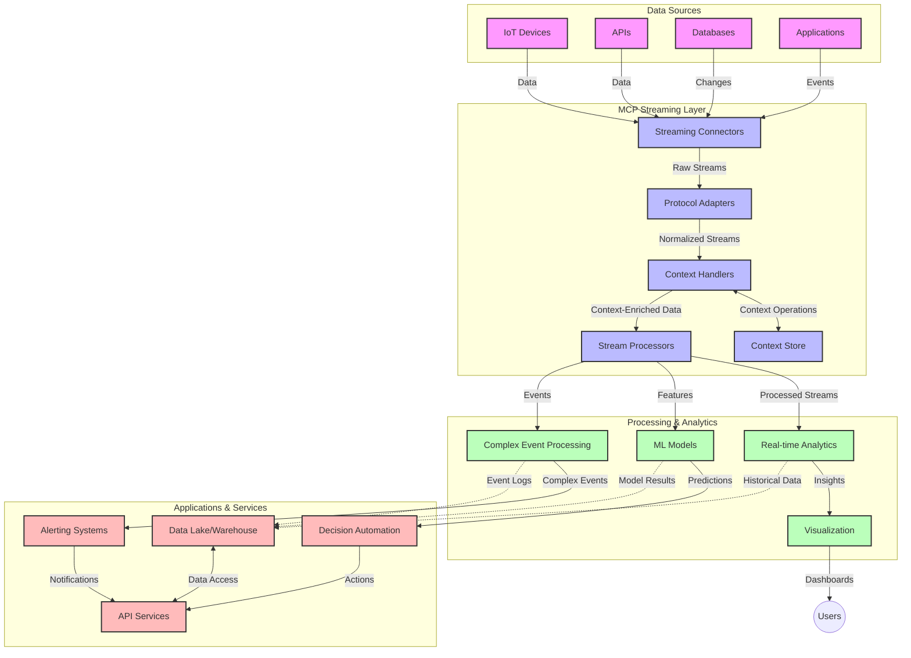

<!--
CO_OP_TRANSLATOR_METADATA:
{
  "original_hash": "195f7287638b77a549acadd96c8f981c",
  "translation_date": "2025-06-12T22:59:49+00:00",
  "source_file": "05-AdvancedTopics/mcp-realtimestreaming/README.md",
  "language_code": "ru"
}
-->
# Model Context Protocol для потоковой передачи данных в реальном времени

## Обзор

Потоковая передача данных в реальном времени стала неотъемлемой частью современного мира, где бизнес и приложения требуют мгновенного доступа к информации для своевременного принятия решений. Model Context Protocol (MCP) представляет собой значительный шаг вперёд в оптимизации этих процессов потоковой передачи, повышая эффективность обработки данных, сохраняя контекст и улучшая общую производительность системы.

В этом модуле рассматривается, как MCP преобразует потоковую передачу данных в реальном времени, обеспечивая стандартизированный подход к управлению контекстом между AI-моделями, платформами потоковой передачи и приложениями.

## Введение в потоковую передачу данных в реальном времени

Потоковая передача данных в реальном времени — это технологическая парадигма, позволяющая непрерывно передавать, обрабатывать и анализировать данные по мере их поступления, что даёт системам возможность мгновенно реагировать на новую информацию. В отличие от традиционной пакетной обработки, работающей с фиксированными наборами данных, потоковая обработка происходит "на ходу", обеспечивая получение инсайтов и действий с минимальной задержкой.

### Основные понятия потоковой передачи данных в реальном времени:

- **Непрерывный поток данных**: данные обрабатываются как беспрерывный, нескончаемый поток событий или записей.
- **Обработка с низкой задержкой**: системы настроены на минимизацию времени между генерацией данных и их обработкой.
- **Масштабируемость**: архитектуры потоковой передачи должны справляться с переменным объёмом и скоростью данных.
- **Отказоустойчивость**: системы должны быть устойчивы к сбоям, чтобы обеспечить непрерывность потока данных.
- **Состояние процесса**: поддержание контекста между событиями важно для получения значимых результатов анализа.

### Model Context Protocol и потоковая передача в реальном времени

Model Context Protocol (MCP) решает несколько ключевых задач в средах потоковой передачи данных в реальном времени:

1. **Сохранение контекстной непрерывности**: MCP стандартизирует способ поддержания контекста между распределёнными компонентами потоковой передачи, обеспечивая доступ AI-моделям и узлам обработки к релевантному историческому и окружающему контексту.

2. **Эффективное управление состоянием**: предоставляя структурированные механизмы передачи контекста, MCP снижает нагрузку на управление состоянием в потоковых конвейерах.

3. **Взаимодействие**: MCP создаёт общий язык для обмена контекстом между различными технологиями потоковой передачи и AI-моделями, что позволяет создавать более гибкие и расширяемые архитектуры.

4. **Оптимизированный для потоков контекст**: реализации MCP могут приоритизировать наиболее важные элементы контекста для принятия решений в реальном времени, оптимизируя производительность и точность.

5. **Адаптивная обработка**: с правильным управлением контекстом через MCP системы потоковой передачи могут динамически настраивать обработку в зависимости от меняющихся условий и шаблонов в данных.

В современных приложениях — от сетей IoT до финансовых торговых платформ — интеграция MCP с технологиями потоковой передачи позволяет создавать более интеллектуальные, контекстно-зависимые процессы, способные адекватно реагировать на сложные и динамичные ситуации в реальном времени.

## Цели обучения

К концу этого урока вы сможете:

- Понять основы потоковой передачи данных в реальном времени и связанные с ней проблемы
- Объяснить, как Model Context Protocol (MCP) улучшает потоковую передачу данных в реальном времени
- Реализовать потоковые решения на базе MCP с использованием популярных фреймворков, таких как Kafka и Pulsar
- Проектировать и внедрять отказоустойчивые и высокопроизводительные потоковые архитектуры с MCP
- Применять концепции MCP в IoT, финансовой торговле и аналитике на базе AI
- Оценивать текущие тенденции и будущие инновации в технологиях потоковой передачи на основе MCP

### Определение и значимость

Потоковая передача данных в реальном времени подразумевает непрерывное создание, обработку и доставку данных с минимальной задержкой. В отличие от пакетной обработки, где данные собираются и обрабатываются группами, потоковые данные обрабатываются по мере поступления, что позволяет получать мгновенные инсайты и принимать решения.

Ключевые характеристики потоковой передачи данных в реальном времени:

- **Низкая задержка**: обработка и анализ данных за миллисекунды или секунды
- **Непрерывный поток**: непрерывные потоки данных из различных источников
- **Мгновенная обработка**: анализ данных по мере их поступления, а не пакетами
- **Событийно-ориентированная архитектура**: реакция на события по мере их возникновения

### Проблемы традиционной потоковой передачи данных

Традиционные методы потоковой передачи данных сталкиваются с рядом ограничений:

1. **Потеря контекста**: сложности с поддержанием контекста в распределённых системах
2. **Проблемы масштабируемости**: трудности с обработкой больших объёмов и высокой скорости данных
3. **Сложность интеграции**: проблемы с взаимодействием между разными системами
4. **Управление задержкой**: балансировка пропускной способности и времени обработки
5. **Консистентность данных**: обеспечение точности и полноты данных в потоке

## Понимание Model Context Protocol (MCP)

### Что такое MCP?

Model Context Protocol (MCP) — это стандартизованный протокол коммуникации, разработанный для эффективного взаимодействия между AI-моделями и приложениями. В контексте потоковой передачи данных в реальном времени MCP предоставляет основу для:

- Сохранения контекста на всём протяжении конвейера данных
- Стандартизации форматов обмена данными
- Оптимизации передачи больших объёмов данных
- Улучшения коммуникации между моделями и приложениями

### Основные компоненты и архитектура

Архитектура MCP для потоковой передачи включает несколько ключевых компонентов:

1. **Обработчики контекста**: управляют и поддерживают контекстную информацию в рамках потокового конвейера
2. **Процессоры потоков**: обрабатывают входящие потоки данных с учётом контекста
3. **Адаптеры протоколов**: преобразуют данные между разными потоковыми протоколами, сохраняя контекст
4. **Хранилище контекста**: эффективно сохраняет и извлекает контекстную информацию
5. **Потоковые коннекторы**: обеспечивают подключение к различным платформам потоковой передачи (Kafka, Pulsar, Kinesis и др.)



### Как MCP улучшает обработку данных в реальном времени

MCP решает традиционные проблемы потоковой передачи через:

- **Целостность контекста**: поддержание связей между данными на всём протяжении конвейера
- **Оптимизация передачи**: снижение избыточности данных за счёт интеллектуального управления контекстом
- **Стандартизированные интерфейсы**: предоставление единых API для потоковых компонентов
- **Снижение задержки**: минимизация накладных расходов на обработку благодаря эффективному управлению контекстом
- **Повышенная масштабируемость**: поддержка горизонтального масштабирования с сохранением контекста

## Интеграция и реализация

Системы потоковой передачи данных в реальном времени требуют тщательного архитектурного проектирования и реализации для обеспечения как производительности, так и сохранения контекстной целостности. Model Context Protocol предлагает стандартизированный подход к интеграции AI-моделей и потоковых технологий, позволяя создавать более сложные, контекстно-зависимые конвейеры обработки.

### Обзор интеграции MCP в потоковые архитектуры

Реализация MCP в средах потоковой передачи данных в реальном времени включает несколько важных аспектов:

1. **Сериализация и транспорт контекста**: MCP предоставляет эффективные механизмы кодирования контекстной информации внутри потоковых пакетов данных, гарантируя, что важный контекст сопровождает данные на всём пути обработки. Включает стандартизированные форматы сериализации, оптимизированные для потоковой передачи.

2. **Состояние в потоковой обработке**: MCP позволяет реализовать более интеллектуальную обработку с сохранением состояния, поддерживая консистентное представление контекста между узлами обработки. Это особенно важно в распределённых потоковых архитектурах, где управление состоянием традиционно сложно.

3. **Время события vs. время обработки**: реализации MCP должны учитывать распространённую проблему различия между временем возникновения события и временем его обработки. Протокол может включать временной контекст, сохраняющий семантику времени события.

4. **Управление обратным давлением (backpressure)**: стандартизируя обработку контекста, MCP помогает управлять нагрузкой в потоковых системах, позволяя компонентам сообщать о своих возможностях обработки и соответственно регулировать поток данных.

5. **Оконное представление и агрегация контекста**: MCP облегчает выполнение сложных оконных операций, предоставляя структурированные представления временного и реляционного контекста, что позволяет получать более значимые агрегаты по потокам событий.

6. **Обработка с гарантией единственного выполнения (exactly-once)**: в системах, требующих семантики exactly-once, MCP может включать метаданные обработки для отслеживания и подтверждения статуса обработки в распределённых компонентах.

Реализация MCP в различных потоковых технологиях создаёт единый подход к управлению контекстом, снижая необходимость в индивидуальной интеграции и повышая способность системы сохранять значимый контекст при прохождении данных через конвейер.

### MCP в различных потоковых фреймворках

Примеры основаны на текущей спецификации MCP, которая использует протокол JSON-RPC с разными транспортными механизмами. Код демонстрирует, как реализовать пользовательские транспорты для интеграции платформ потоковой передачи, таких как Kafka и Pulsar, при полной совместимости с протоколом MCP.

Примеры показывают, как платформы потоковой передачи могут быть интегрированы с MCP для обеспечения обработки данных в реальном времени с сохранением контекстной осведомлённости, являющейся ключевой для MCP. Такой подход гарантирует, что примеры кода точно отражают текущее состояние спецификации MCP на июнь 2025 года.

MCP может быть интегрирован с популярными потоковыми фреймворками, включая:

#### Интеграция Apache Kafka

```python
import asyncio
import json
from typing import Dict, Any, Optional
from confluent_kafka import Consumer, Producer, KafkaError
from mcp.client import Client, ClientCapabilities
from mcp.core.message import JsonRpcMessage
from mcp.core.transports import Transport

# Custom transport class to bridge MCP with Kafka
class KafkaMCPTransport(Transport):
    def __init__(self, bootstrap_servers: str, input_topic: str, output_topic: str):
        self.bootstrap_servers = bootstrap_servers
        self.input_topic = input_topic
        self.output_topic = output_topic
        self.producer = Producer({'bootstrap.servers': bootstrap_servers})
        self.consumer = Consumer({
            'bootstrap.servers': bootstrap_servers,
            'group.id': 'mcp-client-group',
            'auto.offset.reset': 'earliest'
        })
        self.message_queue = asyncio.Queue()
        self.running = False
        self.consumer_task = None
        
    async def connect(self):
        """Connect to Kafka and start consuming messages"""
        self.consumer.subscribe([self.input_topic])
        self.running = True
        self.consumer_task = asyncio.create_task(self._consume_messages())
        return self
        
    async def _consume_messages(self):
        """Background task to consume messages from Kafka and queue them for processing"""
        while self.running:
            try:
                msg = self.consumer.poll(1.0)
                if msg is None:
                    await asyncio.sleep(0.1)
                    continue
                
                if msg.error():
                    if msg.error().code() == KafkaError._PARTITION_EOF:
                        continue
                    print(f"Consumer error: {msg.error()}")
                    continue
                
                # Parse the message value as JSON-RPC
                try:
                    message_str = msg.value().decode('utf-8')
                    message_data = json.loads(message_str)
                    mcp_message = JsonRpcMessage.from_dict(message_data)
                    await self.message_queue.put(mcp_message)
                except Exception as e:
                    print(f"Error parsing message: {e}")
            except Exception as e:
                print(f"Error in consumer loop: {e}")
                await asyncio.sleep(1)
    
    async def read(self) -> Optional[JsonRpcMessage]:
        """Read the next message from the queue"""
        try:
            message = await self.message_queue.get()
            return message
        except Exception as e:
            print(f"Error reading message: {e}")
            return None
    
    async def write(self, message: JsonRpcMessage) -> None:
        """Write a message to the Kafka output topic"""
        try:
            message_json = json.dumps(message.to_dict())
            self.producer.produce(
                self.output_topic,
                message_json.encode('utf-8'),
                callback=self._delivery_report
            )
            self.producer.poll(0)  # Trigger callbacks
        except Exception as e:
            print(f"Error writing message: {e}")
    
    def _delivery_report(self, err, msg):
        """Kafka producer delivery callback"""
        if err is not None:
            print(f'Message delivery failed: {err}')
        else:
            print(f'Message delivered to {msg.topic()} [{msg.partition()}]')
    
    async def close(self) -> None:
        """Close the transport"""
        self.running = False
        if self.consumer_task:
            self.consumer_task.cancel()
            try:
                await self.consumer_task
            except asyncio.CancelledError:
                pass
        self.consumer.close()
        self.producer.flush()

# Example usage of the Kafka MCP transport
async def kafka_mcp_example():
    # Create MCP client with Kafka transport
    client = Client(
        {"name": "kafka-mcp-client", "version": "1.0.0"},
        ClientCapabilities({})
    )
    
    # Create and connect the Kafka transport
    transport = KafkaMCPTransport(
        bootstrap_servers="localhost:9092",
        input_topic="mcp-responses",
        output_topic="mcp-requests"
    )
    
    await client.connect(transport)
    
    try:
        # Initialize the MCP session
        await client.initialize()
        
        # Example of executing a tool via MCP
        response = await client.execute_tool(
            "process_data",
            {
                "data": "sample data",
                "metadata": {
                    "source": "sensor-1",
                    "timestamp": "2025-06-12T10:30:00Z"
                }
            }
        )
        
        print(f"Tool execution response: {response}")
        
        # Clean shutdown
        await client.shutdown()
    finally:
        await transport.close()

# Run the example
if __name__ == "__main__":
    asyncio.run(kafka_mcp_example())
```

#### Реализация Apache Pulsar

```python
import asyncio
import json
import pulsar
from typing import Dict, Any, Optional
from mcp.core.message import JsonRpcMessage
from mcp.core.transports import Transport
from mcp.server import Server, ServerOptions
from mcp.server.tools import Tool, ToolExecutionContext, ToolMetadata

# Create a custom MCP transport that uses Pulsar
class PulsarMCPTransport(Transport):
    def __init__(self, service_url: str, request_topic: str, response_topic: str):
        self.service_url = service_url
        self.request_topic = request_topic
        self.response_topic = response_topic
        self.client = pulsar.Client(service_url)
        self.producer = self.client.create_producer(response_topic)
        self.consumer = self.client.subscribe(
            request_topic,
            "mcp-server-subscription",
            consumer_type=pulsar.ConsumerType.Shared
        )
        self.message_queue = asyncio.Queue()
        self.running = False
        self.consumer_task = None
    
    async def connect(self):
        """Connect to Pulsar and start consuming messages"""
        self.running = True
        self.consumer_task = asyncio.create_task(self._consume_messages())
        return self
    
    async def _consume_messages(self):
        """Background task to consume messages from Pulsar and queue them for processing"""
        while self.running:
            try:
                # Non-blocking receive with timeout
                msg = self.consumer.receive(timeout_millis=500)
                
                # Process the message
                try:
                    message_str = msg.data().decode('utf-8')
                    message_data = json.loads(message_str)
                    mcp_message = JsonRpcMessage.from_dict(message_data)
                    await self.message_queue.put(mcp_message)
                    
                    # Acknowledge the message
                    self.consumer.acknowledge(msg)
                except Exception as e:
                    print(f"Error processing message: {e}")
                    # Negative acknowledge if there was an error
                    self.consumer.negative_acknowledge(msg)
            except Exception as e:
                # Handle timeout or other exceptions
                await asyncio.sleep(0.1)
    
    async def read(self) -> Optional[JsonRpcMessage]:
        """Read the next message from the queue"""
        try:
            message = await self.message_queue.get()
            return message
        except Exception as e:
            print(f"Error reading message: {e}")
            return None
    
    async def write(self, message: JsonRpcMessage) -> None:
        """Write a message to the Pulsar output topic"""
        try:
            message_json = json.dumps(message.to_dict())
            self.producer.send(message_json.encode('utf-8'))
        except Exception as e:
            print(f"Error writing message: {e}")
    
    async def close(self) -> None:
        """Close the transport"""
        self.running = False
        if self.consumer_task:
            self.consumer_task.cancel()
            try:
                await self.consumer_task
            except asyncio.CancelledError:
                pass
        self.consumer.close()
        self.producer.close()
        self.client.close()

# Define a sample MCP tool that processes streaming data
@Tool(
    name="process_streaming_data",
    description="Process streaming data with context preservation",
    metadata=ToolMetadata(
        required_capabilities=["streaming"]
    )
)
async def process_streaming_data(
    ctx: ToolExecutionContext,
    data: str,
    source: str,
    priority: str = "medium"
) -> Dict[str, Any]:
    """
    Process streaming data while preserving context
    
    Args:
        ctx: Tool execution context
        data: The data to process
        source: The source of the data
        priority: Priority level (low, medium, high)
        
    Returns:
        Dict containing processed results and context information
    """
    # Example processing that leverages MCP context
    print(f"Processing data from {source} with priority {priority}")
    
    # Access conversation context from MCP
    conversation_id = ctx.conversation_id if hasattr(ctx, 'conversation_id') else "unknown"
    
    # Return results with enhanced context
    return {
        "processed_data": f"Processed: {data}",
        "context": {
            "conversation_id": conversation_id,
            "source": source,
            "priority": priority,
            "processing_timestamp": ctx.get_current_time_iso()
        }
    }

# Example MCP server implementation using Pulsar transport
async def run_mcp_server_with_pulsar():
    # Create MCP server
    server = Server(
        {"name": "pulsar-mcp-server", "version": "1.0.0"},
        ServerOptions(
            capabilities={"streaming": True}
        )
    )
    
    # Register our tool
    server.register_tool(process_streaming_data)
    
    # Create and connect Pulsar transport
    transport = PulsarMCPTransport(
        service_url="pulsar://localhost:6650",
        request_topic="mcp-requests",
        response_topic="mcp-responses"
    )
    
    try:
        # Start the server with the Pulsar transport
        await server.run(transport)
    finally:
        await transport.close()

# Run the server
if __name__ == "__main__":
    asyncio.run(run_mcp_server_with_pulsar())
```

### Лучшие практики при развертывании

При реализации MCP для потоковой передачи данных в реальном времени:

1. **Проектируйте с учётом отказоустойчивости**:
   - Реализуйте корректную обработку ошибок
   - Используйте очереди с "мертвыми письмами" для неудачных сообщений
   - Создавайте идемпотентные процессоры

2. **Оптимизируйте производительность**:
   - Настраивайте подходящие размеры буферов
   - Используйте пакетную обработку там, где это оправдано
   - Внедряйте механизмы обратного давления

3. **Мониторинг и наблюдение**:
   - Отслеживайте метрики обработки потоков
   - Контролируйте распространение контекста
   - Настраивайте оповещения о сбоях и аномалиях

4. **Обеспечьте безопасность потоков**:
   - Реализуйте шифрование для конфиденциальных данных
   - Используйте аутентификацию и авторизацию
   - Применяйте надлежащие механизмы контроля доступа

### MCP в IoT и Edge-вычислениях

MCP улучшает потоковую передачу в IoT за счёт:

- Сохранения контекста устройств на протяжении всего конвейера обработки
- Обеспечения эффективной потоковой передачи данных с edge-устройств в облако
- Поддержки аналитики в реальном времени на потоках IoT-данных
- Облегчения коммуникации между устройствами с учётом контекста

Пример: Сети датчиков умного города  
```
Sensors → Edge Gateways → MCP Stream Processors → Real-time Analytics → Automated Responses
```

### Роль в финансовых транзакциях и высокочастотной торговле

MCP даёт значительные преимущества для финансовой потоковой передачи данных:

- Сверхнизкая задержка обработки для торговых решений
- Поддержание контекста транзакций на протяжении обработки
- Поддержка сложной обработки событий с учётом контекста
- Обеспечение консистентности данных в распределённых торговых системах

### Улучшение аналитики на базе AI

MCP открывает новые возможности для потоковой аналитики:

- Обучение и вывод моделей в реальном времени
- Непрерывное обучение на потоковых данных
- Извлечение признаков с учётом контекста
- Мульти-модельные конвейеры вывода с сохранением контекста

## Будущие тренды и инновации

### Эволюция MCP в реальном времени

В будущем ожидается развитие MCP в следующих направлениях:

- **Интеграция квантовых вычислений**: подготовка к потоковым системам на базе квантовых технологий
- **Обработка на edge-устройствах**: перенос более сложной контекстно-зависимой обработки на устройства периферии
- **Автономное управление потоками**: самонастраивающиеся потоковые конвейеры
- **Федеративная потоковая передача**: распределённая обработка с сохранением приватности

### Возможные технологические улучшения

Новые технологии, которые повлияют на будущее MCP:

1. **AI-оптимизированные протоколы потоковой передачи**: специализированные протоколы для AI-нагрузок
2. **Интеграция нейроморфных вычислений**: вдохновлённые мозгом вычисления для обработки потоков
3. **Безсерверная потоковая передача**: событийно-ориентированная масштабируемая потоковая обработка без управления инфраструктурой
4. **Распределённые хранилища контекста**: глобально распределённое, но высококонсистентное управление контекстом

## Практические упражнения

### Упражнение 1: Настройка базового MCP-конвейера потоковой передачи

В этом упражнении вы научитесь:
- Конфигурировать базовую MCP-среду потоковой передачи
- Реализовывать обработчики контекста для потоковой обработки
- Тестировать и проверять сохранение контекста

### Упражнение 2: Создание панели аналитики в реальном времени

Создайте полноценное приложение, которое:
- Принимает потоковые данные с использованием MCP
- Обрабатывает поток с сохранением контекста
- Визуализирует результаты в реальном времени

### Упражнение 3: Реализация сложной обработки событий с MCP

Продвинутое упражнение, охватывающее:
- Обнаружение шаблонов в потоках
- Контекстную корреляцию между несколькими потоками
- Генерацию сложных событий с сохранённым контекстом

## Дополнительные ресурсы

- [Model Context Protocol Specification](https://github.com/modelcontextprotocol) - Официальная спецификация и документация MCP
- [Apache Kafka Documentation](https://kafka.apache.org/documentation/) - Изучение Kafka для потоковой обработки
- [Apache Pulsar](https://pulsar.apache.org/) - Унифицированная платформа обмена сообщениями и потоковой передачи
- [Streaming Systems: The What, Where, When, and How of Large-Scale Data Processing](https://www.oreilly.com/library/view/streaming-systems/9781491983867/) - Всеобъемлющая книга о потоковых архитектурах
- [Microsoft Azure Event Hubs](https://learn.microsoft.com/azure/event-hubs/event-hubs-about) - Управляемый сервис потоковой передачи событий
- [MLflow Documentation](https://mlflow.org/docs/latest/index.html) - Для отслеживания и развертывания ML-моделей
- [Real-Time Analytics with Apache Storm](https://storm.apache.org/releases/current/index.html) - Фреймворк для обработки в реальном времени
- [Flink ML](https://nightlies.apache.org/flink/flink-ml-docs-master/) - Библиотека машинного обучения для Apache Flink
- [LangChain Documentation](https://python.langchain.com/docs/get_started/introduction) - Создание приложений с LLM

## Результаты обучения

После прохождения этого модуля вы сможете:

- Понимать основы потоковой передачи данных в реальном времени и связанные с ней вызовы
- Объяснять, как Model Context Protocol (MCP) улучшает потоковую передачу данных в реальном времени
- Реализовывать потоковые решения на базе MCP с использованием популярных фреймворков, таких как Kafka и Pulsar
- Проектировать и внедрять отказоустойчивые и высокопроизводительные потоковые архитектуры с MCP
- Применять концепции MCP в IoT, финансовой торговле и аналитике на базе AI
- Оценивать текущие тенденции и будущие инновации в технологиях потоковой передачи на основе MCP

## Что дальше

- [5.11 Realtime Search](../mcp-realtimesearch/README.md)

**Отказ от ответственности**:  
Этот документ был переведен с помощью сервиса автоматического перевода [Co-op Translator](https://github.com/Azure/co-op-translator). Несмотря на наши усилия по обеспечению точности, пожалуйста, учитывайте, что автоматические переводы могут содержать ошибки или неточности. Оригинальный документ на его исходном языке следует считать авторитетным источником. Для получения критически важной информации рекомендуется использовать профессиональный перевод, выполненный человеком. Мы не несем ответственности за любые недоразумения или неправильные толкования, возникшие в результате использования данного перевода.