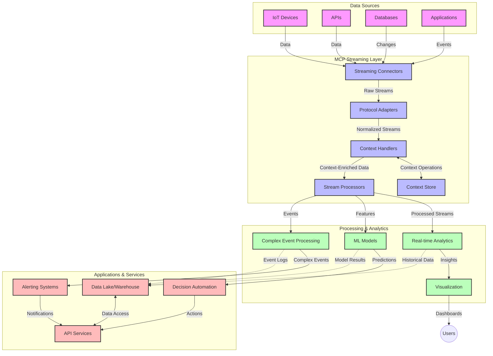

<!--
CO_OP_TRANSLATOR_METADATA:
{
  "original_hash": "68c518dbff8a3b127ed2aa934054c56c",
  "translation_date": "2025-06-11T16:55:47+00:00",
  "source_file": "05-AdvancedTopics/mcp-realtimestreaming/README.md",
  "language_code": "ru"
}
-->
# Протокол контекста модели для потоковой передачи данных в реальном времени

## Обзор

Потоковая передача данных в реальном времени стала незаменимой в современном мире, ориентированном на данные, где бизнес и приложения требуют мгновенного доступа к информации для своевременного принятия решений. Протокол контекста модели (MCP) представляет собой значительный шаг вперёд в оптимизации процессов потоковой передачи данных в реальном времени, повышая эффективность обработки данных, сохраняя контекст и улучшая общую производительность системы.

В этом модуле рассматривается, как MCP преобразует потоковую передачу данных в реальном времени, предоставляя стандартизированный подход к управлению контекстом между AI-моделями, потоковыми платформами и приложениями.

## Введение в потоковую передачу данных в реальном времени

Потоковая передача данных в реальном времени — это технологическая парадигма, позволяющая непрерывно передавать, обрабатывать и анализировать данные по мере их появления, что позволяет системам мгновенно реагировать на новую информацию. В отличие от традиционной пакетной обработки, которая работает с фиксированными наборами данных, потоковая обработка работает с данными в движении, обеспечивая получение инсайтов и выполнение действий с минимальной задержкой.

### Основные понятия потоковой передачи данных в реальном времени:

- **Непрерывный поток данных**: данные обрабатываются как непрерывный, бесконечный поток событий или записей.
- **Обработка с низкой задержкой**: системы спроектированы так, чтобы минимизировать время между генерацией и обработкой данных.
- **Масштабируемость**: архитектуры потоковой передачи должны справляться с переменным объёмом и скоростью данных.
- **Отказоустойчивость**: системы должны быть устойчивы к сбоям для обеспечения непрерывного потока данных.
- **Сохранение состояния**: поддержание контекста между событиями важно для значимого анализа.

### Протокол контекста модели и потоковая передача в реальном времени

Протокол контекста модели (MCP) решает несколько ключевых задач в средах потоковой передачи в реальном времени:

1. **Непрерывность контекста**: MCP стандартизирует способ поддержания контекста между распределёнными потоковыми компонентами, обеспечивая AI-моделям и узлам обработки доступ к релевантному историческому и окружающему контексту.

2. **Эффективное управление состоянием**: предоставляя структурированные механизмы передачи контекста, MCP снижает накладные расходы на управление состоянием в потоковых конвейерах.

3. **Взаимодействие**: MCP создаёт общий язык для обмена контекстом между различными потоковыми технологиями и AI-моделями, что позволяет создавать более гибкие и расширяемые архитектуры.

4. **Оптимизированный для потоковой передачи контекст**: реализации MCP могут приоритизировать наиболее важные элементы контекста для принятия решений в реальном времени, оптимизируя как производительность, так и точность.

5. **Адаптивная обработка**: благодаря правильному управлению контекстом через MCP, потоковые системы могут динамически настраивать обработку в зависимости от меняющихся условий и паттернов в данных.

В современных приложениях — от сетей IoT-датчиков до финансовых торговых платформ — интеграция MCP с потоковыми технологиями позволяет осуществлять более интеллектуальную, контекстно-осведомлённую обработку, способную адекватно реагировать на сложные, развивающиеся ситуации в реальном времени.

## Цели обучения

К концу этого урока вы сможете:

- Понять основы потоковой передачи данных в реальном времени и связанные с ней задачи
- Объяснить, как Протокол контекста модели (MCP) улучшает потоковую передачу данных в реальном времени
- Реализовать решения потоковой передачи на основе MCP с использованием популярных фреймворков, таких как Kafka и Pulsar
- Проектировать и внедрять отказоустойчивые, высокопроизводительные потоковые архитектуры с MCP
- Применять концепции MCP в сценариях IoT, финансовой торговли и аналитики на основе AI
- Оценивать новые тенденции и будущие инновации в технологиях потоковой передачи на базе MCP

### Определение и значение

Потоковая передача данных в реальном времени предполагает непрерывное создание, обработку и доставку данных с минимальной задержкой. В отличие от пакетной обработки, где данные собираются и обрабатываются группами, потоковые данные обрабатываются по мере поступления, что позволяет получать мгновенные инсайты и принимать решения.

Ключевые характеристики потоковой передачи данных в реальном времени:

- **Низкая задержка**: обработка и анализ данных в пределах миллисекунд или секунд
- **Непрерывный поток**: непрерывные потоки данных из различных источников
- **Мгновенная обработка**: анализ данных по мере их поступления, а не пакетами
- **Событийно-ориентированная архитектура**: реакция на события по мере их возникновения

### Проблемы традиционной потоковой передачи данных

Традиционные подходы к потоковой передаче данных сталкиваются с рядом ограничений:

1. **Потеря контекста**: сложности с поддержанием контекста в распределённых системах
2. **Проблемы масштабируемости**: сложности с масштабированием для обработки больших объёмов и высокой скорости данных
3. **Сложности интеграции**: проблемы с взаимодействием между разными системами
4. **Управление задержками**: балансировка пропускной способности и времени обработки
5. **Согласованность данных**: обеспечение точности и полноты данных в потоке

## Понимание Протокола контекста модели (MCP)

### Что такое MCP?

Протокол контекста модели (MCP) — это стандартизованный протокол связи, разработанный для эффективного взаимодействия между AI-моделями и приложениями. В контексте потоковой передачи данных в реальном времени MCP предоставляет основу для:

- Сохранения контекста на протяжении всего конвейера данных
- Стандартизации форматов обмена данными
- Оптимизации передачи больших объёмов данных
- Улучшения коммуникации между моделями и приложениями

### Основные компоненты и архитектура

Архитектура MCP для потоковой передачи в реальном времени включает несколько ключевых компонентов:

1. **Обработчики контекста**: управляют и поддерживают контекстную информацию на протяжении потокового конвейера
2. **Потоковые процессоры**: обрабатывают входящие потоки данных с учётом контекста
3. **Адаптеры протоколов**: конвертируют данные между разными потоковыми протоколами, сохраняя контекст
4. **Хранилище контекста**: эффективно хранит и извлекает контекстную информацию
5. **Потоковые коннекторы**: подключаются к различным потоковым платформам (Kafka, Pulsar, Kinesis и др.)



### Как MCP улучшает обработку данных в реальном времени

MCP решает традиционные задачи потоковой передачи через:

- **Сохранение целостности контекста**: поддержание связей между данными на всем протяжении конвейера
- **Оптимизация передачи**: снижение избыточности при обмене данными за счёт интеллектуального управления контекстом
- **Стандартизированные интерфейсы**: обеспечение единообразных API для потоковых компонентов
- **Снижение задержек**: минимизация накладных расходов за счёт эффективного управления контекстом
- **Повышение масштабируемости**: поддержка горизонтального масштабирования с сохранением контекста

## Интеграция и внедрение

Системы потоковой передачи данных в реальном времени требуют тщательного архитектурного проектирования и реализации для поддержания как производительности, так и целостности контекста. Протокол контекста модели предлагает стандартизованный подход к интеграции AI-моделей и потоковых технологий, позволяя создавать более сложные, контекстно-осведомлённые конвейеры обработки.

### Обзор интеграции MCP в потоковые архитектуры

Внедрение MCP в потоковых средах в реальном времени требует учёта нескольких ключевых аспектов:

1. **Сериализация и транспорт контекста**: MCP предоставляет эффективные механизмы кодирования контекстной информации внутри потоковых пакетов данных, обеспечивая, что важный контекст сопровождает данные на протяжении всего конвейера обработки. Включает стандартизированные форматы сериализации, оптимизированные для потоковой передачи.

2. **Сохранение состояния в потоковой обработке**: MCP позволяет более интеллектуально поддерживать состояние, обеспечивая согласованное представление контекста между узлами обработки. Особенно важно для распределённых потоковых архитектур, где управление состоянием традиционно вызывает сложности.

3. **Время события vs время обработки**: реализации MCP должны учитывать распространённую проблему различения времени возникновения событий и времени их обработки. Протокол может включать временной контекст, сохраняющий семантику времени события.

4. **Управление обратным давлением (backpressure)**: стандартизация обработки контекста помогает управлять обратным давлением в потоковых системах, позволяя компонентам сообщать о своих возможностях обработки и корректировать поток данных.

5. **Оконное агрегирование контекста**: MCP облегчает более сложные операции с окнами, предоставляя структурированное представление временного и реляционного контекста, что позволяет выполнять более осмысленные агрегирования по потокам событий.

6. **Обработка с гарантией единственного исполнения (exactly-once)**: в системах, требующих строго однократной обработки, MCP может включать метаданные обработки для отслеживания и подтверждения статуса обработки в распределённых компонентах.

Реализация MCP в различных потоковых технологиях создаёт единый подход к управлению контекстом, снижая необходимость в кастомном интеграционном коде и повышая способность системы сохранять значимый контекст при прохождении данных через конвейер.

### MCP в различных потоковых фреймворках

MCP может быть интегрирован с популярными потоковыми фреймворками, включая:

#### Интеграция с Apache Kafka

```python
from mcp_streaming import MCPKafkaConnector

# Initialize MCP Kafka connector
connector = MCPKafkaConnector(
    bootstrap_servers='localhost:9092',
    context_preservation=True
)

# Create a context-aware consumer
consumer = connector.create_consumer('input-topic')

# Process streaming data with context
for message in consumer:
    context = message.get_context()
    data = message.get_value()
    
    # Process with context awareness
    result = process_with_context(data, context)
    
    # Produce output with preserved context
    connector.produce('output-topic', result, context=context)
```

#### Реализация в Apache Pulsar

```python
from mcp_streaming import MCPPulsarClient

# Initialize MCP Pulsar client
client = MCPPulsarClient('pulsar://localhost:6650')

# Subscribe with context awareness
consumer = client.subscribe('input-topic', 'subscription-name', 
                           context_enabled=True)

# Process messages with context preservation
while True:
    message = consumer.receive()
    context = message.get_context()
    
    # Process with context
    result = process_with_context(message.data(), context)
    
    # Acknowledge the message
    consumer.acknowledge(message)
    
    # Send result with preserved context
    producer = client.create_producer('output-topic')
    producer.send(result, context=context)
```

### Лучшие практики при развертывании

При внедрении MCP для потоковой передачи в реальном времени:

1. **Проектирование с учётом отказоустойчивости**:
   - Реализуйте корректную обработку ошибок
   - Используйте очереди dead-letter для неудачных сообщений
   - Проектируйте идемпотентные процессоры

2. **Оптимизация производительности**:
   - Настройте подходящие размеры буферов
   - Используйте пакетную обработку там, где это уместно
   - Реализуйте механизмы обратного давления

3. **Мониторинг и наблюдение**:
   - Отслеживайте метрики обработки потоков
   - Контролируйте распространение контекста
   - Настройте оповещения о аномалиях

4. **Безопасность потоков**:
   - Внедрите шифрование для чувствительных данных
   - Используйте аутентификацию и авторизацию
   - Применяйте корректные механизмы контроля доступа

### MCP в IoT и edge-вычислениях

MCP улучшает потоковую передачу данных в IoT за счёт:

- Сохранения контекста устройств на протяжении конвейера обработки
- Обеспечения эффективной потоковой передачи данных от edge-устройств к облаку
- Поддержки аналитики в реальном времени на потоках IoT-данных
- Облегчения коммуникации между устройствами с учётом контекста

Пример: сети датчиков умного города  
```
Sensors → Edge Gateways → MCP Stream Processors → Real-time Analytics → Automated Responses
```

### Роль в финансовых транзакциях и высокочастотной торговле

MCP предоставляет значительные преимущества для финансовой потоковой передачи данных:

- Обработка с ультранизкой задержкой для торговых решений
- Поддержка контекста транзакций на протяжении обработки
- Поддержка сложной обработки событий с учётом контекста
- Обеспечение согласованности данных в распределённых торговых системах

### Улучшение аналитики на основе AI

MCP открывает новые возможности для потоковой аналитики:

- Обучение и вывод моделей в реальном времени
- Непрерывное обучение на потоковых данных
- Извлечение признаков с учётом контекста
- Многоступенчатые конвейеры вывода с сохранённым контекстом

## Будущие тенденции и инновации

### Эволюция MCP в реальных условиях

В будущем ожидается развитие MCP в следующих направлениях:

- **Интеграция с квантовыми вычислениями**: подготовка к квантовым потоковым системам
- **Обработка на edge-устройствах**: перенос большей части контекстно-осведомлённой обработки на периферию
- **Автономное управление потоками**: самонастраивающиеся потоковые конвейеры
- **Федеративная потоковая передача**: распределённая обработка с сохранением приватности

### Возможные технологические достижения

Новые технологии, формирующие будущее потоковой передачи с MCP:

1. **AI-оптимизированные протоколы потоковой передачи**: протоколы, специально разработанные для AI-нагрузок
2. **Интеграция нейроморфных вычислений**: вычисления, вдохновлённые работой мозга, для обработки потоков
3. **Безсерверная потоковая передача**: событийно-ориентированная, масштабируемая потоковая передача без управления инфраструктурой
4. **Распределённые хранилища контекста**: глобально распределённое, но высокосогласованное управление контекстом

## Практические задания

### Задание 1: Настройка базового MCP-потокового конвейера

В этом задании вы научитесь:

- Конфигурировать базовую MCP-среду для потоковой передачи
- Реализовывать обработчики контекста для потоковой обработки
- Тестировать и проверять сохранение контекста

### Задание 2: Создание панели аналитики в реальном времени

Создайте полноценное приложение, которое:

- Получает потоковые данные с использованием MCP
- Обрабатывает поток с сохранением контекста
- Визуализирует результаты в реальном времени

### Задание 3: Реализация сложной обработки событий с MCP

Продвинутое задание, охватывающее:

- Обнаружение паттернов в потоках
- Контекстную корреляцию между несколькими потоками
- Генерацию сложных событий с сохранённым контекстом

## Дополнительные ресурсы

- [Model Context Protocol Specification](https://github.com/microsoft/model-context-protocol) - Официальная спецификация и документация MCP
- [Apache Kafka Documentation](https://kafka.apache.org/documentation/) - Изучение Kafka для потоковой обработки
- [Apache Pulsar](https://pulsar.apache.org/) - Унифицированная платформа сообщений и потоков
- [Streaming Systems: The What, Where, When, and How of Large-Scale Data Processing](https://www.oreilly.com/library/view/streaming-systems/9781491983867/) - Полное руководство по архитектурам потоковой передачи
- [Microsoft Azure Event Hubs](https://learn.microsoft.com/en-us/azure/event-hubs/event-hubs-about) - Управляемый сервис потоковой передачи событий
- [MLflow Documentation](https://mlflow.org/docs/latest/index.html) - Для отслеживания и развертывания моделей машинного обучения
- [Real-Time Analytics with Apache Storm](https://storm.apache.org/releases/current/index.html) - Фреймворк для потоковых вычислений в реальном времени
- [Flink ML](https://nightlies.apache.org/flink/flink-ml-docs-master/) - Библиотека машинного обучения для Apache Flink
- [LangChain Documentation](https://python.langchain.com/docs/get_started/introduction) - Создание приложений с LLM

## Результаты обучения

После прохождения этого модуля вы сможете:

- Понимать основы потоковой передачи данных в реальном времени и связанные с ней задачи
- Объяснять, как Протокол контекста модели (MCP) улучшает потоковую передачу данных в реальном времени
- Реализовывать решения потоковой передачи на основе MCP с использованием популярных фреймворков, таких как Kafka и Pulsar
- Проектировать и внедрять отказоустойчивые, высокопроизводительные потоковые архитектуры с MCP
- Применять концепции MCP в сценариях IoT, финансовой торговли и аналитики на основе AI
- Оценивать новые тенденции и будущие инновации в технологиях потоковой передачи на базе MCP

## Что дальше

- [6. Вклад сообщества](../../06-CommunityContributions/README.md)

**Отказ от ответственности**:  
Этот документ был переведен с использованием сервиса автоматического перевода [Co-op Translator](https://github.com/Azure/co-op-translator). Несмотря на наши усилия по обеспечению точности, имейте в виду, что автоматический перевод может содержать ошибки или неточности. Оригинальный документ на его исходном языке следует считать авторитетным источником. Для критически важной информации рекомендуется профессиональный перевод человеком. Мы не несем ответственности за любые недоразумения или неправильные толкования, возникшие в результате использования данного перевода.