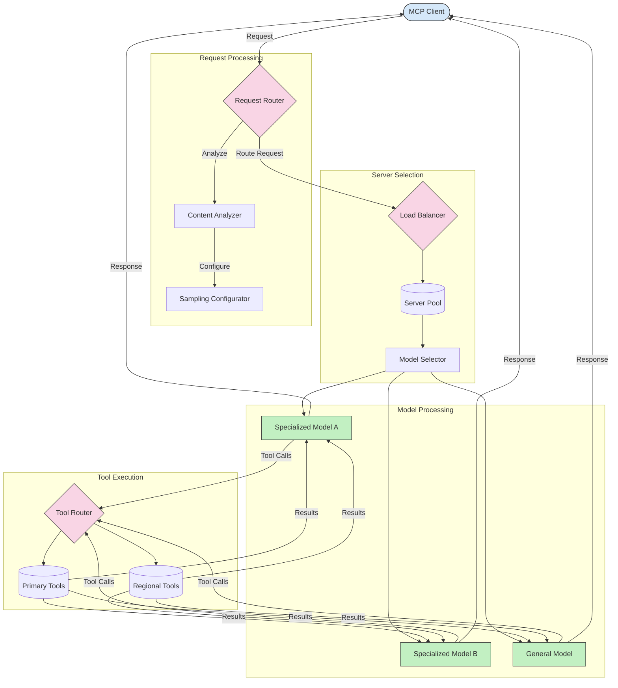

<!--
CO_OP_TRANSLATOR_METADATA:
{
  "original_hash": "2f1b473818b5a6cc9a9bbf777fffa6d4",
  "translation_date": "2025-07-14T21:44:12+00:00",
  "source_file": "05-AdvancedTopics/mcp-routing/README.md",
  "language_code": "ru"
}
-->
## Архитектура выборки и маршрутизации в MCP

Выборка — это ключевой компонент Model Context Protocol (MCP), который позволяет эффективно обрабатывать и маршрутизировать запросы. Она включает анализ входящих запросов для определения наиболее подходящей модели или сервиса, который должен их обработать, на основе различных критериев, таких как тип содержимого, контекст пользователя и нагрузка на систему.

Выборка и маршрутизация могут быть объединены для создания надежной архитектуры, которая оптимизирует использование ресурсов и обеспечивает высокую доступность. Процесс выборки используется для классификации запросов, а маршрутизация направляет их к соответствующим моделям или сервисам.

Ниже приведена диаграмма, иллюстрирующая, как выборка и маршрутизация работают вместе в комплексной архитектуре MCP:

## Что дальше

- [5.6 Sampling](../mcp-sampling/README.md)

**Отказ от ответственности**:  
Этот документ был переведен с помощью сервиса автоматического перевода [Co-op Translator](https://github.com/Azure/co-op-translator). Несмотря на наши усилия по обеспечению точности, просим учитывать, что автоматический перевод может содержать ошибки или неточности. Оригинальный документ на его исходном языке следует считать авторитетным источником. Для получения критически важной информации рекомендуется обращаться к профессиональному переводу, выполненному человеком. Мы не несем ответственности за любые недоразумения или неправильные толкования, возникшие в результате использования данного перевода.